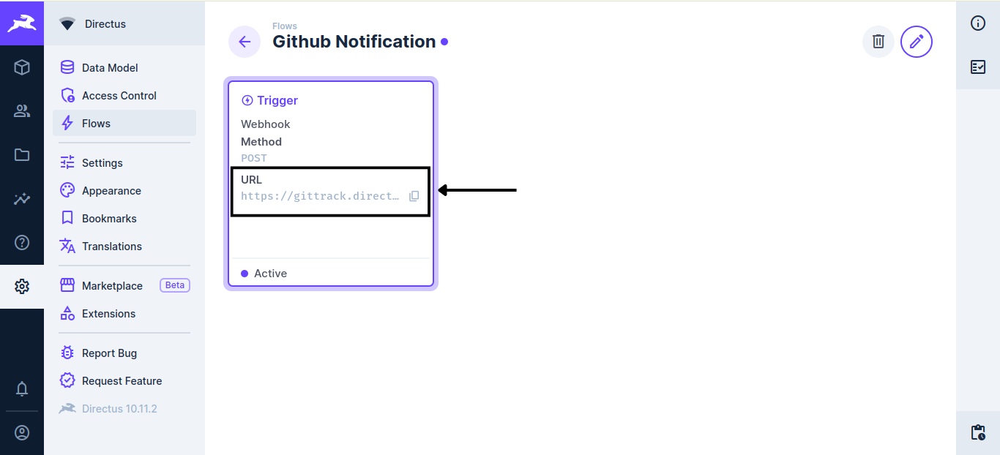
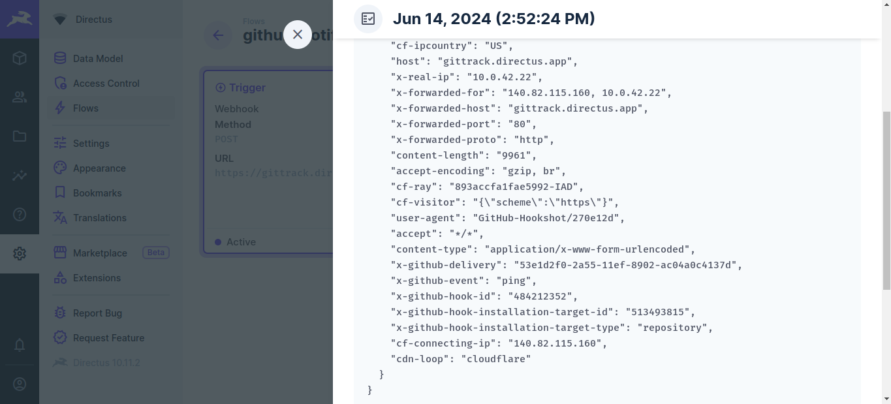
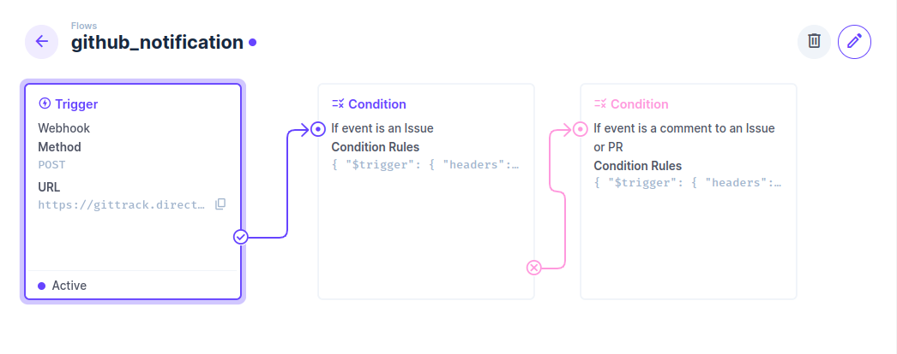
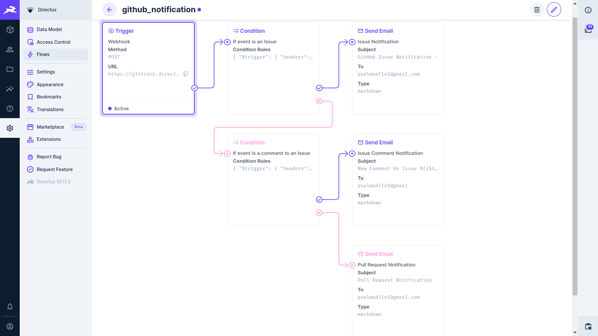
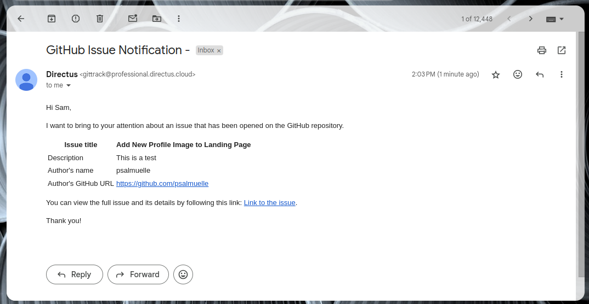

In this tutorial, you will learn how to track events, such as new issues and pull requests, in a GitHub repository using Directus Automate. By the end of this article, you will have created a repository tracker that sends alerts via email and in-app notifications.

## Before You Start

You will need:

- A Directus project - Create a project by following this [quickstart guide](https://docs.directus.io/getting-started/quickstart.html). Your project will need to be accessible via a public URL so you'll need to host it or use a tunnel to your local instance.
- [A GitHub Account](https://github.com/signup) and admin access to the GitHub repo you want to track.

## Creating a New Flow

In your Directus project, navigate to **Settings -> Flows** and create a Flow. In the Trigger Setup section, select **Webhook Trigger** so we can receive events from GitHub. Ensure the Webhook Trigger is set to use the `POST` method with Asynchronous mode enabled. Save the Flow and copy the Trigger URL.



## Setting Up a Webhook on GitHub

GitHub allows developers to create webhooks for both repositories and organizations. A webhook is a web request to an external URL (in this case, Directus) that will be immediately triggered when an event happens such as a new issue being opened in a repository. 

To create a webhook, navigate to the repository or organization you want to track. Go to the **Settings** tab and select **Webhooks** from the menu.

Click on the **Add Webhook** button. Next, paste the Trigger URL from Directus flow into the `Payload URL` field and change the content type to `application/json`.

Select the events that should trigger the webhook. For this tutorial, choose the `Let me select individual events` option and toggle these events:

- Issues
- Issue comments
- Pull requests

Save your settings by clicking the **Add Webhook** button. GitHub will send a ping payload to your Directus project. Confirm the webhook is successful by checking the Activity Logs section in your Flow.



## Creating the Alert System

The final step is to set up an alert system to notify you or others on the project when any of the selected events occur. Depending on your preference, you can use email or in-app notifications available as operations in Flows.

Since there are three different events, creating a one-size-fits-all notification template won't be ideal. Instead, we can generate a separate notification template for each event by setting up **Condition** operations to check if the trigger event is an issue, issue comment, or pull request.

### Setting Up Condition Operations

Create a condition operation with the following rules:

```json
{
  "$trigger": {
    "headers": {
      "x-github-event": {
        "_eq": "issues"
      }
    }
  }
}
```

Add another condition in the [failure path](https://docs.directus.io/app/flows.html) of the first condition to check if the event is an issue comment. The setup is the same as the above condition, with the change being `"_eq": "issue_comment"`. You should see something like this:



### Generate Notification Template

The next step is to create a custom notification template for each event, generating dynamic content specific to each one.

For Issues:

```md
Hi name,

I want to bring to your attention an issue that has been {{$trigger.body.action}} on the GitHub repository.

| Issue title         | {{$trigger.body.issue.title}}         |
| :------------------ | :------------------------------------ |
| Description         | {{$trigger.body.issue.body}}          |
| Author's name       | {{$trigger.body.issue.user.login}}    |
| Author's GitHub URL | {{$trigger.body.issue.user.html_url}} |

You can view the full issue and its details by following this link: [Link to the issue]($trigger.body.issue.html_url).

Thank you!
```

- For Issue comments:

```md
Hi name,

Issue #{{$trigger.body.issue.number}} has a new comment by [{{$trigger.body.comment.user.login}}]({{$trigger.body.comment.user.html_url}})

| Issue title | {{$trigger.body.issue.title}}  |
| :---------- | :----------------------------- |
| Comment     | {{$trigger.body.comment.body}} |

You can view the issue and join the conversation: [Link to the issue]($trigger.body.issue.html_url).

Thank you!
```

For pull requests:

```md
Hi Sam,

I want to bring to your attention a pull request that has been {{$trigger.body.action}} on the GitHub repository.

| Pull Request Title  | {{$trigger.body.pull_request.title}}         |
| :------------------ | :------------------------------------------- |
| Description         | {{$trigger.body.pull_request.body}}          |
| Author's name       | {{$trigger.body.pull_request.user.login}}    |
| Author's GitHub URL | {{$trigger.body.pull_request.user.html_url}} |

You can view the pull request and its details by following this link: [Link to pull request]($trigger.body.pull_request.html_url).

Thank you!
```

### Creating Email and In-App Notification Operations

You will need the generated template and `User ID` if you are creating **Send Notification** operation, or email address if you are using the **Send Email** operation. The result should look like this:



## Test the Application

Voila! You've completed setting up the flow. Test the repo tracker by creating an issue.



## Summary

In this tutorial, you've learned how to track a GitHub repository in your Directus application. Join our [Discord server](https://directus.chat/) to learn more about using Directus.
