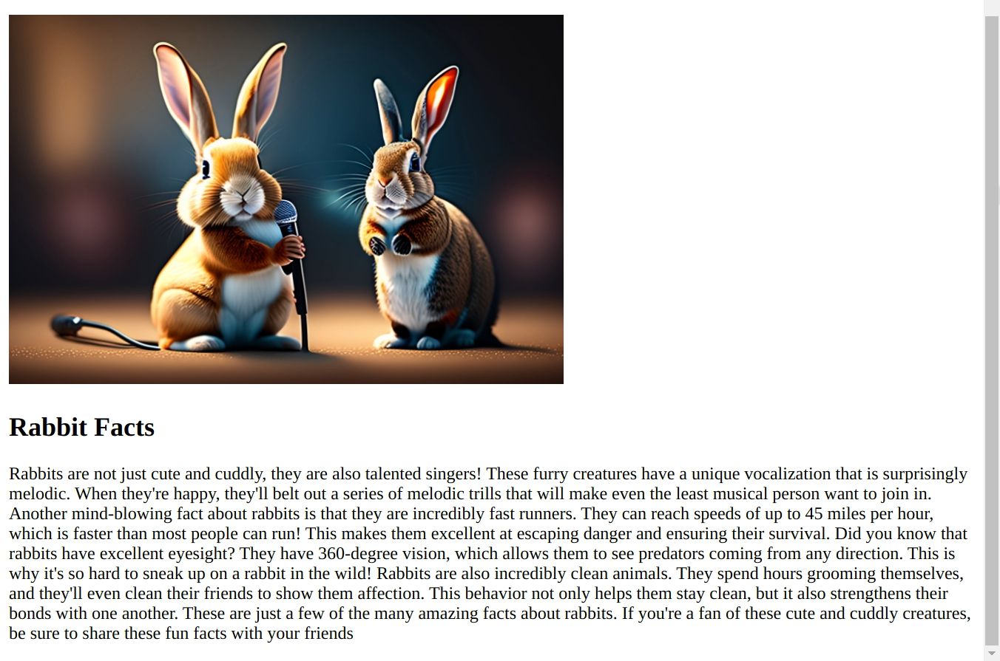

[Angular](https://angular.dev/) is a popular front-end web framework. In this tutorial, you will use the framework to implement the front-end for the Directus headless CMS. You will implement a blog that loads blog posts dynamically and also serves global metadata.

## Prerequisites
- Some knowledge of TypeScript and [Angular](https://angular.io/)
- A Directus project. Follow the [Quickstart guide](https://docs.directus.io/getting-started/quickstart.html) to create one.
- [Node.js](https://nodejs.org/en/download) and a development environment of your choice
- Install the Angular CLI - use the Angular [guide](https://angular.io/guide/setup-local) to achieve this. 

:::info Compatibility

Note that Angular and TypeScript versions must be compatible. Since the SDK requires a minimum TypeScript version of 5.0, you need to use Angular version 17 for your project.

:::

## Initialize Project
To create a new Angular project, use the following command.

```bash
ng new directus-with-angular
? Which stylesheet format would you like to use? CSS
? Do you want to enable Server-Side Rendering (SSR) and Static Site Generation (SSG/Prerendering)? (y/N) No
```
Next, run the following command to install the Directus SDK:

```bash
npm install @directus/sdk
```
Once the project has been created, open it in your code editor and replace the code in the `src/app/app.component.html` file with the following:

```html
<router-outlet/>
```
Angular will dynamically fill the [RouterOutlet](https://angular.io/api/router/RouterOutlet) placeholder based on the current router state.

You should also disable strict checking in `./tsconfig.json` file under `compilerOptions`.

```json
"strict": false
```

Navigate to your project directory in a terminal and start the development server at `http://localhost:4200`:

```bash
ng serve
```
## Create an instance of Directus SDK
For every Directus model that you define, you need to create a TypeScript type for that model. The type will help to map the JSON data to TypeScript objects.

In addition, you should expose an instance of the Directus SDK that you will use to make different requests to the Directus CMS.

In your project, create a file named `./directus.ts` with the following code:

```ts
import {createDirectus, rest} from "@directus/sdk";

type Global = {
  id: number;
  title: string;
  description: string;
}

type Author = {
  id: number;
  name: string;
}

type Page = {
  slug: string;
  title: string;
  content: string;
}

type Post = {
  id: number;
  image: string;
  title: string;
  content: string;
  author: Author;
  published_date: string;
}

type Schema = {
  global: Global;
  posts: Post[];
  pages: Page[];
}

const directus =
  createDirectus<Schema>("YOUR_DIRECTUS_URL")
    .with(rest());

export {directus, Global, Post, Page}
```
## Using Global Metadata and Settings
In your Directus project, go to **Settings > Data Model** and create a singleton collection named `global` with the fields `title` and `description`. The primary key named `id` will be created for you by default.

To ensure the collection is a singleton, select the **Singleton** checkbox. This collection's fields match the `Global` type you created when defining the Schema for the Directus SDK.

Once the collection is defined go to the **Content** section and add the title and description for the metadata. 

To permit public access to the metadata, go to **Settings > Access Control > Public** and permit the read permission under the metadata section.

### Create a Component for the Global Metadata
Navigate to your project directory in a terminal and create the global metadata component:

```bash
ng g c component/global
```
This command will generate four files under the *component* directory. 

Replace the code in the `src/app/component/global/global.component.ts` file with the following code:

```ts
import {Component, OnInit} from '@angular/core';
import {directus, Global} from "../../../../directus";
import {CommonModule} from "@angular/common";
import {readSingleton} from "@directus/sdk";

@Component({
  selector: 'app-global',
  standalone: true,
  imports: [
    CommonModule
  ],
  templateUrl: './global.component.html',
  styleUrl: './global.component.css'
})
export class GlobalComponent implements OnInit{
  global: Global;
  ngOnInit(): void {
    this.getGlobal();
  }

  async getGlobal(){
    //@ts-ignore
    this.global = await directus
      .request<Global>(readSingleton("global"))
  }

}
```
When this component is initialized, it will retrieve the singleton and store it in the `global` object. 

To display the contents of the object, replace the code in the `src/app/component/global/global.component.html` file with the following code:

```ts
<div *ngIf="global">
  <h1>{{global.title}}</h1>
  <p>{{global.description}}</p>
</div>
```
### Add Routing for the Global Metadata
In `app.routes.ts` replace the code in the file with the following code:

```ts
import { Routes } from '@angular/router';
import {GlobalComponent} from "./component/global/global.component";

export const routes: Routes = [
  {path: '', component: GlobalComponent}
];
```
Once the application reloads, go to `https://localhost:4200`. As a result, the global component containing the global metadata is loaded on the page.

## Creating Pages with Directus

### Configure Directus
In your Directus project, create a new collection named `pages` - make the Priary ID Field a "Manually Entered String" called `slug`, which will correlate with the URL for the page. For example, `privacy` will later correlate to the page `localhost:4200/privacy`.

Create a text input field called `title` and a text area input field called `content`. In the Access Control settings, give the Public role read access to the new collection.

Create some items in the new collection - [here is some sample data](https://github.com/directus-community/getting-started-demo-data).

### Dynamic Routes in Angular
Navigate to your project directory in a terminal and generate the page component:

```bash
ng g c component/page
```
Replace the code in the `src/app/component/page/page.component.ts` file with the following code:

```ts
import {Component, OnInit} from '@angular/core';
import {directus, Page} from "../../../../directus";
import {ActivatedRoute} from "@angular/router";
import {CommonModule} from "@angular/common";
import {readItem} from "@directus/sdk";

@Component({
  selector: 'app-page',
  standalone: true,
  imports: [CommonModule],
  templateUrl: './page.component.html',
  styleUrl: './page.component.css'
})
export class PageComponent implements OnInit{
  page: Page;

  constructor(private route: ActivatedRoute) {
  }

  ngOnInit(): void {
    this.route.paramMap.subscribe(params => {
      const slug = params.get("slug");
      if (slug){
        this.getPageBySlug(slug);
      }
    })
  }

  async getPageBySlug(slug: string){
    //@ts-ignore
    this.page = await directus
      .request<Page>(readItem("pages", slug));
  }

}
```
When the component is initialized, the `slug` path parameter is retrieved using `ActivatedRoute` and passed to the `readItem()` method to get a page with that slug.

The retrieved page is stored in the object named `page`. To display the contents of the page, replace the code in the `src/app/component/page/page.component.html` file with the following code:

```html
<div *ngIf="page">
  <h1>{{page.title}}</h1>
  <p>{{page.content}}</p>
</div>
```
### Add Routing for the Pages
In `src/app/app.routes.ts` add the following route in the `Routes` array:

```ts
   {path: ':slug', component: PageComponent},
```
when the application reloads, go to `http://localhost:4200/privacy` to view the privacy page. Replace the `slug` path parameter with `about` and `conduct` to view the content of about and conduct pages.

## Creating Blog Posts with Directus
In your Directus project, create a new collection called `authors` with a single text input field called `name`. Add some authors to the collection.


Next, create a new collection named `posts` - make the Primary ID Field an "Auto-incremented integer" called `id` which will correlate with the URL for the page. For example, `1` will later correlate to the page `localhost:3000/blog/1`.

Create the following fields for the `posts` data model.

- a text input field called `title`
- an image relational field called `image`
- a text area input field called `content`
- a datetime selection field called `published_date` of type date.
- a many-to-one relational field called `author` with the related collection set to `authors`

In Settings -> Access Control, give the Public role read access to the `authors`, `posts`, and `directus_files` collections.

Create some items in the posts collection - [here's some sample data](https://github.com/directus-community/getting-started-demo-data).

### Create Blog Post Listing
Navigate to your project directory in a terminal and generate the posts component:

```bash
ng g c component/posts
```
Replace the code in the `src/app/component/posts/posts.component.ts` file with the following code:

```ts
import {Component, OnInit} from '@angular/core';
import {directus, Post} from "../../../../directus";
import {RouterLink} from "@angular/router";
import {CommonModule} from "@angular/common";
import {readItems} from "@directus/sdk";

@Component({
  selector: 'app-posts',
  standalone: true,
  imports: [CommonModule, RouterLink],
  templateUrl: './posts.component.html',
  styleUrl: './posts.component.css'
})
export class PostsComponent implements OnInit{
  posts: Post[];

  ngOnInit(): void {
    this.getAllPosts();
  }

  async getAllPosts(){
    //@ts-ignore
    this.posts = await directus
      .request<Post[]>(readItems("posts", {
        fields: ["id","title", "published_date", {author: ["name"]}]
      }))
  }
}

```
When the component is initialized, it will retrieve all the posts using the `readItems()` method and store them in the `posts` array.

To list the posts, replace the code in the `src/app/component/posts/posts.component.html` file with the following code:

```html
<h1>Blog Posts</h1>
<ol>
  <li *ngFor="let post of posts">
    <a routerLink="#">
      <h2>{{post.title}}</h2>
    </a>
    <span>
      {{post.published_date}} &bull; {{post.author.name}}
    </span>
  </li>
</ol>
```
### Add Routing for Posts
Go to `src/app/app.routes.ts` file and add the following route in the `Routes` array:

```ts
 {path: 'blog', component: PostsComponent},
```
Once the application reloads, go to `http://localhost:4200/blog` and the list of posts will be displayed on the page.

:::info Navigation

In Angular, the order in which you put the routes in the `Routes` array will affect how components are loaded in your application. In this case, you don't want the path to `blog` to be consumed as a `slug`. As a result, ensure the blog route is put before slug in the Routes array.

:::


## Create Blog Post Pages
You have learned how to create dynamic pages in a previous section, you will leverage the skill in this section to display individual post pages for the blog post listing.

### Create a Component for Gallery Detail
Navigate to your project directory in a terminal and create the post component:

```bash
ng g c component/post
```
Replace the code in the `src/app/component/post/post.component.ts` file with the following code.

```ts
import {Component, OnInit} from '@angular/core';
import {directus, Post} from "../../../../directus";
import {ActivatedRoute} from "@angular/router";
import {CommonModule} from "@angular/common";
import {readItem} from "@directus/sdk";

@Component({
  selector: 'app-post',
  standalone: true,
  imports: [CommonModule],
  templateUrl: './post.component.html',
  styleUrl: './post.component.css'
})
export class PostComponent implements OnInit{
  post: Post;
  baseUrl = "YOUR_DIRECTUS_URL";
  constructor(private route: ActivatedRoute) {
  }
  ngOnInit(): void {
    this
      .getPostById(+this
      .route
      .snapshot
      .paramMap.get('id'))
  }

  async getPostById(id: number){
    //@ts-ignore
    this.post = await directus
      .request<Post>(readItem("posts", id));
  }

}
```
When the component is initialized, it will retrieve the path variable using the `ActivatedRoute` and pass it to the `readItem()` method to get the post with that id.

Note that this will happen when you click on a blog post from the list of blog posts. 

The retrieved post is stored in the `post` object. To display the contents of the object, replace the code in the `src/app/component/post/post.component.html` file with the following code:

```html
<div *ngIf="post">
  <div style="width: 500px">
    
  </div>
  <h2>{{post.title}}</h2>
  <p>{{post.content}}</p>
</div>
```
### Add a Method to Handle a Click on the Blog Posts
In `src/app/component/posts/posts.component.ts` file add the following code.

```ts
  constructor(private router: Router) {}

  goToPost(id: number){
    this.router.navigate(['/blog', id]);
  }
```
This method will redirect you to `/blog/id` using `Route` when you click on an post on the blog post listing. The `id` path variable will be associated with the clicked item.

As a result, a post will be loaded dynamically depending on which post you click.

### Add a Click Listener for the Blog Posts
In `src/app/component/posts/posts.component.html` add the method you have created in the previous section in the following line.

```ts
<a routerLink="#" (click)="goToPost(post.id)">
      <h2>{{post.title}}</h2>
</a>
```
Since the method expects the `id` parameter, pass `post.id` as the argument of the method. As a result, this will bind the method with the current id of a post at runtime.

### Add Routing for the Blog Post Page
In `src/app/app.routes.ts` file add the following route in the `Routes` array:

```ts
{path: 'blog/:id', component: PostComponent}
```
Once the application reloads, go to `http://localhost:4200/blog` and click on a post. As a result, the individual post will be displayed on the page via the path `http://localhost:4200/blog/id`.



## Add Navigation
To avoid navigating through the application manually, you should add navigation links that will dynamically route you to different components. To achieve this, go to `src/app/app.component.html` and add the following code before the `<router-outlet/>` tag.

```html
<nav>
  <ul>
    <li><a routerLink="/">Home</a> </li>
    <li><a routerLink="/about">About</a> </li>
    <li><a routerLink="/conduct">Code of Conduct</a> </li>
    <li><a routerLink="/privacy">Privacy Policy</a> </li>
    <li><a routerLink="/blog">Blog</a> </li>
  </ul>
</nav>
```

## Recap
In this tutorial, you have learned how to integrate directus with Angular. You have covered how to use global metadata and settings, how to create pages, how to create a post listing, how to show blog post pages, and lastly how to add navigation in your application.

The Directus CMS is quite diverse and it can accomodate any type of blog that you might want to create. For instance, one of the features of Directus you can leverage is authentication of requests. The Directus SDK makes authentication very easy for you. Go to the authentication [guide](https://docs.directus.io/guides/sdk/authentication.html) to learn how to authenticate your requests.


