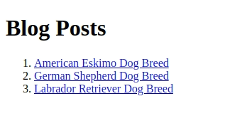
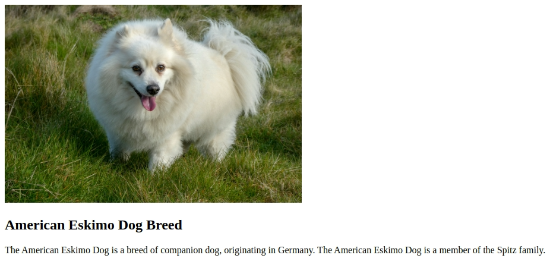

[Angular](https://angular.dev/) is a popular front-end web framework. In this tutorial, you will use the framework to implement the front-end for the Directus headless CMS. You will implement a blog that loads blog posts dynamically and also serves global metadata.

## Prerequisites
- Some knowledge of TypeScript and [Angular](https://angular.io/)
- A Directus project. Follow the [Quickstart guide](https://docs.directus.io/getting-started/quickstart.html) to create one.
- [Node.js](https://nodejs.org/en/download) and a development environment of your choice
- Install the Angular CLI - use the Angular [guide](https://angular.io/guide/setup-local) to achieve this. Note that Angular and TypeScript versions must be compatible. Since the SDK requires a minimum TypeScript version of 5.0, you need to use Angular version 17 for your project.

## Initialize Project
To create a new Angular project, use the following command.

```bash
ng new directus-with-angular
```
For the prompts, choose CSS for the stylesheet format and no to disable server side rendering and static site generation.

```bash
? Which stylesheet format would you like to use? CSS
? Do you want to enable Server-Side Rendering (SSR) and Static Site Generation (SSG/Prerendering)? (y/N) No
```
Once the project has been created, open it in the development environment and replace the code in the `src/app/app.component.html` file with the following tag.

```html
<router-outlet/>
```
Angular will dynamically fill the [RouterOutlet](https://angular.io/api/router/RouterOutlet) placeholder based on the current router state.

You should also disable strict checking in `./tsconfig.json` file under `compilerOptions`.

```json
"strict": false
```

Next, open a new terminal window and CD into the project then use the following command to start the server at `http://localhost:4200`.

```bash
ng serve
```
## Configure the Directus SDK
Open a new terminal window and CD into the project then use the following command to install the directus SDK.

```bash
npm install @directus/sdk
```
In your project, create a file named `./directus.ts` with the following code.

```ts
import {createDirectus, rest} from "@directus/sdk";
type Metadata = {
  id: number;
  title: string;
  description: string;
}

type Job = {
  id: number;
  title: string;
  description: string;
}
type Gallery = {
  id: number;
  image: string;
  title: string;
  description: string;
}

type Schema = {
  metadata: Metadata;
  gallery: Gallery[];
  job: Job[];
}

const directus =
  createDirectus<Schema>("YOUR_DIRECTUS_URL")
    .with(rest());

export {directus, Metadata, Gallery, Job}
```
For every Directus model that you define, you need to create a TypeScript type for that model. The type will help to map the JSON data to TypeScript objects.

In addition, you should expose an instance of the Directus SDK that you will use to make different requests to the Directus CMS.

## Serving Global Metadata
In your Directus project, go to **Settings > Data Model** and create a singleton collection named `metadata` with the fields `title` and `description`. The primary key named `id` will be created for you by default.

To ensure the collection is a singleton, select the **Singleton** checkbox. Note that this collection matches the `Metadata` type you created in the previous section.

Once the collection is defined go to the **Content** section and add the title and description for the metadata. 

To permit public access to the metadata, go to **Settings > Access Control > Public** and permit the read permission under the metadata section.

### Create a Component for the Metadata
Use the following command on a terminal window pointing to your project.

```bash
ng g c component/home
```
This command will generate four files under the *component* directory. 

Replace the code in the `src/app/component/home/home.component.ts` file with the following code.

```ts
import {Component, OnInit} from '@angular/core';
import {directus, Metadata} from "../../../../directus";
import {CommonModule} from "@angular/common";
import {readSingleton} from "@directus/sdk";

@Component({
  selector: 'app-home',
  standalone: true,
  imports: [
    CommonModule
  ],
  templateUrl: './home.component.html',
  styleUrl: './home.component.css'
})
export class HomeComponent implements OnInit{
  metadata: Metadata;
  ngOnInit(): void {
    this.getMetadata();
  }
  async getMetadata(){
    //@ts-ignore
    this.metadata = await directus
      .request<Metadata>(readSingleton("metadata"))
  }
}
```
When this component is initialized, it will retrieve the singleton and store it in the `metadata` object. 

To display the contents of the object, replace the code in the `src/app/component/home/home.component.html` file with the following code.

```ts
<div *ngIf="metadata">
  <h1>{{metadata.title}}</h1>
  <p>{{metadata.description}}</p>
</div>
```
### Add Routing for the Metadata
In your project, go to `app.routes.ts` and replace the code in the file with the following code.

```ts
import { Routes } from '@angular/router';
import {HomeComponent} from "./component/home/home.component";

export const routes: Routes = [
  {path: '', component: HomeComponent},
];
```
Once the application reloads, go to `https://localhost:4200`. As a result, the home component containing the metadata is loaded on the page.

## Serving Dynamic Pages
In your Directus project, create a new collection named `job` with the fields `id`, `title` , and `description`.

However, the collection should not be a singleton. In addition, grant public access and add some job items to the collection. 

Angular uses path variables and query parameters to serve dynamic data. As a result, you will leverage the `id` as the path variable to display different type of job items.

### Create a Component for Dynamic Pages
On an existing terminal window of your project, use the following command to generate the the job detail component.

```bash
ng g c component/job-detail
```
Replace the code in the `src/app/component/job-detail/job-detail.component.ts` file with the following code.

```ts
import {Component, OnInit} from '@angular/core';
import {directus, Job} from "../../../../directus";
import {ActivatedRoute} from "@angular/router";
import {CommonModule, NgIf} from "@angular/common";
import {readItem} from "@directus/sdk";

@Component({
  selector: 'app-job-detail',
  standalone: true,
  imports: [
    CommonModule
  ],
  templateUrl: './job-detail.component.html',
  styleUrl: './job-detail.component.css'
})
export class JobDetailComponent implements OnInit{
  job: Job;
  constructor(private route: ActivatedRoute) {
  }
  ngOnInit(): void {
    this.getJobById(+this
      .route
      .snapshot
      .paramMap.get('id'))
  }
  async getJobById(id: number){
    //@ts-ignore
    this.job = await directus
      .request<Job>(readItem("job", id))
  }
}
```
When the component is initialized, the `id` path variable is retrieved using `ActivatedRoute` and passed to the `readItem()` method to get a job with that id.

The retrieved job item is stored in the object named `job`. To display the contents of the job item, replace the code in the `src/app/component/job-detail/job-detail.component.html` file with the following code.

```html
<div *ngIf="job">
  <h2>{{job.title}}</h2>
  <p>{{job.description}}</p>
</div>
```
### Add Routing for Dynamic Pages
Go to `src/app/app.routes.ts` file and add the following route in the `Routes` array.

```ts
  {path: 'job/:id', component: JobDetailComponent},
```
when the application reloads, go to `http://localhost:4200/job/id` to view a job item based on its id. Replace the `id` path variable with an appropriate primary key. In addition, replace the id with other keys to view different job items.

## List All the Blog Posts
In your Directus project, create a collection named `gallery` with the fields `id`, `image`, `title`, and `description`. 

Next, add some items to the collection and grant public access. 

You also need to grant public access to the files to access images. To achieve this, go to **Settings > Access Control > Public > System Collections** and allow read permission for `directus_files`.

### Create a Component for the Gallery List
On an existing terminal window of your project, use the following command to generate the gallery list component.

```bash
ng g c component/gallery-list
```
Replace the code in the `src/app/component/gallery-list/gallery-list.component.ts` file with the following code.

```ts
import {Component, OnInit} from '@angular/core';
import {directus, Gallery} from "../../../../directus";
import {CommonModule} from "@angular/common";
import {readItems} from "@directus/sdk";

@Component({
  selector: 'app-gallery-list',
  standalone: true,
  imports: [CommonModule, RouterLink],
  templateUrl: './gallery-list.component.html',
  styleUrl: './gallery-list.component.css'
})
export class GalleryListComponent implements OnInit{
  galleries: Gallery[];
  ngOnInit(): void {
    this.getAllGalleries();
  }

  async getAllGalleries(){
    //@ts-ignore
    this.galleries = await directus
      .request<Gallery[]>(readItems("gallery"))
  }
}
```
When the component is initialized, it will retrieve all the gallery items using the `readItems()` method and store them in the `galleries` array.

To list the gallery items, replace the code in the `src/app/component/gallery-list/gallery-list.component.html` file with the following code.

```html
<h1>Blog Posts</h1>
<ol>
  <li *ngFor="let gallery of galleries">
    <a routerLink="#"> {{gallery.title}}</a>
  </li>
</ol>
```
### Add Routing for Gallery List
Go to `src/app/app.routes.ts` file and add the following route in the `Routes` array.

```ts
  {path: 'blog', component: GalleryListComponent},
```
Once the application reloads, go to `http://localhost:4200/blog` and the list of gallery items will be displayed on the page.



## View a Single Blog Post
You have learned how to create dynamic pages in a previous section, you will leverage the feature in this section to display individual gallery items.

### Create a Component for Gallery Detail
On an existing terminal window of your project, use the following command to generate the gallery detail component.

```bash
ng g c component/gallery-detail
```
Replace the code in the `src/app/component/gallery-detail/gallery-detail.component.ts` file with the following code.

```ts
import {Component, OnInit} from '@angular/core';
import {directus, Gallery} from "../../../../directus";
import {ActivatedRoute} from "@angular/router";
import {CommonModule} from "@angular/common";
import {readItem} from "@directus/sdk";

@Component({
  selector: 'app-gallery-detail',
  standalone: true,
  imports: [CommonModule],
  templateUrl: './gallery-detail.component.html',
  styleUrl: './gallery-detail.component.css'
})
export class GalleryDetailComponent implements OnInit{
  gallery: Gallery;
  baseUrl = "YOUR_DIRECTUS_URL";
  constructor(private route: ActivatedRoute) {
  }
  ngOnInit(): void {
    this
      .getGalleryById(+this
      .route
      .snapshot
      .paramMap.get('id'))
  }
  async getGalleryById(id: number){
    //@ts-ignore
    this.gallery = await directus
      .request<Gallery>(readItem("gallery", id));
  }
}
```
When the component is initialized, it will retrieve the path variable using the `ActivatedRoute` and pass it to the `readItem()` method to get the gallery with that id.

Note that this will happen when you click on a blog post from the list of blog posts. 

The retrieved gallery item is stored in the `gallery` object. To display the contents of the object, replace the code in the `src/app/component/gallery-detail/gallery-detail.component.html` file with the following code.

```html
<div *ngIf="gallery">
  <div style="width: 500px">
    
  </div>
  <h2>{{gallery.title}}</h2>
  <p>{{gallery.description}}</p>
</div>
```
### Add a Method to Handle a Click on the Gallery Items
Go to `src/app/component/gallery-list/gallery-list.component.ts` file and add the following code.

```ts
  constructor(private router: Router) {}

  goToGalleryDetail(id: number){
    this.router.navigate(['/blog', id]);
  }
```
This method will redirect you to `/blog/id` using `Route` when you click on an item on the gallery list. The `id` path variable will be associated with the clicked item.
 As a result, an item will be loaded dynamically depending on which item you click.

### Add a Click Listener for the Gallery Items
Go to `src/app/component/gallery-list/gallery-list.component.html` and add the method you have created in the previous section in the following line.

```ts
 <a routerLink="#" (click)="goToGalleryDetail(gallery.id)"> {{gallery.title}}</a>
```
Since the method expects the `id` parameter, pass `gallery.id` as the argument of the method. As a result, this will bind the method with the current id of a gallery item at runtime.

### Add Routing for Gallery Detail
Go to `src/app/app.routes.ts` file and add the following route in the `Routes` array.

```ts
  {path: 'blog/:id', component: GalleryDetailComponent}
```
Once the application reloads, go to `http://localhost:4200/blog` and click on a gallery item. As a result, the individual gallery item will be displayed on the page via the path `http://localhost:4200/blog/id`.



## Add Navigation
To avoid navigating through the application manually, you should add navigation links that will dynamically route you to different components. To achieve this, go to `src/app/app.component.html` and add the following code before the `<router-outlet/>` tag.

```html
<nav>
  <ul>
    <li><a routerLink="/">Home</a> </li>
    <li><a routerLink="/blog">Blog</a> </li>
    <li><a routerLink="/jobs">Jobs</a></li>
  </ul>
</nav>
```

## Recap
In this tutorial, you have learned how to integrate directus with Angular. You have covered how to serve singleton collections for global metadata, how to serve dynamic pages, how to show a blog listing, how to show a single blog post, and lastly how to add navigation in your application.

The Directus CMS is quite diverse and it can accomodate any type of blog that you might want to create. For instance, one of the features of Directus you can leverage is authentication of requests. The Directus SDK makes authentication very easy for you. Go to the authentication [guide](https://docs.directus.io/guides/sdk/authentication.html) to learn how to authenticate your requests.


