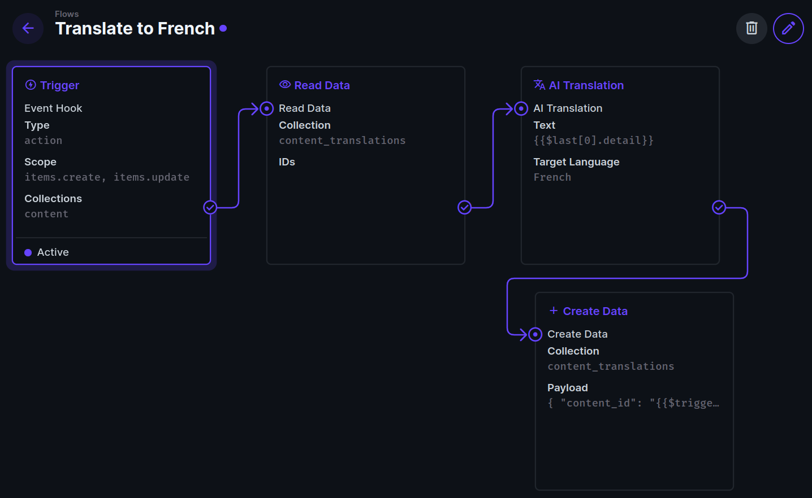
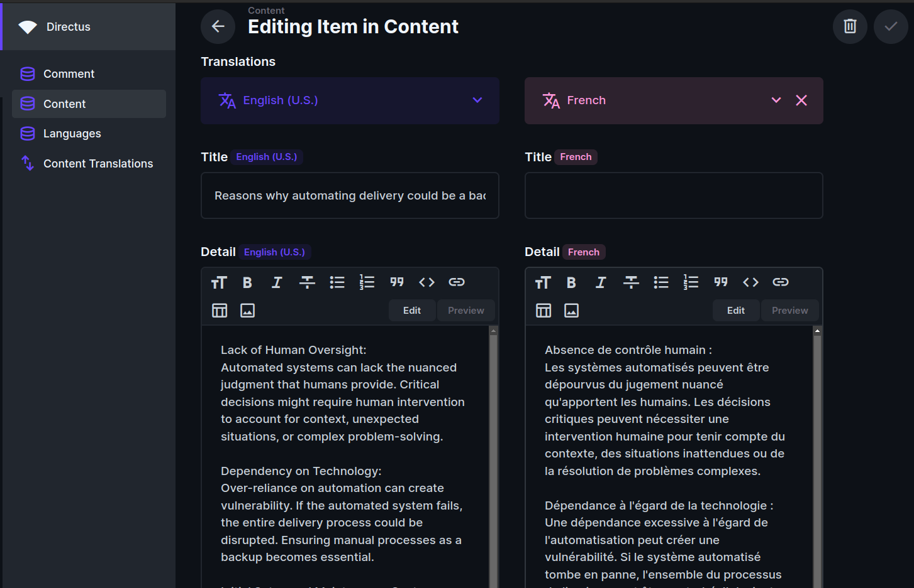
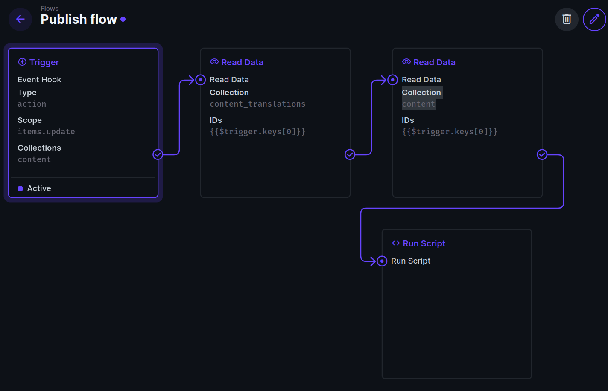
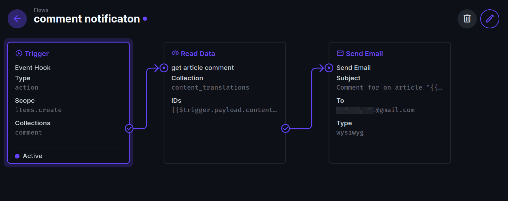
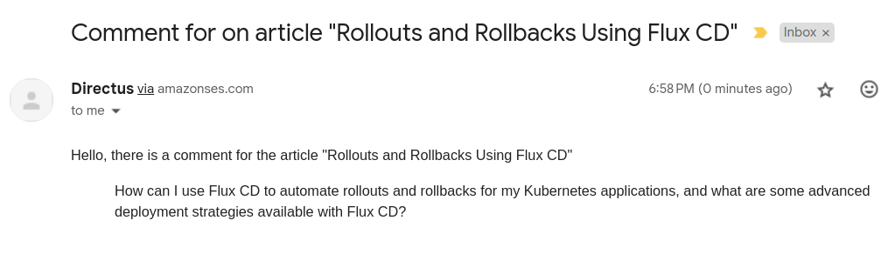
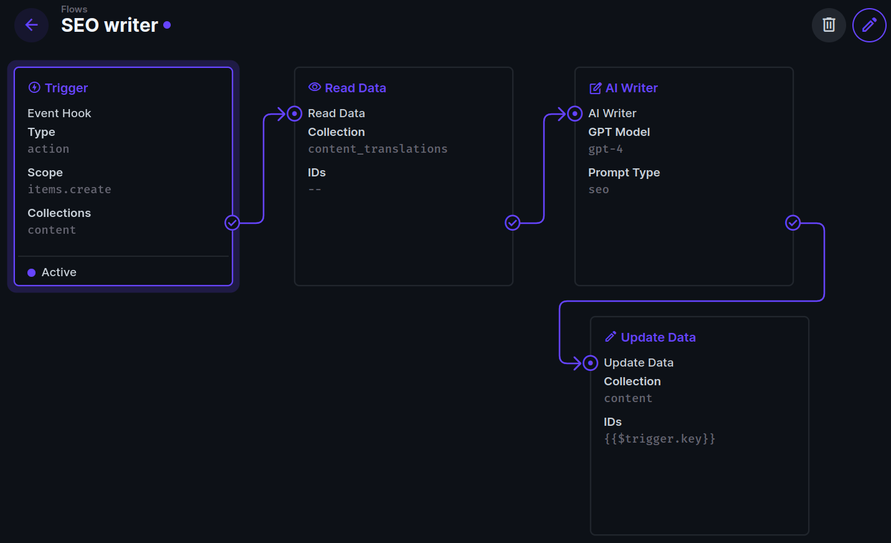
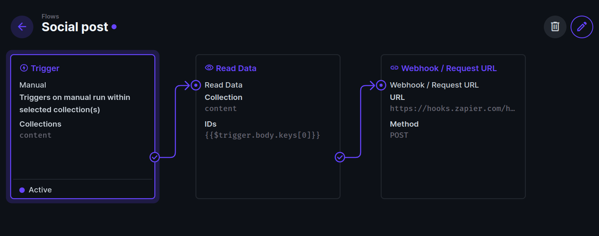

Maintaining a blog requires more than just compelling content; there's a lot of other manual work or processes that may need to be set up. 

This article shows five automation ideas that will level up your blog powered by Directus, allowing you to focus more on content creation and less on the intricacies of blog management.

## Before You Start

You will need:

- A Directus project - [follow our quickstart guide](https://docs.directus.io/getting-started/quickstart) if you don't already have one.
- A [DeepL](https://www.deepl.com/) API key for translation.
- An [OpenAI](https://openai.com/) key for generating search engine optimized summaries of your content.

In your Directus project, create a new collection called `content` and `comment` with the following fields:

For `content`:

- `seo_summary`: Textarea, string
- `comment`: one to many, comment
- `approved`: Radio Buttons, Choices: yes, no, Default Value: no

Do not add the fields to be translated like `title` or `detail` yet, because those will be stored in a separate collection. Follow [this translation guide](https://docs.directus.io/guides/headless-cms/content-translations) to set up your multilingual project.

For `comment`:
- `content`: many to one, content
- `comment`: Textarea, string

## 1. Automated Translation of New Posts


Automated translations ensure that every new post is available in multiple languages simultaneously, helping you be more accessible to a global audience.

Before continuing, add a `translation` field in your `content` collection with a `title` and `detail` field, if you haven't already.

We will automate translation from English to French, then update the article that was just created or updated. While we will translate only the `detail` section of the blog, but you can also use this method to create a translations for more fields.


This automation relies on the AI Translator extension, which you can download from the Directus Marketplace and is published by the Directus team.

Create a new flow with an event trigger. The scope should be `items.create` and `items.update` on the `content` collection. 

The trigger will only return the `key` of the content, but we require the `detail` field. Create a **Read Data** operation and give it full access permissions. On the "Content Translations" collection, access the following query:

```json
{
    "filter": {
        "_or": [
            {
                "_and": [
                    {
                        "content_id": {
                            "_eq": "{{$trigger.keys[0]}}"
                        }
                    },
                    {
                        "languages_code": {
                            "_eq": "en-US"
                        }
                    }
                ]
            },
            {
                "_and": [
                    {
                        "content_id": {
                            "_eq": "{{$trigger.key}}"
                        }
                    },
                    {
                        "languages_code": {
                            "_eq": "en-US"
                        }
                    }
                ]
            }
        ]
    }
}
```

The query filters for records in Content Translations where the `content_id` matches <span v-pre>`{{$trigger.keys[0]}}`</span> (when an updated item) or <span v-pre>`{{$trigger.key}}`</span> (when a newly-created item), and retrieves the `en-US` version. The **Read Data** returns the full article that was just created or updated.

Now add the **AI Translation** operation with full access permission. Enter your DeepL API key and select the appropriate plan. In the **Text** input, insert <span v-pre>`{{$last[0].detail}}`</span> and then choose the desired language.

Now we can save the French output by adding the **Create Data** operation on the **Content Translations** collection with full access permission. Use the payload:

```json
{
    "content_id": "{{$trigger.keys[0]}}",
    "languages_code": "fr-FR",
    "detail": "{{$last}}"
}
```

You can test this out by creating new content. After a few seconds, the French version will be populated. You can do the same for the title.



## 2. Automate Content Publishing Workflow on Approval


As a blog manager, you're often juggling multiple tasks. By setting up an automated publishing workflow in Directus, once a post is reviewed and approved by a superior, it gets published immediately. This automation eliminates the back-and-forth of manual scheduling and reduces the risk of human error.
Since we are not working with frontend here, we can simulate publishing by returning the title and detail as output.

### How to Implement
Create a flow to trigger upon updating a post and select the content collection. 
Now add a **Read Data** operation attached to the Content Translations collection with the ID `{{$trigger.keys[0]}}`.  This will return the payload that includes the `title` and `detail` of the content that was just updated. If you look at the payload, this data does not come with the value for `approved`, this is because it is saved in the `content` collection. So we need to use the **Read Data** operation again, but this time we will attach to the `content` collection with the ID `{{$trigger.keys[0]}}`.
Now use the Run Script operation to run the following JavaScript code:
```javascript
module.exports = async function(data) {
    // Initialize an empty result object
    let result = {};

    // Check if "approved" is "yes"
    if (data.item_read_rif6q.approved === "yes") {
        // Publish the article title and detail
        result = {
            title: data.item_read_6grfu.title,
            detail: data.item_read_6grfu.detail
        };
    } else {
        result = {
            status: "Not Approved for Publishing"
        };
    }
    
    return result;
};
```

In the code above, `item_read_rif6q` and `item_read_6grfu` are the keys for the Read Data operations, so yours might be different since they are automatically generated.
This is what your output will look like this when a content is approved:
```json
{
    "title": "Reasons why automating delivery could be a bad idea ",
    "detail": "Lack of Human Oversight:\nAutomated systems can lack the nuanced judgment that humans provide. Critical decisions might require human intervention to account for context, unexpected situations, or complex problem-solving...."
}
```
## 3. Configuring Alerts for New Comments



As your blog grows, monitoring comments manually becomes impractical. Automated alerts ensure that you and your team are notified of new comments instantly, enabling prompt responses and community engagement.

In this section, you will learn how to set up an automation to send comments email to a specified email.  

This automation assumed that comments are either collected directly in your Directus project, or that they are synced/pushed via an integration.

:::info Email Setup

If you are self-hosting a Directus instance, you will need to set up the [email service configuration](https://docs.directus.io/self-hosted/config-options.html#email).

:::


Create a flow to trigger email upon creating a comment and select the `comment` collection. 

Now add a **Read Data** operation attached to the Content Translations collection with the ID <span v-pre>{{$trigger.payload.content}}`</span>. This will return the comment that was just created. Now attach the **Send Email** operation. In the **To** section input the email addresses you want the notification to go to.

```
**Subject**:  Comment for on article "{{get_article_comment.title}}"
**Type**: Markdown
**Body**: 
    Hello, there is a comment for the article "{{get_article_comment.title}}"
    > {{$trigger.payload.comment}}
```



## Automatically Write SEO-Optimized Summaries



Writing SEO summaries can be time-consuming and repetitive. By using the AI Writer extension, available in the Directus Marketplace, you can automatically generate keyword-rich summaries, improving your blog's SEO performance and freeing up time for more creative tasks.

Once you've installed the AI Writer extension, create a flow to trigger upon creating a post and select the content collection. 

The trigger will only return the `key` of the content, but the whole post is needed to send to OpenAI. Create a **Read Data** operation and give it full access permissions. On the “Content Translations” collection, access the following query:

```json
{
    "filter": {
        "_and": [
            {
                "content_id": {
                    "_eq": "{{$trigger.key}}"
                }
            },
            {
                "languages_code": {
                    "_eq": "en-US"
                }
            }
        ]
    }
}
```

Pass the content to OpenAI by creating an **AI writer** operation. Input your OpenAI key, select the **GPT model** you want to use and **Prompt** as Create SEO Description. The Text will be gotten at <span v-pre>`{{$last[0].detail}}`</span>.

Update the content collection with the newly created SEO description using **Update Data** operation - the ID tag will be <span v-pre>`{{$trigger.key}}`</span>. You can now save the summary back to the item.


## Connect to the World of Zapier Integrations



Zapier is a wonderful automation tool with thousands of pre-built integrations. While Directus Automate is powerful, it's useful to recognize when integrating with other tools ends up being more efficient. 

Create a Zap with a [Webhook Trigger URL](https://help.zapier.com/hc/en-us/articles/8496288690317-Trigger-Zaps-from-webhooks). Once you have this, data can be sent to Zapier from Directus.

Create a flow to manually trigger on the Item page in the content collection. Now, create a **Read Data** operation, on the “Content” collection, use the ID at <span v-pre>`{{$trigger.body.keys[0]}}`</span>.

Create a **Webhook/Request URL** operation with the POST method and paste in your Zapier hook URL. You can add any data required by your Zap in the body. 

Examples of what you can do with Zapier for social media automation includes posting to Facebook, Instagram, or LinkedIn. 

## Conclusion
By leveraging the capabilities of Directus, from automated translations to content posting, you have the ability to operate your blog effectively. These five automation strategies not only streamline your workflow but also ensure that you cut down on the actions you need to take between the writing and promotion process.

