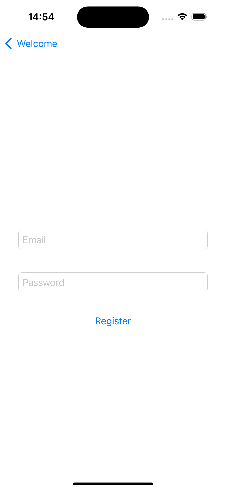

## Introduction

In this tutorial, you will learn how to configure an iOS project with Directus Auth. You'll cover registering, logging in, logging out, viewing all posts from all users, creating a post, and editing and deleting posts from your user account.

## Before You Start

You will need:

1. To have Xcode installed on your macOS machine.
2. Knowledge of the Swift programming language.
3. A Directus project - follow our [quickstart guide](docs.directus.io/getting-started/quickstart) if you don't already have one.

## Allowing Public Role To Create Users

1. Navigate to `Settings`.
2. Select `Access Control`.
3. Click on the `Public Role`.
4. Access the `System Collection`.
5. Locate `directus_users`.
6. Under the `Create` option, choose `Use Custom`.
7. Enable field permissions for `Email` and `Password` options.


## Creating A New iOS App User Role 

1. On the Access Control page, click the plus button.
2. Name your new role, such as `iOS App User`.
3. Under the "Post" collection, enable `Create` and `Read`.
4. For `Edit` and `Delete`, select `Use Custom`.
5. Add Filter `user_created -> id Equals $CURRENT_USER.id` for both update and delete options.
6. This configuration ensures that users can read all posts but are restricted to updating and deleting only      their own posts.
7. Retrieve the `Primary Key` associated with the iOS App User role by selecting the 'iOS APP User' option and 
   then tapping the information icon where you'll be able to copy the `Primary Key`
8. On the Access Control page, click `Public`. Click `create` for `directus_users` from the options, then 
   click on `Use custom`. Proceed to `field presets` and paste the Primary Key.

By following these steps users created by the public role will be given the iOS App User role.


## Content View

In Xcode, create a new project and add the following code to the ContentView.swift file. This code presents a welcome screen with two buttons `Register` and `Login`. After logging in, users will see a `create post` along with a `logout` button. Additionally, the view includes the function responsible for making the `POST` request from logging out.


```swift

import SwiftUI

struct ContentView: View {
    @State private var showLoginView = false
    @State private var isLoggedIn = false
    @State private var accessToken: String?
    
    var body: some View {
        NavigationView {
            VStack {
                Spacer()
                
                if isLoggedIn {
                    NavigationLink(
                        destination: CreatePostView(accessToken: accessToken ?? ""),
                        label: {
                            Text("Create Post")
                                .font(.title)
                                .foregroundColor(.white)
                                .padding()
                                .background(Color.blue)
                                .cornerRadius(10)
                        })
                    .padding()
                    
                    NavigationLink(
                        destination: PostsView(isLoggedIn: $isLoggedIn, accessToken: $accessToken),
                        label: {
                            Text("Posts")
                                .font(.title)
                                .foregroundColor(.white)
                                .padding()
                                .background(Color.green)
                                .cornerRadius(10)
                        })
                    .padding()
                    
                    Button("Logout") {
                        logout()
                    }
                    .foregroundColor(.red)
                    .padding()
                } else {
                    Button(action: {
                        showLoginView = true
                    }) {
                        Text("Login")
                            .font(.title)
                            .foregroundColor(.white)
                            .padding()
                            .background(Color.green)
                            .cornerRadius(10)
                    }
                    .sheet(isPresented: $showLoginView) {
                        LoginView(isLoggedIn: $isLoggedIn, accessToken: $accessToken)
                    }
                    
                    NavigationLink(
                        destination: UserRegisterView(isActive: .constant(false)),
                        label: {
                            Text("Register")
                                .font(.title)
                                .foregroundColor(.white)
                                .padding()
                                .background(Color.orange)
                                .cornerRadius(10)
                        })
                    .padding()
                }
                
                Spacer()
            }
            .padding()
            .navigationTitle("Welcome")
        }
    }
    
    func logout() {
        guard let refreshToken = accessToken
        else {
            print("Refresh token is missing")
            return
        }
        
        guard let url = URL(string: "https://your-directus-project-url/auth/logout") else {
            print("Invalid logout URL")
            return
        }
        
        var request = URLRequest(url: url)
        request.httpMethod = "POST"
        request.addValue("application/json", forHTTPHeaderField: "Content-Type")
        
        let body: [String: Any] = [
            "refresh_token": refreshToken
        ]
        
        do {
            request.httpBody = try JSONSerialization.data(withJSONObject: body)
        } catch {
            print("Error encoding request body: \(error.localizedDescription)")
            return
        }
        
        URLSession.shared.dataTask(with: request) { data, response, error in
            if let error = error {
                print("Error logging out: \(error.localizedDescription)")
                return
            }
            
            if let httpResponse = response as? HTTPURLResponse {
                if (200..<300).contains(httpResponse.statusCode) {

                    DispatchQueue.main.async {
                        isLoggedIn = false
                        accessToken = nil
                    }
                } else {
                    print("Failed to logout. Status code: \(httpResponse.statusCode)")
                }
            }
        }.resume()
    }
```

### State Properties:

Three `@State` properties are declared to manage the state of the view:

- **showLoginView**: Tracks whether the login view should be displayed.
- **isLoggedIn**: Tracks whether the user is logged in.
- **accessToken**: Stores the access token after successful login.

### Conditional Rendering:

Depending on the `isLoggedIn` state:
- If logged in, it displays navigation links for creating posts and viewing posts, along with a logout button.
- If not logged in, it displays buttons to login and register.


### Logout Button:

Triggers the `logout()` function when tapped.

### Logout Function:

- When the logout button is tapped, this function is called.
- It retrieves the `refreshToken` from the `accessToken` state variable.
- Constructs a POST request to the `/auth/logout` endpoint with the `refresh_token` included in the request body.
- If the logout request is successful (status code between 200 and 299), it updates the `isLoggedIn` state to `false` and clears the `accessToken`.
- If the logout request fails, it prints an error message with the status code.


## UserRegisterView
Create a file named UserRegisterView.swift, which facilitates user registration by providing two input fields for email and password. The registration process involves sending a POST request.



```swift
import SwiftUI

struct UserRegisterView: View {
    @Binding var isActive: Bool
    @State private var email: String = ""
    @State private var password: String = ""
    @State private var showAlert: Bool = false
    @State private var alertMessage: String = ""
    @Environment(\.presentationMode) var presentationMode
    
    var body: some View {
        VStack {
            TextField("Email", text: $email)
                .padding()
                .textFieldStyle(RoundedBorderTextFieldStyle())
            SecureField("Password", text: $password)
                .padding()
                .textFieldStyle(RoundedBorderTextFieldStyle())
            
            Button("Register") {
                registerUser()
            }
            .padding()
            .alert(isPresented: $showAlert) {
                Alert(title: Text("Error"), message: Text(alertMessage), dismissButton: .default(Text("OK")))
            }
        }
        .padding()
    }
    
    func registerUser() {
        guard !email.isEmpty, !password.isEmpty else {
            alertMessage = "Please enter both email and password"
            showAlert = true
            return
        }
        
        guard let url = URL(string: "https://your-directus-project-url/users") else {
            showAlert(message: "Invalid URL")
            return
        }
        
        let body = [
            "email": email,
            "password": password
        ]
        
        guard let jsonData = try? JSONSerialization.data(withJSONObject: body) else {
            showAlert(message: "Failed to encode data")
            return
        }
        
        var request = URLRequest(url: url)
        request.httpMethod = "POST"
        request.setValue("application/json", forHTTPHeaderField: "Content-Type")
        request.httpBody = jsonData
        
        URLSession.shared.dataTask(with: request) { data, response, error in
            if let error = error {
                showAlert(message: error.localizedDescription)
                return
            }
            
            if let data = data {
                if let responseString = String(data: data, encoding: .utf8) {
                    print("Response: \(responseString)")
                    DispatchQueue.main.async {
                        presentationMode.wrappedValue.dismiss()
                    }
                } else {
                    showAlert(message: "Failed to parse response")
                }
            } else {
                showAlert(message: "No data received")
            }
        }.resume()
    }
    
    func showAlert(message: String) {
        alertMessage = message
        showAlert = true
    }
}
```

### Properties:

- **`@Binding var isActive: Bool`**: This is a binding variable that determines whether the view is active or not. Changes in this view propagate back to the parent.
- **`@State private var email`: String = ""**: State variable to hold the user's email address.
- **`@State private var password`: String = ""**: State variable to hold the user's password.
- **`@State private var showAlert`: Bool = false**: State variable to control whether to show an alert.
- **`@State private var alertMessage`: String = ""**: State variable to hold the message to be displayed in the alert.
- **`@Environment(\.presentationMode)` var presentationMode**: Environment variable to access the presentation mode, which allows the view to dismiss itself.

### Body View:

- **VStack**: A vertical stack that arranges its child views in a vertical line.
- **TextField**: Text field for entering the user's email.
- **SecureField**: Secure text field for entering the user's password.
- **Button**: Button to register the user.
- **.alert(isPresented: $showAlert)**: Modifier to present an alert when showAlert is true.

### registerUser Function:

This function is called when the user taps the "Register" button.

- It first checks if the email and password fields are not empty. If they are empty, it sets the `alertMessage` and shows the alert.
- It sends a POST request to the '/user' endpoint with a payload containing the email and password. The 
   request is executed asynchronously using `URLSession.shared.dataTask`, and upon completion, it handles the response or any encountered errors. If successful, it dismisses the current view.


### showAlert Function:

- This function sets the `alertMessage` and sets showAlert to true, triggering the display of the alert.


## Login
Create a file named LoginView.swift, designed to facilitate user login with two input fields for email and password. The login process is executed through a `POST`request.

```swift
import SwiftUI

struct LoginData: Codable {
    let access_token: String
    let refresh_token: String
}

struct LoginResponse: Codable {
    let data: LoginData
}


struct LoginView: View {
    @State private var email: String = ""
    @State private var password: String = ""
    @State private var showAlert: Bool = false
    @State private var alertMessage: String = ""
    @Binding var isLoggedIn: Bool
    @Binding var accessToken: String?
    @Environment(\.presentationMode) var presentationMode
    
    var body: some View {
        NavigationView {
            VStack {
                TextField("Email", text: $email)
                    .padding()
                    .textFieldStyle(RoundedBorderTextFieldStyle())
                    .autocapitalization(.none)
                    .keyboardType(.emailAddress)
                
                SecureField("Password", text: $password)
                    .padding()
                    .textFieldStyle(RoundedBorderTextFieldStyle())
                
                Button(action: {
                    loginUser()
                }) {
                    Text("Login")
                        .padding()
                        .background(Color.blue)
                        .foregroundColor(.white)
                        .cornerRadius(8)
                }
            }
            .padding()
            .alert(isPresented: $showAlert) {
                Alert(title: Text("Error"), message: Text(alertMessage), dismissButton: .default(Text("OK")))
            }
        }
    }
    
    func loginUser() {
        guard let url = URL(string: "https://your-directus-project-url/auth/login") else {
            showAlert = true
            alertMessage = "Invalid URL"
            return
        }
        
        let loginData = ["email": email, "password": password]
        
        var request = URLRequest(url: url)
        request.httpMethod = "POST"
        request.addValue("application/json", forHTTPHeaderField: "Content-Type")
        
        do {
            request.httpBody = try JSONSerialization.data(withJSONObject: loginData, options: [])
        } catch {
            showAlert = true
            alertMessage = "Error encoding login data"
            return
        }
        
        URLSession.shared.dataTask(with: request) { data, response, error in
            guard let data = data, let httpResponse = response as? HTTPURLResponse, error == nil else {
                showAlert = true
                alertMessage = error?.localizedDescription ?? "Unknown error"
                return
            }
            
            if (200..<300).contains(httpResponse.statusCode) {
                // Successful login
                if let loginResponse = try? JSONDecoder().decode(LoginResponse.self, from: data) {
                    accessToken = loginResponse.data.access_token
                    isLoggedIn = true
                    presentationMode.wrappedValue.dismiss()
                }
            } else {
                // Failed to login
                showAlert = true
                alertMessage = "Failed to login"
            }
        }.resume()
    }
}
```
### LoginData Struct:

Codable protocol indicates that instances of this type can be encoded and decoded, typically used for JSON encoding and decoding. 

### Properties:

- Declares a struct `LoginData` with two properties: `access_token` and `refresh_token`, both of type String.

### LoginResponse Struct:

**Purpose**: Defines a struct `LoginResponse` conforming to Codable, representing the structure of the response expected from the login API.

### Properties:

- It contains a single property `data` of type `LoginData`.

### LoginView Struct:

**Purpose**: Defines a SwiftUI view named `LoginView`.

### State Variables:

- Contains several `@State` variables to hold the user's email, password, whether to show an alert, and the alert message.
- Takes two `@Binding` variables: `isLoggedIn` to track whether the user is logged in and `accessToken` to hold the access token received upon successful login.
- Accesses the presentation mode environment variable to control the navigation flow.

### Body View:

- Sets up a `NavigationView` for navigation-related functionalities.
- Contains a `VStack` with two `TextField` views for email and password input, and a `Button` for logging in.
- The button triggers the `loginUser()` function when tapped.
- Applies a modifier to show an alert if `showAlert` is true.

### loginUser Function:

- Validates the URL for the login endpoint (`/auth/login`).
- Constructs the login data dictionary with email and password.
- Creates a POST request with JSON-encoded login data.
- Performs a data task to execute the request asynchronously.
- Checks for errors, response status, and decodes the response if the status code indicates success (200..<300).
- If successful, updates `accessToken` with the received access token, sets `isLoggedIn` to true, and dismisses the view.
- If unsuccessful, the app shows an alert with an error message.


## CreatePostView
Create a file named CreatePostView.swift, intended for creating a new post with two input fields for title and content. The creation process is executed through a `POST` request.

```swift
import SwiftUI

struct CreatePostView: View {
    @State private var title: String = ""
    @State private var content: String = ""
    @State private var showAlert: Bool = false
    @State private var alertMessage: String = ""
    let accessToken: String
    
    var body: some View {
        VStack {
            TextField("Title", text: $title)
                .padding()
                .textFieldStyle(RoundedBorderTextFieldStyle())
            
            TextField("Content", text: $content)
                .padding()
                .textFieldStyle(RoundedBorderTextFieldStyle())
            
            Button(action: {
                createPost()
            }) {
                Text("Create Post")
                    .padding()
                    .background(Color.blue)
                    .foregroundColor(.white)
                    .cornerRadius(8)
            }
        }
        .padding()
        .alert(isPresented: $showAlert) {
            Alert(title: Text("Error"), message: Text(alertMessage), dismissButton: .default(Text("OK")))
        }
    }
    
    func createPost() {
        guard let url = URL(string: "https://your-directus-project-url/items/posts") else {
            showAlert = true
            alertMessage = "Invalid URL"
            return
        }
        
        let postData = ["title": title, "content": content]
        
        var request = URLRequest(url: url)
        request.httpMethod = "POST"
        request.addValue("application/json", forHTTPHeaderField: "Content-Type")
        request.addValue("Bearer \(accessToken)", forHTTPHeaderField: "Authorization")
        
        do {
            request.httpBody = try JSONSerialization.data(withJSONObject: postData, options: [])
        } catch {
            showAlert = true
            alertMessage = "Error encoding post data"
            return
        }
        
        URLSession.shared.dataTask(with: request) { data, response, error in
            guard let httpResponse = response as? HTTPURLResponse, error == nil else {
                showAlert = true
                alertMessage = error?.localizedDescription ?? "Unknown error"
                return
            }
            
            if (200..<300).contains(httpResponse.statusCode) {
                print("Post created successfully")
            } else {
                showAlert = true
                alertMessage = "Failed to create post. Status code: \(httpResponse.statusCode)"
            }
        }.resume()
    }
}
```
### CreatePostView Struct:

Defines a SwiftUI view named `CreatePostView`.

### State Variables:

- Contains several `@State` variables to hold the post's title, content, whether to show an alert, and the alert message.

### Parameters:

- Takes an `accessToken` parameter, which represents the access token needed to authenticate the user's request to create a post.

### Body View:

- Sets up a `VStack` containing two `TextField` views for inputting the post's title and content, respectively.
- Also contains a `Button` titled "Create Post", which triggers the `createPost()` function when tapped.
- Applies a modifier to show an alert if `showAlert` is true.

### createPost Function:

- Validates the URL for the endpoint where posts are created `/items/posts`.
- Constructs the post data dictionary with title and content.
- Creates a POST request with JSON-encoded post data.
- Adds necessary headers, including the authorization header with the provided access token.
- Performs a data task to execute the request asynchronously.
- Checks for errors and response status.
- If the status code indicates success (between 200 and 299), it prints a success message.
- If the status code indicates a failure, it shows an alert with an appropriate error message.


## Token Manager 

Create a new file named TokenManager.swift. This Swift code defines a struct named TokenManager responsible for managing access tokens.


``` swift
import Foundation

struct TokenManager {
    static let accessTokenKey = "accessToken"
    static let refreshTokenKey = "refreshToken"

    static func saveToken(_ accessToken: String) {
        UserDefaults.standard.set(accessToken, forKey: accessTokenKey)
    }
    
    static func saveRefreshToken(_ refreshToken: String) {
        UserDefaults.standard.set(refreshToken, forKey: refreshTokenKey)
    }
    
    static func getToken() -> String? {
        return UserDefaults.standard.string(forKey: accessTokenKey)
    }
    
    static func getRefreshToken() -> String? {
        return UserDefaults.standard.string(forKey: refreshTokenKey)
    }
}

```
- `accessTokenKey` and `refreshTokenKey`: These are static constants representing the keys used to store access and refresh tokens in UserDefaults.

- `saveToken(_:)`: This static method takes an access token as input and saves it to UserDefaults using the `accessTokenKey`.

- `saveRefreshToken(_:)`: This static method takes a refresh token as input and saves it to UserDefaults using the `refreshTokenKey`.

- `getToken()`: This static method retrieves the access token stored in UserDefaults using the `accessTokenKey`. It returns an optional String representing the access token.

- `getRefreshToken()`: This static method retrieves the refresh token stored in UserDefaults using the `refreshTokenKey`. It returns an optional String representing the refresh token.


## PostView 
Create a new file named PostView.swift. This code fetches and displays the current posts by users by sending a `GET` request.
``` swift 
import SwiftUI

struct PostResponse: Codable {
    let data: [Post]
}

struct Post: Codable, Identifiable {
    let id: String
    let title: String
    let content: String
    let user_created: String
    let date_created: String
}

struct PostsView: View {
    @State private var posts: [Post] = []
    @Binding var isLoggedIn: Bool
    @Binding var accessToken: String?
    
    var body: some View {
        if isLoggedIn {
            List(posts, id: \.id) { post in
                NavigationLink(destination: PostDetailView(post: post, accessToken: accessToken)) {
                    VStack(alignment: .leading) {
                        Text(post.title)
                            .font(.headline)
                        Text(post.content)
                            .font(.subheadline)
                    }
                }
            }
            .onAppear {
                fetchPosts()
            }
        } else {
            Text("Please login to view posts")
                .onAppear {
                    fetchPosts()
                }
        }
    }
    
    func fetchPosts() {
        guard let token = accessToken, let url = URL(string: "https://your-directus-project-url/items/posts") else {
            return
        }
        
        var request = URLRequest(url: url)
        request.httpMethod = "GET"
        request.addValue("Bearer \(token)", forHTTPHeaderField: "Authorization")
        
        URLSession.shared.dataTask(with: request) { data, response, error in
            if let error = error {
                print("Error fetching posts: \(error.localizedDescription)")
                return
            }
            
            guard let data = data else {
                print("No data received")
                return
            }
            
            do {
                let decodedResponse = try JSONDecoder().decode(PostResponse.self, from: data)
                DispatchQueue.main.async {
                    self.posts = decodedResponse.data
                }
            } catch {
                print("Error decoding posts: \(error.localizedDescription)")
            }
        }.resume()
    }
}
```

### PostResponse Struct:

Declares a struct `PostResponse` conforming to `Codable`. It represents the structure of the response expected from the API when fetching posts.

### Properties:

- It contains a property `data` which is an array of `Post` objects.

### Post Struct:

Declares a struct `Post` conforming to `Codable` and `Identifiable`. It represents the structure of a post.

### Properties:

- Properties such as `id`, `title`, `content`, `user_created`, and `date_created`.

### PostsView Struct:

Defines a SwiftUI view named `PostsView`.

### State Variables:

- Contains several `@State` variables: `posts` to hold an array of posts, `isLoggedIn` to track whether the user is logged in, and `accessToken` to hold the access token.

### Body View:

- Checks if the user is logged in (`isLoggedIn`). If logged in, it displays a list of posts fetched from the server.
- Each post is displayed using a `NavigationLink`, which navigates to a `PostDetailView` when tapped.
- If not logged in, it displays a message prompting the user to log in.
- Calls `fetchPosts()` to retrieve posts when the view appears.

### fetchPosts Function:
- Fetches posts from the server using an HTTP GET request.
- Constructs a request with the provided access token in the authorization header.
- Performs a data task to execute the request asynchronously.
- Handles errors, data reception, and decoding of the response.
- If successful, it decodes the response into a PostResponse object and updates the posts array with the received posts on the main thread.
- Uses the `/items/posts` endpoint to fetch posts.


## PostDetailView 
Create a new file named PostDetailView.swift. This view enables users to click on a post to expand it, providing options to edit and delete the post.

```swift
import SwiftUI


struct PostDetailView: View {
    var post: Post
    var accessToken: String?
    @State private var showAlert = false
    @State private var isEditMode = false

    var body: some View {
        VStack {
            Text(post.title)
                .font(.title)
                .padding()
            Text(post.content)
                .padding()
            
            Button("Edit") {
                isEditMode = true
            }
            .sheet(isPresented: $isEditMode) {
                EditPostView(post: post, isEditMode: $isEditMode, accessToken: accessToken)
            }
        
            DeletePostView(postId: post.id, accessToken: accessToken, showAlert: $showAlert)
        }
    }
}
```

### Properties:

- **post**: Represents the post to be displayed in detail.
- **accessToken**: Optional access token for authentication purposes.
- **showAlert**: A boolean state variable to control the display of an alert.
- **isEditMode**: A boolean state variable to track whether the view is in edit mode.

### Body View:

- Displays the title and content of the post.
- Contains a "Edit" button, which toggles the `isEditMode` state when tapped.
- Utilizes a `sheet` modifier to present an `EditPostView` when `isEditMode` is true. This allows the user to edit the post.
- Renders a `DeletePostView` passing the post's ID, access token, and the `showAlert` state variable. This allows the user to delete the post.

### Button Action:

- When the "Edit" button is tapped, it sets `isEditMode` to true, triggering the presentation of the `EditPostView`.

### EditPostView:

- The `sheet` modifier presents an `EditPostView` when `isEditMode` is true. It passes the post, `isEditMode`, and `accessToken` to the `EditPostView`.

### DeletePostView:

- Renders a `DeletePostView`, passing the post's ID and access token. It also passes the `showAlert` state variable, allowing the `DeletePostView` to control the display of an alert if needed.

## EditPostView 
Create a new file named EditPostView.swift. This code allows the editing of an existing post by sending a PATCH request.
``` swift
import SwiftUI

struct EditPostView: View {
    var post: Post
    @Binding var isEditMode: Bool
    var accessToken: String?
    @State private var editedTitle: String
    @State private var editedContent: String
    
    init(post: Post, isEditMode: Binding<Bool>, accessToken: String?) {
        self.post = post
        _isEditMode = isEditMode
        _editedTitle = State(initialValue: post.title)
        _editedContent = State(initialValue: post.content)
        self.accessToken = accessToken
    }
    
    var body: some View {
        VStack {
            TextField("Title", text: $editedTitle)
                .padding()
                .textFieldStyle(RoundedBorderTextFieldStyle())
            
            TextField("Content", text: $editedContent)
                .padding()
                .textFieldStyle(RoundedBorderTextFieldStyle())
            
            Button("Save") {
                updatePost()
            }
        }
        .padding()
        .onAppear {
            editedTitle = post.title
            editedContent = post.content
        }
    }
    
    func updatePost() {
        guard let accessToken = accessToken else {
            print("Access token is missing")
            return
        }
        
        let postId = post.id
        
        guard let url = URL(string: "https://your-directus-project-url/items/posts/\(postId)") else {
            print("Invalid URL")
            return
        }
        
        var request = URLRequest(url: url)
        request.httpMethod = "PATCH"
        request.addValue("Bearer \(accessToken)", forHTTPHeaderField: "Authorization")
        request.addValue("application/json", forHTTPHeaderField: "Content-Type")
        
        let updateData: [String: Any] = [
            "title": editedTitle,
            "content": editedContent
        ]
        
        do {
            request.httpBody = try JSONSerialization.data(withJSONObject: updateData, options: [])
        } catch {
            print("Error encoding update data: \(error.localizedDescription)")
            return
        }
        
        URLSession.shared.dataTask(with: request) { data, response, error in
            if let error = error {
                print("Error updating post: \(error.localizedDescription)")
                return
            }
            
            if let httpResponse = response as? HTTPURLResponse {
                if httpResponse.statusCode == 200 {
                    DispatchQueue.main.async {
                        isEditMode = false
                    }
                } else {
                    print("Failed to update post. Status code: \(httpResponse.statusCode)")
                }
            }
        }.resume()
    }
}
```
### EditPostView Struct:

### Properties:

- **post**: Represents the post to be edited.
- **isEditMode**: A binding to a boolean indicating whether the view is in edit mode.
- **accessToken**: Optional access token for authentication.
- **editedTitle**: A state variable to hold the edited title of the post.
- **editedContent**: A state variable to hold the edited content of the post.

### Initializer:

- Initializes the view with the provided `post`, `isEditMode`, and `accessToken`.
- Initializes the `editedTitle` and `editedContent` state variables with the initial values of the post's title and content, respectively.

### Body View:

- Displays a `VStack` containing two `TextField` views for editing the post's title and content.
- Provides a "Save" button that triggers the `updatePost()` function when tapped.
- Uses the `onAppear` modifier to set the initial values of the `editedTitle` and `editedContent` when the view appears.

### updatePost Function:

- Updates the post with the edited title and content.
- Constructs a PATCH request with the updated data and the access token in the authorization header.
- Performs a data task to execute the request asynchronously.
- Handles errors and response status codes.
- If successful (status code 200), sets `isEditMode` to false to exit the edit mode.
- Uses the `/items/posts/\(postId)` endpoint.


## Delete Post View 
Create a new file named DeletePostView.swift. This code enables the deletion of a post by sending a DELETE request.
``` swift 
import SwiftUI

struct DeletePostView: View {
    let postId: String
    let accessToken: String?
    @Binding var showAlert: Bool
    
    var body: some View {
        Button("Delete") {
            showAlert.toggle()
        }
        .padding()
        .alert(isPresented: $showAlert) {
            Alert(title: Text("Confirm"), message: Text("Are you sure you want to delete this post?"), primaryButton: .destructive(Text("Delete")) {
                deletePost()
            }, secondaryButton: .cancel())
        }
    }
    
    func deletePost() {
        print("Deleting post...")
        
        guard let accessToken = accessToken else {
            print("Access token is missing")
            return
        }
        
        guard let url = URL(string: "https://your-directus-project-url/items/posts/\(postId)") else {
            print("Invalid URL")
            return
        }
        
        var request = URLRequest(url: url)
        request.httpMethod = "DELETE"
        request.addValue("Bearer \(accessToken)", forHTTPHeaderField: "Authorization")
        
        URLSession.shared.dataTask(with: request) { data, response, error in
            if let error = error {
                print("Error deleting post: \(error.localizedDescription)")
                return
            }
            
            if let httpResponse = response as? HTTPURLResponse {
                if (200..<300).contains(httpResponse.statusCode) {
                    // Post deleted successfully
                    print("Post deleted successfully")
                } else {
                    print("Failed to delete post. Status code: \(httpResponse.statusCode)")
                }
            }
        }.resume()
    }
}
```

### Properties:

- **postId**: Represents the ID of the post to be deleted.
- **accessToken**: A string representing the access token required for authorization.
- **showAlert**: A binding to a boolean value indicating whether to show an alert for confirming the deletion.

### Body:

- This is where the layout of the view is defined using SwiftUI components.
- The body consists of a single `Button` labeled "Delete". When tapped, it toggles the `showAlert` boolean to true, which triggers the display of an alert for confirming the deletion.

### Alert:

- This is presented using the `.alert` modifier, which shows an alert when `showAlert` is true.
- The alert presents a confirmation message asking the user if they are sure they want to delete the post.
- It provides two buttons: a primary button labeled "Delete" (with a destructive style) and a secondary button labeled "Cancel".
- If the user confirms deletion by tapping "Delete", the `deletePost()` function is called.

### deletePost Function:

- Deletes a post from the server.
- Verifies the availability of the access token.
- Constructs the URL for deleting the post using its ID.
- Creates a `URLRequest` with HTTP method DELETE and appropriate headers, including the authorization header with the access token.
- Performs an asynchronous URLSession data task to execute the request.
- Upon receiving a response, checks if the request was successful (HTTP status code 200-299). If successful, prints a success message; otherwise, prints an error message.
- Endpoint: `/items/posts/\(postId)`.


## Summary 
By following this tutorial you've integrated Directus APIs for authentication in a SwiftUI iOS app. You've covered user registration, login, post creation, viewing, editing, deletion, and logout functionalities. This knowledge equips you to develop efficient and secure social apps, enabling users to interact seamlessly with content and manage their accounts with ease.
