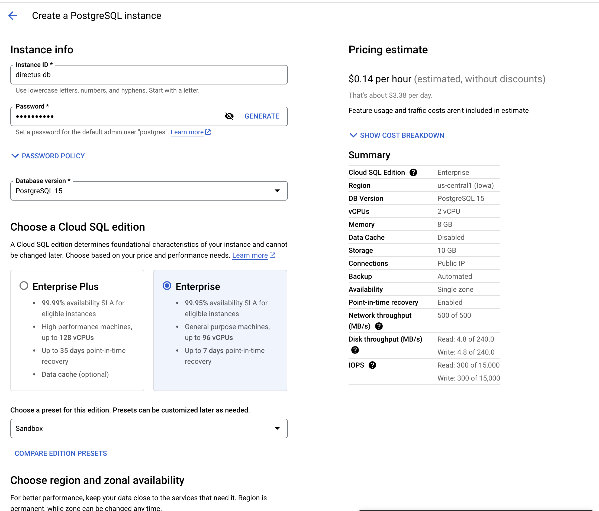
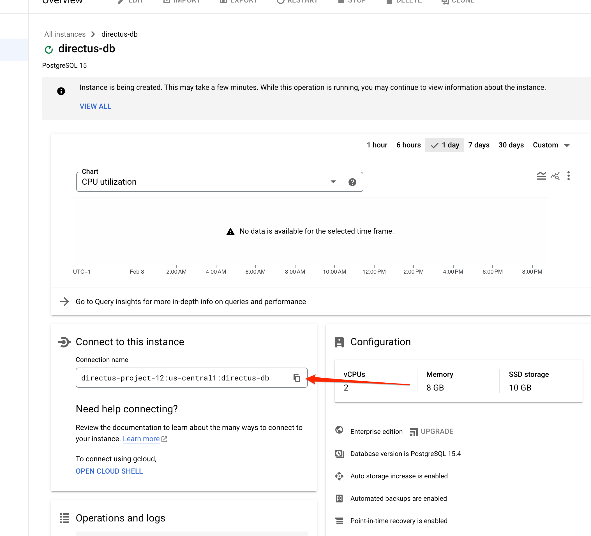
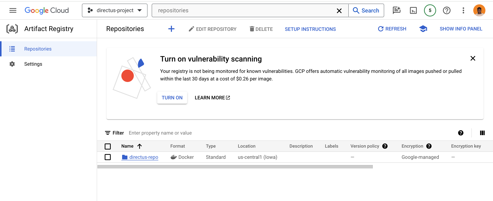
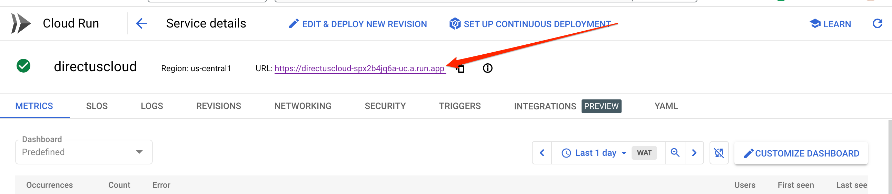

## Introduction

In this tutorial, you will learn how to deploy a self-hosted instance of Directus to Google Cloud Platform (GCP) Cloud Run and connect it with a Cloud SQL database (PostgreSQL) and Cloud Storage for storing assets.

## Prerequisite

To begin with this tutorial, you need the following:

- A [Google Cloud Account](https://cloud.google.com) with billing enabled.
- Google Cloud SDK [(gcloud CLI)](https://cloud.google.com/sdk/docs/install) installed in your local computer
- [Docker](https://docker.com/) locally installed and running on your computer

## Create a Google Cloud Project

Log in to Google Cloud Platform and head to the [project page](https://console.cloud.google.com/projectcreate) to create a new project, name this project `directs-project`, and associate it with your organization.

## Set up a Cloud SQL Database

Go to your Google Cloud console -> Menu -> SQL. On the Cloud SQL page, click on `Create Instance`, choosing PostgreSQL to create a Cloud SQL instance(You will need to enable this API if it's not enabled already).

Add an instance ID and a password for the default admin user `postgres` and select the database version you need. Choose also the Cloud SQL edition and region to suit your needs.

Click on the `Create Instance` button to create your new instance.



After successful creation, you will be redirected to the instance page; here, you'll find details about the PostgreSQL database instance created, such as the connection name and other information.

Copy the connection name for later usage.



## Set up Docker Container

To deploy a Docker container to Cloud Run, you must first prepare the container.

In your local computer, create a `Dockerfile` with the following content:

```yml
FROM directus/directus:10.9.2
```

The`Dockerfile` creates a new Docker image using the Directus image as the base image.

Next, Build the docker image and tag it to be `directus:10.9.2` using the command:

```bash
docker build -t directus:10.9.2 --platform linux/amd64 .
```

If you are using an ARM-based MacBook(M series), use the command:

```bash
docker buildx build -t directus:10.9.2 --platform linux/amd64 .
```

## Set up Repository on Google Cloud

To deploy the `Dockerfile` created, you must set up a repository on the Google Cloud Platform.
On the Google Cloud console, search for `repositories` and click on the Artifact Registry repositories (You'd need to enable Artifact Registry API if it is not enabled).

Click on the `Create repository` button and create a new repository with the name `directus-repo` with the following details:

- Format: Docker
- Mode: Standard
- Location type: Region (You can select multiple regions depending on your need)
- Region: `us-central1` (Again, choose your preferred region)
- Encryption: Google-managed encryption key
- Cleanup policies: Delete artifacts.

Click on Create to create a new repository.


You should have a repository page that looks like the photo above.

### Pushing the Dockerfile to Google Cloud

To push the `Dockerfile` to the created repository, you must first be authenticated via the Google Cloud SDK.

1. Login to Google Cloud SDK:  Login to Google Cloud using:

    ```bash
    gcloud auth login
    ```

    Select the project you created on Google Cloud via the `gcloud` CLI with:

    ```bash
    gcloud config set project PROJECT_ID
    ```

    In the directory where the `Dockerfile` is located, run the command:

    ```bash
    gcloud auth configure-docker us-central1-docker.pkg.dev
    ```

    The command above will configure Docker to authenticate with Google Artifact Registry.

    ```
    :::info Google Cloud Region
    Wherever `us-central1` appears in this tutorial should be replaced with the `region` you selected when creating that resource
    :::
    ```

2. Tag the Docker Image: Tag the local docker image you built with the repository created with the command:

    ```bash
    docker tag directus:10.9.2 us-central1-docker.pkg.dev/directus-project/directus-repo/directus:10.9.2
    ```

    Where:

    - `directus-project` is the project ID you are working on
    - `directus-repo` is the repository created
    - `us-central1` is the region

3. Push the Docker image to the Artifact Registry with the command:

```bash
docker push  us-central1-docker.pkg.dev/directus-project/directus-repo/directus:10.9.2

```

This will push the image to the Google Cloud Artifact Registry.

## Set up Cloud Run

Google Cloud Run lets you run Docker containers directly on top of Google's Cloud platform.

1. In the Google Cloud console, go to Menu -> Cloud Run (You need to enable this API ) -> Create service

2. To create a new service, select the following options:
    - **Deploy one revision from an existing container image**
    - **Container Image URL**: To select a container image URL, click the select button to open the Artifact Registry and select the image you pushed earlier.
    - Add your preferred service name, e.g., `directuscloud`, and select a region, e.g., `us-central1`
    - **Authentication**: Check on `Allow unauthenticated invocations`
    - **CPU allocation**: check that CPU is only allocated during request processing
    - **Revision autoscaling**: Choose the number of instances you need.

3. Toggle the Container(s), Volumes, Networking, Security dropdown to show more details about the container.
  On the settings tab, select a resource of 2GiB memory and 2 CPU (This is the recommended minimum configuration for setting up a Directus instance)

4. On the variables & secret tab, add the required environment variables needed to start a Directus instance, such as:

    ```yml
    KEY: YOUR_RANDOM_KEY
    SECRET: YOUR_RANDOM_SECRET
    ADMIN_EMAIL: admin@example.com
    ADMIN_PASSWORD: d1r3ctu5
    DB_CLIENT: pg
    DB_HOST: /cloudsql/directus-project:us-central1:directus-db
    DB_PORT: 5432
    DB_DATABASE: postgres
    DB_USER: postgres
    DB_PASSWORD: YOUR_DB_PASSWORD
    DB_SSL__REJECT_UNAUTHORIZED: false
    ```

    ```
    :::info `DB_HOST`
    The `DB_HOST` is a combination of `/cloudsql/` and the connection name of your Cloud SQL database. This is a prefix indicating that the hostname is for a Cloud SQL instance.
    :::
    ```

5. To connect Cloud SQL to Cloud Run, click on the Cloud SQL instance select box to select your previously created Cloud SQL database instance.

Click on the create button to create your new Cloud Run service; when successfully deployed, click on the service name to show more details about the service; on the dashboard, you'll find the URL where Directus is running.



## Connect Cloud Storage (Optional)

If you want to use Google Cloud Storage as a bucket for storing your files and assets, go to the console -> Main Menu -> Cloud Storage

1. Click on Create a new Bucket and select a bucket name, region, and default storage class as standard, Access control as uniform, and create a new bucket

2. Copy the bucket name to add to your container environment variables and update the environment variables in Cloud Run the details:

    ```yml
    STORAGE_LOCATIONS: gcs
    STORAGE_GCS_DRIVER: gcs
    STORAGE_GCS_BUCKET: YOUR_CLOUD_STORAGE_BUCKET_NAME
    STORAGE_GCS_CREDENTIALS: YOUR_SERVICE_ACCOUNT_KEY_JSON

    ```

```
:::info YOUR_SERVICE_ACCOUNT_KEY_JSON
To create a new key for your service account, go to your Google Cloud console -> IAM & Admin -> Services Accounts -> Click on your project's Compute Engine default service account email and click on the Keys tab to create a new key.
:::
```

## Next Steps

Some steps you could consider moving forward toward improving your deployment include:

- Improved security permissions for connecting to the created resources

- Consider using [Google Secret Manager](https://cloud.google.com/security/products/secret-manager) for managing your `ENV` variables

Compared to using [Directus Cloud](https://directus.io/cloud), a self-hosted instance of Directus on Google Cloud Platform has several limitations by default, like no backups, no rolling updates, round-the-clock monitoring, and the inability to restart automatically in the event of a crash. Each of these can be configured and maintained separately.
