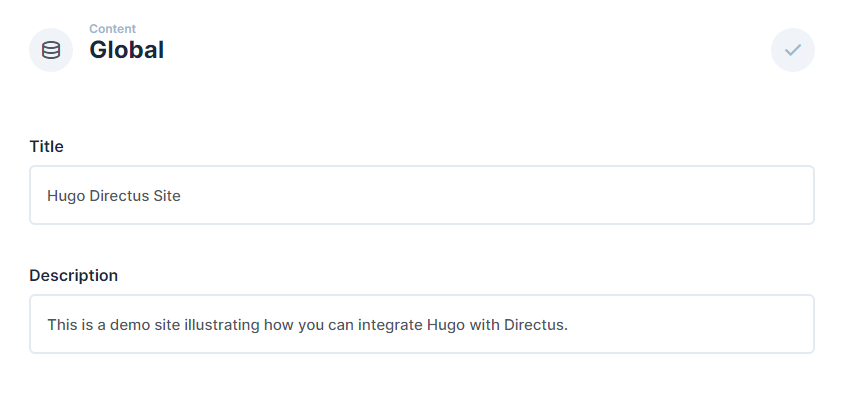
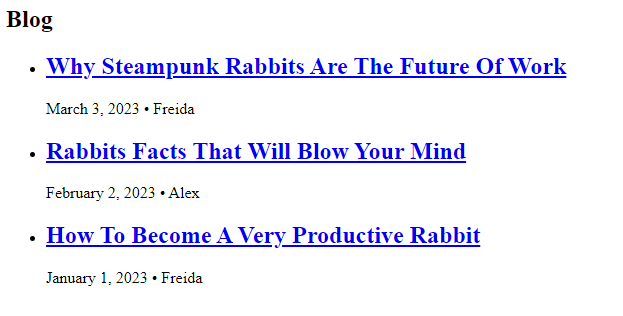
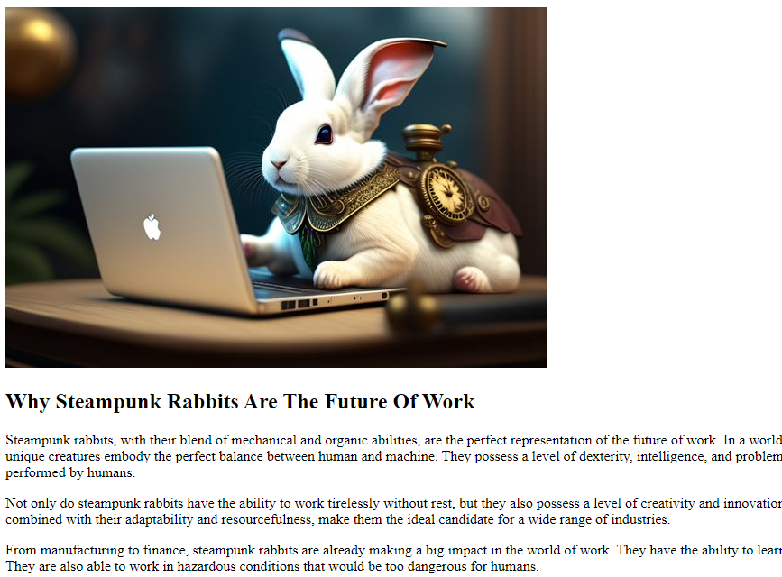

## Introduction

Hugo is a popular Static Site Generator (SSG). In this tutorial, you will learn how to build a website using Directus as a headless CMS. You will store, retrieve, and use global metadata such as the site title, create new pages dynamically based on Directus items, and build a blog.

## Before You Start

<!-- ## Your Sections Here -->
You will need:

- Install Go, Hugo, and a code editor for your computer.
- A Directus project. Follow the [Quickstart guide](https://docs.directus.io/getting-started/quickstart.html) to create one.
- Some knowledge of Go Templating language is helpful.

## Creating Hugo Project

Open your terminal and run the following command to create a new Hugo website:

```bash
hugo new site my-website
```

Inside `my-website` open the `config.toml` file and add the URL to your Directus project as a param.

```toml
[params]
    api_url = "https://directus.example.com"
``` 

Open `my-website` in your code editor.

## Using Global Metadata And Settings

In your Directus project, navigate to Settings -> Data Model and create a new collection called `global`. Select 'Treat as a single object' under the Singleton option.

Create two text input fields - one with the key of `title` and the other with `description`.

Go to the Content module and select the Global collection. Enter information for the title and the description and hit Save.



By default, new collections are not accessible to the public. Navigate to Settings -> Access Control -> Public and give Read access to the Global collection.

Inside `my-website`, open the `layouts` directory and create a `_default` directory. Add a `baseof.html` file. This will provide the base layout to be inherited by all other layout files.

```html
<!doctype html>
<html>
<head>
 <meta charset="utf-8">
 <title>
  {{ $global := getJSON (printf "%s/items/global" site.Params.api_url) }}
  {{ $global.data.title }} -
  {{ block "title" . }}
  {{ end }}
</title>
</head>

<body>
    <h1>{{ $global.data.title }}</h1>
    <p>{{ $global.data.description }}</p>
    {{ block "main" . }}
    {{ end }}
</body>
</html>
```

The `getJSON` method is used to fetch the global collection from the Directus project. The data is accessed using the `$global` variable. The "main" and "title" blocks are placeholders that other layouts can use to only specify that part of the page.

Create a new file in the `layouts` directory named `index.html`.

```html
{{ define "title" }}
    Home
{{ end }}
```

Type `hugo serve` in your terminal and Hugo will build your site. Open your site at http://localhost:1313 in your browser. You should see data from your Directus Global collection on your page. 

## Creating Pages With Directus

### Setting Up Directus

Create a new collection called `pages` - make the Primary ID Field a "Manually Entered String" called `slug`, which will correlate with the URL for the page. For example `about` will later correlate to the page localhost:1313/about.

Create a text input field called `title` and a WYSIWYG input field called `content`. In Access Control, give the Public role read access to the new collection. Create 3 items in the new collection - [here's some sample data](https://github.com/directus-community/getting-started-demo-data/tree/main/pages).

### Creating Markdown Files in Hugo

Inside `my-website` create a new directory named `prebuild`. The `prebuild` directory will store to process data fetched from the Directus project and create markdown files. Add a `prebuild/config.toml` file. 

Open up `prebuild/config.toml` in your code editor and add the following:

```toml
disableKinds = ["sitemap", "taxonomy", "term"]

[outputs.home]
  to = ["html"]

[params]
  api_url = "https://directus.example.com"
```

This ensures the prebuild directory outputs only the data fetched from the Directus project API.

Inside of `prebuild`, create a new directory named `layouts` and add a file called `index.html`. This template file will fetch API data from the Directus project's pages collection and create markdown files for each page.

```html
{{ with resources.GetRemote (printf "%s/items/pages" site.Params.api_url) }}
    {{ $pages := unmarshal .Content }}
    {{ range $pages.data }}
        {{ $meta := dict "slug" .slug "title" .title }} 
        {{ $metaJson := jsonify $meta }}
        {{ $content := .content | safeHTML }}
        {{ $output := printf "%s\n%s" $metaJson $content }}
        {{ $filename := printf "content/%s.md" .slug }}
        {{ $resource := resources.FromString $filename $output }} 
        {{ $file := $resource.RelPermalink }} 
    {{ end }}
{{ end }}
```

The method `resources.GetRemote (printf "%s/items/pages" site.Params.api_url)` is used to fetch data from the pages collection in the Directus project.

The `$meta` variable stores a dictionary map of the `slug` and `title` fields for each page. These fields are then used as frontmatter in JSON format when the markdown file is generated.

Run `hugo` from the `prebuild` directory. This will generate a directory named `prebuild/public/content` containing all the pages from the Directus collection.

Mount the `prebuild/public/content` directory for Hugo to read the pages collection. Open up your Hugo site's config file `config.toml` and append the following code:

```toml
[markup.goldmark.renderer]
  unsafe = true

[module]
  [[module.mounts]]
    source = "prebuild/public/content"
    target = "content"
```

Setting the `unsafe` boolean of `markup.goldmark.renderer` to true tells Hugo HTML is safe to render.

Add a file named `single.html` in the `layouts/_default` directory.

```html
{{ define "title" }}
  {{ .Title }}
{{ end }}
{{ define "main" }}
  <h2>{{ .Title }}</h2>
  {{ .Content }}
{{ end }}
```

This code will make sure your templates for the pages are using the proper Front Matter keys.

Run `hugo serve` from the root of your main Hugo project directory. Visit http://localhost:1313/about, replacing `about` with any of your item slugs. The page should show the data in your Directus pages collection.

## Creating Blog Posts With Directus

Create a new collection called `authors` with a single text input field called `name`. Create one or more authors.

Then, create a new collection called `posts` - make the Primary ID Field a "Manually Entered String" called `slug`, which will correlate with the URL for the page. For example `hello-world` will later correlate to the page localhost:1313/blog/hello-world.

Create the following fields in your posts data model:

- a text input field called `title`
- a WYSIWYG input field called `content`
- an image relational field called `image`
- a datetime selection field called `publish_date` - set the type to 'date'
- a many-to-one relational field called `author` with the related collection set to `authors`.

In Access Control, give the Public role read access to the `authors`, `posts`, and `directus_files` collections.

Create 3 items in the posts collection - [here's some sample data](https://github.com/Marktawa/examples/tree/main/hugo-directus/demo-data/posts).

### Configure Hugo For Fetching Posts

Update `prebuild/layout/index.html` so that it can fetch posts from Directus as well. Append the following:

```html
{{ with resources.GetRemote (printf "%s/items/Posts?fields[]=*.*" site.Params.api_url) }}
    {{ $posts := unmarshal .Content }}
    {{ range $posts.data }}
        {{ $meta := dict "slug" .slug "title" .title "date" .publish_date "author" .author.name "image" .image.filename_disk }} 
        {{ $metaJson := jsonify $meta }}
        {{ $content := .content | safeHTML }}
        {{ $output := printf "%s\n%s" $metaJson $content }}
        {{ $filename := printf "content/blog/%s.md" .slug }}
        {{ $resource := resources.FromString $filename $output }} 
        {{ $file := $resource.RelPermalink }} 
    {{ end }}
{{ end }}
```
The query `%s/items/Posts?fields[]=*.*` will retrieve the first 100 items (default). It will return all top-level fields and all second-level relational fields.

Run `hugo` from the `prebuild` directory. This will generate a subdirectory named `blog` in the `prebuild/public/content` directory containing all the posts from the Directus collection.

### Create Blog Post Listing

Create a new directory called `blog` in the `layouts` directory, and inside create `list.html` with the following content:

```html
{{ define "title" }}
  Blog
{{ end }}
{{ define "main" }}
    <h2>Blog</h2>
    <ul>
    {{ range .Pages }}
        <li>
            <a href="{{ .Permalink }}"><h2>{{ .Title }}</h2></a>
            <span>{{ .Date.Format "January 2, 2006" }} &bull; {{ .Params.author }}</span>
        </li>
    {{ end }}
    </ul>
{{ end }}
```

This will display a list of all the blog posts. It includes the `slug`, `title`, `publish_date`, and `name` of the related `author`.

Visit http://localhost:1313/blog to view the blog post listing with the latest items first.



### Create Blog Post Pages

Create a layout for blog posts. Open the `layouts` directory and create a directory named `blog`. Inside `blog` add a file named `single.html`.

```html
{{ define "title" }}
  {{ .Title }}
{{ end }}
{{ define "main" }}
    
    <h2>{{ .Title }}</h2>
    {{ .Content }}
{{ end }}
```

Some key notes about the code snippet:
- `%s/assets/%s?width=600` is a query requesting the blog post's image.
- The `width` attribute demonstrates Directus' built-in image transformations.

Run `hugo serve` and view any blog post page, for example, http://localhost:1313/why-steampunk-rabbits-are-the-future-of-work.



## Add Navigation

While not strictly Directus-related, there are now several pages that aren't linked to each other. Update `baseof.html` the following code just after the opening `<body>` tag:

```html
<nav>
    <a href="/">Home</a>
    <a href="/about">About</a>
    <a href="/conduct">Code of Conduct</a>
    <a href="/privacy">Privacy Policy</a>
    <a href="/blog">Blog</a>
</nav>
```

## Summary

Through this guide, you have set up a Hugo project and configured it to query data from a Directus project. You have used a singleton collection for global metadata, dynamically created pages, as well as blog listing, and single post pages.

If you want to change what is user-accessible, consider setting up more restrictive roles and accessing only valid data at build time.

If you want to build more complex dynamic pages made of reusable components, check out our [recipe for doing just this](https://docs.directus.io/guides/headless-cms/reusable-components).