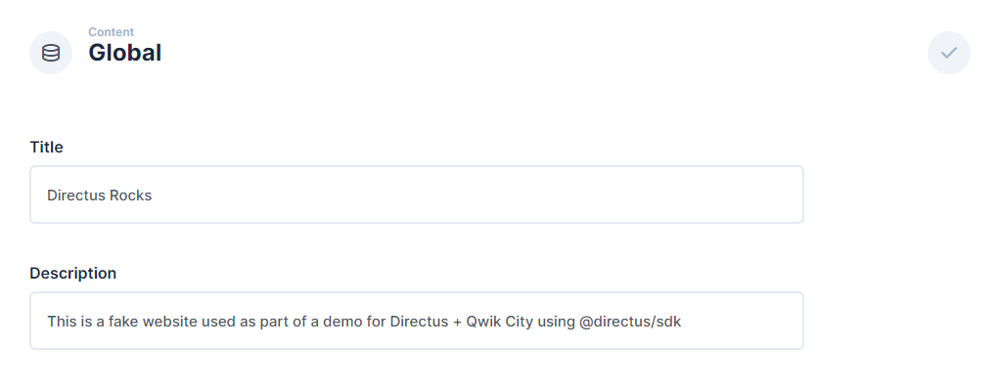
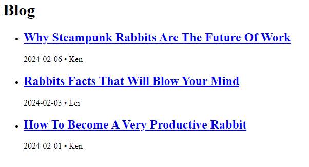

## Introduction

This guide shows you how to build a website with Qwik City and Directus as a Headless CMS.

[Qwik City](https://qwik.dev/docs/qwikcity/) is a popular JavaScript framework based on [Qwik](https://qwik.dev/docs/). In this tutorial, you will learn how to build a website using Directus as a [Headless CMS](https://directus.io/solutions/headless-cms). You will store, retrieve, and use global metadata such as the site title, create new pages dynamically based on Directus items, and build a blog.

## Before You Start

You will need:

- To install Node.js and a code editor on your computer.
- To sign up for a Directus Cloud account.
- Some knowledge of Vue.js and Nuxt.

Create a new Directus Cloud project - any tier and configuration is suitable for this tutorial.

Open your terminal and run the following commands to create a new Qwik City project and the Directus JavaScript SDK:

```bash
mkdir my-website
npm create qwik@latest
```

Answer the pre-install prompts as follows:

- `Where would you like to create your new project?` - `./my-website`
- `Select a starter` - `Empty App (Qwik City + Qwik)`
- `Would you like to install npm dependencies?` - `Yes`

Once finished, navigate into the new directory, install the dependencies, and install the Directus JavaScript SDK:

```bash
cd my-website
npm install
npm install @directus/sdk
```

Open `my-website` in your code editor and type `npm start` in your terminal to start the Qwik City development server and open [http://localhost:5173](http://localhost:5173) in your browser.

## Create a Helper for the SDK 

To share a single instance of the Directus JavaScript SDK between multiple pages in this project, create a single helper file that can be imported later. Create a new directory called `lib` and a new file called `directus.js` inside of it.

```js
import { createDirectus, rest } from '@directus/sdk';

const directus = createDirectus('https://directus.example.com').with(rest());

export default directus;
```

Ensure your Project URL is correct when initializing the Directus JavaScript SDK.

## Using Global Metadata and Settings 

In your Directus project, navigate to Settings -> Data Model and create a new collection called `global`. Under the Singleton option, select 'Treat as a single object', as this collection will have just a single entry containing global website metadata.

Create two text input fields - one with the key of `title` and one `description`.

Navigate to the content module and enter the global collection. Collections will generally display a list of items, but as a singleton, it will launch directly into the one-item form. Enter information in the title and description field and hit save.



By default, new collections are not accessible to the public. Navigate to Settings -> Access Control -> Public and give Read access to the Global collection.

Inside of the `src` directory, open up the `routes/index.tsx` file. Replace the contents with the following:

```tsx
import { component$ } from "@builder.io/qwik";
import { routeLoader$ } from "@builder.io/qwik-city";

import directus from '../../lib/directus';
import { readItems } from '@directus/sdk';

export const useGetGlobals = routeLoader$(async () => {
  return directus.request(readItems("global"));
});

export default component$(() => {
  const global = useGetGlobals().value;
  return (
    <>
      <h1>{global.title}</h1>
      <p>{global.description}</p>
    </>
  );
});
```

Type `npm start` in your terminal to start the Qwik City development server and open [http://localhost:5173](http://localhost:5173) in your browser. You should see data from your Directus Global collection in your page.

## Creating Pages With Directus

Create a new collection called `pages` - make the Primary ID Field a "Manually Entered String" called `slug`, which will correlate with the URL for the page. For example `about` will later correlate to the page `localhost:3000/about`.

Create a text input field called `title` and a WYSIWYG input field called `content`. In Access Control, give the Public role read access to the new collection. Create 3 items in the new collection - [here's some sample data](https://github.com/directus-labs/getting-started-demo-data).

Inside of `routes`, create a new folder called `[slug]`. Add `index.tsx` inside `slug`. This is a dynamic route, so a single file can be used for all of the top-level pages.

```tsx
import { component$ } from "@builder.io/qwik";
import { routeLoader$ } from "@builder.io/qwik-city";

import directus from '../../../lib/directus';
import { readItem } from '@directus/sdk';

export const useGetPages = routeLoader$(async ({ params, status }) => {
    try {
  const page = await directus.request(readItem('pages', params.slug));
  return page;
    } catch (error) {
        status(404);
    }
});

export default component$(() => {
  const page = useGetPages().value;
  return (
    <>
        <h1>{page.title}</h1>
		<div dangerouslySetInnerHTML={page.content}></div>
    </>
  );
});
```

Go to http://localhost:3000/about, replacing `about` with any of your item slugs. Using the Directus JavaScript SDK, the single item with that slug is retrieved, and the page should show your data. `readItem()` allows you to specify the Primary ID Field.

*Note that we check if a returned value exists, and return a 404 if not. Please also note that [`dangerouslySetInnerHTML` should only be used for trusted content.](https://reactjs.org/docs/dom-elements.html#dangerouslysetinnerhtml)*

## Creating Blog Posts With Directus

Create a new collection called `authors` with a single text input field called `name`. Create one or more authors.

Then, create a new collection called `posts` - make the Primary ID Field a "Manually Entered String" called `slug`, which will correlate with the URL for the page. For example `hello-world` will later correlate to the page `localhost:3000/blog/hello-world`.

Create the following fields in your `posts` data model:

- a text input field called `title`
- a WYSIWYG input field called `content`
- an image relational field called `image`
- a datetime selection field called `publish_date` - set the type to 'date'
- a many-to-one relational field called `author` with the related collection set to `authors`
- In Access Control, give the Public role read access to the `authors`, `posts`, and `directus_files` collections.

Create 3 items in the posts collection - [here's some sample data](https://github.com/directus-community/getting-started-demo-data).

### Create Blog Post Listing

Inside of the `routes` directory, create a new subdirectory called `blog` and a new file called `index.tsx` inside of it.

```tsx
import { component$ } from "@builder.io/qwik";
import { routeLoader$ } from "@builder.io/qwik-city";

import directus from '../../../lib/directus';
import { readItems } from '@directus/sdk';

export const useGetPosts = routeLoader$(async () => {
  return directus.request(
    readItems("posts", {
        fields: ['slug', 'title', 'publish_date', { author: ['name'] }],
		sort: ['-publish_date'],
    })
    );
});

export default component$(() => {
  const posts = useGetPosts().value;
  return (
    <div>
      <h1>Blog</h1>
    </div>
  );
});
```

This query will retrieve the first 100 items (default), sorted by publish date (descending order, which is latest first). It will only return the specific fields we request - `slug`, `title`, `publish_date`, and the `name` from the related `author` item.

Update the returned HTML:

```tsx
<div>
		<h1>Blog</h1>
		<ul>
			{posts.map((post) => {
				return (
					<li key={post.slug}>
						<h2>
						<a href={`/blog/${post.slug}`}>
							{post.title}
						</a>
						</h2>
						<span>
							{post.publish_date} &bull; {post.author.name}
						</span>
					</li>
				);
			})}
		</ul>
	</div>
```

Visit http://localhost:3000/blog and you should now see a blog post listing, with latest items first.



### Create Blog Post Pages

Each blog post links to a page that does not yet exist. In the `routes/blog` directory, create a new directory called [slug], and within it a `index.tsx` file:

```tsx
import { component$ } from "@builder.io/qwik";
import { routeLoader$ } from "@builder.io/qwik-city";

import directus from '../../../../lib/directus';
import { readItem } from '@directus/sdk';

export const useGetPost = routeLoader$(async ({ params, status }) => {
	try {
		const post = await directus.request(
			readItem('posts', params.slug, {
				fields: ['*', { image: ['filename_disk'], author: ['name'] }],
			})
		);

		return post;
	} catch(error) {
		status(404);
	}
});

export default component$(() => {
	const post = useGetPost().value;
	return (
		<>
			
			<h1>{post.title}</h1>
			<div dangerouslySetInnerHTML={post.content}></div>
		</>
	);
});
```

Some key notes about this code snippet.

- In the `` tag, `directus.url` is the value provided when creating the Directus helper.
- The `width` attribute demonstrates Directus' built-in image transformations.
- Once again, `dangerouslySetInnerHTML` should only be used if all content is trusted.

Click on any of the blog post links, and it will take you to a blog post page complete with a header image.


## Add Navigation

While not strictly Directus-related, there are now several pages that aren't linked to each other. Open the file `routes/layout.tsx` to add a navigation above the main content. Don't forget to use your specific page slugs. Replace the existing code with this:

```tsx
import { component$, Slot } from "@builder.io/qwik";
import { Link } from '@builder.io/qwik-city';

export default component$(() => {
  return (
    <>
        <nav>
          <Link href="/">Home</Link>{' | '}
          <Link href="/about">About</Link>{' | '}
          <Link href="/conduct">Code of Conduct</Link>{' | '}
          <Link href="/privacy">Privacy Policy</Link>{' | '}
          <Link href="/blog">Blog</Link>
        </nav>
        <Slot />
    </>
  );
});
```

## Summary

Through this guide, you have set up a Qwik City project, created a Directus helper, and used it to query data. You have used a singleton collection for global metadata, dynamically created pages, as well as blog listing and post pages.

If you want to change what is user-accessible, consider setting up more restrictive roles and accessing only valid data at build-time.

If you want to build more complex dynamic pages made out of reusable components, check out [our recipe on doing just this](https://docs.directus.io/guides/headless-cms/reusable-components).

If you want to see the code for this project, you can find it on GitHub.