## Introduction

[Amazon Web Services (AWS)](https://aws.amazon.com/free/) is a cloud computing platform provided by Amazon, offering a comprehensive suite of services that empower businesses and individuals to harness the potential of the cloud. In this tutorial, you will learn how to deploy a self-hosted instance of Directus to AWS and connect it to S3 storage and an AWS RDS PostgreSQL database.

## Before You Start

You will need:

- An Amazon Web Service account ([AWS](https://aws.amazon.com/free)) with access to its `SecretKey` and `AccessKey`.
- A Directus project - you can use [Directus Cloud](https://directus.cloud/) or [run it yourself](https://docs.directus.io/getting-started/quickstart.html).

## Set up an AWS RDS Database

Login to your AWS account and head to the [RDS page](https://eu-west-2.console.aws.amazon.com/rds/home) or search for RDS on the search bar to create a new database.

In the Create new database page,  select a standard create for database creation method, and on the engine options, select `PostgreSQL` (Directus also supports other databases such as, `MySQL`, `OracleDB`, `And Microsoft SQL` on AWS RDS).

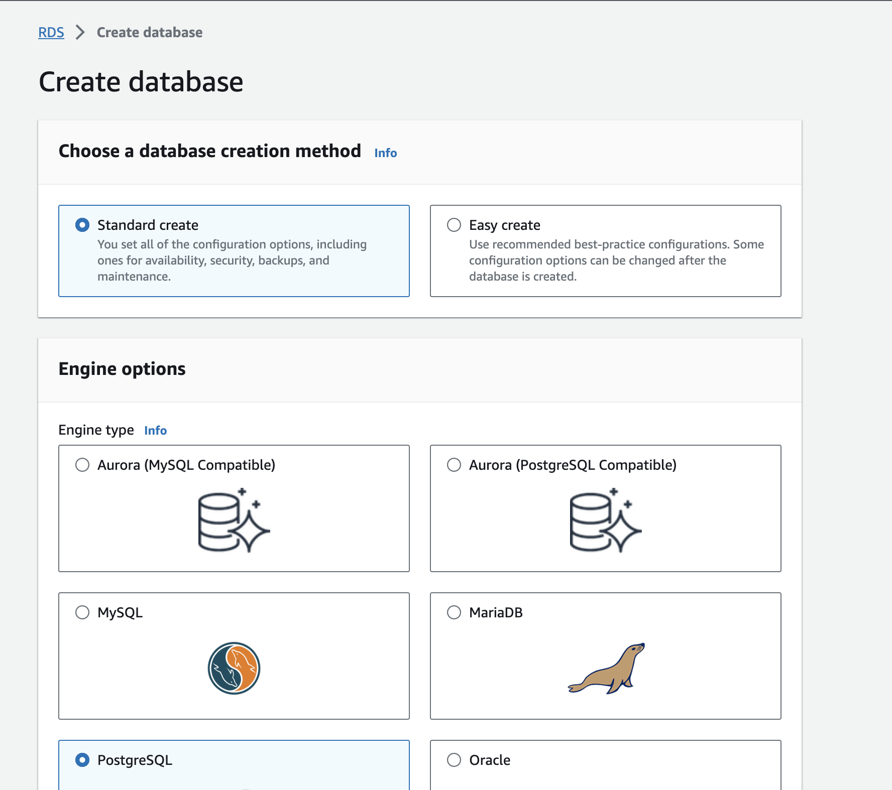

In the settings options, create a name for your database instance and a username and password credentials to log in to the database.

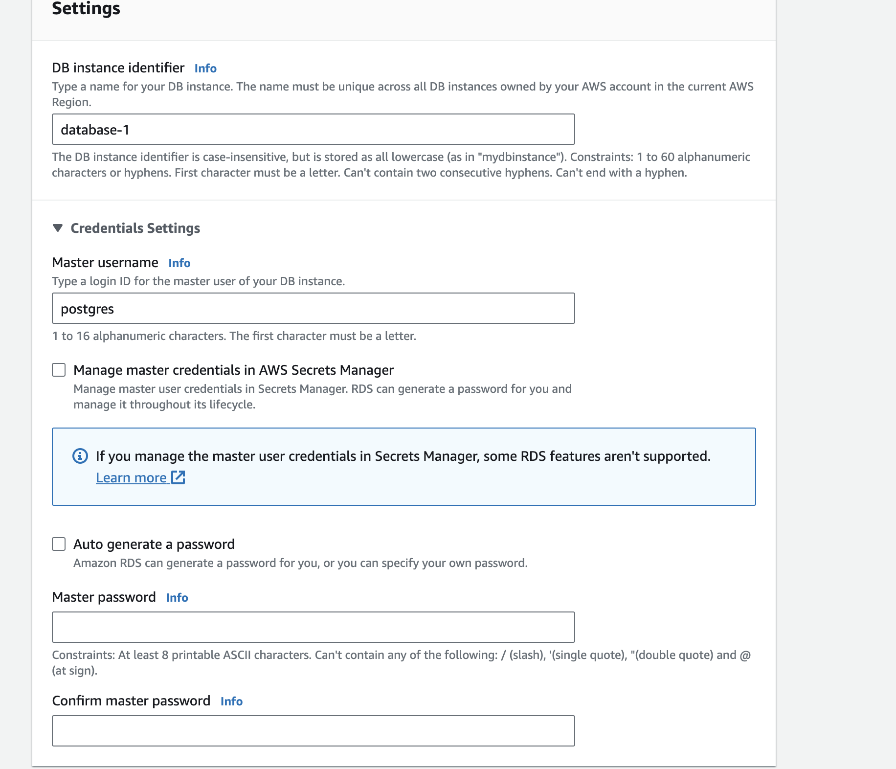

- On the connectivity options, choose don't connect to an EC2 instance (this is because you haven't created an EC2 instance yet), and choose the default virtual private cloud (VPC) for connecting to the database.

- Select the `No` option for public access to the database to ensure the database can only be connected via the VPC security firewall.

- For the VPC security group (firewall), choose the default security group and select password authentication for database authentication.

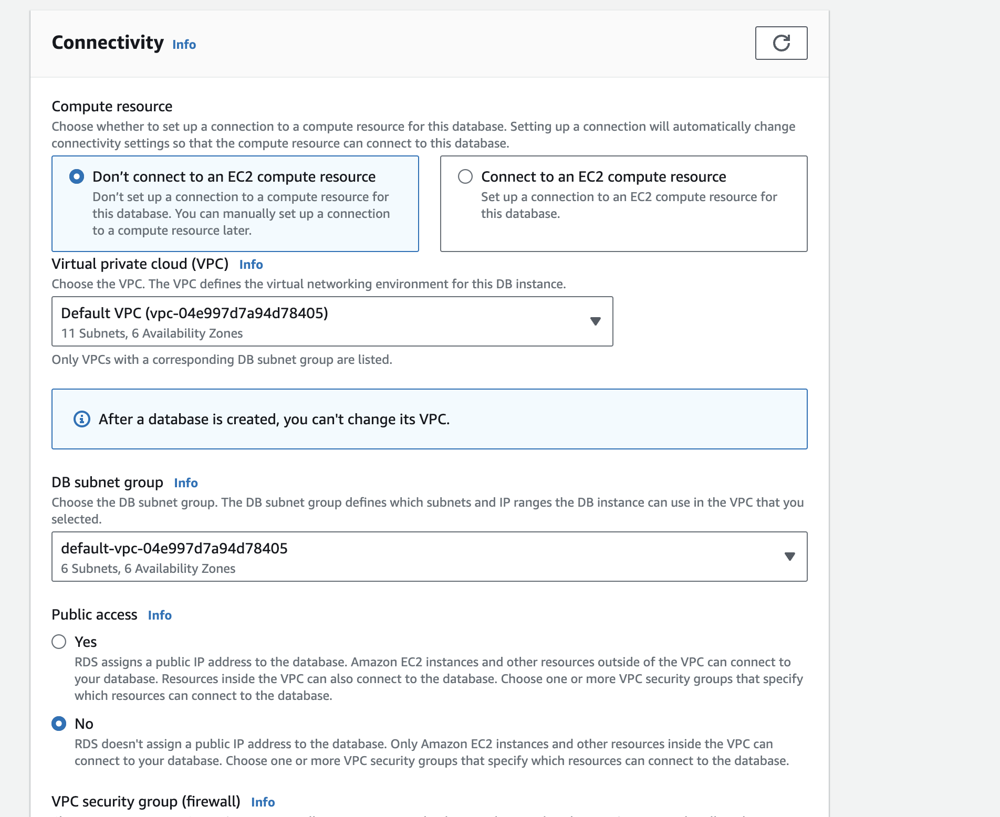

This will create a new `PostgreSQL` database for you on RDS.

## Set up Amazon Elastic Compute Cloud (EC2) Instance

AWS EC2 are private virtual cloud servers you can spin up to run your applications on AWS cloud.

To create an EC2 instance, search for EC2 or head over to the [EC2  page](https://us-east-1.console.aws.amazon.com/ec2/home) and click `Launch instance`.

Add a name for the server called `Directus Server` and select the Amazon Linux image (you can also choose another image to suit your needs).

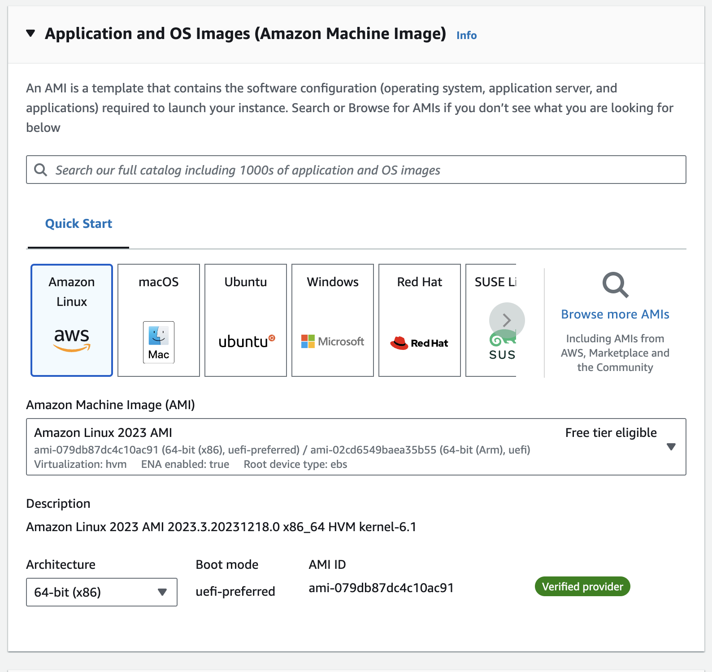

Create a key pair that you can use for logging in to the EC2 instance.

Also, for network settings, select the existing security group and choose the default security group for connecting to the EC2 instance.

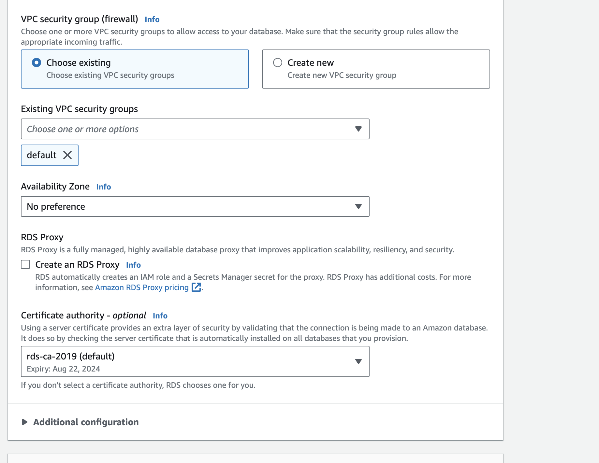

For storage options, the default selection meets the requirements for running a Directus instance.

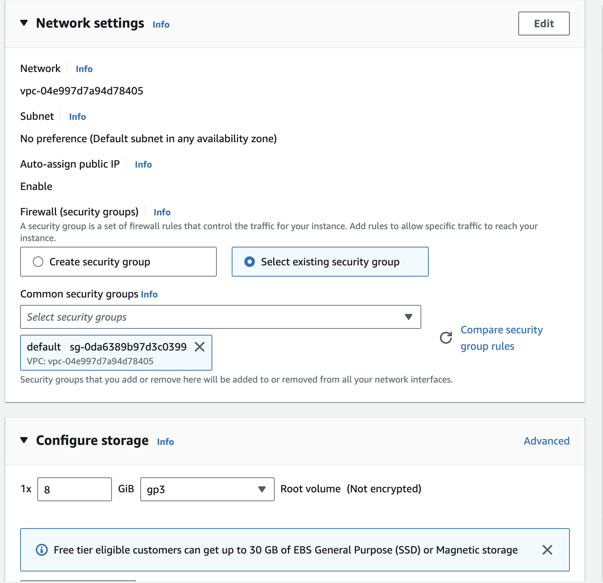

Click on the `Launch Instance` button, and this will create a new EC2 instance for you

### Set up permission

To ensure that the EC2 instance can be accessed and operated from anywhere, head over to the security group in your EC2 instance and add the following inbound rules:

| Name  | Security group rule ID | IP version | Type | Protocol | Port Range | Source |
| --- | --- | --- | --- | --- | --- | --- |
| -  | your default security group | IPv4 | SSH | TCP | 22 | 0.0.0.0/0 |
| -  | your default security group | IPv4 | HTTP | TCP | 80 | 0.0.0.0/0 |
| -  | your default security group | IPv4 | HTTPS | TCP | 443 | 0.0.0.0/0 |

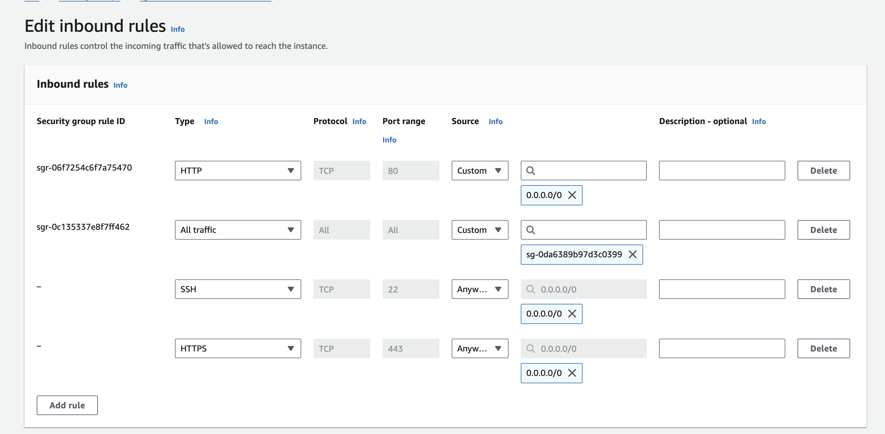

Also, create an outbound rule for connecting to the database:

| Name  | Security group rule ID | IP version | Type | Protocol | Port Range | Source |
| --- | --- | --- | --- | --- | --- | --- |
| -  | your default security group | IPv4 | PostgreSQL | TCP | 5432 | 0.0.0.0/0 |

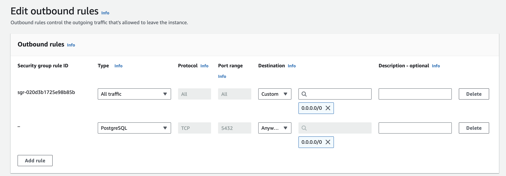
Save these rules.

## Set up Directus on AWS EC2

On the EC2 instance page, click on the connect button to connect to your AWS EC2 instance using EC2 Instance Connect (you can also connect to EC2 via other methods such as a session manager or SSH client).

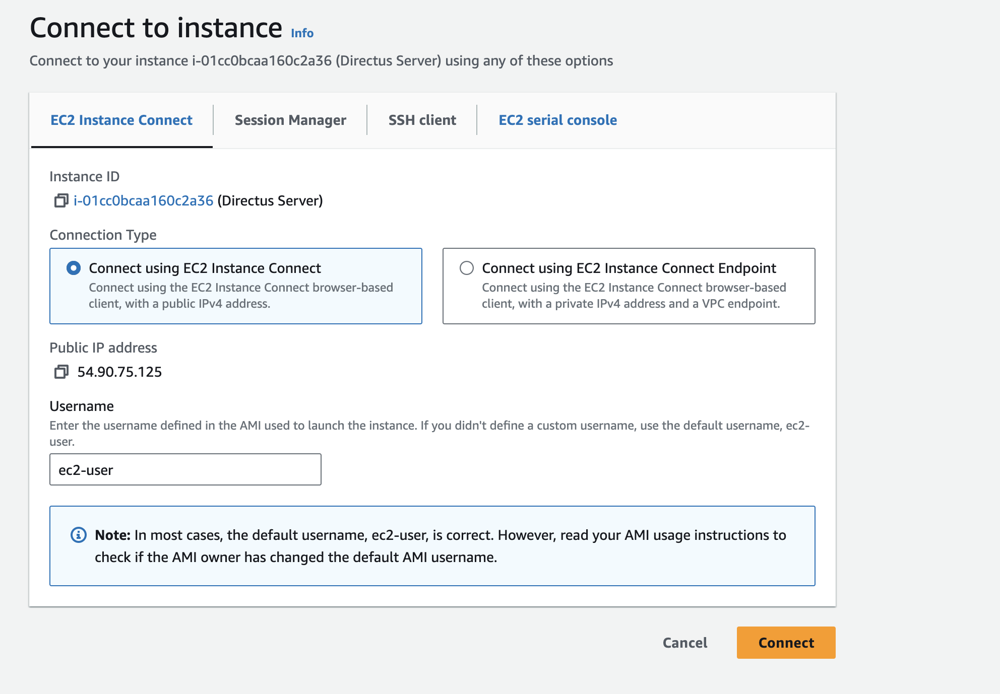

Once connected, run the command to install Docker on your EC2 server:

```bash
sudo yum install -y docker
```

Next, install Docker-compose with the command:

```bash
sudo curl -L https://github.com/docker/compose/releases/latest/download/docker-compose-$(uname -s)-$(uname -m) -o /usr/local/bin/docker-compose
```

Grant permission to run the `docker-compose` command without using the `sudo` command

```bash
sudo chmod +x /usr/local/bin/docker-compose
```

Start the docker service with the command:

```bash
sudo service docker start
```

Create a new directory called `directus` and navigate into the directory with the command:

```bash
mkdir directus && cd directus
```

In the `directus` directory, create a `docker-compose.yml` file and update its content using `vim` with the command:

```bash
touch docker-compose.yml && vim docker-compose.yml
```

This will open the `docker-compose.yml` file in `vim`, to edit the file, press `i` and paste the following Directus configuration:

```yml
version: "3"
services:
  directus:
    image: directus/directus:10.8.3
    ports:
      - 80:80
    volumes:
      - ./uploads:/directus/uploads
      - ./extensions:/directus/extensions
    environment:
      PORT: 80
      KEY: "replace-with-random-value"
      SECRET: "replace-with-random-value"
      ADMIN_EMAIL: "admin@example.com"
      ADMIN_PASSWORD: "d1r3ctu5"
      DB_CLIENT: "pg"
      DB_HOST: "YOUR_RDS_DB_URL"
      DB_PORT: 5432
      DB_DATABASE: "postgres"
      DB_USER: "YOUR_DB_USER"
      DB_PASSWORD: "YOUR_DB_PASSWORD"
      DB_SSL__REJECT_UNAUTHORIZED: false
      WEBSOCKETS_ENABLED: true
```

Press the `esc` key to exit the insert mode and press `:` followed along with `wq` to quite the `vim` editor

To ensure that Directus can write and save data in the `extensions` and `uploads` directories, enter the following command to grant the current user ownership of the directory:

```bash
sudo chown $USER:$USER extensions uploads
```

Run the command `docker-compose up`, which should spin up a Directus instance on port `80` of your EC2 server.

Head to the EC2 dashboard and click on the instance ID; this will open the properties of your EC2 instance; here, you'll find the `Public IPv4 DNS.`

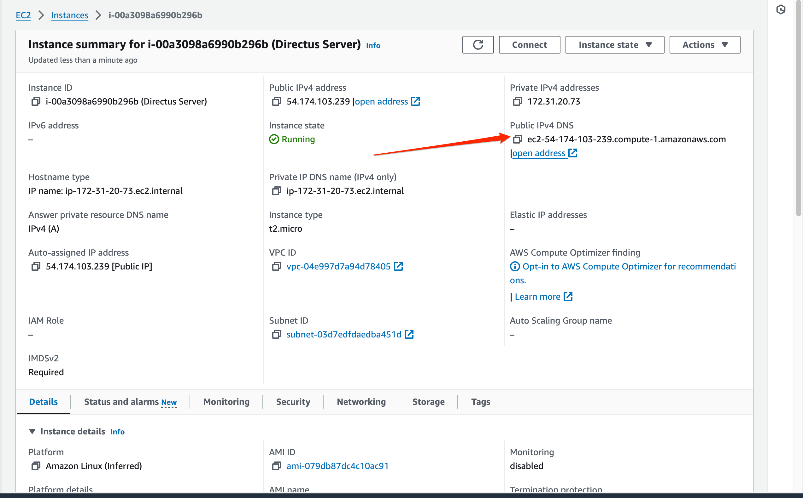

Open this URL and you should find Directus running.

## Set up AWS s3 (optional)

If you want to use AWS S3 for media storage, follow these additional steps:

Search for s3 on the console or navigate to the [s3 page](https://s3.console.aws.amazon.com/s3/home) to create a new storage bucket.

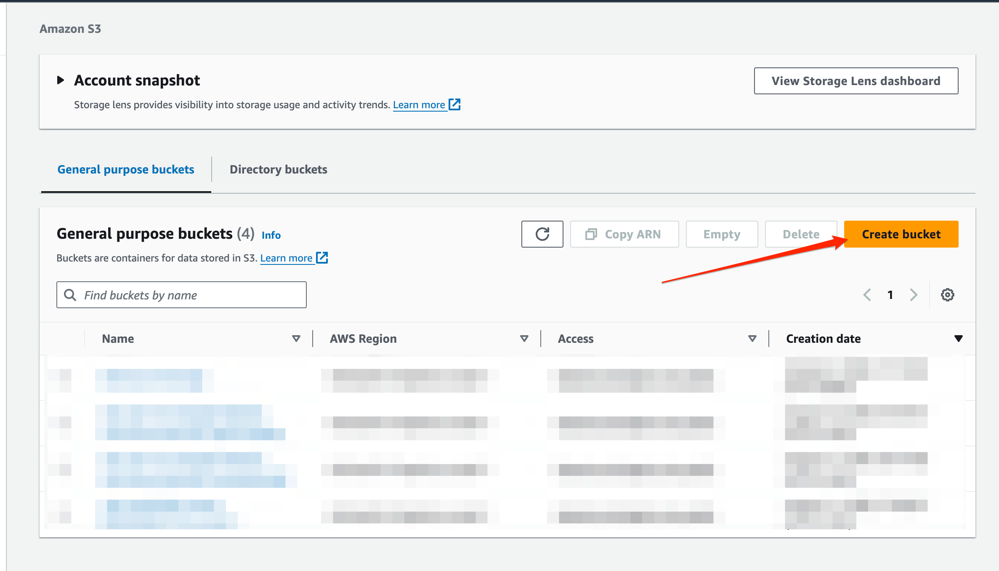

When creating a new bucket, ensure ACLs are disabled and public access is blocked for the bucket for privacy (you can update these settings to suit your needs).

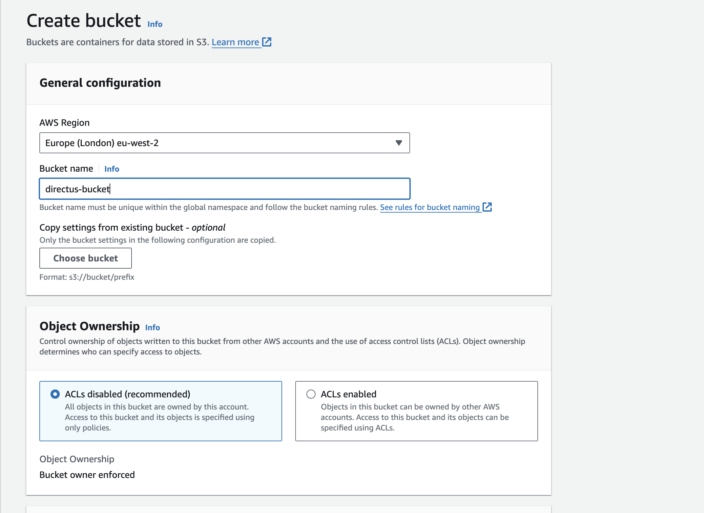

Copy the name of the bucket and use it in your `docker-compose.yml` with the following configs:

```yml
  STORAGE_LOCATIONS: s3
  STORAGE_S3_DRIVER: s3
  STORAGE_S3_KEY: YOUR_AWS_KEY
  STORAGE_S3_SECRET: YOUR_AWS_SECRET_KEY
  STORAGE_S3_BUCKET: YOUR_STORAGE_NAME
  STORAGE_S3_REGION: YOUR_PREFERRED_REGION
  STORAGE_S3_ENDPOINT: s3.amazonaws.com
```

Re-run the Directus server with `docker-compose up` to implement the new changes added to the `docker-compose.yml` file.

Alternatively, you can run the command `docker-compose up -d` to run the Directus application on the background

## Next Steps

Some steps you could consider moving forward towards improving your deployment include:

- Improved security permissions for connecting to the created resources

- Consider utilizing [AWS Secrets Manager](https://us-east-1.console.aws.amazon.com/secretsmanager/) for managing your `ENV` variables
- Consider implementing a load balancer for scaling the incoming requests on your directus application.
