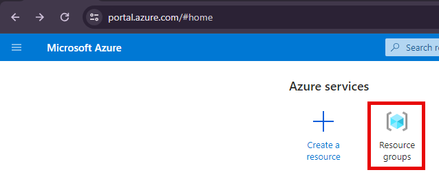
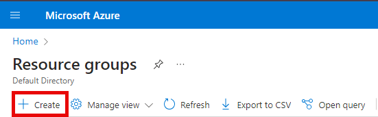
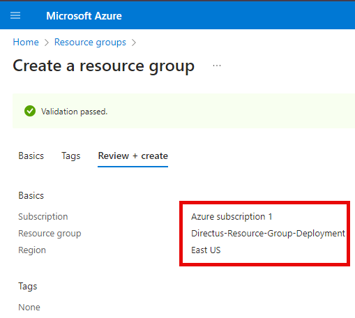
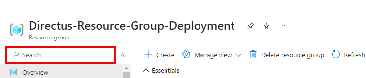
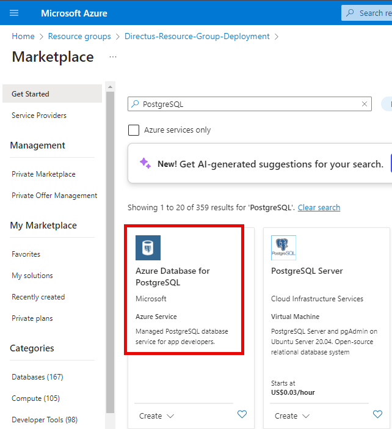
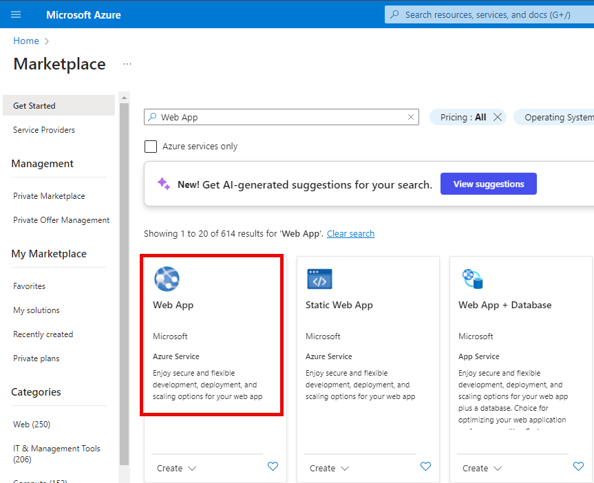
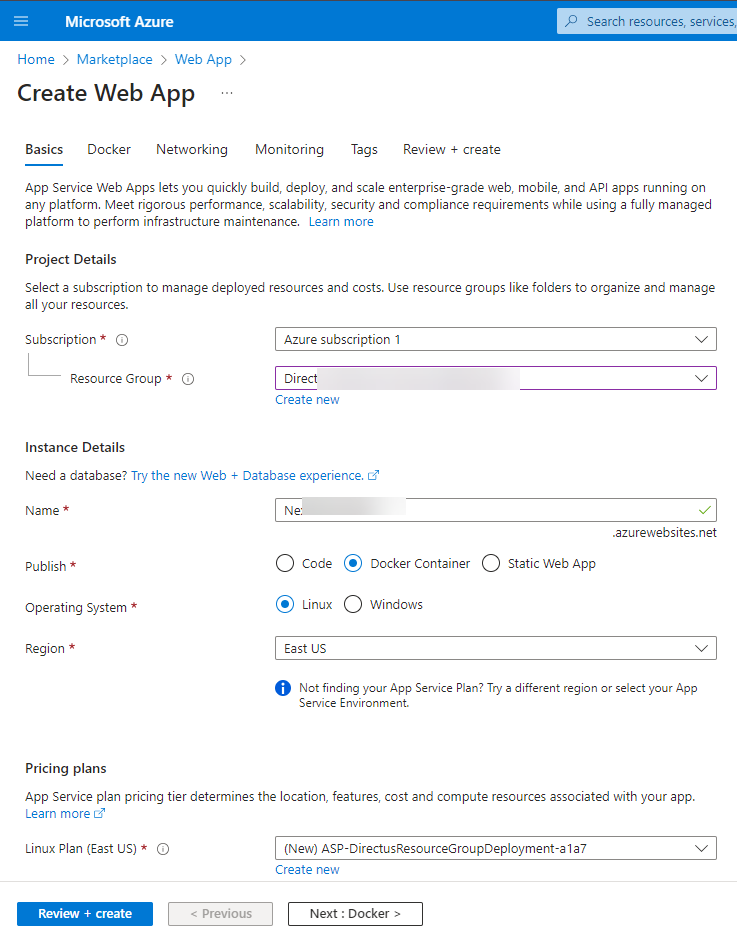
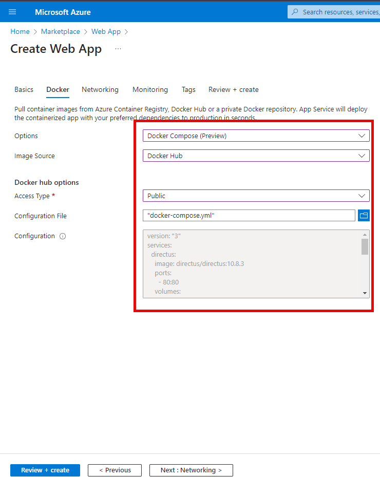

## Introduction
In the rapidly evolving landscape of web development, the need for robust and flexible content management systems is more pronounced than ever. Directus, an open-source headless CMS, stands out as a powerful solution allowing developers to create and manage databases with ease. 

This guide outlines the steps to deploy Directus on Azure using Docker, with a focus on utilizing PostgreSQL as the database, providing a scalable and efficient solution for your content management needs.

## Before You Start
Before deploying Directus on Azure, make sure you have the following prerequisites:

- **Azure Account:** Obtain an active Azure account or [sign up](https://go.microsoft.com) for a free one on the Azure portal. Also, understand basic navigation in the Azure Portal for efficient resource management.

- **Docker:** A basic understanding of Docker is required.

## Create and Set Up a Resource Group
To begin the deployment process, you need to set up a resource group in Azure. A resource group acts as a logical container to group and manage related Azure resources. It allows you to organize your resources, control access permissions, and manage them collectively.

To create a resource group, navigate to the Azure portal and follow these steps:

- Sign into your Azure account via the [Azure Portal](https://portal.azure.com/).
- Click on **Resource Groups** to view all resource groups.
  


- Afterwards, click on the **Create** button to create a new resource group



- Provide a unique name for your resource group and choose the desired Azure subscription
- Select the appropriate region for your resource group, considering factors like data residency and proximity to users.
- Review the other settings, such as tags and permissions, and adjust if needed.

Finally, click on **Review + Create** and then Create to create the resource group.



## Setting Up Azure Database for PostgresSQL
After creating the resource group, the next crucial step is setting up the Azure Database for PostgreSQL. This managed database service offers scalability, security, and high availability for your PostgreSQL databases. Before proceeding with the deployment, it's important to configure and prepare the PostgreSQL database to seamlessly integrate with Directus.

Here's how to set up your Azure Database for PostgreSQL:
- Click on the recently created Resource Group.
- In the Overview pane, click the **Create** button to initiate the resource creation process. This action will seamlessly navigate you to the Azure Marketplace.



- Afterwards, search for a **PostgreSQL** resource, preferably, use the **Azure Database for PostgreSQL** resource and proceed to select it.



- Secure your database with a strong password and consider firewall rules for additional protection.


- Click the **Next:Networking** button to configure networking access and security for your server.
- Click the **Next:Security** button to configure data security features for your server.
- Connection Information: Save the server’s name, username, and password for later use in Directus configuration.

  
Finally, click on Review + Create and then Create to create your new PostgreSQL Database deployment.

## Pre-Deployment: Setting up your Docker Configuration File
Docker plays a pivotal role in streamlining the deployment process of Directus on Azure by offering a seamless and efficient containerization solution. With Docker, deployment becomes a consistent and reproducible experience, eliminating the complexities often associated with configuring environments and dependencies. Its containerized approach encapsulates Directus and its prerequisites, ensuring that the application runs reliably across various environments, leading to a smoother deployment experience. To get started:

- Begin by creating an empty folder named *directus* on your *Desktop* directory.
- Launch a text editor like Visual Studio Code, nano, Vim, TextEdit, or Notepad.
  
Copy and paste the provided content below, then save the file with the name `docker-compose.yml`:

```yml
version: "3"
services:
  directus:
    image: directus/directus:10.8.3
    ports:
      - 8055:8055
    volumes:
      - ${WEBAPP_STORAGE_HOME}/database:/directus/database
      - ${WEBAPP_STORAGE_HOME}/uploads:/directus/uploads
    environment:
      KEY: "replace-with-random-value"
      SECRET: "replace-with-random-value"
      ADMIN_EMAIL: "admin@example.com"
      ADMIN_PASSWORD: "d1r3ctu5"
      DB_CLIENT: "pg"
      DB_HOST: "YOUR_PDS_DB_URL"
      DB_PORT: 5432
      DB_DATABASE: "postgres"
      DB_USER: "YOUR_DB_USER"
      DB_PASSWORD: "YOUR_DB_PASSWORD"
      WEBSOCKETS_ENABLED: true
```
Let’s go through some of the key parameters in this configuration file above:
- `KEY and SECRET`: Generate random values for the `KEY` and `SECRET` parameters. These are used for security purposes in Directus
- `${WEBAPP_STORAGE_HOME}`: This is an environment variable in Azure App Service that is mapped to persistent storage for your app. It allows you to reference the shared storage within your Docker configuration file.
- `ADMIN_EMAIL and ADMIN_PASSWORD`: Choose an email address and a strong password for the Directus administrator. These credentials will be used to log in to the Directus interface.
- `DB_CLIENT`: Set the `DB_CLIENT` parameter to `pg` to indicate the use of PostgreSQL.
- `DB_HOST`: The `DB_HOST` parameter should be set to the server’s name of your Azure Database for PostgreSQL. This information can be found in the Azure Portal: Navigate to your Azure Database for PostgreSQL resources. In the left-hand menu, go to Overview to find the server’s name.
- `DB_PORT`: The default PostgreSQL port is 5432. If you haven't changed the default port during the PostgreSQL server setup, keep this value as is.
- `DB_USER and DB_PASSWORD`: Use the credentials you set up during the creation of your Azure Database for PostgreSQL. If you've forgotten these, you can find them in the Azure Portal: Navigate to your Azure Database for PostgreSQL resources. In the left-hand menu, go to **Connection security** to find the server admin login.
- `DB_NAME`: Specify the name of your PostgreSQL database. If you haven't set a custom name, you can find this in the **Overview** section of your Azure Database for PostgreSQL resource in the Azure Portal.

You can use various methods to generate random values for the `KEY` and `SECRET` parameters in Directus. One common approach is to use a random string generator or a tool that provides secure random values. Here's how you can generate these values using a command-line script. You can use the following command in the terminal to generate a random string:
```bash
openssl rand -base64 32
```
This command uses OpenSSL to generate a random base64-encoded string of 32 characters. You can adjust the length as needed.

## Deploying Directus on Azure Web App
Before delving into the deployment of Directus on Azure Web App, it's essential to understand the seamless integration capabilities that Azure Web App offers. Azure Web App provides a fully managed platform for building, deploying, and scaling web apps. With its support for multiple programming languages, automated deployment, and streamlined scaling, Azure Web App simplifies the process of hosting web applications, making it an ideal choice for deploying Directus.

Similar to how our PostgreSQL Database was created, visit the Azure Marketplace and search for a Web App Resource, select the Web App resource highlighted below to create an Azure Web App.



Within the Basics Configuration section: 
- Select the resource group we created earlier.
- Give your App instance a name.
- Select **Docker Container** in the **Publish** settings. 
- Choose your preferred operating system.
- Select your preferred Region.
- Select your preferred pricing plan.



Click the **Next:Docker** button to configure the docker container settings for your web app using the docker-compose.yml we created earlier. Adjust the settings as seen below.



Click the **Next:Networking** button and select your preferred network settings.
Finally, click on **Review + Create** and then **Create** to create your new Web App

Directus is successfully deployed and can be visited via the **Default domain** in the Azure web app. Leveraging the power of Directus' Backend as a Service (BaaS) solution, you can now benefit from ready-made REST and GraphQL APIs, seamless integrations, and superior scalability, empowering you to uncomplicate your backend operations with Directus.

## Trouble Shooting Tips
Here are few troubleshooting tips:

**1. Connection Issues with Azure Database for PostgreSQL**

If you encounter connectivity problems between Directus and your Azure Database for PostgreSQL, consider the following steps:

- **Firewall Rules:** Ensure that the firewall rules for your Azure Database allow connections from the Azure Web App. You can configure this in the Azure Portal under the *Connection Security* section for your PostgreSQL server.

- **Connection String:** Double-check the values in your docker-compose.yml file for `DB_HOST`, `DB_USER`, `DB_PASSWORD`, and other related parameters. Any discrepancies here can result in connection failures.

2. **Azure Web App Deployment Failures**

In case your Azure Web App deployment fails, consider the following:

- **Docker Image Compatibility:** Ensure that the Directus Docker image version specified in your `docker-compose.yml` file is compatible with the Azure Web App environment. Check for updates or use a different version if needed.

- **Resource Group Permissions:** Confirm that the Azure account used for deployment has the necessary permissions to create and manage resources within the specified resource group.

- **Docker Configuration Validation:** Validate your `docker-compose.yml` file for syntax errors or inconsistencies. Incorrect configurations can lead to deployment failures.
  
3. **Directus Interface Login Issues**

If you experience problems logging into the Directus interface:

- **Admin Credentials:** Ensure that the `ADMIN_EMAIL` and `ADMIN_PASSWORD` values in your `docker-compose.yml` file match the credentials you are using to log in.

- **Environment Variable Changes:** If you make changes to environment variables after the initial deployment, restart the Directus container to apply the new configurations.

## Summary

Deploying Directus on Azure Web App provides a robust solution for content management, offering scalability and flexibility for your web development projects. By leveraging Docker and Azure services like Azure Database for PostgreSQL, you create a reliable and efficient environment for managing databases and content.

This tutorial has guided you through setting up a resource group, configuring Azure Database for PostgreSQL, and deploying Directus using Docker on Azure Web App. The integration of these technologies allows you to take advantage of the features offered by Directus while benefiting from the reliability and scalability of Azure services.