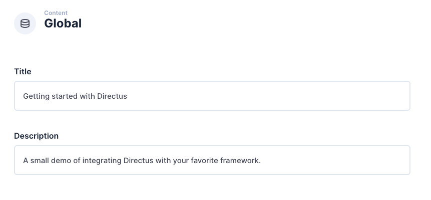
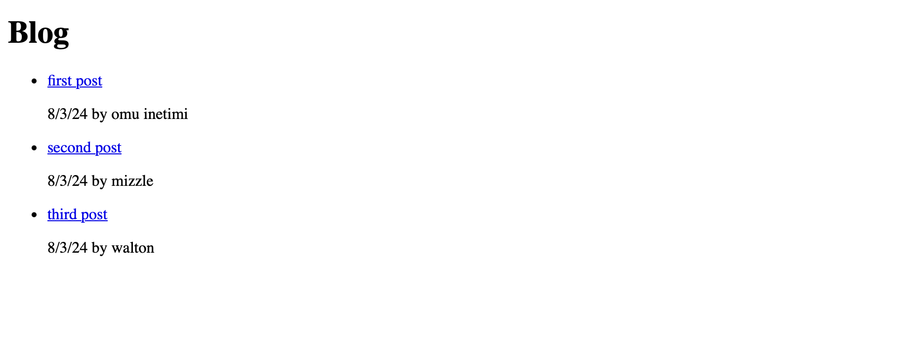
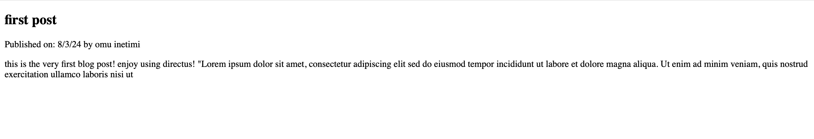

## Introduction
Django is one of the most popular python frameworks known for its battery included philosophy, it comes loaded with a lot of features that cuts down development time for  devs. In this tutorial, you will learn how to integrate django with Directus using a blog API. At the end of this tutorial, you will have an application that uses the django templating engine to display data from the API.


## Before You Start
You will need:
- Python installed and a code editor on your computer.
- A Directus project - Use the [quickstart guide](https://docs.directus.io/getting-started/quickstart) to create a project if you dont already have one.


## Project setup
lets get our django project setup

```bash
  mkdir my_django_site && cd my_django_site
  django-admin startproject config .
  python -m venv env
  source env/bin/activate  # On Windows use `env\Scripts\activate`
  pip install django requests
```
After setting up your project structure, let's configure Django to serve as the foundation of your dynamic website:

 Open your Django project in your code editor of choice.

 	
 Activate your virtual environment and start your Django development server with the following command:
 
 ```bash 
 python manage.py runserver  
 ```
 Visit http://localhost:8000 in your web browser to see your new Django project running.

 After you've started your Django project, you need to create a Django app that will contain your views, integrations and URLs. Run the following command in your project directory:

 ```bash
 python manage.py startapp blog
```
Replace blog with whatever name you find suitable for your app.

Open the config/settings.py file in your Django project and add your newly created app to the INSTALLED_APPS list. Also edit the template settings. This step tells Django to include the app in the project as well as where to look find the templates we create.

```python
INSTALLED_APPS = [
    ...  # Other installed apps
    'blog',  # Add this line
]

TEMPLATES = [
    {
        ...
        "DIRS": [BASE_DIR / "templates"],  
        ...
    },
]
```
 
 
 ## Using Global Metadata and Settings
 In your Directus project, navigate to Settings -> Data Model and create a new collection called global. Under the Singleton option, select 'Treat as a single object', as this collection will have just a single entry containing global website metadata.

Create two text input fields - one with the key of title and one description.

Navigate to the content module and enter the global collection. Collections will generally display a list of items, but as a singleton, it will launch directly into the one-item form. Enter information in the title and description field and hit save.


By default, new collections are not accessible to the public. Navigate to Settings -> Access Control -> Public and give Read access to the Global collection.

In your Django project, create a file named directus_integration.py in the blog app directory.
In this file, write functions to handle data fetching:

```python
import requests

DIRECTUS_API_ENDPOINT = "YOUR_DIRECTUS_INSTANCE_API_ENDPOINT"

def get_global_settings():
    response = requests.get(f"{DIRECTUS_API_ENDPOINT}/items/global")
    return response.json()

def get_collection_items(collection):
    response = requests.get(f"{DIRECTUS_API_ENDPOINT}/items/{collection}")
    return response.json()
    
```

With the functions in place, you can now fetch global settings and pass them to your Django templates.

Lets now create a View for the Home Page.
django automatically adds a views.py file after starting an app, so within the views.py in your blog app, add:

```python
from django.shortcuts import render
from .directus_integration import get_global_settings

def home_page(request):
    global_settings = get_global_settings()
    context = {
        'title': global_settings['data']['title'],
        'description': global_settings['data']['description']
    }
    return render(request, 'home.html', context)
```
Now we can design the Home Page Template.

 First off, create a `templates` directory in the root directory of our django project (the root directory is where you have the manage.py file).
Create home.html in your templates directory:

```python
<!DOCTYPE html>
<html lang="en">
<head>
    <meta charset="UTF-8">
    <title>{{ title }}</title>
</head>
<body>
    <header>
        <h1>{{ title }}</h1>
    </header>
    <main>
        <p>{{ description }}</p>
    </main>
</body>
</html>
```


## Creating Pages With Directus
In your Django project, we'll set up a simple system to serve pages stored in a Directus collection called pages. each page in Directus will have a unique identifier that corresponds to its URL path.

In your Directus dashboard, navigate to Settings -> Data Model and create a new collection named pages.
Assign a "Manually Entered String" field called slug for the URL of each page.
Add a text field named title and a Rich Text field for the content.

head to Roles & Permissions and allow the public role to read the pages collection.


In your views.py, utilize the `get_collection_items` function to get the content and serve it through a Django view:

```python
from django.shortcuts import render
from django.http import JsonResponse
# Import the get_collection_items function from your integration script
from .directus_integration import get_collection_items

def page_view(request, slug):
    pages = get_collection_items('pages')
    page = next((p for p in pages['data'] if p['slug'] == slug), None)
    if page:
        return render(request, 'page.html', {'page': page})
    else:
        return JsonResponse({'error': 'Page not found'}, status=404)
```

Now we can develop a Django template to render the page content. In your templates directory, create a file named page.html:

```html
<!DOCTYPE html>
<html lang="en">
<head>
    <meta charset="UTF-8">
    <meta name="viewport" content="width=device-width, initial-scale=1.0">
    <title>{{ page.title }}</title>
</head>
<body>
    <main>
        {{ page.content|safe }}
    </main>
</body>
</html>
```

Now, when you visit http://localhost:8000/your-page-slug, replacing your-page-slug with any slug from your Directus pages collection, Django will serve the content of that page.

## Creating Blog Posts With Directus


In your Directus dashboard, create two collections:
- authors: with a field for the author's name.
- posts: with fields for: 
   - Slug (unique identifier for the URL path)
   - Title
   - Rich text field for content
   - Date field for publish date
   - Relationship field linking to the authors collection


Adjust Directus permissions to allow public reading of the authors and posts.

### Create blog post listing

Now, you'll need to create a Django view that fetches the blog posts. still within our directus_integration.py file, set up the following code:

```python
def fetch_blog_posts():
    response = requests.get(f"{DIRECTUS_API_ENDPOINT}/items/posts")
    return response.json()
```

In your views.py, create a function that imports and uses the `fetch_blog_posts` function to display the list of posts:

```python
from .directus_integration import get_collection_items,fetch_blog_posts

def blog_posts(request):
    posts_data = fetch_blog_posts()
    return render(request, 'blog_list.html', {'posts': posts_data['data']})
```

Within the the templates directory craft a Django template to list all blog posts, blog_list.html:
```html
<!DOCTYPE html>
<html lang="en">
<head>
    <meta charset="UTF-8">
    <title>Blog Posts</title>
</head>
<body>
    <h1>Blog</h1>
    <ul>
        
            <li>
                <a href="">{{ post.title }}</a>
                <p>{{ post.publish_date }} by {{ post.author.name }}</p>
            </li>
        
    </ul>
</body>
</html>
```

   
### Create Blog Post Single
Create another view in views.py to handle individual blog posts: 

```python
def blog_post_detail(request, slug):
    posts_data = fetch_blog_posts()
    post = next((p for p in posts_data['data'] if p['slug'] == slug), None)

    if post is not None:
        return render(request, 'blog_detail.html', {'post': post})
    else:
        return JsonResponse({'error': 'Post not found'}, status=404)
```

Still within our templates directory, create the blog_detail.html template to display each post:

```html
<!DOCTYPE html>
<html lang="en">
<head>
    <meta charset="UTF-8">
    <title>{{ post.title }}</title>
</head>
<body>
    <article>
        <header>
            <h1>{{ post.title }}</h1>
        
            <p>Published on: {{ post.publish_date }} by {{ post.author.name }}</p>
        </header>
        <section>
            {{ post.content | safe }}
        </section>
    </article>
</body>
</html>

```



Create a urls.py within the blog app directory and update it to include URL patterns for all views:

```python
from django.urls import path
from .views import blog_posts, blog_post_detail

urlpatterns = [
    path('', home_page, name='home'),
    path('blog/', blog_posts, name='blog_list'),
    path('blog/<slug:slug>/', blog_post_detail, name='blog_detail'),
    
    # ... other URL patterns ...
]

```

Include the app's URLs in the main project's config/urls.py:

```python
from django.urls import path, include

urlpatterns = [
    path('', include('blog.urls')),
]
```

 		
## Add Navigation

In Django, the website's navigation is usually integrated into a base template that other templates extend. Let's add a navigation menu to your base Django template to link together the different pages of your site.

The navigation menu typically resides in a base template that other templates extend.
Update your base template (base.html) to include the navigation:

```python
<nav>
    <a href="">Home</a>
    <a href="">About</a>
    <a href="">Blog</a>
    </nav>


    

```

In your individual page templates, extend the base.html to inherit the navigation:

```python



    
```

Utilize Django's URL names instead of hardcoded paths for navigation links:

```html
<a href="">Home</a>
```

## Next steps
Through this guide, you have established a Django project and integrated it with Directus to manage and serve content dynamically. Utilizing the rich features of Django's web framework and Directus's flexible CMS, you've created a system that not only handles global website settings but also powers a blog with listings and detailed post pages.

As you progress, you might consider refining the accessibility of your content. To achieve this, delve into Directus's permissions and roles to define more granular access control, ensuring that only appropriate data is available for each user role. Additionally, you can fine-tune your Django views and templates to render content based on the user's permissions, providing a secure and customized experience.
