## What is Directus

If you’re unfamiliar with [Directus](https://docs.directus.io/getting-started/introduction.html), it provides a nice (and open-source) way for anyone to interact with SQL databases and file storage adapters and an even nicer way for developers to build tools around them.

It is built entirely in Typescript, primarily on Node.js, and Vue.js. Directus is 100% open source, modular and extensible, ensuring your project never hits a hard feature ceiling. You can use it as many stacks or frontend framework as you want to.

Directus is used for the following:

1. Headless CMS
2. Product Inventory Management
3. No-code Data Platform
4. Backend-as-a service
5. Full API-Based Data Architecture

## Why You Should Use Directus

Directus is pure, it has no predefined or proprietary schema. It is open source and portable, vendor lock-in. Your database can be exported or migrated anytime. No arbitrary limits or paywalls on users, roles, translations, and data. This makes it limitless. It is also extensible, every aspect of this platform is modular to avoid any hard feature ceiling. It is unopinionated, meaning that you can choose any stack you want.

## Directus Cloud

The easiest and fastest way to get started with Directus is through Directus Cloud. Directus Cloud provides scalable, optimized storage and infrastructure, and automatic updates so developers can focus on the app’s core business logic. To learn more about Directus cloud, [check the documentation](https://directus.io).

## What is Webscraping

Webscraping is one of the efficient way to extract data in a website. Now, imagine if you need some information from a website. You can manually copy it down and save it somewhere. But what if you need a large amount of data from a website, maybe for a project that has a tight deadline. In this case, copying it manaually will not be efficient and will slow you down. What you need is a webscraper. Webscraper is a process of  extracting a large amount of data in a smaller amount of time.

## How Does a Webscraper Function Work?

A Webscraper works in 3 steps;

Step 1: Make a HTTP request to a server
Step 2: Data Extraction from the website’s code
Step 3: Save the relevant data

## Project Setup

In this project, we will be building a Directus extension.

## Prerequisites

- Node.js installed globally
- Basic knowledge of directus cloud
- Knowledge of Vscode terminal
- Knowledge of Javascript
- Understanding of REST APIs
- SQL database installed or any of the compatible database
- Basic database queries

Note: In this article, we will use MSSQL database. Feel free to use any database of your choice.

## At The End of This Article, You Should Have Learned

- How to create a new Directus project, Collection and flows
- What webscrapping is all about
- How to build a webscrapping extension using directus and playwright.

### Creating a New Directus Extension Project

For ease, follow this [documentation](https://docs.directus.io/getting-started/quickstart.html) and follow the step by step process

### There Will Be 3 Major Parts Of The Extension

1. The [data model](https://docs.directus.io/app/data-model.html) will store the URL scraped and the data we scrape from the site.
2. The [flow trigger](https://docs.directus.io/app/flows.html) which will call on our extension.
3. The extension itself will be added as a custom operation and chained to the flow trigger.

To create a new directus project, open your command prompt and type the following:

```bash
 // to navigate to desktop directory
 cd desktop 

```

## The Custom Operation

Our extension is going to be in the form of a custom operation, which we will chain to our flow trigger.

To bootstrap the structure of our operation extension, we use the following command:

```bash

npx create-directus-extension@latest
```

Ensure you select operation as the type of extension when prompted.

The [operation](https://docs.directus.io/extensions/operations.html) has two parts, the app and the api. The app controls the frontend and options available when adding the extension. And the api controls what happens when the operation is called.

Our custom operation does not require any extra arguments so the app will be plain and basic.

```ts
import { defineOperationApp } from "@directus/extensions-sdk";

export default defineOperationApp({ 
  id: "web_scraper_extension", 
  name: "Web Scraper Extension", 
  icon: "box", 
  description: "Web Scraper Extension", 
  overview: [], 
  options: [],
 }); 
```

To open your Vscode Terminal

```bash
code .

```

The *api* for our custom operation is where all the processing and web scraping will happen.

```ts
import { defineOperationApi } from "@directus/extensions-sdk";
import WebScraperService from "./webscraper";

export default defineOperationApi({
  id: "web_scraper_extension",
  handler: async (_, { data, database }) => {
    const trigger = data["$trigger"] as { payload: { website_url: string }; collection: string; };
    const webScraperService = new WebScraperService();
    const siteData = await webScraperService.getCompanySiteData(trigger.payload.website_url);
    await database(trigger.collection)
      .where({ website_url: trigger.payload.url })
      .update({ website_data: siteData });
    return { success: true };
  },
 }); 
```

Aside from ensuring the `id` property in the *app* and *api* are the same, we need to pay close attention to the `handler` property, this is where all the extension logic lives. It receives two parameters: `options`, and `context`.

Since the *app* of our operation does not take any options, we can ignore the `options` parameter. The second parameter which is the `context` parameter is where all the important information is.
Per the [docs](https://docs.directus.io/extensions/operations.html#handler-function), the context parameter has several properties, two of which we will take advantage of: `data`, and `database`.

The data property contains the raw data from the previous operations, which in this case will be the trigger. This part of the [docs](https://docs.directus.io/app/flows/triggers.html#actions), provides some insight into the data property in the `handler` context. We're particularly interested in the `”$trigger”` property, as it contains the `payload` (containing the data from the newly created item) and the name of the collection. We can then pass the `URL` from the newly created item into our web scraping service.

Lastly, we use the database property from the context object to interact with the underlying database through Directus, and modify the corresponding record as needed. `database(trigger.collection)` creates an instance of the database operating on the collection that the `trigger` is attached to, then we query for the corresponding item in the collection and update it to store the scraped data.

## Create a New Directus Project

```bash
npx create-directus-project webscraper
```

You will be prompted to choose any database of your choice, we will use MYSQL database, but feel free to choose any database of your choice.

Check your *.env* file and make sure it has the following environmental variables

```javascript
DB_CLIENT="your database client"
DB_HOST="your database host"
DB_PORT="your database port"
DB_DATABASE="your database title"
DB_USER="your database username"
DB_PASSWORD="your database password"

```

### Building and Starting Your Directus Server

Type the following commands to build your project

```bash
npm run build
```

Type the following commands to start your server

```bash
npx directus start
```

This will automatically start the server. You will see the directus localhost url. Click on it, and you will be directed to the Directus admin dashboard.

### Creating Your Collections

We will create a data model collection, with at least two fields: i.e. `website_url` and `website_data`.

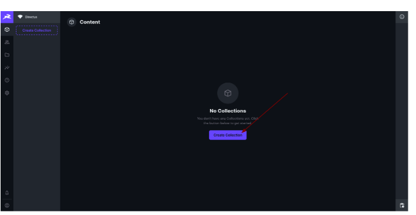

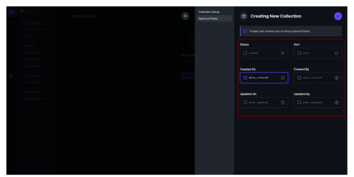
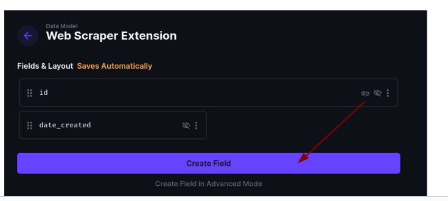
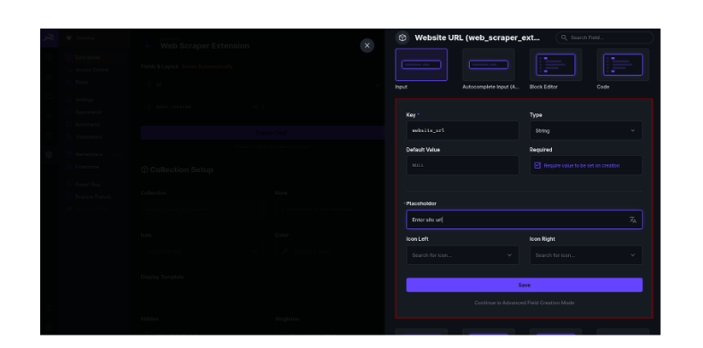
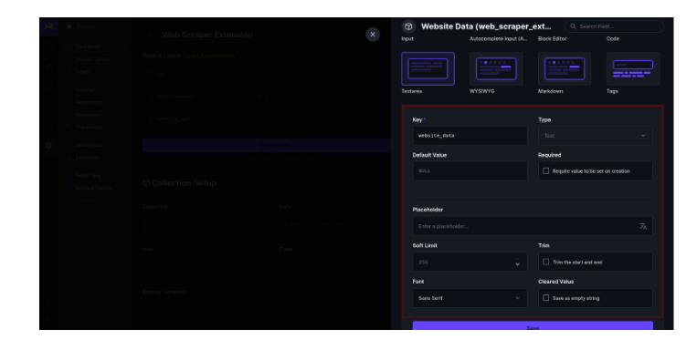
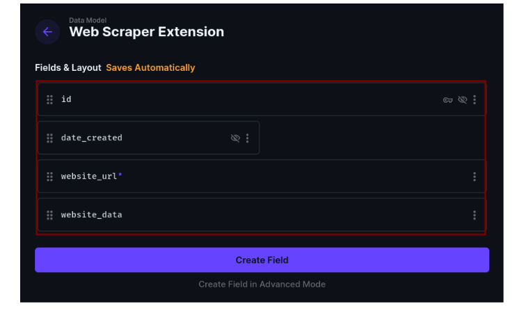

You should have a data model set up with at least 3 fields (id, website_url, and website_data).

### The Flow Trigger

The next part of the setup for our extension is the flow. We will set up a Directus flow that triggers when a new item is created in our collection. This will pass in the data from the created item (i.e. the website_url), so we can pass that to our web scraping function that will be added in later.

You should have something that looks like this:

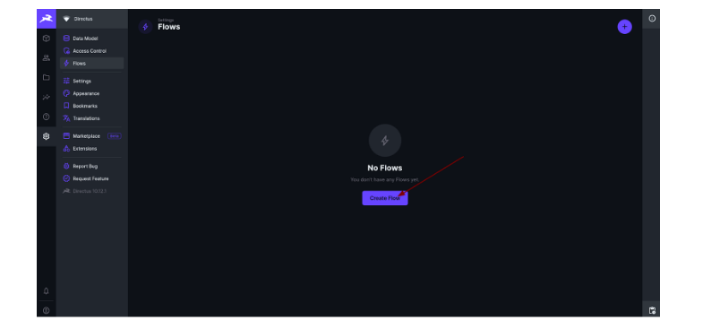
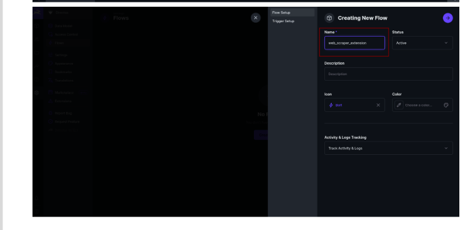
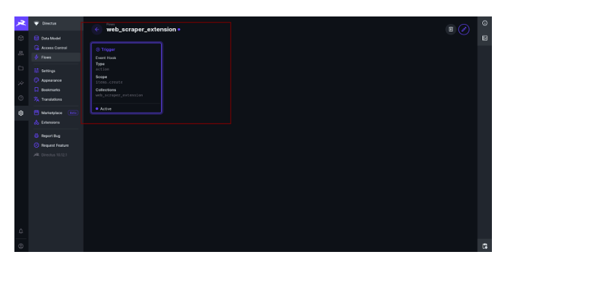

### Adding the Custom Operation

The next and final step is to add our `custom operation` as an extension in Directus, and attach it to the `trigger` in our flow.

To do this, we first build the extension, by executing the following command:

```bash
npm run build
```

Then we copy the root directory of our extension, containing the extension code and build output, and add it to the extensions folder in the root of our Directus server. For more information on this, refer to [here](https://docs.directus.io/extensions/installing-extensions.html#installing-via-the-extensions-directory).

After restarting the Directus server, we should see our extension in the Directus app.

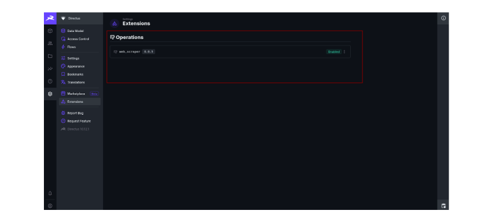

Finally, we add our `custom operation` to the web scraper flow:

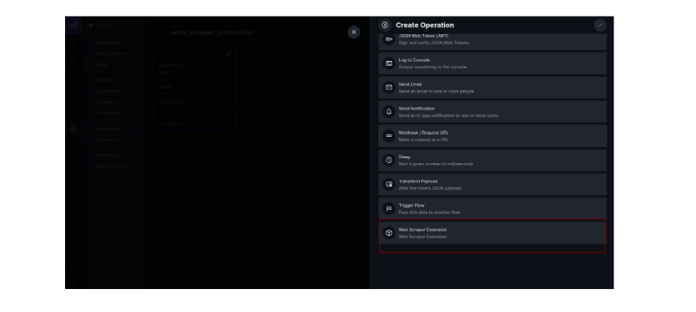

The flow should look something like this:

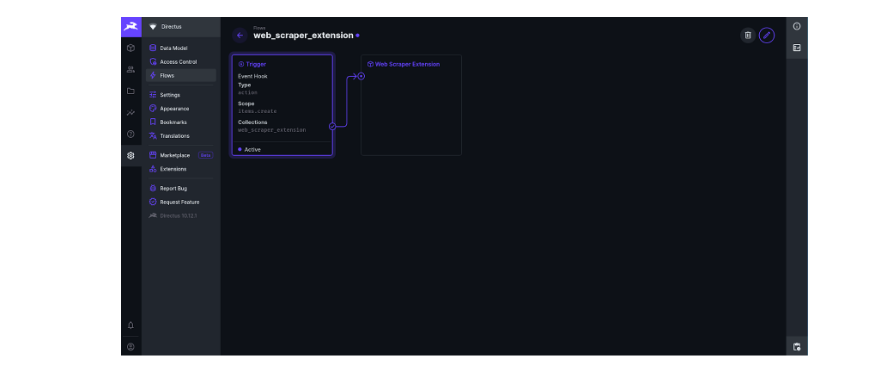

Now whenever a new item is created in our collection, the flow will be triggered and our custom operation will be called. The item will be updated to store the scraped data from the url specified.

## Working on the Webscraping Part

### Installing Cheerio npm package

- Cheerio:  Cheerio is an npm package used for manipulating data.Cheerio does not provide a visua rendering, apply CSS, load external resources, execute Javascript which is common for Single Page Application(SPA). This makes Cheerio much, much faster that other solutions. Some of the amazing features of cheerio includes:

1. Familiar syntax: Cheerio implements a subset of core jQuery. Cheerio removes all the DOM inconsistencies and browser cruft from the jQuery library, revealing its truly gorgeous API.

2. Blazingly fast: Cheerio works with a very simple, consistent DOM model. As a result parsing, manipulating, and rendering are incredibly efficient.

3. Incredibly flexible: Cheerio wraps around parse5 parser and can optionally use @FB55's forgiving htmlparser2. Cheerio can parse nearly any HTML or XML document.

```bash=
npm i playwright cheerio
```

## The Web Scraper

The final piece of our extension is the web scraper itself, which takes the URL and parses the website at the URL for any relevant data.

```javascript

import * as cheerio from "cheerio";

export default class WebScraperService {
  constructor() {}

  async validatePage(url: string) {
try {
    
   new URL(url);
 } catch (error) {
   throw new PageLoadError("Invalid URL");
 }
  }

  async getCompanySiteData(url: string) {
 console.log(`Crawling ${url}`);
 try {
   await this.validatePage(url);
   const html = await fetch(url).then((res) => res.text());

   const $ = cheerio.load(html);
   const tagsToExtract = [
     "span",
     "div",
     "p",
     "h1",
     "h2",
     "h3",
     "h4",
     "h5",
     "h6",
     "li",
     "a",
     "ol",
     "ul",
   ];
   let content = "";
   tagsToExtract.forEach((tag) => {
     $(tag).each((_, element) => {
       content = content + " " + $(element).text();
     });
   });

```

Explanation:

The web scraping service uses the cheerio library for parsing HTML. The main component is the WebScraperService class, which has methods for validating URLs and extracting content from web pages.

The getCompanySiteData method is responsible for fetching and extracting text content from a web page. It fetches the HTML content of the web page and uses cheerio to parse this HTML. The method extracts text content from specific HTML tags (span, div, p, h1, h2, h3, h4, h5, h6, li, a, ol, ul) and concatenates this text into a single string. The text is then trimmed to the first 5000 characters and cleaned by removing certain patterns (such as periods followed by a word, repeated characters, hashtags, hyphenated words, and extra whitespace). Finally, the cleaned-up text content is returned and saved in the Directus database.

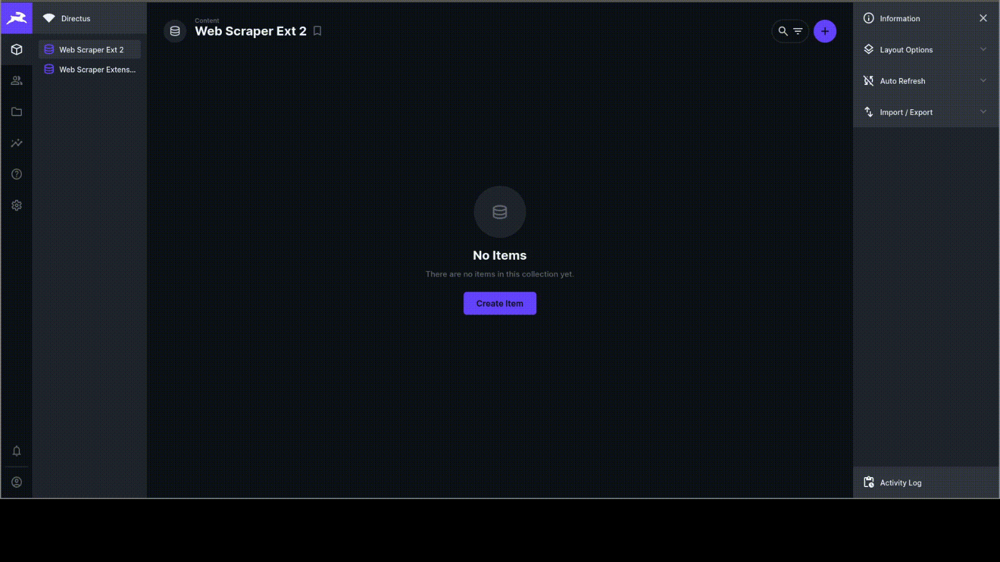

## Testing Your Extension


## Github Repo URL

To crosscheck your code in case of any error, please clone the repo [here](https://github.com/Okeke12nancy/webscraper-extension)

## Summary

In this article, we explored how to create a directus extension, what webscraping is all about and how to create a webscraping directus extension. To know more about Directus, you can go through the Directus youtube channel [here](https://www.youtube.com/@DirectusVideos).
