## Introduction
Directus has an excellent built-in implementation of Single Sing-On (SS0) across a variety of standards, with adapters for a large number of providers. However, tweaking it all together to make it work like a charm can be tricky.

This step-by-step guide explains the process of configuring SSO in a Directus application. We will be using the SAML standard along with the Okta provider. Our goal is to enable users to log into the Directus admin panel via Okta.

## Before We Start
- Ensure you have a self-hosted Directus application up and running.
- Register for a company account on Okta. Note: Okta requires business emails. Register [here](https://www.okta.com/free-trial/).

## Creating an Application in Okta
1. Access Okta Admin Workspace: Navigate to `https://<YOUR-WORKSPACE-NAME>-admin.okta.com/admin/getting-started`.
2. Create App Integration: In our Okta admin workspace, under the **Applications** tab, select **Create App Integration** and select the desired method (**SAML 2.0** in our case). Click **Next**.

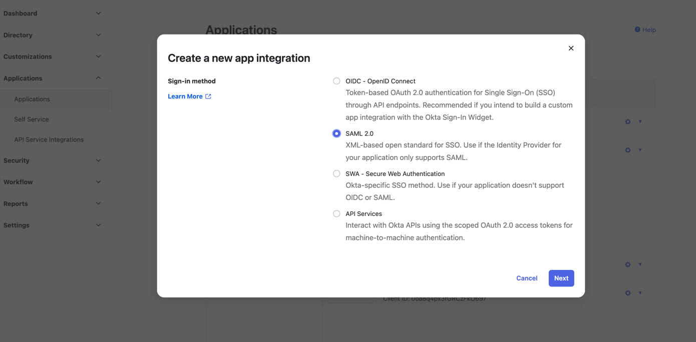
### General settings
Configure App Details: Now, we've gotten to the multistep creation of the app. On the first screen, we need to enter the name of our app, as well as upload a logo and set up its visibility to users. Let's name our app **My Directus App** and leave the rest of the settings as default. Click **Next**.

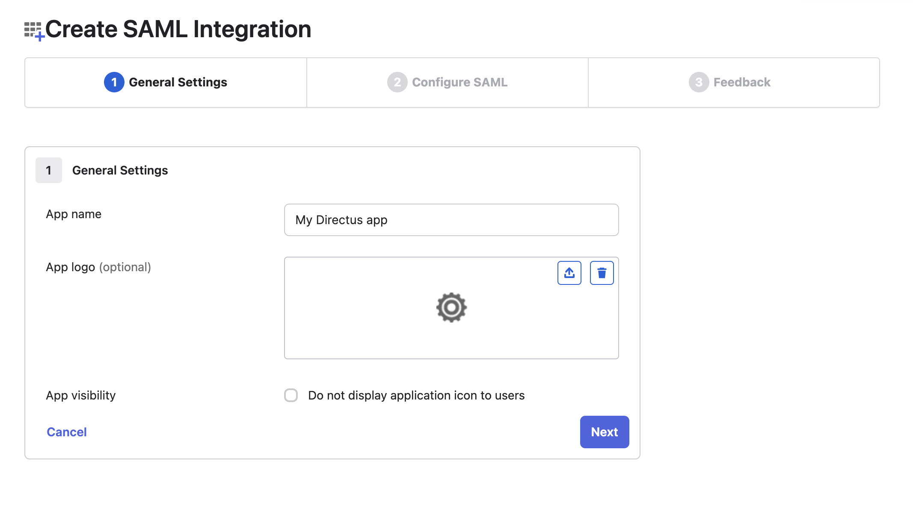

### Configure SAML
SAML Settings: the most important part of our integration with Directus. Fill in the following values:

| Name                        | Value                                                       | Description                                                                                                                                |
|-----------------------------|-------------------------------------------------------------|--------------------------------------------------------------------------------------------------------------------------------------------|
| Single sign-on URL          | http://localhost:8055/auth/login/okta/acs                   | A route in our Directus application that handles authentication through Okta                                                               |
| Audience URI (SP Entity ID) | http://localhost:8055/auth/login/okta/metadata              | A route in our Directus application that provides metadata to verify that our application is the intended recipient of the SAML response   |
| Default RelayState          | http://localhost:8055/admin/login?reason=SIGN_OUT&continue= | A route in our Directus application to which the user will be redirected after successful authentication                                   |

Note: Use `localhost:8055` for local development. For deployment to other domains, change values to your domain, which will most likely work over the https protocol (e.g., `https://example.com/...`). Alternatively, we can create as many Okta applications as needed for each environment.

Next, fill in the **Attribute Statements**.
Note: Although it is labelled as optional, it is critical to fill in at least the email attribute for authentication to work.

The attributes will look like this:

| Name       | Name format | Value          | Description                                                                                                                                                                      |
|------------|-------------|----------------|----------------------------------------------------------------------------------------------------------------------------------------------------------------------------------|
| email      | Basic       | user.email     | An important field by which Directus will match the email from our Okta account with the email in our app                                                                        |
| first_name | Basic       | user.firstName | The field by which Directus will match the first name from the Okta account with the first name in our app. Add it if we want the user's first name to be pre-filled in the app. |
| last_name  | Basic       | user.lastName  | The field by which Directus will match the last name from the Okta account with the last name in our app. Add it if we want the user's last name to be pre-filled in the app.    |


Let's leave the rest of the parameters at this step as defaults. As a result, we will get parameters like these:

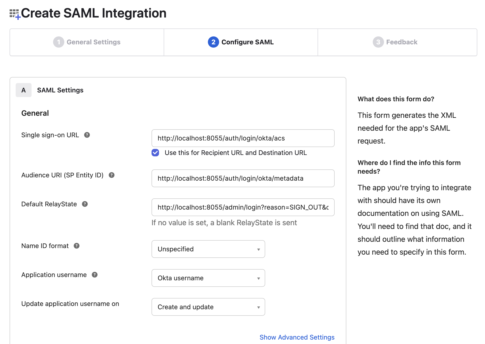

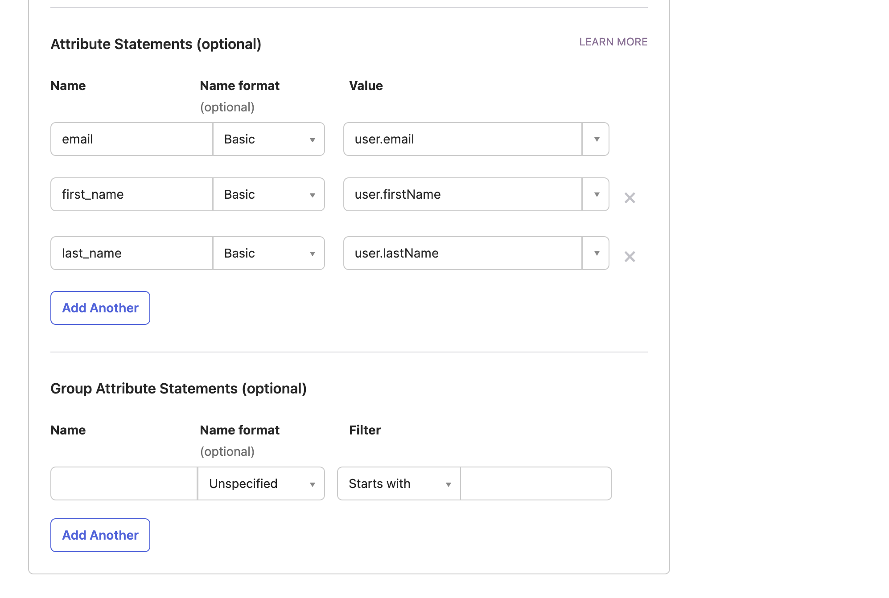

Click **Next** and go to the third and final screen for the Okta app settings.

### Feedback
Our setup is complete, and we are prompted to leave feedback or submit the app to Okta for review. Unless you want to spend any more time here, select **I'm an Okta customer adding an internal app** and, without filling anything in, click **Finish**.

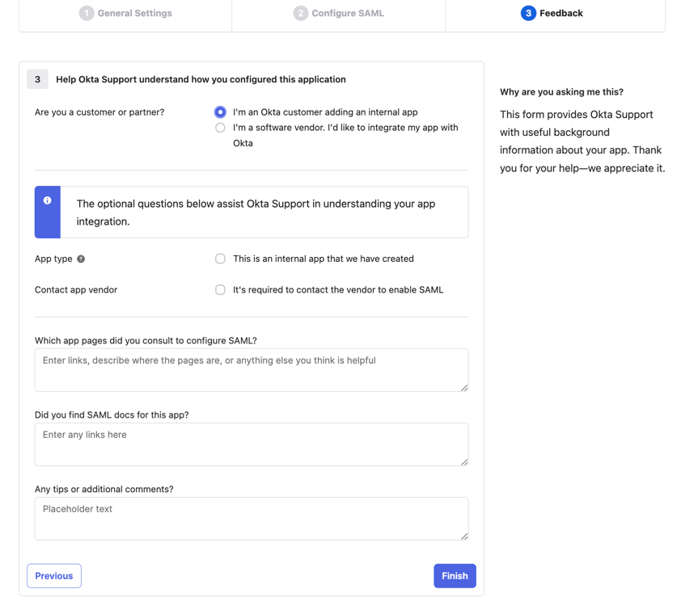

### Add Users
Now, we can choose which people from our organization can access Directus through Okta SSO. Go to the **Assignments** tab in the settings of our Okta application.

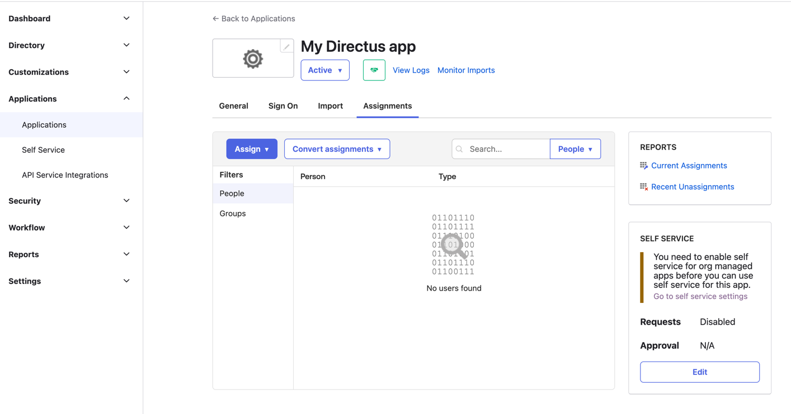

Click **Assign**->**Assign to People**.

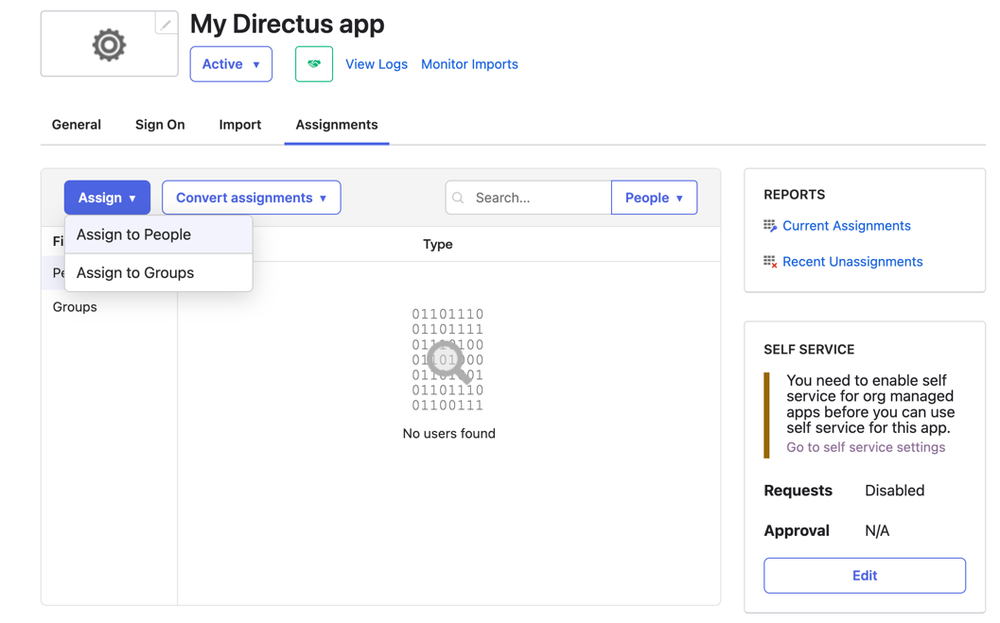

Click **Assign** next to the desired user.

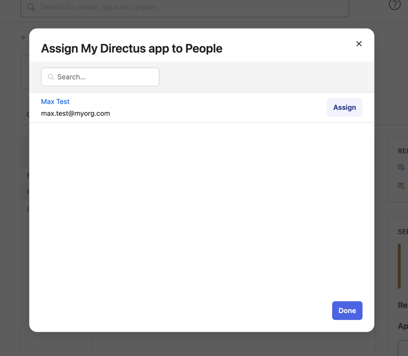

We can also change the username, but we will leave the default. Click **Save and Go Back**.

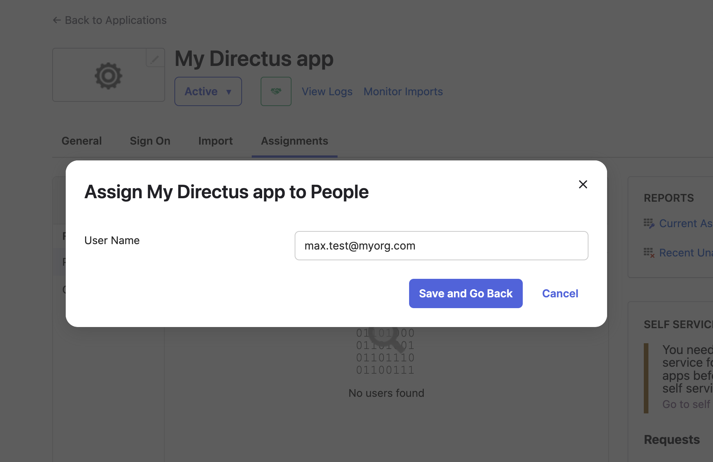

```
:::How to add Users to Organisation

Go to the People page. To do this, click **Directory**->**People** in the sidebar.


Click **Add Person**, and enter the user's personal data in the modal window that appears. Then click **Save**.

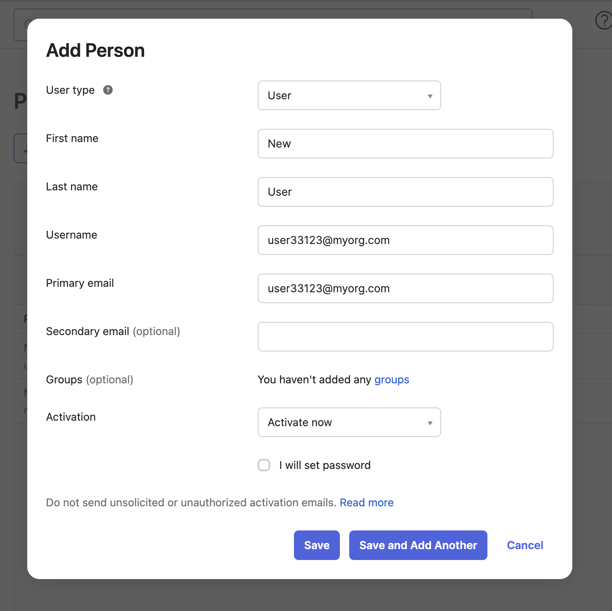

Great, the user will receive an email with further instructions and appear in our organisation's list of users.

```

### Result
Congrats! We have completed our Okta app.

All we need to do now is go to the **Sign On** tab in our app(**Applications**->**Applications**->**My Directus app**->**Sign On**) and copy the **Metadata URL**. We will need this a bit later.

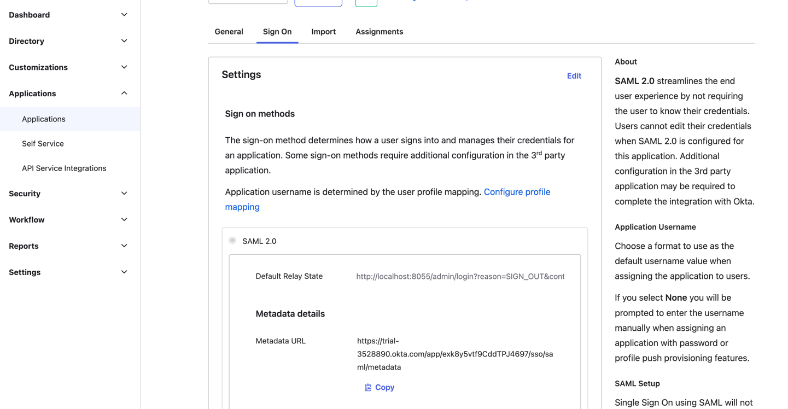

## Configuring SSO in the Directus application

Now that the integration on the Okta side is complete, it's time to set up our Directus app. We need to open the _.env_ file and add the following variables to it:

| Name                                  | Value                                                                                                                                                                                                                                                                                                                                                                                                                                                                                                                                                                                         | Description                                                                                                                                                                                                                                                                                                                      |
|---------------------------------------|-----------------------------------------------------------------------------------------------------------------------------------------------------------------------------------------------------------------------------------------------------------------------------------------------------------------------------------------------------------------------------------------------------------------------------------------------------------------------------------------------------------------------------------------------------------------------------------------------|----------------------------------------------------------------------------------------------------------------------------------------------------------------------------------------------------------------------------------------------------------------------------------------------------------------------------------|
| `AUTH_PROVIDERS`                      | okta                                                                                                                                                                                                                                                                                                                                                                                                                                                                                                                                                                                          | List of SSO providers. In our case, it is only Okta, but can also be a comma-separated list.                                                                                                                                                                                                                                     |
| `AUTH_OKTA_DRIVER`                    | saml                                                                                                                                                                                                                                                                                                                                                                                                                                                                                                                                                                                          | Driver used for the Okta SSO.                                                                                                                                                                                                                                                                                                    |
| `AUTH_OKTA_ALLOW_PUBLIC_REGISTRATION` | true                                                                                                                                                                                                                                                                                                                                                                                                                                                                                                                                                                                          | Whether our application will register users who log in via SSO for the first time.                                                                                                                                                                                                                                               |
| `AUTH_OKTA_DEFAULT_ROLE_ID`           | {Look in the database}                                                                                                                                                                                                                                                                                                                                                                                                                                                                                                                                                                        | Id of the role in the application that will be assigned by default to users logging in through Okta. We can look it up in the database. Note that the id can be different if we use different databases for development and production.                                                                                          |
| `AUTH_OKTA_IDENTIFIER_KEY`            | email                                                                                                                                                                                                                                                                                                                                                                                                                                                                                                                                                                                         | The key by which Directus will identify the user from the Okta integration (we specified it in the attributes).                                                                                                                                                                                                                  |
| `AUTH_OKTA_EMAIL_KEY`                 | email                                                                                                                                                                                                                                                                                                                                                                                                                                                                                                                                                                                         | The key by which Directus will populate the user's email from the Okta integration (we specified it in the attributes).                                                                                                                                                                                                          |
| `AUTH_OKTA_GIVEN_NAME_KEY`            | first_name                                                                                                                                                                                                                                                                                                                                                                                                                                                                                                                                                                                    | The key by which Directus will populate the user's first name from the Okta integration (we specified it in the attributes).                                                                                                                                                                                                     |
| `AUTH_OKTA_FAMILY_NAME_KEY`           | last_name                                                                                                                                                                                                                                                                                                                                                                                                                                                                                                                                                                                     | The key by which Directus will populate the user's last name from the Okta integration (we specified it in the attributes).                                                                                                                                                                                                      |
| `AUTH_OKTA_IDP_metadata`              | {Look in the Metadata URL we copied in the previous step}                                                                                                                                                                                                                                                                                                                                                                                                                                                                                                                                     | Open the **Metadata URL** and copy all the XML content. Note: specify the content, not the link. We can wrap this in quotes and leave it multi-line.                                                                                                                                                                             |
| `AUTH_OKTA_SP_metadata`               | ```<EntityDescriptor xmlns:md="urn:oasis:names:tc:SAML:2.0:metadata" xmlns:ds="http://www.w3.org/2000/09/xmldsig#" entityID="{ENTITY_ID}"><SPSSODescriptor WantAssertionsSigned="true" protocolSupportEnumeration="urn:oasis:names:tc:SAML:2.0:protocol">         <NameIDFormat>             urn:oasis:names:tc:SAML:1.1:nameid-format:emailAddress         </NameIDFormat>         <AssertionConsumerService isDefault="true" index="0" Binding="urn:oasis:names:tc:SAML:2.0:bindings:HTTP-POST" Location="{OUR_DOMAIN}/auth/login/okta/acs"/>     </SPSSODescriptor> </EntityDescriptor>``` | Insert the template from the Value column, replacing `{ENTITY_ID}` with the entityId value from  **Metadata URL**. It will look something like `http://www.okta.com/exk8y5vtf9CddTPJ4697`. Also, replace `{OUR_DOMAIN}` with our domain, i.e., `http://localhost:8055`, for local development or another domain for production.  |

As a result, our _.env_ file will look like this:

```
...
AUTH_PROVIDERS="okta"
AUTH_OKTA_DRIVER="saml"
AUTH_OKTA_ALLOW_PUBLIC_REGISTRATION=true
AUTH_OKTA_DEFAULT_ROLE_ID="d2021a6c-327a-4477-9cb8-62244ead4e1f"
AUTH_OKTA_IDENTIFIER_KEY="email"
AUTH_OKTA_EMAIL_KEY="email"
AUTH_OKTA_GIVEN_NAME_KEY="first_name"
AUTH_OKTA_FAMILY_NAME_KEY="last_name"

AUTH_OKTA_IDP_metadata='<md:EntityDescriptor xmlns:md="urn:oasis:names:tc:SAML:2.0:metadata" entityID="http://www.okta.com/exk8y5vtf9CddTPJ4697">
<md:IDPSSODescriptor WantAuthnRequestsSigned="false" protocolSupportEnumeration="urn:oasis:names:tc:SAML:2.0:protocol">
<md:KeyDescriptor use="signing">
<ds:KeyInfo xmlns:ds="http://www.w3.org/2000/09/xmldsig#">
<ds:X509Data>
<ds:X509Certificate>MIIDqjCCApKgAwIBAgIGAYtjHesFMA0GCSqGSIb3DQEBCwUAMIGVMQswCQYDVQQGEwJVUzETMBEG A1UECAwKQ2FsaWZvcm5pYTEWMBQGA1UEBwwNU2FuIEZyYW5jaXNjbzENMAsGA1UECgwET2t0YTEU MBIGA1UECwwLU1NPUHJvdmlkZXIxFjAUBgNVBAMMDXRyaWFsLTM1Mjg4NDkxHDAaBgkqhkiG9w0B CQEWDWluZm9Ab2t0YS5jb20wHhcNMjMxMDI0MTkxNTI3WhcNMzMxMDI0MTkxNjI2WjCBlTELMAkG A1UEBhMCVVMxEzARBgNVBAgMCkNhbGlmb3JuaWExFjAUBgNVBAcMDVNhnkBGcmFuY2lzY28xDTAL BgNVBAoMBE9rdGExFDASBgNVBAsMC1NTT1Byb3ZpZGVyMRYwFAYDVQQDDA10cmlhbC0zNTI4ODQ5 MRwwGgYJKoZIhvcNAQkBFg1pbmZvQG9rdGEuY29tMIIBIjANBgkqhkiG9w0BAQEFAAOCAQ8AMIIB CgKCAQEAp3Fym7vnRBER9Hoj70Z7EjE0hsEQTyjN7aN7EcBWL7/g40h65bmaHtTq/Pbd/6fBedGF f4ZvwW1vOLdnRnVxwIl5UdUqYgfgSoYq9xp48xMlonWDqd6fNlSRKl3h9sFARZQ680f7TYbanTEu ikUKoE7K6HdEOXC00Iv+zcyA6BfiIRBuBSnAZU6Ip3nsLeY8ludDhZzqD04H6bhZFVzRUif75LHn DYUY9VsvGxqDIhLGQFuVlgbP5OdNEGZM02iCGhivGN0eIEPGUpMGBu9dpxHSMqOar/QVO64JgwTw jcW+t7P+47IC6LRJVY07bg3pjgEMtmylzgvdx/30tynpwwIDAQABMA0GCSqGSIb3DQEBCwUAA4IB AQAux3Jo+jl7kzgd+AILWrayG/Ayu8L2OPs3+pjJ42FfjEa6Vw0a8g+IfQ1t7kvWcI1VrWol2jsR oBzR0xZpsStOQ+t3S+MtjS74iN7ErvDFRHjD4yEGJtMGwxsWFJqcOICwcJEB4Etmd+girCSccVH7 ydR9HnKID0SVKh/i17FPG4SlE28/cQJ2rb/VkPHlBlHIMyRvLhGdM3T2SWBIHR0/9Nvp9gyNZfvk 0qP184mjFP9wKU83tXLCnq31j7vJtdOw+E83TsUSg1e9JBNH3L9OVQJzksI+iUiHEDH8O9yXla5C caqK2Z6/0FTGf2KYlbO6qtLAYmIdKwsQR28crJW0</ds:X509Certificate>
</ds:X509Data>
</ds:KeyInfo>
</md:KeyDescriptor>
<md:NameIDFormat>urn:oasis:names:tc:SAML:1.1:nameid-format:unspecified</md:NameIDFormat>
<md:NameIDFormat>urn:oasis:names:tc:SAML:1.1:nameid-format:emailAddress</md:NameIDFormat>
<md:SingleSignOnService Binding="urn:oasis:names:tc:SAML:2.0:bindings:HTTP-POST" Location="https://trial-3528890.okta.com/app/trial-3528890_mydirectusapp_1/exk8y5vtf9CddTPJ4697/sso/saml"/>
<md:SingleSignOnService Binding="urn:oasis:names:tc:SAML:2.0:bindings:HTTP-Redirect" Location="https://trial-3528890.okta.com/app/trial-3528890_mydirectusapp_1/exk8y5vtf9CddTPJ4697/sso/saml"/>
</md:IDPSSODescriptor>
</md:EntityDescriptor>'

AUTH_OKTA_SP_metadata='<EntityDescriptor xmlns:md="urn:oasis:names:tc:SAML:2.0:metadata" xmlns:ds="http://www.w3.org/2000/09/xmldsig#" entityID="http://www.okta.com/exk8y5vtf9CddTPJ4697">
                       <SPSSODescriptor WantAssertionsSigned="true" protocolSupportEnumeration="urn:oasis:names:tc:SAML:2.0:protocol">
                       <NameIDFormat>urn:oasis:names:tc:SAML:1.1:nameid-format:emailAddress</NameIDFormat>
                       <AssertionConsumerService isDefault="true" index="0" Binding="urn:oasis:names:tc:SAML:2.0:bindings:HTTP-POST" Location="http://localhost:8055/auth/login/okta/acs"/>
                       </SPSSODescriptor>
                       </EntityDescriptor>'
...
```

## Testing
Now, let's make sure that the whole configuration works. Launch our Directus application, go to http://localhost:8055/ in the browser, and immediately see the change - we have a **Log In with Okta** button.

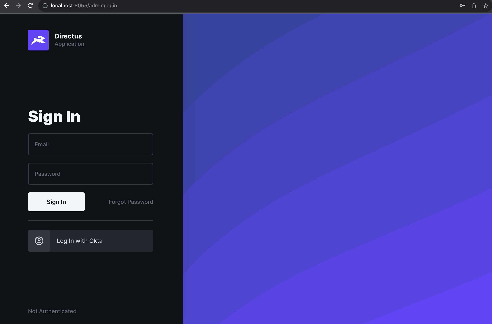

Clicking on it takes us to the Okta login screen. 

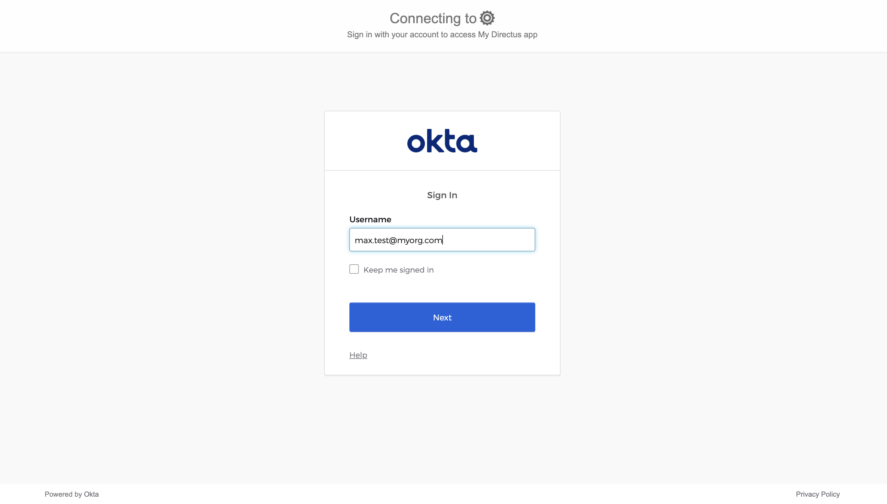

Enter our email, authenticate by any available method. Successful authentication with Okta should redirect us to the Directus admin panel. Here, go to User Directory and confirm that we have a new user with a pre-filled email, first name, and last name.

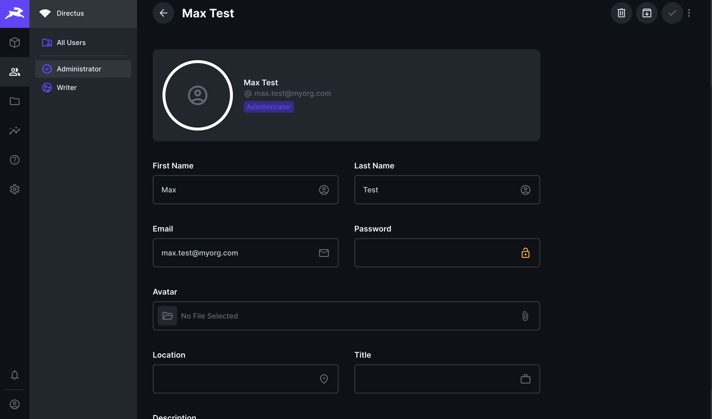

Note: If a user is not added to the list of assigned users in the Okta app, they cannot log in to our app.

We can change our user data to whatever we want, and it won't be overwritten with data from Okta the next time the app logs in.

## Summary

We now have a fully configured and working integration of Okta SSO with the Directus application. Users can seamlessly register and log in via the organization's SSO, functioning equivalently to the standard email and password login method without any limitations.
