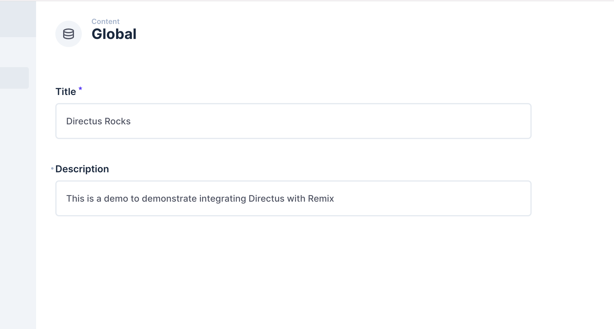

## Introduction

[Remix](https://remix.run/) is a React.js framework that  helps you deliver websites that are fast, slick, and have resilient user experience. In this tutorial, you will learn how to build a website using Directus as a headless CMS. You will store, retrieve, and use global metadata such as the site title, create new pages dynamically based on Directus items, and build a blog.

## Before You Start

You will need:

- To install [Node.js](https://nodejs.org/en/) and a code editor on your computer.
- A Directus project - you can use [Directus Cloud](https://directus.cloud/) or [run it yourself](https://docs.directus.io/getting-started/quickstart.html).
- Some knowledge of TypeScript and React

## Initialize Remix and Install the Directus SDK

Open your terminal to run the following command to create a new Remix project:

```bash
npx create-remix@latest

```

During installation, when prompted, choose the following configurations:

```bash
Where should we create your new project? ./remix-directus
Initialize a new git repository? Choose the choice that suits your need
Install dependencies? Yes
Do you plan to write TypeScript? Yes

```

Once completed, navigate into the new directory and delete all the contents in the `app/routes/_index.tsx` file so you can build the project from scratch and install the Directus JavaScript SDK:

```bash
cd remix-directus
npm i @directus/sdk
```

Open the `remix-directus` directory in a text editor of your choice and run `npm run dev` in the terminal to start the development server at `http://localhost:3000`.

## Create a Helper for the SDK

To create an instance of the Directus SDK that multiple pages in the project will use, create a new directory called `lib` and a new file called `directus.ts` inside of it, add the following content:

```ts
import { createDirectus, rest, } from '@directus/sdk';

//Structure of the data you will be fetching from Directus
type Global = {
  title: string;
  description: string;
}
type Author = {
  name: string
}
type Page = {
  title: string;
  content: string;
  slug: string;
}
type Post = {
  image: string;
  title: string;
  author: Author;
  content: string;
  published_date: string
  slug: string;
}

type Schema = {
  posts: Post[];
  global: Global;
  pages: Page[];
}

const directus = createDirectus<Schema>(YOUR_DIRECTUS_URL).with(rest());

export default directus;


```

Ensure your Directus URL is correct when initializing the Directus JavaScript SDK.

## Using Global Metadata and Settings

In your Directus project, navigate to Settings -> Data Model and create a new collection called `global`. Under the Singleton option, select 'Treat as a single object', as this collection will have just a single entry containing global website metadata.

Create two text input fields - one with the key of `title` and one `description`.

Navigate to the content module and enter the global collection. Collections will generally display a list of items, but as a singleton, it will launch directly into the one-item form. Enter information in the title and description field and hit save.

 

 By default, new collections are not accessible to the public. Navigate to Settings -> Roles & Permissions -> Public and give Read access to the Global collection.

 In your `app/routes/_index.tsx` file, add the following to fetch the data from Directus and display it:

```tsx
import directus from "../lib/directus";
import { readSingleton } from "@directus/sdk";
import { useLoaderData } from "@remix-run/react";


export const loader = async () => {
  const global = await directus.request(readSingleton("global"));
  return global
};

export default function Index() {
  const { title, description } = useLoaderData< typeof loader>();
  return (
    <div>
      <h1>{title}</h1>
      <p>{description}</p>
    </div>
  );
}

```

Refresh your browser. You should see the data from your Directus Global collection displayed in the homepage.

## Creating Pages With Directus

### Set up Directus

Create a new collection called `pages` - make the Primary ID Field a "Manually Entered String" called `slug`, which will correlate with the URL for the page. For example `about` will later correlate to the page `localhost:3000/about`.

Create a text input field called `title` and a WYSIWYG input field called `content`. In Roles & Permissions, give the Public role read access to the new collection.

Create some items in the new collection

### Setup Dynamic Routes in Astro

Inside of the `app/routes` directory, create a new file called `$slug.tsx`. Remix uses `$` in a filename to identify dynamic route parameters and generates generate multiple, matching pages.

```tsx
import { LoaderFunctionArgs } from "@remix-run/node";
import directus from "../lib/directus";
import { readItem } from "@directus/sdk";
import { useLoaderData } from "@remix-run/react";

export const loader = async ({ params }: LoaderFunctionArgs) => {
  const { slug } = params;

  const page = await directus.request(readItem("pages", slug as string));
  return page
};

export default function Page() {
  const { title, content } = useLoaderData<typeof loader>();
  return (
    <div>
      <h1>{title}</h1>
      <div dangerouslySetInnerHTML={{ __html: content }}></div>
    </div>
  );
}


```

Remix uses a special `useLoaderData()` hook to retrieve data from a `loader` function.

Go to `http://localhost:3000/about`, replacing `about` with any of your item slugs. Using the Directus JavaScript SDK, the item with that slug is retrieved, and the page should show your data.

```
:::warning 404s and Trusted Content
Non-existing slugs will result in a 404 error. Additionally,
`dangerouslySetInnerHTML={{ __html: content }}` should only be used for trusted content.

:::
```

## Creating Blog Posts With Directus

Create a new collection called `authors` with a single text input field called `name`. Create one or more authors.

Then, create a new collection called `posts` - make the Primary ID Field a "Manually Entered String" called   , which will correlate with the URL for the page. For example `hello-world` will later correlate to the page `localhost:3000/blog/hello-world`.

Create the following fields in your `posts` data model:

- a text input field called `title`
- a WYSIWYG input field called `content`
- an image relational field called `image`
- a datetime selection field called `published_date` - set the type to 'date'
- a many-to-one relational field called `author` with the related collection set to `authors`

In Roles & Permissions, give the Public role read access to the `authors`, `posts`, and `directus_files` collections.

Create some items in the posts collection - here's some sample data.

### Create Blog Post Listing

In Remix route file convention, `.` will create a `/` in the URL.
Inside of the `app/routes` directory, create a new file called `blog._index.tsx` with the content:

```tsx
import directus from "~/lib/directus";
import { readItems } from "@directus/sdk";
import { useLoaderData } from "@remix-run/react";

export const loader = async () => {
  const posts = await directus.request(
    readItems("posts", {
      fields: ["slug", "title", "published_date", { author: ["name"] }],
      sort: ["-published_date"],
    })
  );
  return { posts };
};


```

This query will retrieve the first 100 items (default), sorted by published date (descending order, which is latest first). It will only return the specific fields we request - `slug`, `title`, `published_date`, and the `name` from the related `author` item.

Display the fetched data in HTML:

```tsx
export default function Blog() {
  const { posts } = useLoaderData<typeof loader>();
  return (
    <div>
      <h1>Blog Posts</h1>
      <ul>
        {posts.map((post) => {
          return (
            <li key={post.slug}>
              <a href={`/blog/${post.slug}`}>
                <h2>{post.title}</h2>
              </a>
              <span>
                {post.published_date} &bull; {post.author.name}
              </span>
            </li>
          );
        })}
      </ul>
    </div>
  );
}

```

Visit `http://localhost:3000/blog` and you'll find a blog post listing, with the latest items first.

 

### Create Blog Post Pages

Each blog post links to a page that does not yet exist. In the `app/routes` directory, create a new file called `blog.$slug.tsx` with the content:

```tsx
import { LoaderFunctionArgs } from "@remix-run/node";
import directus from "../lib/directus";
import { readItem } from "@directus/sdk";
import { useLoaderData } from "@remix-run/react";


export const loader = async ({ params }: LoaderFunctionArgs) => {
  const { slug } = params;
  const post = await directus.request(readItem("posts", slug as string));
  return post;
};

export default function Post() {
  const { image, title, content } = useLoaderData<typeof loader>();
  return (
    <div>
      
      <h1>{title}</h1>
      <div dangerouslySetInnerHTML={{ __html: content }}></div>
    </div>
  );
}


```

Some key notes about this code snippet.

- The `width` attribute demonstrates Directus' built-in image transformations.
- Once again, `dangerouslySetInnerHTML={{ __html: content }}` should only be used if all content is trusted.
- Because almost-all fields are used in this page, including those from the image relational field, the `fields` property when using the Directus JavaScript SDK can be set to `*.*`.

Click on any of the blog post links, and it will take you to a blog post page complete with a header image.


## Add Navigation

While not strictly Directus-related, there are now several pages that aren't linked to each other. Update the `Layout.astro` file to include a navigation. Don't forget to use your specific page slugs.

```tsx
  <html lang="en">
      <head>
        <meta charSet="utf-8" />
        <meta name="viewport" content="width=device-width, initial-scale=1" />
        <Meta />
        <Links />
      </head>
      <body>
        <nav>
          <NavLink to="/">Home</NavLink>
          <NavLink to="/about">About</NavLink>
          <NavLink to="/conduct">Code of Conduct</NavLink>
          <NavLink to="/privacy">Privacy Policy</NavLink>
          <NavLink to="/blog">Blog</NavLink>
        </nav>
        <Outlet />
        <ScrollRestoration />
        <Scripts />
        <LiveReload />
      </body>
    </html>
```

## Next Steps

Through this guide, you have set up a Remix project, created a Directus instance, and used it to query data. You have used a singleton collection for global metadata, dynamically created pages, as well as blog listing and post pages.
