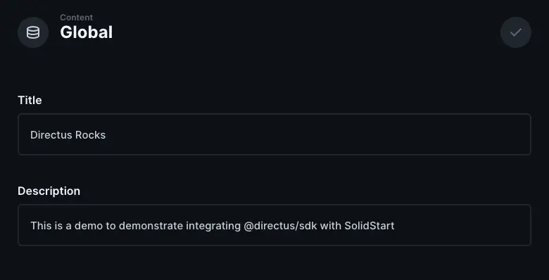
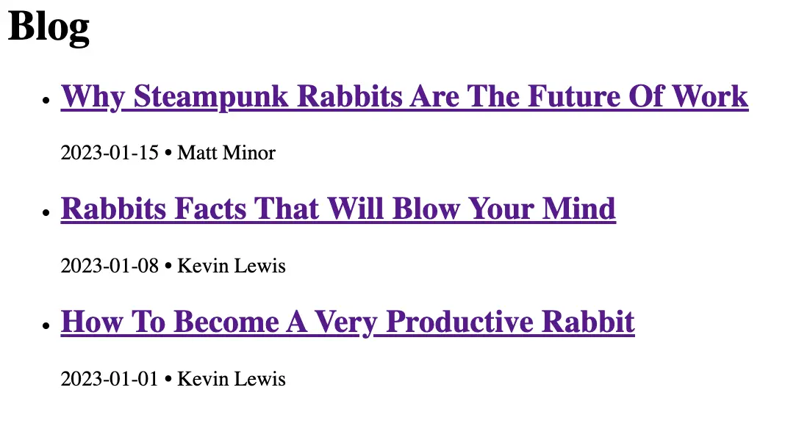
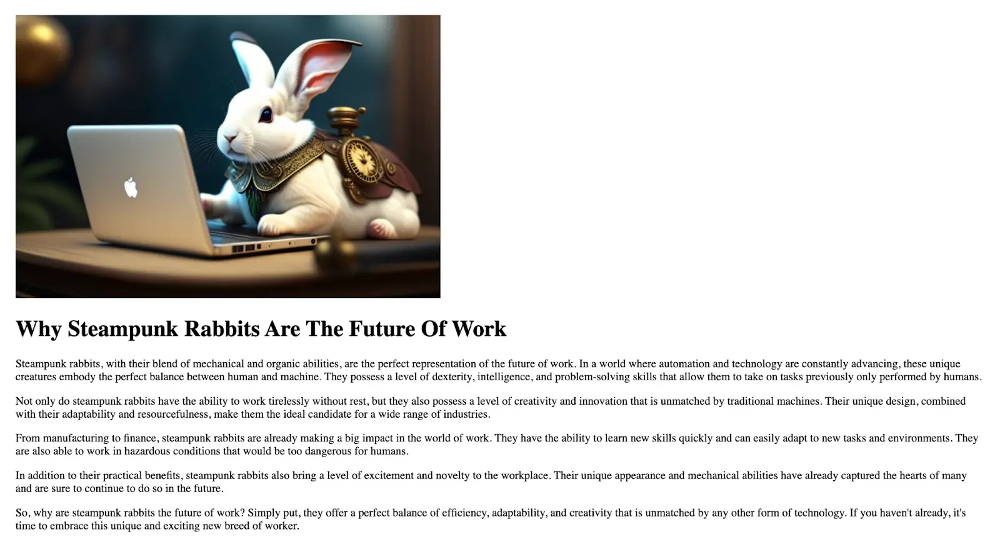

## Summary

[SolidStart](https://start.solidjs.com) a meta-framework built around [SolidJS](https://solidjs.com) - SolidStart is a framework aiming to allow people and teams to built high-end applications without being too opinionated. In this tutorial, you will learn how to build a website using Directus as a CMS. You will store, retrieve, and use global metadata such as the site title, create new pages dynamically based on Directus items, and build a blog.

## Before You Start

You will need:

- Node.js and a code editor.
- A Directus project - [follow our quickstart guide](https://docs.directus.io/getting-started/quickstart) if you don't already have one.
- (Bonus) SolidJS knowledge will definitely help, but is not required.

## Initialize SolidStart Project

Open your terminal and run the following commands to create a new Solid project and add the Directus JavaScript SDK:

```sh
npm create solid@latest solid-directus
✔ Which template do you want to use?
  › bare
✔ Server Side Rendering?
  › yes
✔ Use TypeScript?
  › no
```

Now change directory to what you created and install all dependencies while adding the Directus SDK.

```sh
cd solid-directus && npm install @directus/sdk
```

With this, we are ready to start coding!

```sh
npm run dev --open
```

It will open a browser window or tab on [localhost:3000](https://localhost:3000) or the next available port.

## Create a Directus Helper

We now need to setup the Directus SDK. We will add our data fetchers in this same file so we can handle caching and requests all at the same place. Create a new file `directus.js` inside of the src/libs directory:

```jsx
import { createDirectus, readItem, readItems, rest } from "@directus/sdk";
import { cache } from "@solidjs/router";

export const directus = createDirectus("< your project URL >").with(rest());
```

We have some unused `import` statements at the moment since now we are only instantiating the Directus client.

:::tip Provide Your Directus Project URL

Remember to replace `< your project URL >` with your actual URL, you can find it in your Directus dashboard.

:::

It may be useful to create an `.env` file and store the URL there in case you use different projects for production, development, etc. Otherwise it is not a private value, access is managed through the Directus dashboard.

## Using Global Metadata and Settings

In your Directus project, navigate to Settings -> Data Model and create a new collection called **global**. Under the Singleton option, select 'Treat as a single object', as this collection will have just a single entry containing global website metadata.



By default, new collections are not accessible to the public. Navigate to Settings -> Roles & Permissions -> Public and give Read access to the Global collection.

## Fetch Global Data

Now that the table is created and we have data added, let's create our first fetcher. In `/lib/directus.js` we will add a new method:

```js
export const getGlobals = cache(async () => {
  "use server";
  try {
    return await directus.request.readItems("global");
  } catch (e) {
    console.error(e);

    return null;
  }
}, `globals`);
```

Notice the `"use server"` directive. This indicates the bundler this method will never run (and therefore will not exist) in the client-side build. The `cache()` method wrapper defines a cache-key ("globals") where this response will be stored. We will try the request to Directus, if the request is not successful we can throw a `404`.

With our fetcher, we can head over to our `src/routes/index.jsx` and create our first loader request.

```jsx
export const route = {
  load: () => getGlobals(),
};

export default function Home() {
  const pageInfo = createAsync(getGlobals);

  createEffect(() => {
    if (pageInfo() === null) {
      throw new Error("404");
    }
  });

  return (
    <main>
      <Show when={pageInfo()}>{(info) => <h1>{info().title}</h1>}</Show>

      <Show when={pageInfo()}>
        {(info) => <strong>{info().description}</strong>}
      </Show>
    </main>
  );
}
```

The `route` object defines a `load` method that will be called **before** our route is accessed. Then `createAsync` will receive the deferred data as a signal and allow our UI to update. The `<Show>` component is important to make sure we only render our elements once the data has finally arrived at the browser.

## Dynamic Routes With Directus

Create a new collection called pages - make the Primary ID Field a "Manually Entered String" called slug, which will correlate with the URL for the page. For example about will later correlate to the page [localhost:3000/about](http://localhost:3000/about).

Create a text input field called title and a WYSIWYG input field called content. In Roles & Permissions, give the Public role read access to the new collection. Create 3 items in the new collection - here's some sample data.

Now, we go to our `src/lib/directus.js` and create our new fetcher.

```js
export const getPage = (slug) =>
  cache(async () => {
    "use server";
    try {
      return await directus.request(readItem("pages", slug));
    } catch (e) {
      return null;
    }
  }, slug);
```

Again, this method will attempt to fetch information from a given `slug`. And if there is no information, it will return `null`.

Inside of `src/routes`, create a new a file called `slug.jsx`. This is a dynamic route, so a single file can be used for all of the top-level pages.

> It's important to note that exact matches take precedence over dynamic routes. If it exists, a `about.jsx` file will render instead of `[slug].jsx` for the `/about` URL.

```jsx
import { createAsync, useParams } from "@solidjs/router";
import { Show, createEffect } from "solid-js";
import { getPage } from "~/libs/directus";

export const route = {
  load: (loc) => {
    if (loc.pathname) {
      return getPage(loc.pathname.substring(1));
    }
  },
};

export default function UserPage() {
  const param = useParams();
  const page = createAsync(getPage(param?.slug));

  createEffect(() => {
    if (page() === null) {
      throw new Error("404");
    }
  });

  return (
    <Show when={page()}>
      {(pageInfo) => (
        <>
          <h1>{pageInfo().title}</h1>
          <p innerHTML={pageInfo().content} />
        </>
      )}
    </Show>
  );
}
```

## Creating Blog Posts

Create a new collection called authors with a single text input field called name. Create one or more authors.

Then, create a new collection called posts - make the Primary ID Field a "Manually Entered String" called slug, which will correlate with the URL for the page. For example hello-world will later correlate to the page `localhost:3000/blog/hello-world`.

Create the following fields in your posts data model:

- a text input field called `title`.
- a WYSIWYG input field called `content`.
- an image relational field called `image`.
- a datetime selection field called `publish_date` - set the type to 'date'.
- a many-to-one relational field called `author` with the related collection set to `authors`.

In Roles & Permissions, give the Public role read access to the `authors`, `posts`, and `directus_files` collections.

Create 3 items in the posts collection -[here's some sample data](https://github.com/directus/examples/blob/main/website-next13/demo-data).

## List Blog Posts

Open `src/lib/directus.js`, add a helper to request all items from the `posts` collection.

```jsx
export const getPosts = cache(async () => {
  "use server";
  try {
    const post = await directus.request(
      readItems("posts", {
        fields: ["slug", "title", "publish_date", { author: ["name"] }],
        sort: ["-publish_date"],
      })
    );

    return post;
  } catch (error) {
    return null;
  }
}, "post-list");
```

This query will retrieve the first 100 items (default), sorted by publishing date (descending order, which is latest first). It will only return the specific fields we request - `slug`, `title`, `publish_date`, and the `name` from the related `author` item.



This time, we don't want this route to throw ever. What we want is to just show an empty list if by any chance we are not successful, so not rendering the list is enough.

In our `src/routes`, we can now create a `blog` directory. And within the newly create directory, an `index.jsx`.

```jsx
import { A, createAsync } from "@solidjs/router";
import { For, Show, createEffect } from "solid-js";
import { getPosts } from "~/libs/directus";

export const route = {
  load: () => getPosts,
};

export default function PostsList() {
  const list = createAsync(getPosts);

  return (
    <Show when={list()}>
      {(posts) => (
        <ul>
          <For each={posts()}>
            {(post) => (
              <li>
                <A href={`/blog/${post.slug}`}>
                  <h2>{post.title}</h2>
                </A>
                <span>
                  {post.publish_date} &bull; {post.author.name}
                </span>
              </li>
            )}
          </For>
        </ul>
      )}
    </Show>
  );
}
```



## Add Navigation

While not strictly Directus-related, there are now several pages that aren't linked to each other. Create the file `src/routes/app.jsx` to add a navigation above the main content. Don't forget to use your specific page slugs.

Within the `root` attribute, we can wrap our app within an `<ErrorBoundary>`. That way every time we throw within a component will be caught by our boundary.

```jsx
// @refresh reload
import { A, Router } from "@solidjs/router";
import { FileRoutes } from "@solidjs/start";
import { ErrorBoundary, Suspense } from "solid-js";
import NotFound from "./components/NotFound";

export default function App() {
  return (
    <Router
      root={(props) => (
        <ErrorBoundary fallback={(err) => <NotFound code={err} />}>
          <nav>
            <A href="/">Home</A>
            <A href="/about">About</A>
            <A href="/blog">Blog</A>
          </nav>
          <Suspense>{props.children}</Suspense>
        </ErrorBoundary>
      )}
    >
      <FileRoutes />
    </Router>
  );
}
```

## Next Steps

Through this guide, you have set up a Next project, created a Directus helper, and used it to query data. You have used a singleton collection for global metadata, dynamically created pages, as well as blog listing and post pages.

If you want to change what is user-accessible, consider setting up more restrictive roles and accessing only valid data at build-time.
