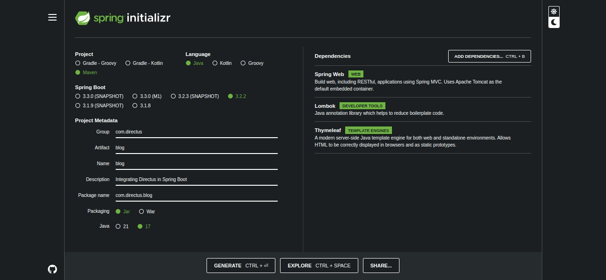
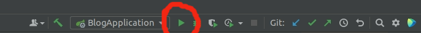
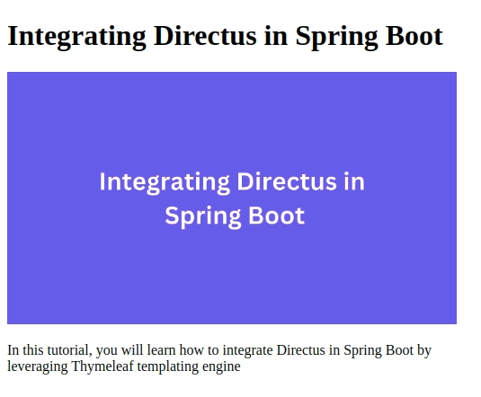

This tutorial will show you how to integrate Spring Boot in Directus. At the end of this tutorial, you will have an application that uses Thymeleaf templating engine to display the data from the Directus API.

## Prerequisites
- Knowledge of Java programming language and Thymeleaf templating.
- [Java development kit(JDK)8](https://www.oracle.com/ke/java/technologies/javase/javase8-archive-downloads.html) and above.
- Directus project - Use the [quickstart guide](https://docs.directus.io/getting-started/quickstart) to create the project.
- Integrated development environment(IDE). Feel free to use any environment that supports the Java programming language.
- A Directus collection named `articles` with the fields `id`, `title`, `featuredImage`, and `body`. These fields will be used to store the contents of an article.

## Project Setup
To create a new Spring Boot project, go to [Spring initializr](https://start.spring.io/) and select **Maven** on **Project** section and **3.x.x** on the **Spring Boot** section. The version will depend on the time you are reading this article so replace the x with the current version of Spring Boot.

On the **Project Metadata** section, enter the following: 

- **Group** - com.directus
- **Artifact** - blog
- **Name** - blog
- **Description** - Integrating Directus in Spring Boot
- **Package name** - com.directus.blog
- **Packaging** - Jar
- **Java** - 17

Add the following dependencies: Spring Web, Lombok, and Thymeleaf.



Next, click the **GENERATE** button to generate a zip file of your project. Extract the zip file to a desired location on your computer then import the extracted Spring Boot project in your IDE.

## Create Project Sub Packages
In your IDE, go to *src/main/java/com/directus/blog* and create three packages named *model*, *service*, and *controller*.

## Create a Class for the Article
Create a file named *Article.java* under the *model* package:

```java
package com.directus.blog.model;

import lombok.Data;

@Data
public class Article {
    private Long id;

    private String title;

    private String featuredImage;

    private String body;
}
```
Add the `@Data` annotation to the class and Lombok will generate getter and setter methods. This class will be used to map the data from your Directus project from JSON to Java objects.

## Create an Articles Data Transfer Object
If you make a request to retrieve a JSON response of your Directus project, you will find that the JSON response has the following format.

```json
{
  "data": [
    {
      "id": 2,
      "title": "Integrating Directus in Spring Boot",
      "featuredImage": "f1b20633-5329-4a6a-8942-1983a5732e7e",
      "body": "In this tutorial, you will learn how to integrate Directus in Spring Boot by leveraging Thymeleaf templating engine"
    }
  ]
}
```
You can see that the data is wrapped in an Array. As a result, you have to ensure the type of data being received is the same as the one returned by JSON. 

To achieve this, create a file named *ArticleDTO.java* under the *model* package then copy and paste the following code into the file.

```java
package com.directus.blog.model;

import com.fasterxml.jackson.annotation.JsonProperty;
import lombok.Data;

import java.util.List;
@Data
public class ArticleDTO {
    @JsonProperty("data")
    private List<Article> articles;
}
```
Since the JSON response is an Array, the field should be of type `List` for the deserialization to work.

The JSON Array is named `data` but the `ArticleDTO` field is named `articles`. As a result, you should add the `@JsonProperty` annotation to the field and pass the Array name as the argument to indicate that the field should be used for the deserialization.

## Create a Service Interface for the Articles
Create a file named *ArticleService.java* under the *service* package then copy and paste the following code into the file.

```java
package com.directus.blog.service;

import com.directus.blog.model.Article;

import java.util.List;

public interface ArticleService {
    List<Article> getAllArticles();
}
```
This `interface` declares a single method named `getAllArticles()` that you will use in the next step to implement the logic to retrieve and deserialize the articles.

If you want to add another functionality to the application such as retrieving a single article, you can declare the method in this `interface`.

## Implement the Article Service Interface
Create a file named *ArticleServiceImpl.java* under the *service* package then copy and paste the folllowing code into the file.

```java
package com.directus.blog.service;

import com.directus.blog.model.Article;
import com.directus.blog.model.ArticleDTO;
import org.springframework.core.ParameterizedTypeReference;
import org.springframework.http.HttpMethod;
import org.springframework.stereotype.Service;
import org.springframework.web.client.RestTemplate;

import java.util.List;
import java.util.Objects;

@Service
public class ArticleServiceImpl implements ArticleService{
    private final String BASEURL = "YOUR_DIRETUS_PROJECT_URL/items/articles";
    @Override
    public List<Article> getAllArticles() {
        return Objects.requireNonNull(new RestTemplate().exchange(
                BASEURL,
                HttpMethod.GET,
                null,
                new ParameterizedTypeReference<ArticleDTO>() {
                }
        ).getBody()).getArticles();
    }
}
```
Since the `ArticleServiceImpl` class is where all the business logic is located, you should annotate the class with `@Service` annotation. As a result, you can inject this class anywhere in the project as the annotation provides component scanning.

The `BASEURL` variable name holds the URL for your API and you should replace this to match your Directus project URL. The logic to perform deserialization is defined in the `getAllArticles()` method.

Deserialization can be achieved using various classes but you will leverage `RestTemplate` in this case. `RestTemplate` will help you to perform HTTP requests to your Directus API and deserialize the response to Java objects.

To achieve this, create a new instance of `RestTemplate` and call the `exchange()` method. Next, pass the expected arguments as shown in the code. The expected arguments include the `BASEURL`, HTTP method, request entity, and response type. You should pass `null` as the request entity argument since no request parameters are expected.

The call to the `exchange()` method should be followed by a call to `getBody()` to retrieve the body from response as it contains the data for your Directus project. The return type for this `RestTemplate` is `ArticleDTO` but we are interested in the `List` of articles. As a result, call the `getArticles()` method to return a `List` of articles.

## Create a Controller for the Articles
Create a file named *ArticleController.java* under the *controller* package then copy and paste the following code into the file.

```java
package com.directus.blog.controller;

import com.directus.blog.service.ArticleService;
import org.springframework.beans.factory.annotation.Autowired;
import org.springframework.stereotype.Controller;
import org.springframework.ui.Model;
import org.springframework.web.bind.annotation.GetMapping;
import org.springframework.web.bind.annotation.RequestMapping;

@Controller
@RequestMapping("/")
public class ArticleController {
    private final ArticleService articleService;

    @Autowired
    public ArticleController(ArticleService articleService) {
        this.articleService = articleService;
    }

    @GetMapping
    public String getAllArticles(Model model){
        model.addAttribute("articles",
                articleService.getAllArticles());
        return "index";
    }
}
```
The `ArticleController` class will be responsible for handling web requests and this is achieved by leveraging the `@Controller` annotation. To map the inbound requests to their respective handlers, you should also add the `@RequestMapping` annotation to the class.

In this case, the method named `getAllArticles()` handles incoming GET requests issued to `/` and returns a Thymeleaf view named index. You should add `@GetMapping` annotation to the method to indicate that it handles GET requests.

To retrieve the `List` of articles from the service class, inject the `ArticleService` class to the controller using the `@Autowired` annotation. Next, use a model attribute named `articles` to add the data to Thymeleaf by calling the `getAllArticles()` method of `ArticleService`. 

The `index` string returned is the name of a Thymeleaf page that will be used to display the articles. You will create the page in the next step.

## Create Thymeleaf View Page
In your IDE, go to *src/main/resources/templates* and create a file named *index.html*:

```html
<!doctype html>
<html lang="en" xmlns:th="https://www.thymeleaf.org">
<head>
    <meta charset="utf-8">
    <meta name="viewport" content="width=device-width, initial-scale=1">
</head>
<body>
<div style="width: 500px">
    <div th:each="article: ${articles}">
        <h1 th:text="${article.title}"></h1>
        
        <p th:text="${article.body}"></p>
    </div>

</div>
</body>
</html>
```
Since the articles were added in the controller as model attributes and you are using Thymeleaf to display them, you can leverage Thymeleaf syntax to create a loop that iterates through the articles and displays each of the article as a Bootstrap card.

## Run and Test the Application
To run the application, click on the **Run** icon located on the top right side of IntelliJ as shown in the following image. You can also use the keyboard shortcut **SHIFT+F10**.



If your application runs successfully without any errors, go to [localhost:8080](http://localhost:8080/) on your browser and you should see the articles you created in your Directus project displayed on the page. The following image shows the final view of the application that you have created.



If your images are not being displayed, there is a probability you have not granted public access. By default, images in Directus are protected by authentication and you will not be able to view them on your application. Use the Directus tutorial on how to [show images on a website](https://learndirectus.com/show-images-on-a-website/) to learn how to grant public access to your images.

## Conclusion
In this tutorial, you have learned how to integrate Directus in Spring Boot by leveraging Thymeleaf templating engine to display the articles. In summary, you have created an article class for your Directus project, issued a request and deserialized the response to Java objects, and finally displayed the data using Thymeleaf.

If you liked this tutorial, you can check out the [developer blog](https://docs.directus.io/blog/getting-started-directus-ios.html) to read more articles like this. Directus also makes it easy for you to go to production as it provides [Directus cloud](https://directus.io/pricing/cloud) that promises flexible and fair pricing options for projects of any size and use case. Feel free to check it out.

Happy Coding!


