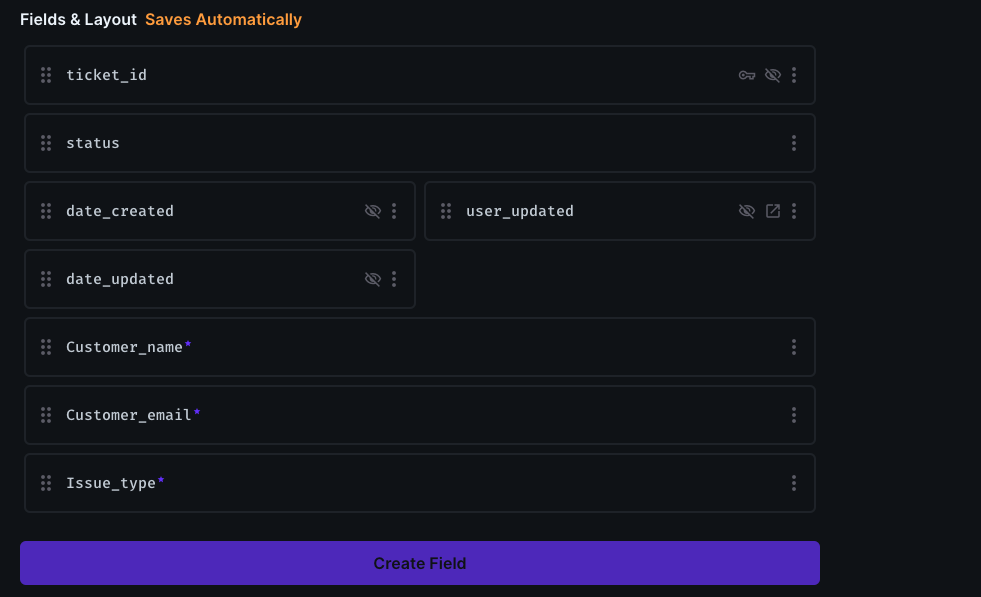
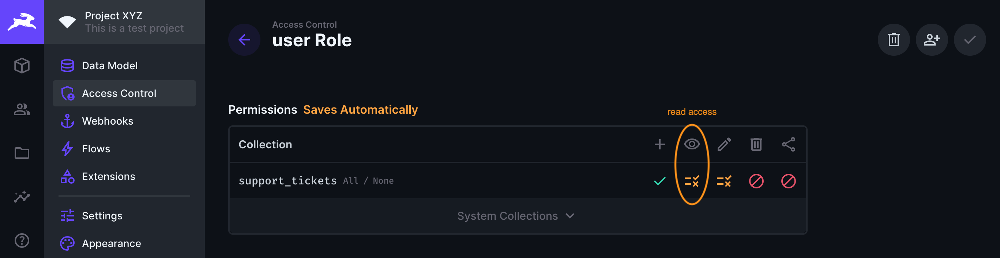
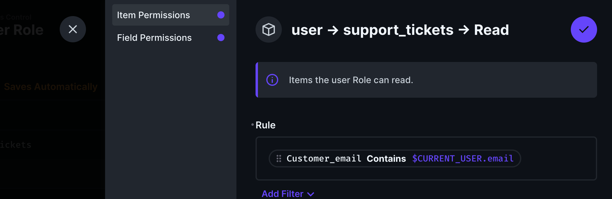
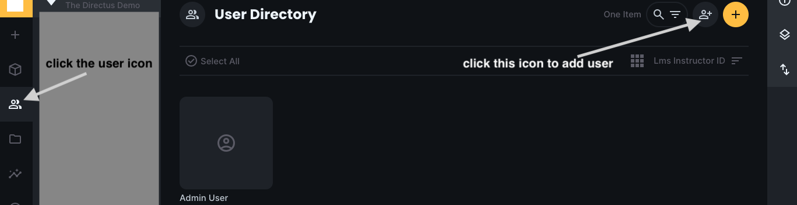
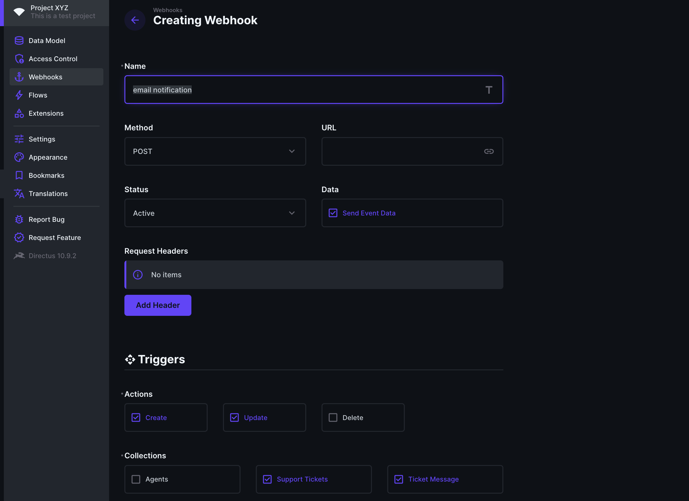

## Introduction

This article will guide you through using [Directus Studio](https://directus.io) to build a support ticket form that allows customers to submit their queries or issues on your product offerings.

## You will need

<!-- ## Your Sections Here -->

- A Directus project. Follow the [Quickstart guide](https://docs.directus.io/getting-started/quickstart) to create one.

Log into your Directus account to set up the different collections of your support system, which revolves around three key components:

- Support Tickets: These is the main records where customer issues are logged and tracked through various stages from opening to resolution.

- Agents: Support agents are assigned to tickets to manage responses and updates, ensuring each ticket is handled efficiently.

- Ticket Messages: This feature facilitates communication between customers and agents directly within the ticket, allowing for a smooth issue resolve.

Each component plays an important role in the workflow, enabling both customers and agents to interact effectively within the system.

The next section explains the setup of each collection and the configuration of roles and permissions, ensuring a comprehensive support system.

## Create the Agent Collection

The support agent collection is useful for managing a dedicated support team. Create an `agents` collection and add the following fields:

- `agent-id`, primary key, type: UID.
- `assigned` many-to-one to `directus_users` (id)

This collection does not require any specific access control settings as only project admins should be able to create agents.

## Create the Support Ticket Collection

The support ticket collection is useful for managing the support request from customers. Create a `support_ticket` collection and add the following fields:

- `ticket-id`, primary key, type: integer (auto-incrementing integer).
- `customer_name`, type: text.
- `customer_email`, type: text.
- `issue_type`, type: dropdown, options: Billing, Technical Issue, General Inquiry.
- `status`, type: dropdown, options: Open, In Progress, Resolved.
- `date_created` type: datetime.
- `date_updated` type: datetime.
- `user_updated` many-to-one to `directus_users` (id)
- `message` type: textarea
- `assigned_to` many-to-one to `agent collection` (agent_id)

```
:::hint

After giving your collection a name, the next page allow you to select some fields such as `status`, `created on`, `updated on`, and `updated by`.

:::
```

**:bulb: Note**:
Make sure to check the "required" option for critical fields like customer_email and issue_type to prevent incomplete submissions.



## Create the Ticket_message Collection

The support ticket collection is useful for managing the support request from customers. Create a `support_ticket` collection and add the following fields:

The message collection is useful for follow-up messages between an assigned support agent and the customer. Create a `ticket_message` collection and add the following fields:

- `message-id`, primary key, type: UID.
- `date_created` type: datetime.
- `date_updated` type: datetime.
- `user_created` many-to-one to `directus_users` (id)
- `user_updated` many-to-one to `directus_users` (id)
- `message` type: textarea
- `relationship` many-to-one to `support_tickets` (ticket_id)

> Following all the above listed steps, you will have three collections by now. The collection for the ticket_submission, agents, and ticket message. All linked together.

## Implementing the communication flow

This section highlight the communication flow of your support ticket system between customers and support agents:

**For Customers:**

- Customers submit tickets through a Directus form, detailing their issue or inquiry.
- They can view the status of their submitted tickets.
- Access to a direct message with the support agent handling their case.

**For Support Agents:**

- Agents can view incoming tickets assigned to them.
- They update ticket statuses (e.g., from Open to In Progress to Resolved) and communicate directly with customers through the ticket's messaging system.

**For Admin:**

- Admin can view incoming tickets and assign the ticket to an available agent (sales, support) to act on them.
- Admin can update ticket statuses (e.g., from Open to In Progress to Resolved) and communicate directly with customers through the ticket's messaging system.

## Configuring Roles and Permissions

Directus’s flexibility in permissions allows you to control access precisely:


1. **Navigate to Roles & Permissions** in Directus Studio and create two new roles named `Customer`, `Agent`. Agents will be assigned to review and treat tickets.
2. **Set Permissions for the `Customer` Role:** Allow `read` and `create` access to the `support_tickets` collection. It's crucial to restrict `read` access to only their tickets, ensuring privacy and security.
   
3. **Set Permissions for the `Agent` Role:** Allow `read` and `update` access to the `support_tickets` assigned to them. Also, grant a full `create`, `read`, and `update` role to the Agent on the `ticket_message` collection.


```
:::Rule Setting

Directus allows you to apply filters to permissions. To ensure users can only see their own tickets, you'll apply a filter on the Read permission. According to the image above, you'll allow the user to see only the tickets they created. You need to choose the field that links the ticket to the user. This is often a user ID or user email field in the ticket collection that references the user who submitted the ticket. This same goes to the permission set on the Agent role as well. You can read more about user fileds on the [documentation](https://docs.directus.io/reference/system/users.html).

> Test this setting with a test account before going live.

:::
```

## Inviting Customers to Use the Form

To allow customers to submit tickets, you must add them to Directus and assign them the `Customer`/`User` role based on what the configuration is:

1. Add Users in Directus Studio: Go to the Users section and invite customers via email.
   
2. **Assign Roles:** Ensure each customer user is assigned the `Customer` role to access and submit the support ticket form.

## Basic System Walkthrough

### Admin

1. The admin logs into the Directus platform and navigates to the available support tickets.
2. Admin can assign the ticket to an agent or resolve the ticket's issue.
3. The admin can also add a message to an open ticket as well close the ticket if it is resolved.


### Customer

1. The customer logs into the Directus platform and navigates to the support ticket form.
2. They fill out the form with their details and issue description and submit the ticket.
3. The customer can then go to their ticket overview page to see the status of their ticket and any messages from support agents.


### Support Agents

1. The support agent views a dashboard of all tickets, filtered by their current status.
2. Upon selecting a ticket, the agent can see all details provided by the customer and start a conversation through the messaging system within the ticket.
3. As they work on resolving the ticket, the agent updates the ticket's status and, once resolved, adds a resolution summary for the customer to view.


## Setting up Notifications for new Messages

Webhooks in Directus are used to automate actions outside of Directus itself, such as sending notifications. When configured, Directus will send an HTTP POST request to a specified URL (your server endpoint) every time a defined event occurs, such as the creation of a `new ticket` or a `new message`.

1. To setup the webhook, navigate to to the `Settings` menu.
2. In the settings, select the Webhooks option.
3. Click on `+ Add Webhook`.
4. Give your hook a name, 'email notification'.
5. Method should be set to `POST`.
6. Enter the URL where Directus should send the webhook POST request
6. click `create` and `update` under the Actions menu.
7. click`Support Tickets` and `Ticket Message` under the collection menu



Set up your mailing service, link it with Directus. 

## Best Practices

An effective support ticket system is an evolving tool. Regular reviews of customer feedback and ticket resolution times can highlight areas for improvement. Adjusting the ticket schema, roles, and communication flow based on this analysis ensures that the system remains efficient and responsive to customer needs.

## Summary

In this article, you have been able to create a customized support ticket system that streamlines the process of managing customer inquiries and issues for your business. This guide has outlined a specific approach to setting up such a system, emphasizing a clear communication flow and practical implementation for both customers and support agents. With Directus, you have the flexibility to tailor this system to fit your business's unique needs, enhancing your ability to provide excellent customer support.