---

title: 'Deploy to Digital Ocean Apps'

description: 'Launch Directus on DigitalOcean App Platform: Easy, fast deployment for efficient data management in the cloud'

author_name: 'Matthew Ruffino'

avatar_file_name: '1676510086127.jpg'

---

  

## Introduction

Directus has quickly become an integral part of my life. My quest for the best backend evolved into a passion-filled journey, introducing Directus to everyone I know and integrating it into as many projects as possible.

Today, I'm thrilled to guide you through deploying Directus on the Digital Ocean App Platform quickly. With DO Apps, you can generate a fresh Directus build, complete with any desired extensions, by merely adjusting the included Dockerfile. 

You might wonder, "Why should I opt for the DO App Platform?" The answer lies in its seamless management. There's no underlying infrastructure to fuss about, and it auto-scales to maintain smooth backend operations, making it ideal for both quick development and full-fledged production.

  

## Before You Start
Determine whether you're deploying for development or production, as it affects app and database configurations.

For a development environment, you don't require a redis server or managed database. You can add a development database during setup, which you can later upgrade. Redis is only necessary for clustered dev environments.

For production deployment (our focus in this guide), you'll need a managed database and a Redis droplet.

Moreover, fork my [repository](https://github.com/BlackDahlia313/directus-docker-do) that provides a customizable Dockerfile.

- ### Create Managed DB

	First create a managed Postgres DB. This is as easy as going to the [Databases](https://cloud.digitalocean.com/databases) page and following the steps. If you already have a database, you can skip this step.

- ### Create Redis Droplet
	You will need to create a redis droplet to keep synchronization across your different containers. 

	You can easily create a redis droplet by following these steps [here](https://www.digitalocean.com/community/tutorials/how-to-install-and-secure-redis-on-ubuntu-20-04). If you already have an external redis server, you can use that too.

	##### Note: This will get easier over time as Directus has made big changes to redis support recently and is expected to support clustered redis soon which is what the managed redis from DO uses.

- ### Create a Spaces Object Storage
	File uploads are not persistant unless you have an external volume. With apps platform, that would be using the Spaces Object Storage which works very similiarly to S3. You can setup storage by visiting this [here](https://cloud.digitalocean.com/spaces).

## Create The App
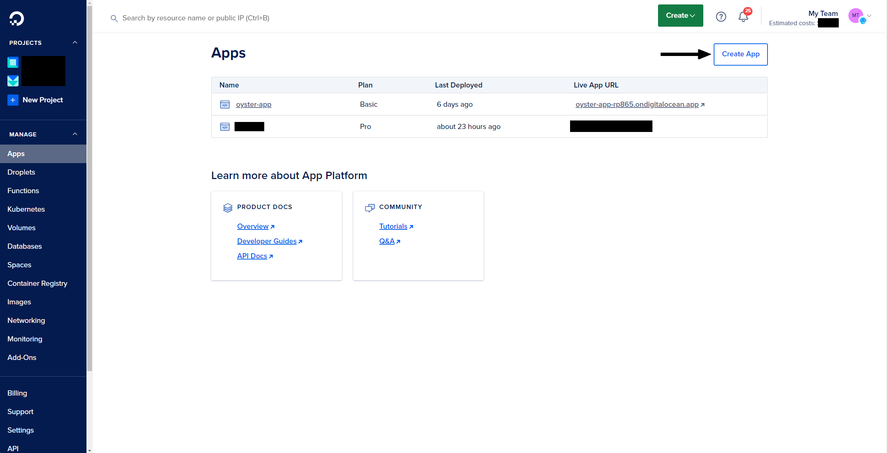
Head over to the apps section and click on "Create App". This is where your adventure begins.

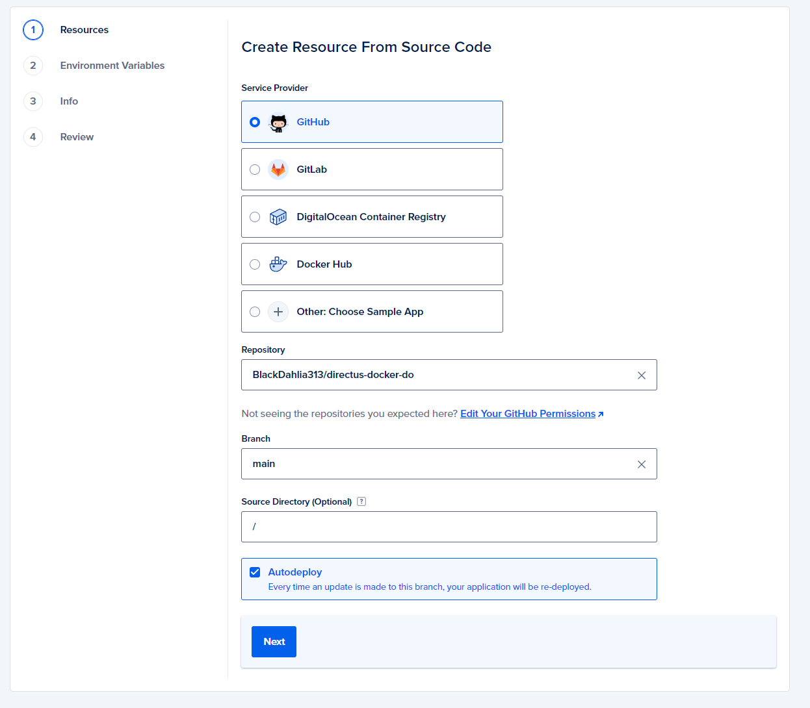
On this page you will need to select the repo that you [forked over](https://github.com/BlackDahlia313/directus-docker-do) earlier. Go ahead and connect your account to github and you will be able to see your repo.

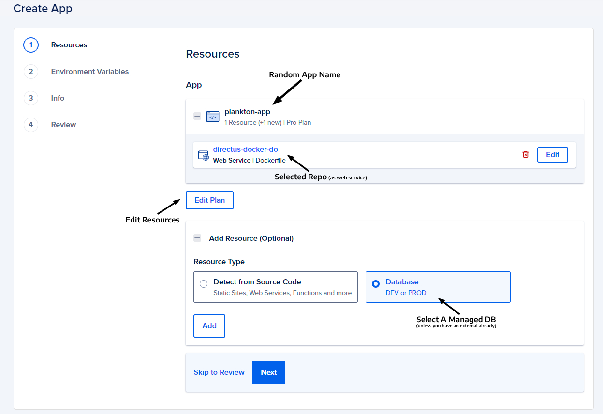
You when you reach this page you will see a random generated name for your app. Below it, you will see the directus-docker-do or whatever you have decided to name the repo you forked earlier. This will be declared as a webservice, which is what we want for Directus.

You will also be able to edit the plan for your app (how many containers and how powerful) and also to attach a managed DO database.

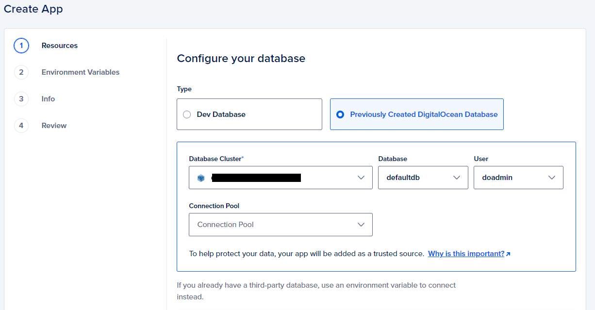
First let's select the managed database you created. While you don't have to "attach" your managed db to the app, it's a best practice as you don't have to worry about any firewall/allow list settings. You can also view the system resources from the same panel. Select your cluster, database and user here.

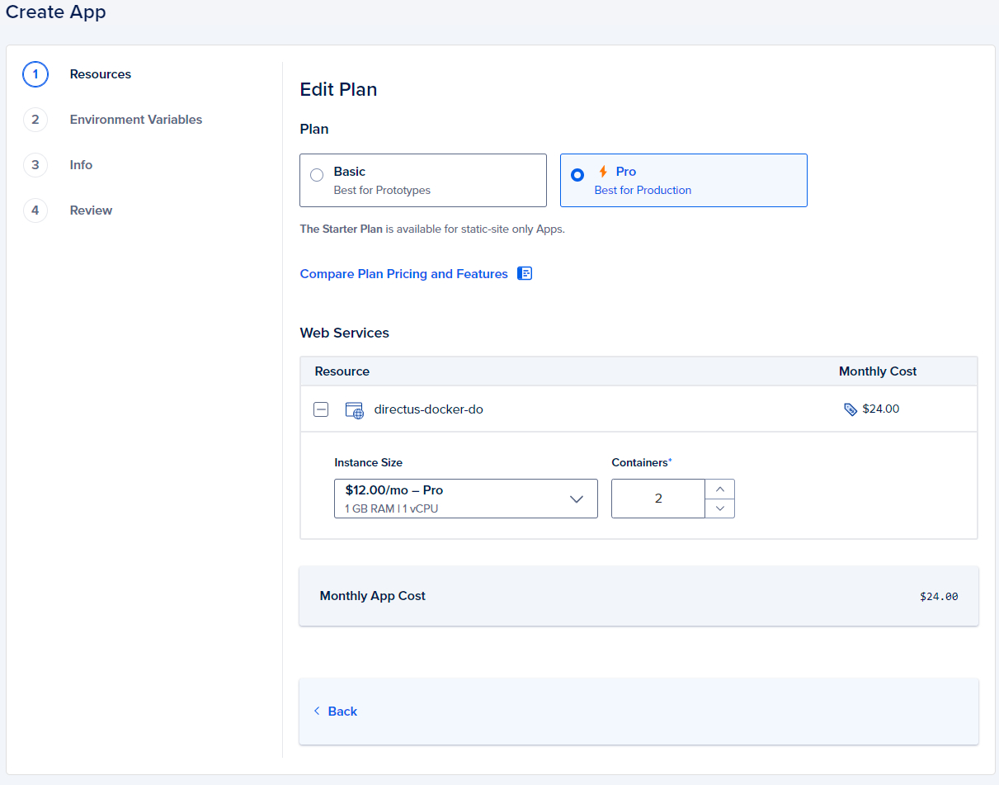
This is where you can define what resources you want to have as a base layer for your backend. If you have 2 or more containers, than redis is required. You can have as many containers are you like. 

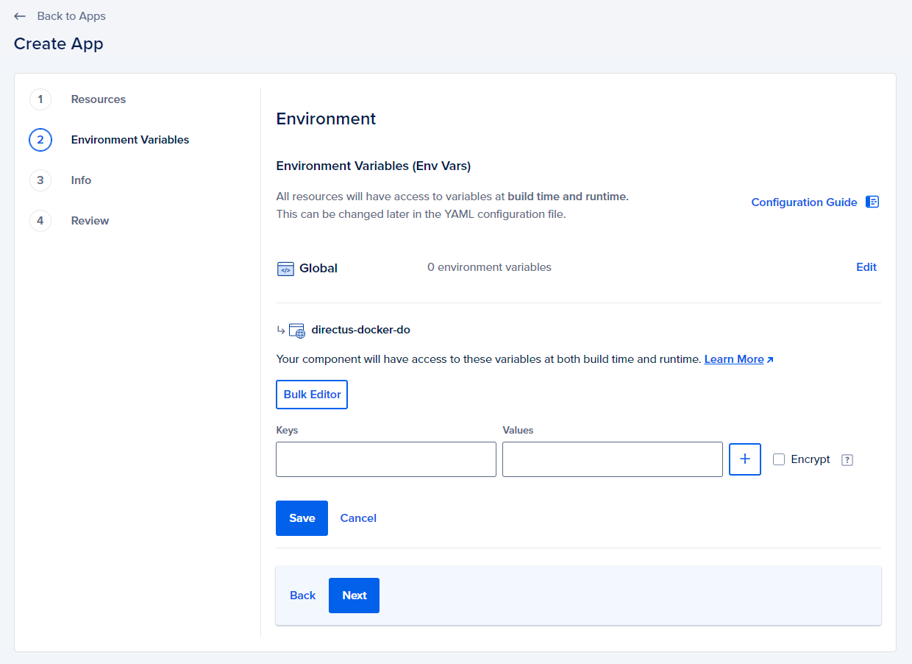
This is where you can insert all the [environment variables](https://docs.directus.io/self-hosted/config-options.html) for Directus. There is a lot to  choose from, but the below should be enough to get your started. Make sure to fill everything out as needed. Using the bulk-editor is a much easier process, and you can edit these variables or add new ones at anytime. 

    KEY=enterakey
    SECRET=enterasecret
    DB_CLIENT=pg
    DB_HOST=dbhost
    DB_PORT=25060
    DB_DATABASE=your_db
    DB_USER=doadmin
    DB_PASSWORD=dbpass
    DB_SSL__CA=""
    STORAGE_LOCATIONS=digitalocean
	STORAGE_DIGITALOCEAN_DRIVER=s3
	STORAGE_DIGITALOCEAN_KEY="yourstoragekey"
	STORAGE_DIGITALOCEAN_SECRET="yoursecret"
	STORAGE_DIGITALOCEAN_ENDPOINT="endpointurl"
	STORAGE_DIGITALOCEAN_BUCKET="bucketname"
	STORAGE_DIGITALOCEAN_REGION="selectedregion"
	REDIS_HOST="hostip"
	REDIS_PORT=6379
	REDIS_PASSWORD="redis-password"
	CACHE_ENABLED=true
	CACHE_STORE=redis
	CACHE_AUTO_PURGE=true
	MESSENGER_STORE=redis
	SYNCHRONIZATION_STORE=redis
    PUBLIC_URL=${APP_URL}
    ADMIN_EMAIL=youradmin@mail.com
    ADMIN_PASSWORD=myfirstadminpassword

For your KEY & SECRET you can generate one easily here: [generate-secret.vercel.app/32](https://generate-secret.vercel.app/32)
For your DB connection settings, you can either use DO's built-in variables or define your own. To learn more about which ones you can use with DO, you can find that [here](https://docs.digitalocean.com/products/app-platform/how-to/use-environment-variables/). You will also need to include the CA cert which can be found with the database connection settings.

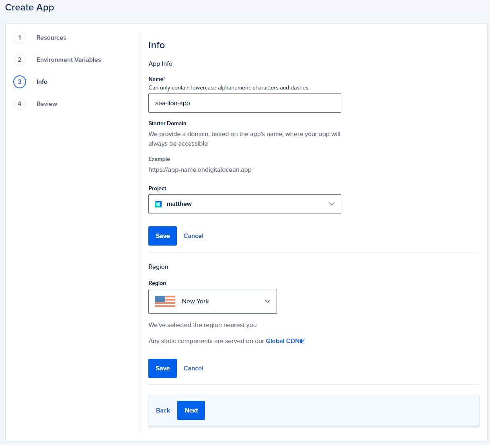
Now you can define the name of your app and if you want to include it into a DO project. (a DO project is an easy way to keep multiple resources tagged together)

Next it will you show a quick review of all everything we have configured. Go ahead and click on Create App. This will now start the build and deployment.

## Deployment
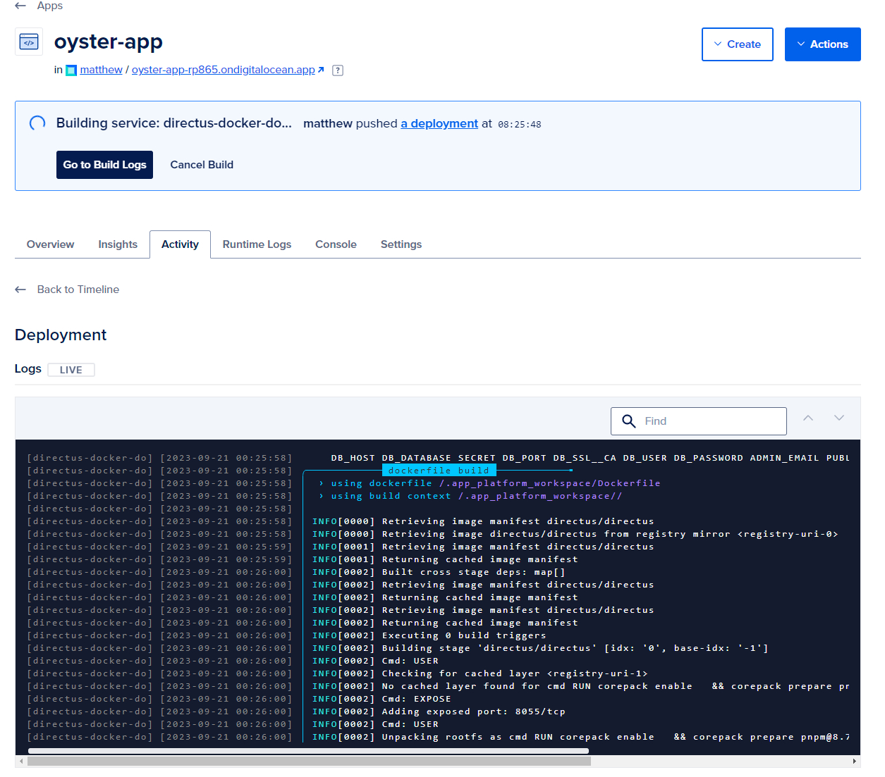
Now all you need to do is sit back and wait while your custom Directus app is built and deployed. DO will cache your newly built image so it can be used to create new container during any auto-scaling. 

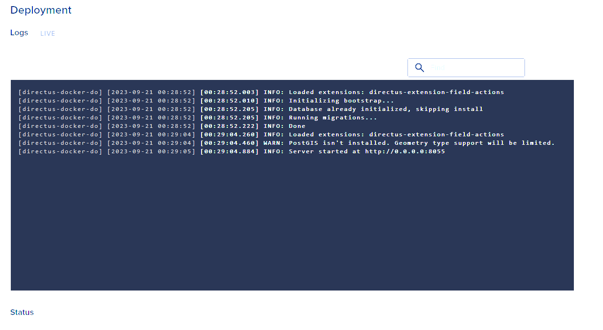
After the build is complete, you should see the deployment begin. This will start Directus and runs it's bootstrap process and test that the backend is operational. If all goes well you will be greeted with a successful deployment.

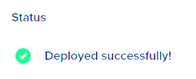

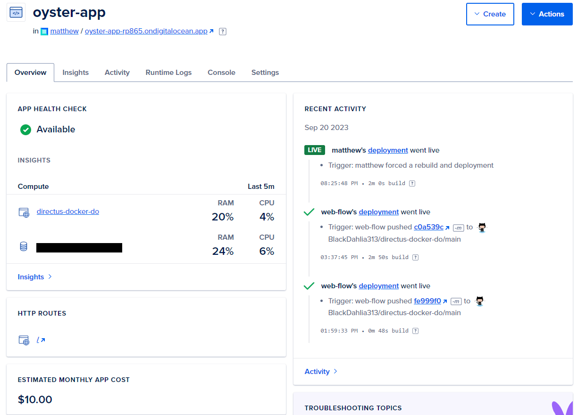
This is now your app dashboard. You can see the health of your app. You can see recent deployments, force new ones and more. You will also see your generated app url. If you want to add a new url, all you need to do is go to the settings tab and add it there. SSL is taken care of for you!
<!-- ## Your Sections Here -->

  

## Summary
This guide offers a swift walkthrough for deploying Directus on DO App. If you're familiar with Digital Ocean's products, its App Platform is an excellent backend hosting choice, complemented by the platform's robust features.

Key takeaways:

 - Modifying Environment Variables or the Dockerfile triggers immediate rebuilds and deployments.
 - Deployments are seamless, with zero downtime. Failed builds revert to the last successful version.
 - With Storage and Managed DB, your data remains secure, even if you halt the app for future migration.

For queries or assistance, find me on the Directus Discord. I'm here to help! 

-onelove
