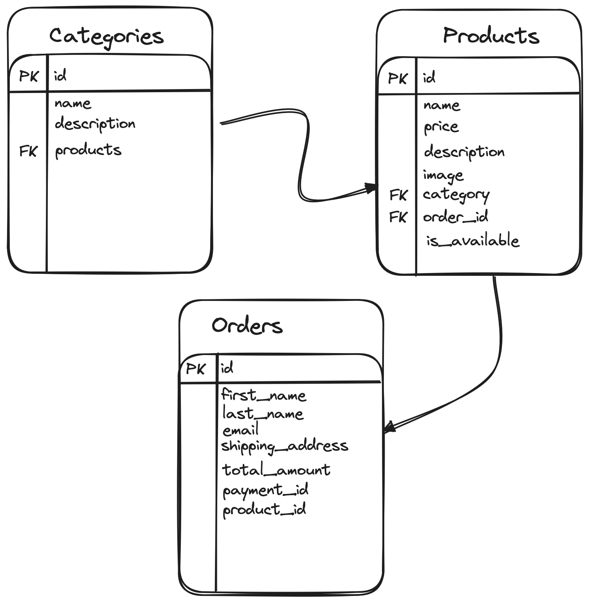
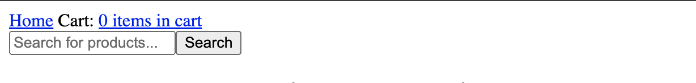
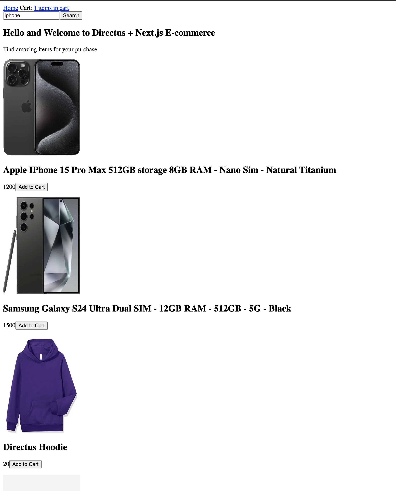
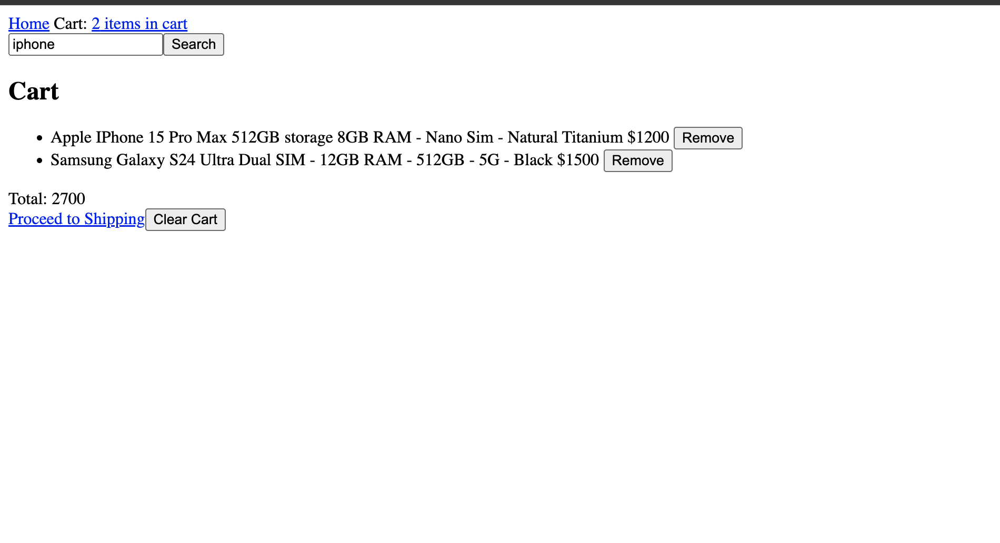
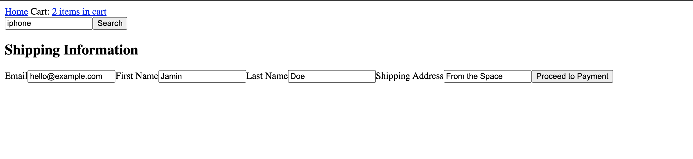
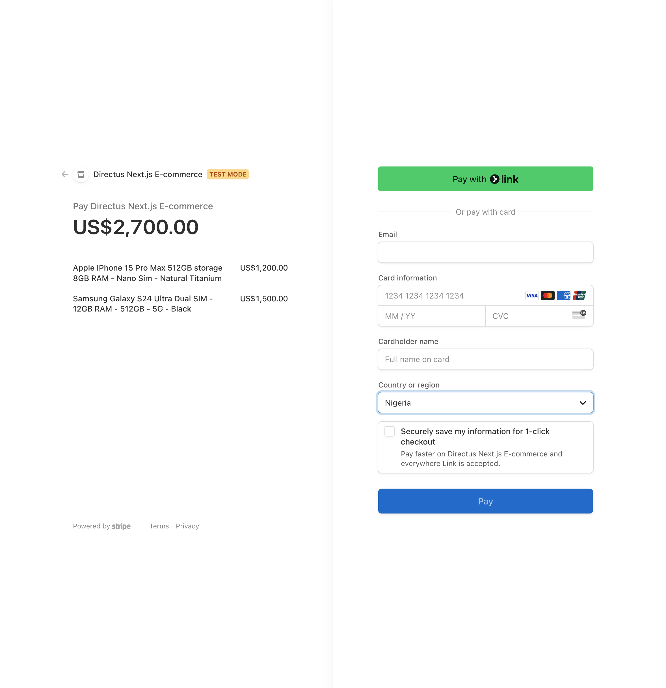
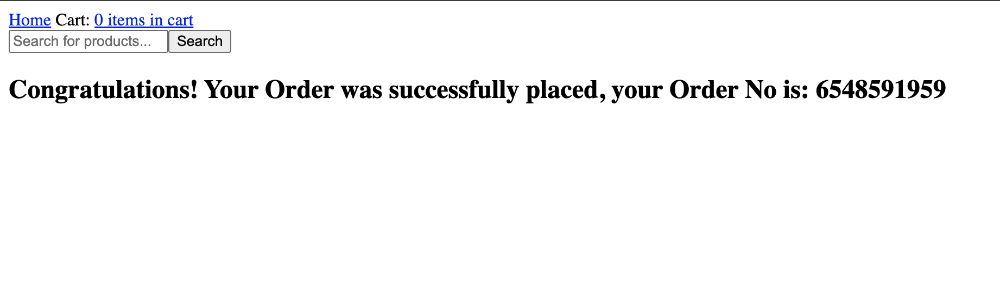
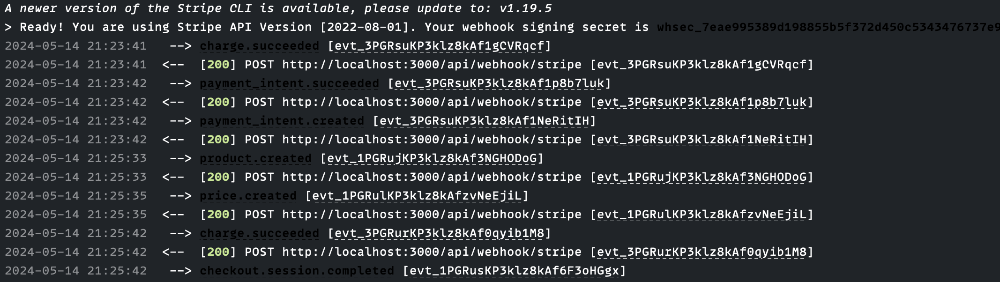

## Introduction

## Before You Start

You will need:

- [Node.js](https://nodejs.org/en) installed and a code editor on your computer.
- A Directus project - you can use [Directus Cloud](https://directus.cloud/) or [run it yourself](https://docs.directus.io/self-hosted/quickstart).
- A [Stripe](https://stripe.com/) account with a business already set up
- [Stripe CLI](https://docs.stripe.com/stripe-cli) installed in your computer
- Some knowledge of TypeScript and React.

<!-- ## Your Sections Here -->
## Set Up Directus

### Data Model Relationships

Before setting up Directus, let's understand how the different data models you will set up in Directus are related. You need 3 data collections - `categories`, `products`, `orders`.



- `categories` are the different categories of products available on the store and can have  multiple `products`.
- `products` are the different products on the store. A product can only be of one `category` and can be ordered from `orders`.
- `orders` are all the orders made by customers from the application's frontend after successfully making a payment.

In your Directus project, head to Settings -> Data Model to create these data models with the following fields:

1. `categories`:

   - `id`: the primary field of this collection
   - `name`: A string field for naming categories
   - `description`: A string field for describing the category type

2. `products`:
   - `id`: the primary field of this collection
   - `is_available`: A toggle field for a product that indicates if the product is available for purchasing.
   - `name`: A string input field for the product name.
   - `price`: A string input field for the price of a product.
   - `image`: An image field for product image.
   - `description`: A string field for description of the product.
   - `category`: A Many to One relational field related to the `categories` collection, signifying that multiple products can only have a single category type.
   - `order_id`: A Many to One relational field related to the `orders` collection, signifying that multiple products can belong to a single order.

3. `orders`:
   - `id`: the primary field of this collection
   - `order_no`: A string input field, uniquely generated to identify an order.
   - `first_name`: A string input for first name.
   - `last_name`: A string input for last name.
   - `shipping_address`: A string input for address to ship the order to.
   - `email`: A string input for email address
   - `payment_id`:  A string input for the order payment that happened on Stripe.
   - `total_amount`: A string input for the total cost of the order
   - `products`: A One to Many relational field that is related to the `products` collection, signifying that an order can have multiple products.

   Create some items in the Categories and Products collections - [here's some sample data.]()

## Set Up a Next.js Application

Run the following command to initialize a Next.js project:

```bash
npx create-next-app@14 e-com-directus
```

Install the Directus SDK and Stripe :

```bash
npm i @directus/sdk @stripe/stripe-js stripe
```

### Set Up Directus SDK and Types

Open the `e-com-directus` project in a text editor and create a `.env.local` file, being sure to place the value with your Directus project URL:

```bash
DIRECTUS_URL=YOUR_DIRECTUS_URL
APP_URL=http://localhost:3000
```

Create a new directory called `types` and inside of it, create an  `index.ts` file with the content:

```ts
export type ProductTypes = {
  id: number;
  name: string;
  image: string;
  price: number;
  description: string;
  category: CategoryTypes[]
  is_available: boolean;
  order_id: OrderTypes
};
export type CategoryTypes = {
  name: string;
  description: string
}
 export type OrderTypes = {
  order_no: string;
  email: string;
  date: string;
  total_amount: string;
  first_name: string;
  last_name: string;
  shipping_address: string;
  products: number[];
  payment_id: string;
 };
```

Next, create a new directory called `lib`. Inside it, create `directus.ts` to initialize a new Directus SDK instance:

```ts
import { createDirectus, rest } from "@directus/sdk";
import { CategoryTypes, OrderTypes, ProductTypes } from "@/types"


type Schema = {
  products: ProductTypes[];
  categories: CategoryTypes[];
  orders: OrderTypes[];
};

const directus = createDirectus<Schema>(
  process.env.DIRECTUS_URL as string
).with(rest());

export default directus;
```

### Create Directus API Actions

In the `lib` directory, create a new file called `apis.ts`. This file will contain all the API requests the Next.js application will make to Directus.

Add a `getAllProducts` function to `lib/apis.ts`:

```tsx
import directus from "./directus";
import { readItems, createItem, updateItems } from "@directus/sdk";
import { OrderTypes } from "@/types";

export const getAllProducts = async () => {
  try {
    const results = await directus.request(
      readItems("products", {
        filter: {
          is_available: {
            _eq: true,
          }
        }
      })
    );
    return results;
  }
  catch (error) {
    console.error("Error fetching products:", error);
    console.log(error);
  }
};
```

This function fetches all the products on the store that are available for purchase.

Next, create another function for implementing search functionality called `searchProducts`:

```tsx
export const searchProducts = async (query: string) => {
  try {
    const results = await directus.request(
      readItems("products", {
        search: query,
        filter: {
          is_available: {
            _eq: true,
          }
        }
      })
    );
    return results;
  } catch (error) {
    console.error("Error searching for products:", error);
    console.log(error);
  }
};
```

This function searches through the `products` collection in Directus and returns the product(s) that matches the query and is available for purchase.

Next, add a function called `createOrder` with the content:

```tsx
export async function createOrder(orderData: OrderTypes) {
  try {
    const results = await directus.request(
      createItem("orders", { ...orderData })
    );
    console.log(results);
    await directus.request(updateItems("products", orderData.products, { is_available: false }))
    return `Order created successfully, Your order No is:  + ${results.order_no}`;

  } catch (error) {
    console.error("Error creating order:", error);
    console.log(error);
  }
}
```

This function performs two actions:

- Sends a request to the `orders` collection in Directus to create a new order.
- When that request is successful, it sends another request to update the `products` collection to mark the item(s) as paid.

## Set up a Shopping Cart for Next.js

### Create a Cart Context

A typical e-commerce store usually has a cart for customers to add items they want to purchase into before checking out, let's implement a simple cart functionality using `React-Context`

In the `app` directory, create a directory called `context`, inside of it, create a file named `cart-context.tsx` with the content:

```tsx
"use client";

import { createContext, useState, useEffect } from 'react'

export const CartContext = createContext<CartContextType>({cartItems: [], addToCart: () => {}, removeFromCart: () => {}, clearCart: () => {}, getCartTotal: () => 0})

type CartContextType = {
  cartItems: CartItem[];
  addToCart: (item: CartItem) => void;
  removeFromCart: (item: CartItem) => void;
  clearCart: () => void;
  getCartTotal: () => number;
};

type CartProviderProps = {
  children: React.ReactNode;
}

type CartItem = {
  id: number;
  name: string;
  image: string;
  price: number;
};


export function CartProvider({ children }: CartProviderProps) {
  
  const [cartItems, setCartItems] = useState<CartItem[]>(() => {
      const storedCartItems = localStorage.getItem('cartItems');
      return storedCartItems ? JSON.parse(storedCartItems) : [];
  });

  const addToCart = (item: CartItem) => {
    const isItemInCart = cartItems.find((cartItem) => cartItem.id === item.id);

    if (!isItemInCart) {
      setCartItems([...cartItems, { ...item }]);
    }
  };

  const removeFromCart = (item: CartItem) => {
      setCartItems(cartItems.filter((cartItem) => cartItem.id !== item.id));
  };

  const clearCart = () => {
    setCartItems([]);
  };

  const getCartTotal = () => {
    return cartItems.reduce((total, item) => total + Number(item.price), 0);
  };

  useEffect(() => {
    if (typeof window !== 'undefined') {
      const data = localStorage.getItem('cartItems');
      if (data) {
        setCartItems(JSON.parse(data));
      }
    }
  }, []);

  useEffect(() => {
    if (typeof window !== 'undefined') {
      localStorage.setItem('cartItems', JSON.stringify(cartItems));
    }
  }, [cartItems]);


  return (
    <CartContext.Provider
    value={{
      cartItems,
      addToCart,
      removeFromCart,
      clearCart,
      getCartTotal,
    }}>
      {children}
    </CartContext.Provider>
  );

};
```

Let's break down the `cart-context` component for better understanding:

- `CartContext` uses React's `createContext` API to create a new context and `useState` for storing items into the `cartItem` array.
- Use `localStorage` for storing `cartItems` for persistance
- Creates a `CartProvider` component from which the context can be passed from to other components
- `addToCart` adds an item to the shopping cart if it's not already there.
- `removeFromCart` removes an item from the shopping cart.
- `clearCart`  clears all items from the shopping cart.
- `getCartTotal` calculates the total price of all items in the shopping cart.

To use the `CartProvider`, update the `layout.tsx` in the `app` directory with the content:

```tsx
import type { Metadata } from "next";
import { CartProvider } from "./context/cart-context";


export const metadata: Metadata = {
  title: "Create Next App",
  description: "Generated by create next app",
};

export default function RootLayout({
  children,
}: Readonly<{
  children: React.ReactNode;
}>) {
  return (
    <CartProvider>
      <html lang="en">
        <body>
          <main>
            {children}
          </main>
        </body>
      </html>
    </CartProvider>
  );
}

```

This will wrap the whole application with the `CartProvider` ensuring you can retrieve values and actions from the cart when you need

### Create a NavBar With Cart

In the root directory of your project, create a `components` directory and create a `nav-bar.tsx` file with the content:

```tsx
"use client";

import { CartContext } from "@/app/context/cart-context";
import { useContext, useEffect, useState } from "react";
import Link from 'next/link'

export default function NavBar() {
  const [isClient, setIsClient] = useState(false)


  const cart = useContext(CartContext);
  useEffect(() => {
    setIsClient(true)
  }, [])
   return isClient &&  (
    <nav>
      <div>

        <span><Link href="/">Home</Link></span>
        <span>  Cart: <Link href="/checkout/cart"> {cart.cartItems.length} items in cart</Link></span>
      </div>
    </nav>
  );
}
```

The `NavBar` component, first uses the `CartContext` created earlier to retrieves `cartItems` and then checks if the component is rendered on the client side and renders the  Navbar with the cart.

## Implement The Search Functionality

An important feature of every e-commerce store is to be able to search for items a customer needs, the Directus search parameter enables you to implement this feature seamlessly.

### Create a Search Form

In the  `components/nav-bar.tsx` file, update the `NavBar` component to be:

```tsx
"use client";

import { CartContext } from "@/app/context/cart-context";
import { useRouter, useSearchParams } from "next/navigation";
import { useContext, useEffect, useState } from "react";
import Link from 'next/link'

export default function NavBar() {
  const router = useRouter();
  const searchParams = useSearchParams()
  const [isClient, setIsClient] = useState(false)

  const handleSubmit = (event: React.FormEvent<HTMLFormElement>) => {
    event.preventDefault();
    const formData = new FormData(event.currentTarget);
    const searchQuery = formData.get("search") as string;
    router.push(`/search?query=${searchQuery}`)

  };

  const cart = useContext(CartContext);
  useEffect(() => {
    setIsClient(true)
  }, [])
   return isClient &&  (
    <div>
      <div>

        <span><Link href="/">Home</Link></span>
        <span>  Cart: <Link href="/checkout/cart"> {cart.cartItems.length} items in cart</Link></span>
      </div>
      <form onSubmit={handleSubmit}>
      <input
        type="text"
        placeholder="Search for products..."
        name="search"
        defaultValue={searchParams.get('query') || ''}
      />
      <button type="submit">Search</button>
      </form>
    </div>
  );
}
```

The code above updates the `NavBar` component with a search form and a `handleSubmit` function to handle the form submission that redirects users to the search page after submission.

In the `app/layout.tsx` file, update the rendered component with the `NavBar`

```tsx
...
<main>
<NavBar />
  {children}
</main>
...
```



### Create The Product Components

In the `components` directory, create a file called `product-item.tsx` with the content:

```tsx
"use client";
import { CartContext } from "@/app/context/cart-context";
import { ProductTypes } from "@/types";
import Image from "next/image";
import { useContext } from "react";

export default function ProductItem({
  id,
  name,
  image,
  price,
}: ProductTypes) {
  const cart = useContext(CartContext);
  const imageUrl = `http://localhost:8055/assets/${image}`;
  return (
    <div>
      <Image
        src={imageUrl}
        width={200}
        height={250}
        alt={name}
      />
      <h2>{name}</h2>
      <p>
        {price}
        <button onClick={() => cart.addToCart({id, name, price, image: imageUrl})}>Add to Cart</button>
      </p>
    </div>
  );
}
```

The above code displays the `image`, `name` and `price` of a product and also adds a `addToCart` button that uses the `CartContext` to add items to the cart.

Next, in the `components` directory, create a list component `product-list.tsx` that lists all the products using the `ProductItem` components:

```tsx
import ProductItem from "./product-item";
import { ProductTypes } from "@/types";

type ProductListProps = {
  products: ProductTypes[];
};
export default function ProductList({ products }: ProductListProps) {
  return (
    <div>
      {
        products.length > 0 ? products.map((product) => (
         <ProductItem {...product} key={product.id}  />
        )) : "No products found."
      }
    </div>
  );
}
```

### Create a Search Result Page

In the `app` directory, create a new directory called `search` and create a `page.tsx` file inside it with the content:

```tsx
import ProductList from "@/components/product-list";
import { searchProducts } from "@/lib/apis";
export default async function Search({
  searchParams,
}: {
  searchParams?: { [key: string]: string | string[] | undefined };
}) {
  const { query } = searchParams as { [key: string]: string };
  const products =  await searchProducts(query) || [];


  return (
    <section>
      <h1>Search Page For Products</h1>
      <p>Showing results for {query}</p>
      <ProductList products={products} />
    </section>
  );
}
```

The component above uses the `searchProducts` function to search for products from Directus and passes them as props to `ProductList` to display.


## Display all Products from The Store

In the `app/page.tsx` file, update the content to be:

```tsx
import ProductList from "@/components/product-list";
import { getAllProducts } from "@/lib/apis";

export default async function Home() {
  const products =  await getAllProducts() || [];
  return (
    <section>
      <h1>Hello and Welcome to Directus + Next.js E-commerce</h1>
      <p>Find amazing items for your purchase</p>
        <ProductList products={products} />
      </section>
  );
}
```

Using the `getAllProducts` function this component will get all available products and display them on the homepage.



## Show Items in the Cart

In the `app` directory, create a `checkout` directory and inside of it create a `cart` directory with `page.tsx` and update its content:

`app/checkout/cart/page.tsx`

```tsx
"use client";

import { CartContext } from "@/app/context/cart-context";
import Link from "next/link";
import { useContext } from "react";

export default function CheckoutCartPage() {
  const cart = useContext(CartContext);
  return (
    <section>
      <div>
        <h2>Cart</h2>
        <ul>
          {cart.cartItems.map((cartItem) => (
            <li key={cartItem.id}>
              <div>
                <span>{cartItem.name}</span>
                <span> ${cartItem.price} </span>
                <button onClick={() => cart.removeFromCart(cartItem)}>
                  {" "}
                  Remove
                </button>
              </div>
            </li>
          ))}
        </ul>
        {cart.cartItems.length > 0 ? (
          <div>
            <div>Total: {cart.getCartTotal()}</div>
            <Link href="/checkout/shipping">Proceed to Shipping</Link>
            <button onClick={() => cart.clearCart()}>Clear Cart</button>
          </div>
        ) : (
          <p>Your cart is empty</p>
        )}
      </div>
    </section>
  );
}
```

This page displays all the items in the cart, a link to the next step of the checkout and also displays a `clearCart` button to remove all items from the cart.



## Set up Stripe for Receiving Payments
In the root of your project, create a `utils` directory with a `generateOrderNum.ts` file with the content:

```ts
export default function generateOrderNum() {
  const length = 10
  let result = '';
  const characters = '0123456789';
  const charactersLength = characters.length;
  for (let i = 0; i < length; i++) {
    result += characters.charAt(Math.floor(Math.random() * charactersLength));
  }
  console.log(result)
  return result;
}
generateOrderNum();
```

Next, update your `.env.local` file with the publishable and secret keys you can find in your Stripe account:

```bash
NEXT_PUBLIC_STRIPE_PUBLISHABLE_KEY=YOUR_STRIPE_PUBLISHABLE_KEY
STRIPE_SECRET_KEY=YOUR_STRIPE_SECRET_KEY
```

In your `app` directory, create a new directory called `api` and, inside of it, create a directory `stripe-session` with a `route.ts` file (`app/api/stripe-session/route.ts`):

```ts
import { ProductTypes } from "@/types";
import { NextResponse } from "next/server";
import Stripe from "stripe";
import generateOrderNum from "@/utils/generateOrderNum";

const stripe = new Stripe(process.env.STRIPE_SECRET_KEY as string);

type RequestData = {
  first_name: string,
  last_name: string,
  email: string,
  total_amount: number,
  address: string,
  products: ProductTypes[]
  shipping_address: string,
};
export async function POST(req: Request) {
  const {
    first_name,
    last_name,
    email,
    total_amount,
    shipping_address,
    products
  }: RequestData = await req.json();

  const order_no = generateOrderNum();

  const line_items = products.map(product => ({
    quantity: 1,
    price_data: {
      currency: "usd",
      product_data: {
        name: product.name,
        description: product.description,
      },
      unit_amount: product.price * 100, // Stripe expects prices in cents
    },
  }));

  try {
    console.log(order_no)

    const stripeSession = await stripe.checkout.sessions.create({
      line_items,
      mode: "payment",
      success_url: `${process.env.APP_URL}/checkout/success?orderNo=${order_no}`,
      cancel_url: `${process.env.APP_URL}/checkout/shipping`,
      metadata: {
        total_amount: total_amount * 100, // Stripe expects prices in cents
        first_name,
        last_name,
        email,
        date: new Date().toISOString(),
        products: JSON.stringify(products.map(product => (product.id))),
        shipping_address,
        order_no,
      },
    });

    console.log(stripeSession);
    return NextResponse.json({ url: stripeSession.url! });
  } catch (err) {
    console.log({ err });
    return NextResponse.json(
      { message: "An expected error occurred, please try again" },
      { status: 500 }
    );
  }
}
```

The code above:

- Create a Next.js API that expects a request order information to create a new order.
- Create a new Stripe session with the `stripe.checkout.sessions.create` method from the Stripe SDK.
- Add the required data to create payment details for Stripe products, such as a `name`, `description` and `unit_amount`.
- Specify `payment` as the Stripe `mode` of payment.
- Provide a `success_url` and `cancel_url` URL to redirect the user to determine if the payment was successful or cancelled.
- Attach a `metadata` object to save the user details to the stripe payment payload when the payment is initiated.
- Returns the Stripe payment session URL so the user can make the payment if the request is successful.

You will use this API route in the next section of this tutorial.

## Create a Shipping Info Page

With items in the cart, you need to create a checkout page, get shipping details, and pay for the products. To do this, create a new directory in `app/checkout` called `shipping`. Inside of it, create a `form.tsx` (`app/checkout/shipping/form.tsx`):

```tsx
"use client";

import { CartContext } from "@/app/context/cart-context";
import { useContext } from "react";


export default function ShippingForm() {
  const cart = useContext(CartContext);

  const handleSubmit = async (e: React.FormEvent<HTMLFormElement>) => {
    e.preventDefault();
    const formData = new FormData(e.currentTarget);
    const shippingInfo = Object.fromEntries(formData.entries());
    const orderData = {
      email: shippingInfo.email,
      first_name: shippingInfo.firstName,
      last_name: shippingInfo.lastName,
      shipping_address: shippingInfo.shippingAddress,
      total_amount: cart.getCartTotal(),
      products: cart.cartItems,
    };
    try {
      console.log({orderData})
      const response = await fetch("/api/checkout-session", {
        method: "POST",
        body: JSON.stringify(orderData),
      });

      if (response.ok) {
        const payment = await response.json();
        window.location.href = payment.url;
      } else {
        console.error("Error submitting form:", response.statusText);
      }
    } catch (error) {
      console.error("Error:", error);
    }
  }
  return (
    <form onSubmit={handleSubmit}>
      <label>
        Email
        <input type="email" name="email"   />
      </label>
      <label>
        First Name
        <input type="text" name="firstName" />
      </label>
      <label>
        Last Name
        <input type="text" name="lastName" />
      </label>
      <label>
        Shipping Address
        <input type="text" name="shippingAddress" />
      </label>
      <button type="submit">Proceed to Payment</button>
    </form>
  )
}
```

The `ShippingForm` component:

- Loads the Stripe SDK when the component is mounted using the loadStripe function.
- Creates a form that gets the user details such as `firstName`, `lastName`, `email` and `shippingAddress`.
- Gets the selected `products` in the cart and total cost
- Creates a new `orderData` object, combining the items in the cart and the user-filled form data.
- When the form is submitted, it fires up a request to the `/api/stripe-session` route you created in the previous step to trigger a payment from Stripe.
- When the request is successful, it redirects the user to the Stripe payment link returned from the Stripe API route.

To render this form in the same directory, create a new file called `page.tsx` with the content:

```tsx
import ShippingForm from "./form";


export default function ShippingPage() {
  return (
    <section>
      <div>
      <h2>Shipping Information</h2>
        <ShippingForm />
      </div>
    </section>
  );
}
```



Clicking on the `Procced to Payment` button to submit the form will trigger a Stripe payment and take you to a Stripe checkout:



This form will trigger a stripe payment to pay for the selected products.

Next, create a `success` directory in the `app/checkout` directory to create a success page when payment is successfully made.

In the success directory, first create a `message.tsx` component to display the message:

```tsx
"use client";

import { CartContext } from "@/app/context/cart-context";
import { useContext, useEffect } from "react";


export default function SuccessMessage({ orderNo }: { orderNo: string }) {
  const { clearCart } = useContext(CartContext);

  useEffect(() => {
    console.log("Clearing cart");
      clearCart();
    // eslint-disable-next-line react-hooks/exhaustive-deps
  }, []);
  return (
    <section>
      <h1>Congratulations! Your Order was successfully placed, your Order No is: {orderNo}</h1>
    </section>
  );
}
```

The `message.tsx` component displays a success message and clears the cart.

Next, create a `page.tsx` that has the content:

```tsx
"use client"
import { useRouter } from "next/navigation";
import { useEffect, useState } from "react";
import SuccessMessage from "./message";

interface SuccessPageProps {
  searchParams?: { [key: string]: string | string[] | undefined };
}

export default function SuccessPage({ searchParams }: SuccessPageProps) {
  const { orderNo } = searchParams || {};
  const router = useRouter();
  const [isClient, setIsClient] = useState(false)

  useEffect(() => {
    setIsClient(true)
  }, [])

  if (!orderNo) {
    router.push("/checkout");
    return null;
  }
  return isClient &&  (<SuccessMessage orderNo={orderNo as string} /> )
}
```



## Configure A Webhook for Stripe Payment Events

When a Stripe payment is resolved successfully, we want to send Directus a request to create a new order using the `metadata` we stored in the payment request.

To do this, Stripe has a list of events that we can listen to when a payment is triggered. Let's create a webhook in Next.js that can listen to a Stripe event when a payment goes through.

In your `app/api/` directory, create a new directory with a subdirectory called `webhook/stripe`, and inside of this directory, create a `route.ts` for implementing a webhook,

Add the following code to `route.ts`:

```ts
import { NextResponse } from "next/server";
import Stripe from "stripe";
import { createOrder } from "@/lib/apis";

const checkout_session_completed = "checkout.session.completed";
const stripe = new Stripe(process.env.STRIPE_SECRET_KEY as string);

export async function POST(req: Request, res: Response) {
  const reqBody = await req.text();
  const sig = req.headers.get("stripe-signature");
  const webhookSecret = process.env.STRIPE_WEBHOOK_SECRET;

  let event: Stripe.Event;

  try {
    if (!sig || !webhookSecret) return;
    event = stripe.webhooks.constructEvent(reqBody, sig, webhookSecret);
  } catch (error: any) {
    console.log(error);
    return NextResponse.json(
      { message: `Webhook Error: ${error.message}` },
      { status: 500 }
    );
  }

  // load our event
  switch (event.type) {
    case checkout_session_completed:
      const session = event.data.object;
      if (!session.metadata || !session.payment_intent) {
        console.error("Missing metadata or Payment Intent in Stripe session");
        // Optionally return an error response
        return NextResponse.json(
          { message: "Incomplete order data" },
          { status: 400 }
        );
      }

      const {
        // @ts-ignore
        metadata: {
          total_amount,
          first_name,
          last_name,
          shipping_address,
          email,
          products,
          date,
          order_no,
        },
        payment_intent,
      } = session;
      console.log({ payment_intent });
      await createOrder({
        total_amount,
        first_name,
        last_name,
        shipping_address,
        email,
        products: JSON.parse(products),
        payment_id: payment_intent as string,
        order_no,
        date: date
      });

      return NextResponse.json("Booking successful", {
        status: 200,
        statusText: "Booking Successful",
      });

    default:
      console.log(`Unhandled event type ${event.type}`);
  }

    return NextResponse.json({ message: "Event Received" }, { status: 200 });
  }
```

Let's break down the webhook route handler for better understanding:

- Initialize a new Stripe instance using a `STRIPE_SECRET_KEY`.
- Use the request body as the "stripe-signature" header and `STRIPE_WEBHOOK_SECRET` to check the authenticity of the request and create the Stripe event.
- Use a switch statement to listen for the Stripe event where the event.type is `checkout.session.completed` (This means the payment checkout went through successfully in Stripe)
- Extract the `metadata` and `payment_intent` from the session that the `event.data.object` provides.
Using the data extracted from the `metadata`, the webhook requests Directus to create a new order.

### Testing the Webhook

With Stripe CLI installed on your computer, run the command:

```bash
stripe login
```

Forward the API route handle in the Next.js application to Stripe to listen for it with the command:

```bash
stripe listen --forward-to localhost:3000/api/webhook/stripe
```

This will provide you with a response similar to this:

```bash
Ready! You are using Stripe API Version [2022-08-01]. Your webhook signing secret is whsec_f9e4axxxxxxx (^C to quit)
```

Copy your webhook signing secret, and update the `.env.local` with:

```bash
STRIPE_WEBHOOK_SECRET=whsec_f9e4axxxxxxx
```

After that, open a new terminal tab and test the webhook by triggering a Stripe event from the CLI with:

```bash
stripe trigger payment_intent.succeeded
```

You will receive a response that looks like this:



## Summary

In this tutorial, you've successfully created a e-commerce website that fetches products and implementing search functionality with Directus, implement relational datasets, trigger a payment on Stripe, create a webhook that listens to the Stripe payment, and then make an order in Directus.

The complete code for this tutorial can be found [here](https://github.com/codejagaban/directus-ecommerce).

Some possible steps to carry out next might include:

- **Styling the Application:** The project is made with HTML. To make it, consider styling the application with CSS or a CSS framework of your choice.

- **User Authentication**: Consider adding user authentication so users can sign up, log in, and manage their orders. This adds a layer of security and personalization to the application.
- **Admin Dashboard**: Create an admin dashboard where staffs can manage product inventory and availability , view orders, and shipping routes. This can be achieved by implementing user roles and permissions in Directus.
- **Email Notifications**: Set up email notifications to confirm orders, send reminders, and provide updates on shipping status. This can also be implemented in Directus using [Directus Flows](https://docs.directus.io/app/flows.html).
-
