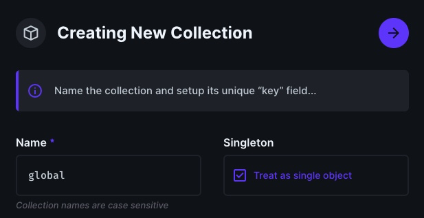
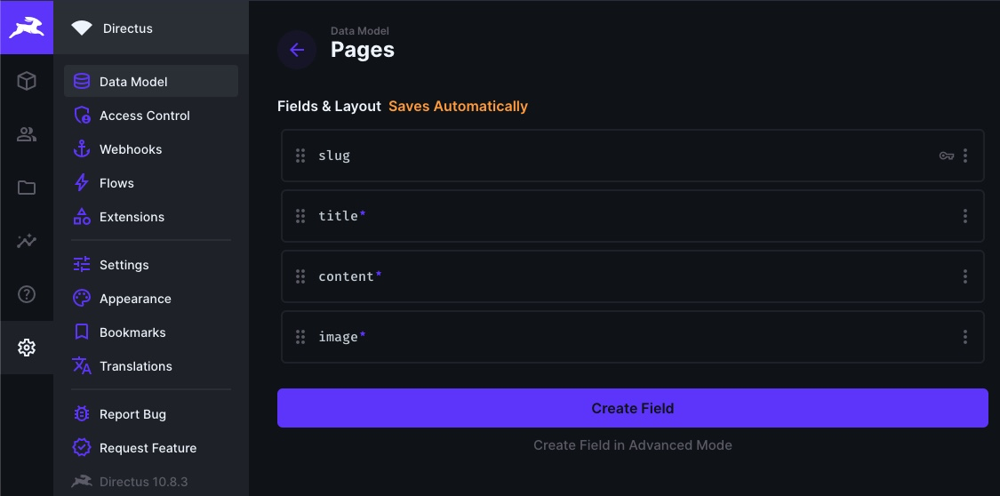
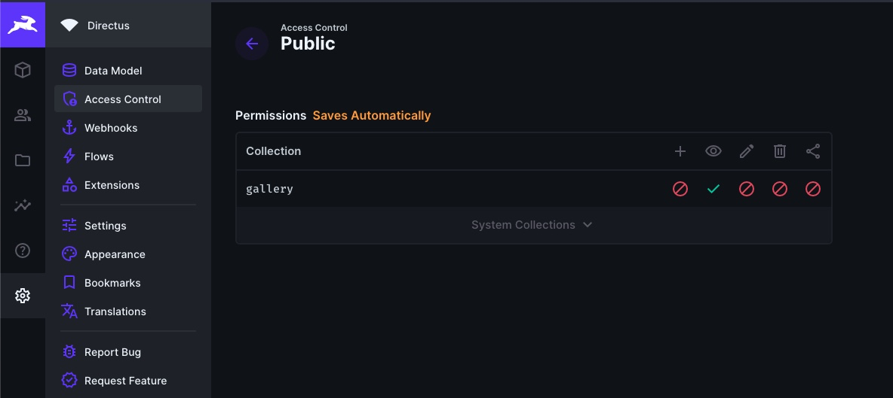
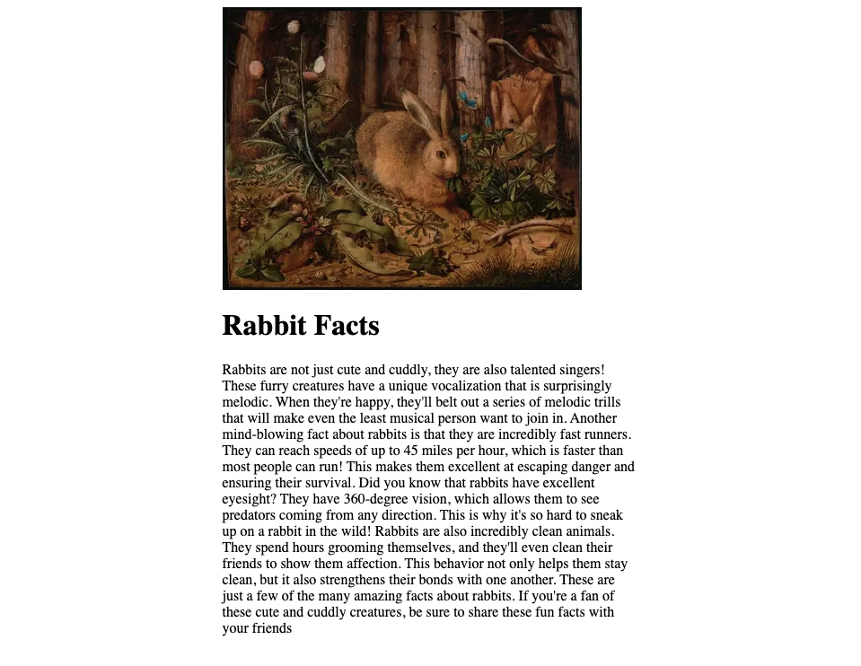

## Introduction

In this blog post, we will create a static website using Gatsby and Directus as a Headless CMS.

We'll make use of the official Directus Gatsby plugin which leverages into one of Gatsby's best features - image compression.

## Before You Start

You will need:

- Node.js and a code editor installed.
- A Directus project - [follow the quickstart guide](https://docs.directus.io/getting-started/quickstart) to create one.
- Knowledge of Gatsby and React.

## Setup

Create a new Gatsby project on your terminal and walk through the wizard:

```sh
npm init gatsby

What would you like to call your site?
  › Directus Gatsby Blog
What would you like to name the folder where your site will be created?
  › directus-gatsby-blog
Will you be using JavaScript or TypeScript?
  › JavaScript
Will you be using a CMS?
  › No (or I'll add it later)
Would you like to install a styling system?
  › No (or I'll add it later)
Would you like to install additional features with other plugins?
  › Done
Add the Google gtag script for e.g. Google Analytics
  › Done
Shall we do this? (Y/n)
  › Yes
```

Navigate into the new directory and install dependencies:

```sh
cd directus-gatsby-blog
npm install @directus/gatsby-source-directus
npm install gatsby-plugin-image gatsby-transformer-sharp gatsby-plugin-sharp
```

Start the development server

```sh
npm run develop
```

Your website is live at `http://localhost:8000/`

### Configuring Directus Plugin and SDK

This will make each item in your collection into its own page on your Gatsby site.

Directus maintains an official plugin for Gatsby. That plugin turns your Directus content is turned into Gatsby source nodes. You can query these nodes everywhere in your Gatsby site, using the GraphQL API, just like you would with Markdown files.

First, you need to add and configure the Directus plugin, the and the other Gatsby plugins that act as dependencies. Update your `gatsby-config.js` file as follows:

```js
module.exports = {
  siteMetadata: {
    title: `Directus Gatsby Blog`,
    siteUrl: `https://www.yourdomain.com`,
  },
  plugins: [
    "gatsby-plugin-image",
    "gatsby-plugin-sharp",
    "gatsby-transformer-sharp",
    {
      resolve: "@directus/gatsby-source-directus",
      options: {
        // Your project's URL
        url: "[DIRECTUS_PROJECT_URL]",
        auth: {
          // Use the credentials that you received by email
          // when you created your project, or a user's
          email: "[YOUR_EMAIL]",
          password: "[YOUR_PASSWORD]",
        },
      },
    },
  ],
};
```

Now our plugins are configured

## Accessing Global Metadata and Settings

Create a Directus collection named `global`, and tick "Treat as a single object."



Next, we'll setup a static hook with a GraphQL query so can use this global metadata everywhere in our Gatsby site.

Create a new file named `directus.js` in your `./src` directory (static queries only work in that folder).

```js
import { useStaticQuery, graphql } from "gatsby";

export const useGlobalMetadata = () => {
  const { directus } = useStaticQuery(graphql`
    {
      directus {
        global {
          title
        }
      }
    }
  `);

  return directus.global;
};
```

Now let's get rid of all the boilerplate in our index page (`src/pages/index.js`) and replace it with this:

```js
import React from "react";
import { useGlobalMetadata } from "../directus";

const IndexPage = ({ data }) => {
  const pages = data.directus.pages;
  const global = useGlobalMetadata();

  return (
    <main>
      <h1>{global.title}</h1>
    </main>
  );
};

export default IndexPage;
```

## Adding Directus Content

Create a Directus collection named collection named `authors`, with at least one input field.

Then, create another collection named `pages` and add the following fields to the

- title (input)
- content (either WISIWYG or Markdown)
- image (image)
- author (Many To One, under Relational), related to the `authors` collection.





Do not forget to add the read permission to the `directus_files` collection (you have to click on "System Collections").


## Creating Dynamic Routes with Directus

First, we need to create a Gatsby template, this component determines what each page will look like.

Create the template in `./src/templates/blog.js`, we will need to reference this file's path in the next section.

Populate it with the following:

```jsx
import React from "react";
import { GatsbyImage, getImage } from "gatsby-plugin-image";

const BlogTemplate = ({ pageContext }) => {
  const { page } = pageContext;
  const image = getImage(page.image.imageFile);

  return (
    <div style={{ margin: "0 auto", maxWidth: "58ch" }}>
      <GatsbyImage image={image} alt={page.title} />
      <h1>{page.title}</h1>
      <section>{page.content}</section>
    </div>
  );
};

export default BlogTemplate;
```

In the template, we're expecting each item in our Directus collection to be passed as a `page` object via the `pageContext` property. We'll set this up now.

A the root of your project directory, create a `gatsby-node.mjs` file (note the `.mjs`).

Populate it with the following:

```jsx
import path from "path";

export const createPages = async ({ graphql, actions: { createPage } }) => {
  const result = await graphql(`
    {
      directus {
        pages {
          title
          content
          slug
          image {
            id
            imageFile {
              childImageSharp {
                gatsbyImageData(width: 400)
              }
            }
          }
        }
      }
    }
  `);

  result.data.directus.pages.forEach((page) => {
    createPage({
      path: `/blog/${page.slug}`,
      component: path.resolve(`./src/templates/blog.js`),
      context: {
        page,
      },
    });
  });
};
```

::: tip Getting a GraphQL error with `imageFile`?
You might have forgotten to also give the `directus_files` collection read access.
This is due to that by default the file object only includes the image name, but not the actual binary file from the Directus endpoint. To fix this refer to the screenshot in the second section of this article.
:::

Now each item in your Directus collection is a page, and you can navigate to it using its slug, like `/blog/rabbit-facts`. There, you will see your template file rendered.



## Listing Blog Posts in an Index Page

Next, we want to create an index page that shows you all the items in our collection. We created individual pages for each item using the official plugin, which also made Gatsby nodes for us.

We can use the GraphQL API to query these nodes and list everything in our index page.

First, update our index page with the following:

```jsx
import React from "react";
import { graphql, Link } from "gatsby";
import { GatsbyImage, getImage } from "gatsby-plugin-image";
import { useGlobalMetadata } from "../directus";

const IndexPage = ({ data }) => {
  const pages = data.directus.pages;
  const global = useGlobalMetadata();

  return (
    <main>
      <h1>{global.title}</h1>
      {pages.map((page) => {
        const image = getImage(page.image.imageFile);
        return (
          <article key={page.slug}>
            <GatsbyImage image={image} alt={page.title} />
            <h2>{page.title}</h2>
            <Link to={`/blog/${page.slug}`}>Read More</Link>
            <hr />
          </article>
        );
      })}
    </main>
  );
};

export const query = graphql`
  {
    directus {
      pages {
        title
        content
        slug
        image {
          id
          imageFile {
            childImageSharp {
              gatsbyImageData(width: 300)
            }
          }
        }
      }
    }
  }
`;

export default IndexPage;
```

## Adding navigation

To navigate to other pages from your index, you need to use the `Link` component from Gatsby, just like we did earlier.

This is how you would add a link to an `about` page:

```diff
<h1>{global.title}</h1>
+ <nav>
+   <ul>
+     <li>
+       <Link to={`/about`}>Read More</Link>
+     </li>
+   </ul>
+ </nav>
```

And then we can create an `about.js` in our `src/pages` folder like so:

```js
import React from "react";
import { useGlobalMetadata } from "../directus";

const AboutPage = () => {
  const global = useGlobalMetadata();

  return (
    <main>
      <h1>{global.title}</h1>

      <p>YOUR_CONTENT</p>
    </main>
  );
};

export default AboutPage;
```

## Summary

Thats it! You've learned:

- How to use the official Directus plugin to transform your content into source nodes
- How to create static pages for each item in a Directus collection.
- How to query your Directus content with Gatsby's GraphQL API.
- How to put take your Directus remote images and optimize them with Gatsby's image processing pipeline.
