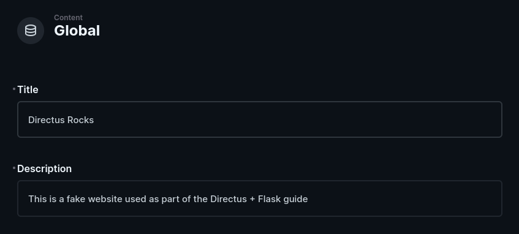
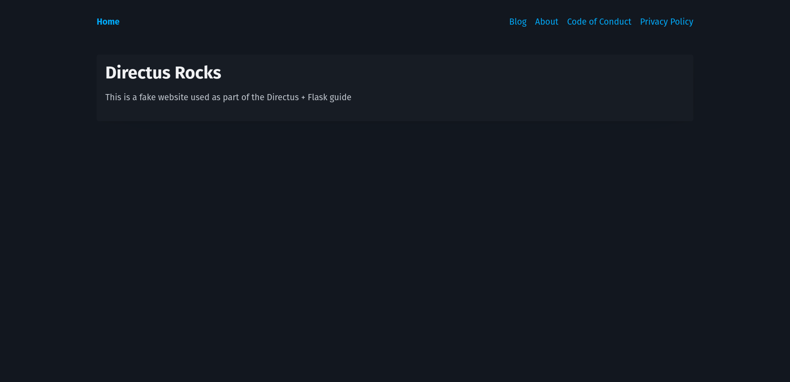
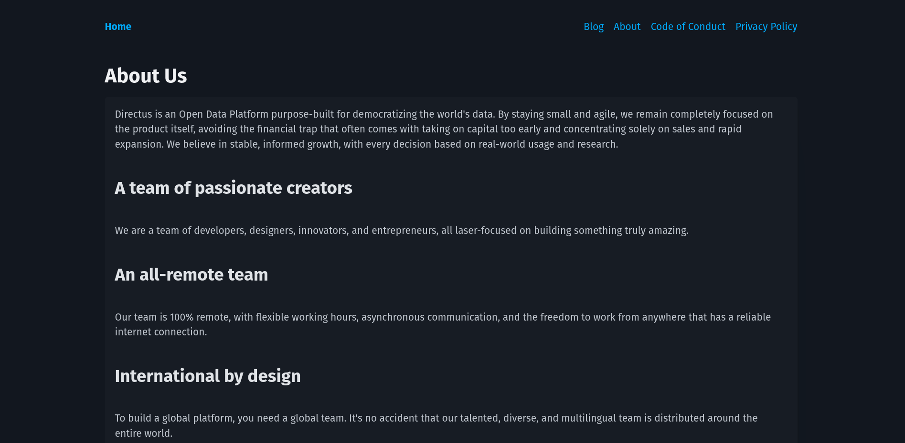
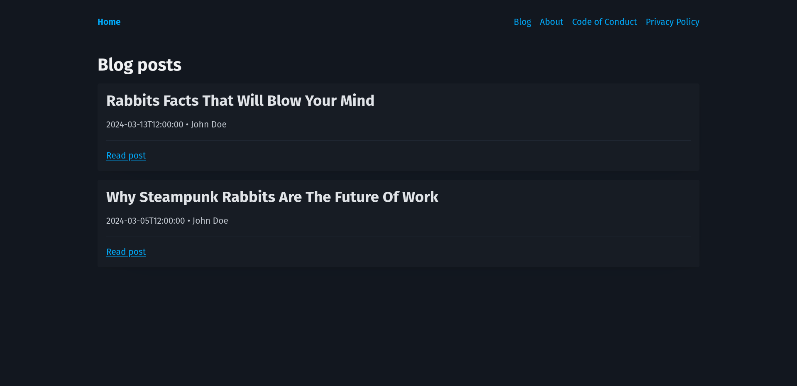
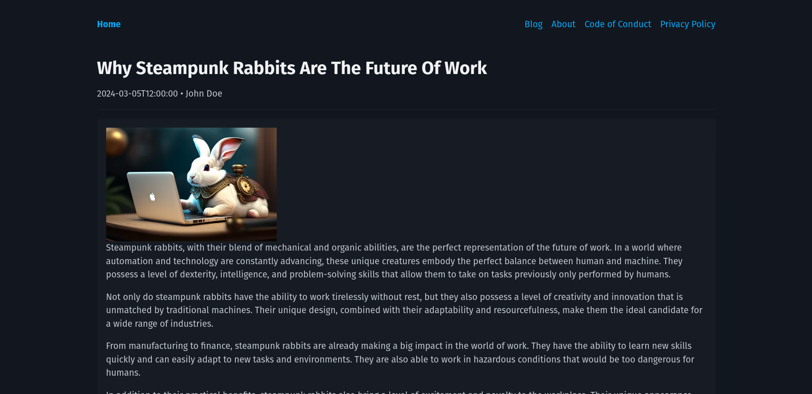

[Flask](https://flask.palletsprojects.com/en/3.0.x/) is a minimal Python framework used to build web applications. In this tutorial, you will store, retrieve, and use global metadata, pages, and posts based on a Directus project.

## Before You Start

You will need:

- To have Python installed on your machine
- A Directus project - [follow our quickstart guide](https://docs.directus.io/getting-started/quickstart) if you don't already have one.
- Basic knowledge of Python and Flask

### Creating Page Templates

First of all, you have to create a base template to be used by all your pages. Create a `templates` directory and a file called `base.html` in it with the following content:

```jinja
<!DOCTYPE html>
<html lang="en">
	<head>
		<meta charset="UTF-8" />
		<meta name="viewport" content="width=device-width, initial-scale=1.0" />
		<title>Directus x Flask</title>
	</head>
	<body>
		<main></main>
	</body>
</html>
```

## Setting Up A Flask Project

To create a new Flask project using `venv`, create your project directory and enter it, then run the following commands:

```sh
python3 -m venv .venv
source .venv/bin/activate  # On Windows you should use `.venv\Scripts\activate`
pip install Flask requests python-dotenv
```

To make `.env` file variables available on the project, create a `config.py` file:

```py
from dotenv import load_dotenv

load_dotenv()
```

Then create an `app.py` file to start the Flask app:

```py
from flask import Flask

app = Flask(__name__)


@app.get("/")
def home():
    return "Hello world"
```

And run the following command to run your flask server, which will start a server at `http://localhost:3000`:

```sh
flask run --debug
```

## Creating Global Metadata And Settings Collection

In your Directus project, navigate to **Settings** -> **Data Model** and create a new collection called `global`. Under the **Singleton** option, select 'Treat as a single object', as this collection will have just a single entry containing global website metadata.

Create two text input fields - one with the key of `title` and one `description`.

Navigate to the content module and enter the `global` collection. Collections will generally display a list of items, but as a singleton, it will launch directly into the one-item form. Enter information in the title and description field and hit save.



By default, new collections are not accessible to the public. Navigate to **Settings** -> **Access Control** -> **Public** and give Read access to the Global collection.

## Creating a Directus Module

Since your data will be fetched via the Directus REST API, you will need to create a module that encapsulates all that logic and exposes an interface to the outside world.

To accomplish this, create a `directus.py` file and add the following content to it:

```py
import requests
import os

DIRECTUS_BASE_URL = os.environ.get("DIRECTUS_BASE_URL")

def get_global_data():
    response = requests.get(f"{DIRECTUS_BASE_URL}/items/global")
    return response.json().get("data")
```

By now this is all you need, but in the following sections, you will also create a new function to fetch data from other collections.

## Rendering The Home Page

To render the site home page, create a new route that uses the directus module to get the global data and use it on a page template.

### Creating Page Templates

Create a `templates/home.html` file that will extend the base template and display additional data:

```jinja



<article>
	<h1>{{ title }}</h1>
	<p>{{ description }}</p>
</article>

```

### Updating Home Route

Update the `app.py` file:

```py
from flask import Flask // [!code --]
from flask import Flask, render_template // [!code ++]
import directus // [!code ++]

app = Flask(__name__)

@app.get("/")
def home():
    return "Hello world" // [!code --]
    global_data = directus.get_global_data() // [!code ++]
// [!code ++]
    return render_template( // [!code ++]
        "home.html", title=global_data["title"], description=global_data["description"] // [!code ++]
    ) // [!code ++]
```

Then go to `http://localhost:3000` in your browser and you will see a page like this:



## Creating Pages With Directus

Create a new collection called pages - make the Primary ID Field a "Manually Entered String" called slug, which will correlate with the URL for the page. For example, about will later correlate to the page `localhost:3000/about`.

Create a text input field called title and a WYSIWYG input field called content. In the Access Control settings, give the Public role read access to the new collection. Create 3 items in the new collection - [here's some sample data](https://github.com/directus-community/getting-started-demo-data).

### Rendering Dynamic Pages

To get data of pages registered on the `pages` collection you will need to add the following code at the end of the `directus.py` file:

```py
def get_page_by_slug(slug):
    response = requests.get(f"{DIRECTUS_BASE_URL}/items/pages/{slug}")
    return response.json().get("data")
```

Create the `templates/dynamic-page.html` file with the following content:

```jinja



	<h1>{{ title }}</h1>
	<article>{{ content | safe }}</article>

```

Then, on the `app.py` file import `render_template_string` from `Flask` and define a new app route with the following code at the end of the file:

```py
@app.get("/<slug>")
def dynamic_page(slug):
    page = directus.get_page_by_slug(slug)

    if not page:
        return render_template_string(
            "This page does not exists"
        )

    return render_template(
        "dynamic-page.html", title=page["title"], content=page["content"]
    )
```

This route fetches page data using the `directus.get_page_by_slug` method and then renders a simple not found page (defined as an inline template string) if the page does not exist, and if it exists it renders the `dynamic-page.html` template with page data on it.

Navigate to `http://localhost:3000/about` and see the result



## Creating Blog Posts With Directus

Create a new collection called `authors` with a single text input field called `name`. Create one or more authors.

Then, create a new collection called `posts` - make the Primary ID Field a "Manually Entered String" called `slug`, which will correlate with the URL for the page. For example `hello-world` will later correlate to the page `localhost:3000/blog/hello-world`.

Create the following fields in your `posts` data model:

- a text input field called `title`
- a WYSIWYG input field called `content`
- an image relational field called `image`
- a datetime selection field called `publish_date` - set the type to 'date'
- a many-to-one relational field called `author` with the related collection set to `authors`

In Access Control, give the Public role read access to the `authors`, `posts`, and `directus_files` collections.

Create 3 items in the posts collection - [here's some sample data](https://github.com/directus-community/getting-started-demo-data).

### Create Blog Post Listing Page

To fetch the blog post data add this function at the end of the `directus.py` file:

```py
def get_posts():
    response = requests.get(
        f"{DIRECTUS_BASE_URL}/items/posts?fields=slug,title,description,publish_date,author.name&sort=-publish_date"
    )
    return response.json().get("data")
```

:::info Directus Query Parameters

The `fields` parameter tells Directus to return only the specified fields. The `sort` parameter tells Directus to return the most recent posts first.

:::

Then create a `templates/blog.html` file to display the posts data to users.

```jinja



<section>
	<h1>Blog posts</h1>
	<ol>
		
		<li>	
			<article>
				<h2>{{ post["title"] }}</h2>
				<span>
					{{ post["publish_date"] }} &bull; {{ post["author"]["name"] }}
				</span>
				<hr />
				<a href="{{ '/blog/' + post["slug"] }}">Read post</a>
			</article>
		</li>
		
	</ol>
</section>

```

And add the following route at the end of `app.py`:

```py
@app.get("/blog")
def blog_page():
    posts = directus.get_posts()

    return render_template("blog.html", posts=posts)
```

Now navigate to`http://localhost:5000/blog` and you will see this result:


 
### Create Blog Post Page

For this page you will need to add the following function at the end of `directus.py` file:

```py
def get_post_by_slug(slug):
    response = requests.get(
        f"{DIRECTUS_BASE_URL}/items/posts/{slug}?fields=*,author.name"
    )
    post = response.json().get("data")
    post["image"] = f'{DIRECTUS_BASE_URL}/assets/{post["image"]}'

    return post
```

:::info File ID

Note that this code is reassigning `post["image"]`, this is because Directus returns the image ID, and you need to explicitly say where it is placed in your code, following this structure: `<directus-base-url>/assets/<image-id>`.
You can read more about it [here](https://docs.directus.io/reference/files.html#accessing-a-file).

:::

Then create the page template on the `templates/post.html` file:

```jinja



<header>
	<h1>{{ post["title"] }}</h1>
	<span> {{ post["publish_date"] }} &bull; {{ post["author"]["name"] }} </span>
</header>
<hr />
<article>
	
	<section>{{ post["content"] | safe }}</section>
</article>

```
:::info Images transformation

Note that the template code appends a query string to the image URL, it is used to dynamically convert the image to the webp format and set a width of 400px to it, allowing you to prevent users from loading an excessively large image.
You can learn more about this [here](https://docs.directus.io/reference/files.html#custom-transformations).

:::

Lastly, create the page route handler at the end of `app.py`:

```py
@app.get("/blog/<slug>")
def post_page(slug):
    post = directus.get_post_by_slug(slug)

    return render_template("post.html", post=post)
```

Now navigate to one of your posts listed on the previous page an see the result.



## Add Navigation

While not strictly Directus-related, there are now several pages that aren't linked to each other. In `templates/base.html`, above the `<main>` tag, add a navigation. Don't forget to use your specific page slugs.

```jinja
<header>
	<nav>
		<ul>
			<li><a href="/">Home</a></li>
			<li><a href="/blog">Blog</a></li>
			<li><a href="/about">About</a></li>
			<li><a href="/conduct">Code of Conduct</a></li>
			<li><a href="/privacy">Privacy Policy</a></li>
		</ul>
	</nav>
</header>
```

## Next steps

Through this guide, you have set up a Flask project, created a Directus module, and used it to query data. You have used a singleton collection for global metadata, dynamically created pages, as well as blog listing and post pages.

If you want to change what is user-accessible, consider setting up more restrictive roles and accessing only valid data at build-time.

If you want to build more complex dynamic pages made out of reusable components, [check out our recipe on doing just this](https://docs.directus.io/guides/headless-cms/reusable-components.html).

If you want to see the code for this project, you can find it [on GitHub](https://github.com/guilhermesdev/directus-flask-example).
