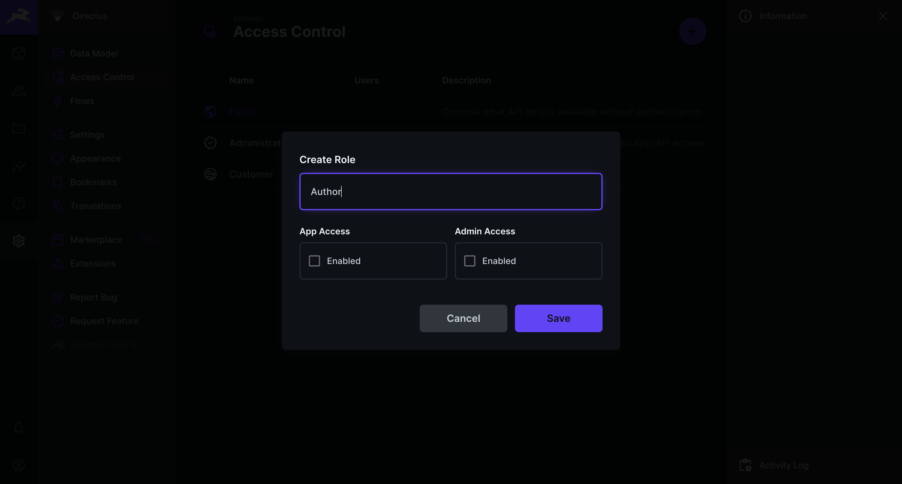
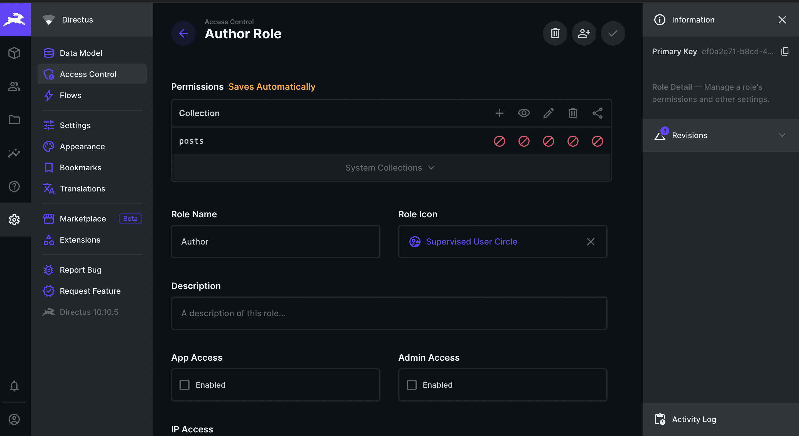
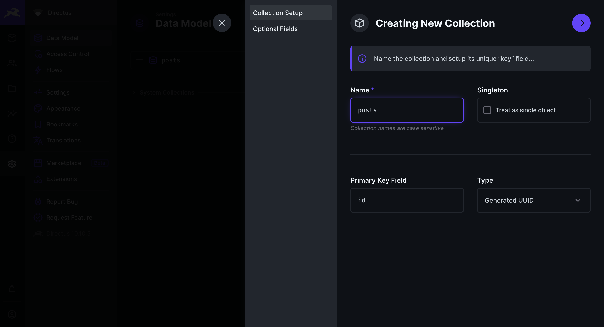
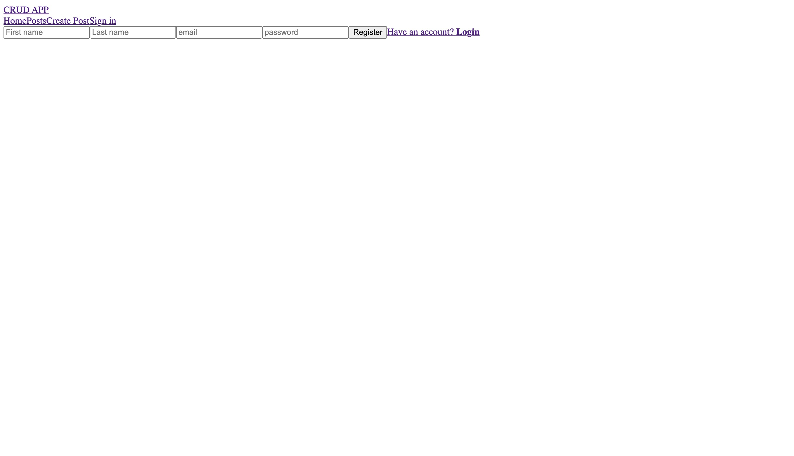
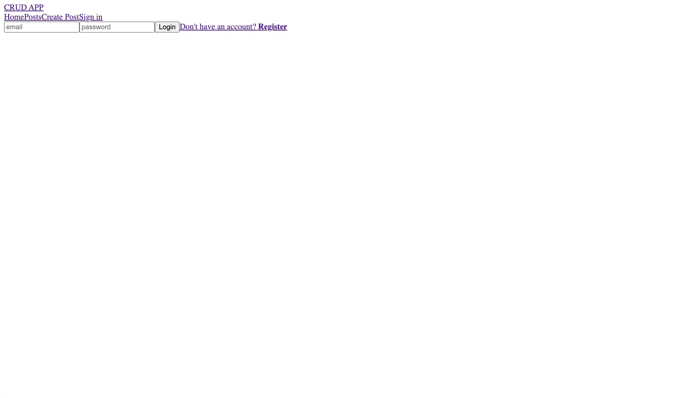
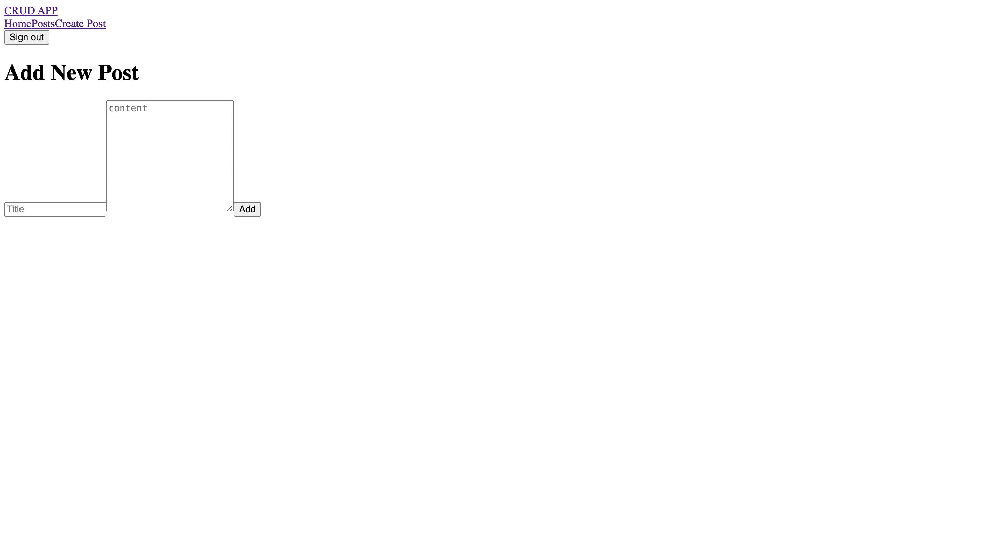

## Introduction
Next.js is a React.js server-side rendering framework that allows front-end developers to build full-stack applications with a single codebase. It has turborpack the rust-based bundler built-in for enhanced code optimization and fast code compilation. It’s a great choice for performance, efficiency and developer experience. In this tutorial, you will learn how to implement Authentication on a Next.js blog website using Directus as a Headless CMS. You’ll register new users, login, handle refresh tokens, create posts, list all posts, and edit/delete posts where the auth user is the post creator.

## Before You Start
To follow along with this tutorial, you will need the following knowledge and tools:

- [Node.js](https://nodejs.org/en/download/) v18 and above installed on your computer.
- A Directus project - you can use [Directus Cloud or run it yourself](https://docs.directus.io/getting-started/quickstart).
- Prior experience with Nextjs.
- Clone the [project repo](https://github.com/emmanuelhashy/Next-directus-auth-demo) to get the CSS styles for the demo project.

<!-- ## Your Sections Here -->
## Setting Up Directus

### Creating a New User Role

Log into your Directus dashboard with your admin credentials, head over to `Settings > Access Control`, and create a new role for users accessing your Directus project from the Next.js application. Name this role `Author`. Uncheck the app access checkbox; you do not want users to access your Directus project via the dashboard but only from the Next.js application.



**Setting Public Role Permission for Directus Users**
Now, you should find two categories of users when you navigate to the User Directory: Administrator and Author.
To ensure that a new user on your frontend application can only sign up as an author, navigate to the Access Control settings, click on the Author role, look at the info icon in the top right corner of the screen, and copy the `Primary Key`.



Navigate to the Public role settings and in the `directus_users` system collection, configure custom create permissions to allow user creation where `role` equals the Author role `Primary Key` you copied earlier.


Click on `Field Permission` and check the fields required to create a user.


The required fields are:

- first_name
- last_name
- email
- password
- role

**Creating posts collection**
Navigate to `Settings/Data Model` and create a new collection named `posts`. This is where all the posts created by users with an Author role will be stored.



Check the fields that you want returned on the `posts` data


Create additional fields for the post:

- title => Input field
- content => WYSIWYG
- image => Image

The `title` and `content` fields should be required.


## **Initialize Next.js Project**

Open your terminal and run the following command to create a new Next.js project:

```bash
npx create-next-app@latest
```

On installation, choose the following configurations when prompted:

```text
What is your project named? next-blog
Would you like to use TypeScript? No
Would you like to use ESLint? Yes
Would you like to use Tailwind CSS? No
Would you like to use `src/` directory? Yes
Would you like to use App Router? Yes
Would you like to customize the default import alias (@/*)? Yes
```

After the prompts, `create-next-app` will create a folder with your project name and install the required dependencies.

Install the required dependencies:

```bash
    npm i next-auth @directus/sdk
```

## Set Up the ENV Variables

Create a `.env` file in your Next.js project root directory and add the following:

```text
NEXTAUTH_URL=http://localhost:3000
NEXTAUTH_SECRET=YOUR_NEXT_RANDOM_SECRET
USER_ROLE=USER_ROLE_ID_FROM_YOUR_DIRECTUS_PROJECT
BACKEND_URL=YOUR_DIRECTUS_PROJECT_URL
NEXT_PUBLIC_URL=http://localhost:3000
```

You can access your Directus project from the Next.js application via `REST`, `GraphQL` and `SDK`. 

## Set Up the Directus SDK

Create an instance of the Directus SDK that will be used across the next.js application.
In the `next-blog` project `src` directory, create a new directory called `lib` and a new file called `directus.js` inside `lib`, then add the following code:

```javascript
import { createDirectus, rest, authentication } from '@directus/sdk';
const directus = createDirectus(process.env.BACKEND_URL)
  .with(authentication("cookie", {credentials: "include", autoRefresh: true}))
export default directus;
```

This code snippet sets up a client for interacting with the Directus backend with cookie-based authentication, ensuring that credentials are included in requests and enabling automatic token refresh.

## Setting up Layout Configuration

Create a `components` directory with `navbar` subdirectory. Inside  `navbar` create `Navbar.jsx` and add the following:

```javascript
import Link from "next/link"
import Links from "./links/Links"
import styles from "./navbar.module.css"
import { auth } from "@/lib/auth";
const Navbar = async () => {
  const session = await auth();
  return (
    <div className={styles.container}>
      <Link href="/" className={styles.logo}>CRUD APP</Link>
      <div>
        <Links session={session}/>
      </div>
    </div>
  )
}
export default Navbar
```

In `navbar` create a `links` directory with `Links.jsx` and add the following:

```javascript
"use client";
import { useState } from "react";
import styles from "./links.module.css";
import NavLink from "./navLink/navLink";
import Image from "next/image";
import { handleLogout } from "@/lib/action";
const links = [
  {
    title: "Home",
    path: "/",
  },
  {
    title: "Posts",
    path: "/blog",
  },
  {
    title: "Create Post",
    path: "/create-post",
  },
];
const Links = ({session}) => {
  const [open, setOpen] = useState(false);
  return (
    <div className={styles.container}>
      <div className={styles.links}>
        {links.map((link) => (
          <NavLink item={link} key={link.title} />
        ))}
        {session?.user ? (
          <>
            <form action={handleLogout}>
              <button className={styles.logout}>Sign out</button>
            </form>
          </>
        ) : (
          <NavLink item={{ title: "Sign in", path: "/login" }} />
        )}
      </div>
      <Image
        className={styles.menuButton}
        src="/menu.png"
        alt=""
        width={30}
        height={30}
        onClick={() => setOpen((prev) => !prev)}
      />
      {open && (
        <div className={styles.mobileLinks}>
          {links.map((link) => (
            <NavLink item={link} key={link.title} />
          ))}
        </div>
      )}
    </div>
  );
};
export default Links;
```

In `links` create a `navLink` directory with `navLinks.jsx` and add the following:

```javascript
"use client";
import Link from "next/link";
import styles from "./navLink.module.css";
import { usePathname } from "next/navigation";
const NavLink = ({ item }) => {
  const pathName = usePathname();
  return (
    <Link
      href={item.path}
      className={`${styles.container} ${
        pathName === item.path && styles.active
      }`}
    >
      {item.title}
    </Link>
  );
};
export default NavLink;
```

To render the `Navbar` component on all pages, update `Layout.js` as follows:

```javascript
import { Inter } from "next/font/google";
import "./globals.css";
import Navbar from "@/components/navbar/Navbar";
const inter = Inter({ subsets: ["latin"] });
export const metadata = {
  title: {
    default:"Next.js 14 Homepage",
    template:"%s | Next.js 14"
  },
  description: "Next.js starter app description",
};
export default function RootLayout({ children }) {
  return (
    <html lang="en">
      <body className={inter.className}>
          <div className="container">
            <Navbar />
            {children}
          </div>
      </body>
    </html>
  );
}
```

### Loader Component

In the `app` directory, create `Loading.jsx` with the content:

```javascript
const Loading = () => {
  return (
    <div>Loading</div>
  )
}
export default Loading
```

### Not Found Component

In the `app` directory, create `not-found.jsx` with the content:

```javascript
//src/app/not-found.jsx
import Link from "next/link"
const NotFound = () => {
  return (
    <div>
      <h2>Not Found</h2>
      <p>Sorry, the page you are looking for does not exist.</p>
      <Link href="/">Return Home</Link>
    </div>
  )
}
export default NotFound
```

## Setting up Auth Configuration

To set up authentication and authorization configurations for a Next.js application using NextAuth.js and Directus as the backend, in the `lib` directory, create `auth.config.js` file and add the following:

```javascript
//src/lib/auth.config.js
import { cookies } from 'next/headers'
import directus from "./directus";
import { readMe, withToken } from "@directus/sdk";
export const authConfig = {
  pages: {
    signIn: "/login",
  },
  secret: process.env.NEXTAUTH_SECRET,
  providers: [],
  callbacks: {
    async jwt({ token, user, account }) {
      if (account && user) {
        const userData = await directus.request(
          withToken(
            user.data.access_token,
            readMe({
              fields: ["id", "first_name", "last_name"],
            })
          )
        );
        const formatedData = JSON.stringify(userData)
        cookies().set("auth_user", formatedData )
        return {
          ...token,
          accessToken: user.data.access_token,
          refreshToken: user.data.refresh_token,
          user: userData,
        };
      }
      return token;
    },
    async session({ session, token }) {
      if (token) {
        session.user.accessToken = token.accessToken;
        session.user.refreshToken = token.refreshToken;
      }
      return session;
    },
  },
};
```

This contains functions that handle JWT creation, and session management logic.
The `jwt` function runs when a JWT token is created. If the user is authenticated, it fetches user data from Directus using the provided access token and then sets a cookie named "auth_user" containing the user data.

**Route Protections:**
To handle route protection, update the `src/lib/auth.config.js` file with the `authorized` callback function as follows:

```javascript
//src/lib/auth.config.js
import { cookies } from 'next/headers'
import directus from "./directus";
import { readMe, withToken } from "@directus/sdk";
export const authConfig = {
  ...
  callbacks: {
    ...
    authorized({ auth, request }) {
      const user = auth?.user;
      const isOnCreatePostPage =
        request.nextUrl?.pathname.startsWith("/create-post");
      const isOnLoginPage = request.nextUrl?.pathname.startsWith("/login");
      // ONLY AUTHENTICATED USERS CAN REACH THE CREATE POST PAGE
      if (isOnCreatePostPage && !user) {
        return false;
      }
      // ONLY UNAUTHENTICATED USERS CAN REACH THE LOGIN PAGE
      if (isOnLoginPage && user) {
        return Response.redirect(new URL("/", request.nextUrl));
      }
      return true;
    },
  },
};
```

This will ensure that only unauthenticated users can reach the login page and only authenticated users can access the create post page.

For the route protection to be effective without rendering the associated page, create `src/middleware.js` and add the following:

```javascript
import NextAuth from "next-auth";
import { authConfig } from "./lib/auth.config";
export default NextAuth(authConfig).auth;
export const config = {
  matcher: ["/((?!api|static|.*\\..*|_next).*)"],
};
```

To implement log-in via user credentials, create `src/lib/auth.js` and add the following:

```javascript
//src/lib/auth.js
import NextAuth from "next-auth";
import CredentialsProvider from "next-auth/providers/credentials";
import { authConfig } from "./auth.config";
const login = async (credentials) => {
  try {
    const res = await fetch(`${process.env.BACKEND_URL}/auth/login`, {
      method: 'POST',
      body: JSON.stringify(credentials),
      headers: { 'Content-Type': 'application/json' },
    });
    const user = await res.json();
    // If no error and we have user data, return it
    if (!res.ok && user) {
      throw new Error('Wrong credentials!');
    }
    return user;
  } catch (err) {
    console.log(err);
    throw new Error("Failed to login!");
  }
};
export const {
  handlers: { GET, POST },
  auth,
  signIn,
  signOut,
} = NextAuth({
  ...authConfig,
  providers: [
    CredentialsProvider({
      async authorize(credentials) {
        try {
          const user = await login(credentials);
          return user;
        } catch (err) {
          return null;
        }
      },
    }),
  ],
  callbacks: {
    ...authConfig.callbacks,
  },
});
```

The `login` function logs in a user by sending a POST request to the Directus backend authentication endpoint `${process.env.BACKEND_URL}/auth/login` with the provided credentials.

## Implementing Server Actions for Auth Components

Server Actions are **asynchronous functions** that are executed on the server. They can be used in Server and Client Components to handle form submissions and data mutations in Next.js applications.

To send user credentials to the `Directus` backend on the user register form submission, navigate to the `lib` directory, create `action.js` file and add the following:

```javascript
"use server";
import { revalidatePath } from "next/cache";
import { signIn, signOut } from "./auth";
import { createItem, createUser, deleteItem, readItems, updateItem, uploadFiles } from "@directus/sdk";
import directus from "@/lib/directus";
import { redirect } from "next/navigation";

export const register = async (previousState, formData) => {
  try {
    const { first_name, last_name, email, password } =
      Object.fromEntries(formData);
    const result = await directus.request(
      createUser({
        first_name,
        last_name,
        email,
        password,
        role: process.env.USER_ROLE,
      })
    );
    return { message: "Account Created!", status: 201 };
  } catch (e) {
    console.log(e);
    const code = e.errors[0].extensions.code;
    if (code === "RECORD_NOT_UNIQUE") {
      return { message: "This user already exist", status: 409 };
    }
    return {
      message: "An unexpected error occurred, please try again",
      status: 500,
    };
  }
};

export const login = async (prevState, formData) => {
  const { email, password } = Object.fromEntries(formData);
  try {
    await signIn("credentials", { email, password });
  } catch (err) {
    console.log(err);
    if (err.message.includes("CredentialsSignin")) {
      return { error: "Invalid username or password" };
    }
    throw err;
  }
};

export const handleLogout = async () => {
  await signOut();
  await directus.logout();
};
```

These functions handle user logout, registration and login using the Directus SDK.

## Creating the Auth Pages

The auth pages consist of the login and the register pages. To group these pages, create `(auth)` directory in the `app` directory. The `auth`  directory will hold both login and register pages.

### Login Form

Create a `components` directory and a `loginForm` subdirectory. Inside `loginForm` create `loginForm.jsx` and add the following:

```javascript
//src/app/(auth)/login
"use client";
import { login } from "@/lib/action";
import styles from "./loginForm.module.css";
import { useFormState } from "react-dom";
import Link from "next/link";
const LoginForm = () => {
  const [state, formAction] = useFormState(login, undefined);
  return (
    <form className={styles.form} action={formAction}>
      <input type="email" placeholder="email" name="email" />
      <input type="password" placeholder="password" name="password" />
      <button>Login</button>
      {state?.error}
      <Link href="/register">
        {"Don't have an account?"} <b>Register</b>
      </Link>
    </form>
  );
};
export default LoginForm;
```

### Register Form

In the `components` directory, create a `registerForm` subdirectory. Inside `registerForm` create `registerForm.jsx` and add the following:

```javascript
//src/app/(auth)/register
"use client";
import { register } from "@/lib/action";
import styles from "./registerForm.module.css";
import { useFormState } from "react-dom";
import { useEffect, useState } from "react";
import { useRouter } from "next/navigation";
import Link from "next/link";
const RegisterForm = () => {
  const [state, formAction] = useFormState(register, undefined);
  const router = useRouter();
  const [error, setError] = useState('')
  useEffect(() => {
    state?.status === 201 && router.push("/login");
    state?.status === 409 && setError('A user with this email already exist');
  }, [state?.status, router]);
  
  return (
    <form className={styles.form} action={formAction}>
      <input type="text" placeholder="First name" name="first_name" />
      <input type="text" placeholder="Last name" name="last_name" />
      <input type="email" placeholder="email" name="email" />
      <input type="password" placeholder="password" name="password" />
      <button>Register</button>
      {state?.error}
      <Link href="/login">
        Have an account? <b>Login</b>
      </Link>
      <p>{error}</p>
    </form>
  );
};
export default RegisterForm;
```

### Register Page

In the `(auth)` directory, create a `register` subdirectory. Inside `register` create `page.jsx` and add the following:

```javascript
import styles from "./register.module.css";
import RegisterForm from "@/components/registerForm/registerForm";
const RegisterPage = () => {
  return (
    <div className={styles.container}>
      <div className={styles.wrapper}>
        <RegisterForm/>
      </div>
    </div>
  );
};
export default RegisterPage;
```

To see the output of what you’ve built so far, run the following command in your terminal:

```bash
npm run dev
```

With the above implementation, users should be able to register.
Navigate to `http://localhost:3000/register` in your browser and you should see the following:



### Login Page

In the `(auth)` directory, create a `login` subdirectory. Inside `login` create `page.jsx` and add the following:

```javascript
//(auth)/login/page.jsx
import LoginForm from "@/components/loginForm/loginForm";
import styles from "./login.module.css";
const LoginPage = () => {
  return (
    <div className={styles.container}>
      <div className={styles.wrapper}>
        <LoginForm />
      </div>
    </div>
  );
};
export default LoginPage;
```

With the above implementation, registered users should be able to sign in and sign out.
Navigate to `http://localhost:3000/register` in your browser and you should see the following:



## Create New Post Implementation

### Server Action to Create a Post

To create post from `Directus` backend, navigate to the `lib/action.js` file and add the following:

```javascript
export const uploadPostImage = async (image, title) => {
  try {
    const formData = new FormData();
    formData.append("title", title);
    formData.append("file", image);
    const result = await directus.request(uploadFiles(formData));
    return result;
  } catch (error) {
    console.log(error);
    return { error: "Something went wrong!" };
  }
};
export const addPost = async (prevState, formData) => {
  const { title, content, image, userId } = Object.fromEntries(formData);
  
  try {
    const postImage = await uploadPostImage(image, title);
    if(postImage) {
      const result = await directus.request(
        createItem("posts", {
          title,
          content,
          image: postImage.id,
          user_created: userId,
          user_role: process.env.USER_ROLE
        })
      );
      if(result.id) {
        revalidatePath("/blog");
        redirect("/blog")
      }
    }
  } catch (err) {
    console.log(err);
    return { error: "Something went wrong!" };
  }
};
```

The `uploadPostImage` function uploads an image associated with a new post and `addPost` adds the post to the Directus backend.

### Create Post Page

In the `app` directory, create a subdirectory `create-post`. Inside `create-post`  create `page.jsx` with the content:

```javascript
//src/app/create-post/page.jsx
import styles from "./create.module.css";
import CreatePostForm from "@/components/createPostForm/createPostForm";
import { cookies } from "next/headers";
const AdminPage = async () => {
  const cook = cookies().get("auth_user")
  const user = JSON.parse(cook.value)
  return (
    <div className={styles.container}>
      <div className={styles.row}>
        <div className={styles.col}>
          <CreatePostForm userId = {user?.id} />
        </div>
      </div>
    </div>
  );
};
export default AdminPage;
```

In the `components` directory, create a subdirectory `createPostForm`. Inside `createPostForm`  create `createPostForm.jsx` with the content:

```javascript
//src/components/createPostForm/createPostForm.jsx
"use client"
import { addPost } from "@/lib/action";
import styles from "./createPostForm.module.css";
import { useFormState } from "react-dom";
const CreatePostForm = ({userId}) => {
  const [state, formAction] = useFormState(addPost, undefined);
  
  return (
    <form action={formAction} className={styles.container}>
      <h1>Add New Post {userId}</h1>
      <input type="hidden" name="userId" value={userId} />
      <input type="text" name="title" placeholder="Title" />
      <input type="file" name="image" placeholder="upload image" accept="image/*"/>
      <textarea type="text" name="content" placeholder="content" rows={10} />
      <button>Add</button>
      {state?.error}
    </form>
  );
};
export default CreatePostForm;
```

The `CreatePostForm` component provides a form for creating a new post. When the form is submitted, it calls the `addPost` function to add the post to the Directus backend. The form state is managed using the `useFormState` hook.

With the above implementation, registered users should be able to create new posts.
Navigate to `http://localhost:3000/create-post` in your browser and you should see the following:



## Create Blog Post Listing

To render a list of all blog posts, you need to send a request to the Directus backend to fetch all post data from the posts collection created earlier in the Directus project.

Navigate to `lib/action.js` and add the following:

```javascript
//src/lib/action.js
export const getPosts = async () => {
  try {
    const result = await directus.request(
      readItems("posts", {
        fields: [
          "title",
          "id",
          "image.*",
          "content",
          "date_created",
          "user_created.*",
        ],
      })
    );
    return result;
  } catch (error) {
    console.log(error);
  }
};
```

The `getPosts` function makes a request to Directus using the `directus.request()` method, specifying to read items from the "posts" collection. Within the request, it specifies the fields to retrieve for each post. The asterisk signifies all fields under its associated field.

In the `app` directory, create a `blog` subdirectory. Inside `blog` create `page.jsx` and add the following to render the retrieved data:

```javascript
//src/app/blog/page.jsx
import PostCard from "@/components/postCard/postCard";
import styles from "./blog.module.css";
import { getPosts } from "@/lib/action";
const BlogPage = async () => {
  const posts = await getPosts()
  return (
    <div className={styles.container}>
      {posts.map((post) => (
        <div className={styles.post} key={post.id}>
          <PostCard post={post} />
        </div>
      ))}
    </div>
  );
};
export default BlogPage;
```

The blog page fetches the posts data asynchronously using the `getPosts` function and renders a `PostCard` component for each post fetched.

In the `components` directory, create a `postCard` subdirectory. Inside `postCard` create `postCard.jsx` and add the following to render the posts data:

```javascript
//src/components/postCard/postCard.jsx
import styles from "./postCard.module.css"
import Link from "next/link"
import directus from "@/lib/directus"
import PostUser from "../postUser/postUser"
const PostCard = async ({post}) => {
  return (
    <div className={styles.container}>
      <div className={styles.top}>
        {post.image && <div className={styles.imgContainer}>
          
        </div>}
      </div>
      <div className={styles.bottom}>
        <h1 className={styles.title}>{post.title}</h1>
        
        <div dangerouslySetInnerHTML={{ __html: post.content }}></div>
        <div className={styles.spaceY}>
          <PostUser user={post.user_created} />
        </div>
        <Link className={styles.link} href={`/blog/${post.id}`}>READ MORE</Link>
      </div>
    </div>
  )
}
export default PostCard
```

Click the `READ MORE`  link to get to the corresponding detail blog post page.

In the `components` directory, create a `postUser` subdirectory. Inside `postUser` create `postUser.jsx` and add the following to render the post creator data:

```javascript
//src/components/postUser/postUser.jsx
import { getUser } from "@/lib/data";
import styles from "./postUser.module.css";
import Image from "next/image";
import directus from "@/lib/directus";
const PostUser = async ({ user }) => {
  return (
    <div className={styles.container}>
      
      <div className={styles.texts}>
        <span className={styles.title}>Author</span>
        <span
          className={styles.username}
        >{`${user?.first_name} ${user?.last_name}`}</span>
      </div>
    </div>
  );
};
export default PostUser;
```

With the above implementation, users should be able to view all posts.
Navigate to `http://localhost:3000/blog` in your browser and you should see all posts:


## Single Post Detail Implementation

### Server Action to Fetch a Single Post Data

To fetch a single post data from the `Directus` backend, navigate to the `lib/action.js` file and add the following:

```JavaScript
//src/lib/action.js
export const getPost = async (slug) => {
  try {
    const post = await directus.request(
      readItem("posts", slug, {
        fields: [
          "title",
          "id",
          "image.*",
          "content",
          "date_created",
          "user_created.*",
        ],
      })
    );
    return post;
  } catch (err) {
    console.log(err);
    throw new Error("Failed to fetch post!");
  }
};
```

The `getPost` function makes a request to Directus using the `directus.request()` method, specifying to read a single item from the "posts" collection based on the provided `slug`. Within the request, it specifies the fields to retrieve for the post.

### Single Post Detail Page

Each blog post links to a single post detail page. In the `blog` directory, create a subdirectory `[slug]`. Inside `[slug]`  create `page.jsx` with the content:

```JavaScript
//src/app/blog/[slug]/page.jsx
import { redirect } from 'next/navigation'
import styles from "./singlePost.module.css";
import PostUser from "@/components/postUser/postUser";
import { Suspense } from "react";
import { getPost } from "@/lib/data";
import directus from "@/lib/directus";
import { deletePost } from "@/lib/action";
import Link from "next/link";
import { cookies } from "next/headers";
export const generateMetadata = async ({ params }) => {
  const { slug } = params;
  const post = await getPost(slug);
  return {
    title: post.title,
  };
};
const SinglePostPage = async ({ params }) => {
  const { slug } = params;
  const post = await getPost(slug);
  const cookie = cookies().get("auth_user")
  const user = JSON.parse(cookie.value)
  const handleDelete = async (data) => {
    "use server";
    const postId = data.get("postId");
    deletePost(postId)
    redirect('/blog')
  };
  return (
    <div className={styles.container}>
      {post.image && (
        <div className={styles.imgContainer}>
          
        </div>
      )}
      <div className={styles.textContainer}>
        <h1 className={styles.title}>{post.title}</h1>
        <div className={styles.detail}>
          {post && (
            <Suspense fallback={<div>Loading...</div>}>
              <PostUser user={post.user_created} />
            </Suspense>
          )}
          <div className={styles.detailText}>
            <span className={styles.detailTitle}>Published</span>
            <span className={styles.detailValue}>
              {post.date_created.toString().slice(2, 16)}
            </span>
          </div>
          {user?.id === post?.user_created?.id &&  <div className={styles.btnContainer}>
            <Link href={`/update-post/${post.id}`} style={{color: "white", backgroundColor: "green" }} className={styles.btn}>Edit</Link>
            <form action={handleDelete}>
            <input name="postId" style={{visibility: "hidden"}} value={post?.id}/>
            <input name="userId" style={{visibility: "hidden"}} value={user?.id}/>
            <button style={{color: "white", backgroundColor: "red" }} className={styles.btn}>Delete</button>
          </form>
          </div>}
        </div>
        <div className={styles.content} dangerouslySetInnerHTML={{ __html: post.content }}></div>
      </div>
    </div>
  );
};
export default SinglePostPage;
```  

The  `SinglePostPage`  renders the  single post detail with options for editing and deleting the post if the logged in user is the post creator.

Click on the `READ MORE`  link in a post to get to the corresponding detail blog post page as follows:


## Update Post Implementation

## Server Action to Update Post

To update post data from `Directus` backend, navigate to the `lib/action.js` file and add the following:

```javascript
export const updatePost = async (formData) => {
  const { id, title, content, image, userId } = formData;
  let postImage = ""
  if(!image.id) {
    //upload image to directus
    const response = await uploadPostImage(image, title)
    if(response.id) {
      postImage = response.id
    }
  } else {
    //use image id
    postImage = image.id
  }
  try {
    const result = await directus.request(
      updateItem('posts', id, {
        title: title,
        image: postImage,
        user_updated: userId,
        content,
      })
    );
    if(result.id) {
      revalidatePath("/blog");
      redirect("/blog")
    }
  } catch (err) {
    console.log(err);
    return { error: "Something went wrong!" };
  }
};
```

The `updatePost` function handles both the case of updating the post content and the case of updating the associated image. If a new image is uploaded, it first uploads the image and then updates the post with the new image ID. If an existing image is used, it directly updates the post with the existing image ID.

### Update Post Page

In the `app` directory, create a subdirectory `update-post`. Inside `update-post`  create a subdirectory `[slug]`. Inside `[slug]` create `pages.jsx` with the content:

```javascript
import styles from "./update.module.css";
import { getPost } from "@/lib/action";
import { cookies } from "next/headers";
import UpdatePostForm from "@/components/updatePostForm/updatePostForm";
const UpdatePage = async ({ params }) => {
  const { slug } = params;
  const post = await getPost(slug);
  const cook = cookies().get("auth_user")
  const user = JSON.parse(cook.value)

  return (
    <div className={styles.container}>
      <div className={styles.row}>
        <div className={styles.col}>
          <UpdatePostForm post={post} userId = {user?.id} />
        </div>
      </div>
    </div>
  );
};
export default UpdatePage;
```

In the `components` directory, create a subdirectory `updatePostForm`. Inside `updatePostForm`  create `updatePostForm.jsx` with the content:

```javascript
"use client"
import { updatePost } from "@/lib/action";
import styles from "./updatePostForm.module.css";
import { useState } from "react";
const UpdatePostForm = ({userId, post}) => {
  const [formState, setFormState] = useState({
    id: post.id,
    title: post.title,
    image: post.image,
    content: post.content,
    userId
  });
  const handleSubmit = () => {
    updatePost(formState)
  }
  
  return (
    <form onSubmit={handleSubmit} className={styles.container}>
      <h1>Update {post.title}</h1>
      <input type="text" name="title" value={formState.title} onChange={(e)=> setFormState({...formState, title: e.target.value}) } placeholder="Title" />
      <input type="file" name="image" onChange={(e)=> setFormState({...formState, image: e.target.files[0]}) } placeholder="upload image" accept="image/*"/>
      <textarea type="text" name="content" value={formState.content} onChange={(e)=> setFormState({...formState, content: e.target.value}) } placeholder="content" rows={10} />
      <button>Update</button>
    </form>
  );
};
export default UpdatePostForm;
```

The `UpdatePostForm` component provides a form for updating an existing post. When the form is submitted, it calls the `updatePost` function to update the post in the Directus backend.

Click on the `Edit`  link in a detail post page to get to the corresponding update post page as follows:


## Delete Post Implementation

## Server Action to Delete Post

To delete post data from the `Directus` backend, navigate to the `lib/action.js` file and add the following:

```javascript
export const deletePost = async (postId) => {
  try {
    await directus.request(deleteItem('posts', postId));
    revalidatePath("/blog");
  } catch (err) {
    console.log(err);
    return { error: "Something went wrong!" };
  }
};
```

Click the `Delete` button on a detail post page to delete the post.

## Conclusion

With this tutorial, you’ve learnt how to implement Directus authentication in a Next.js 14 Project, dynamically create, read, update, and delete posts, and successfully build a full-stack CRUD application with Directus for the backend and Next.js for the frontend.

There are so many ways this can be improved, and I can’t wait to see what you build next with Directus and Next.js.

## Summary
