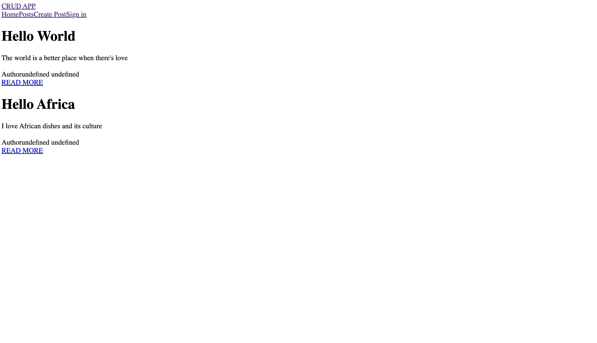
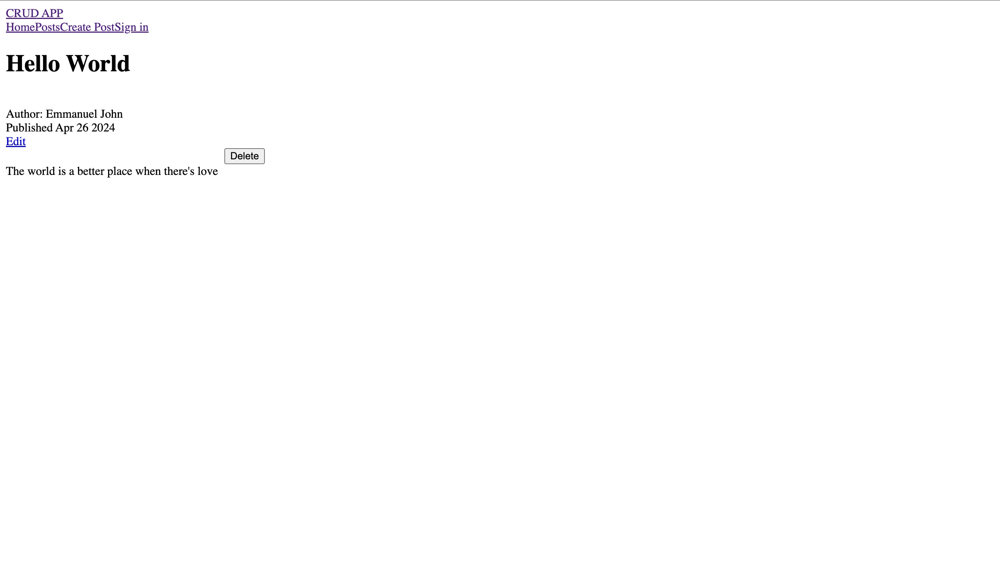
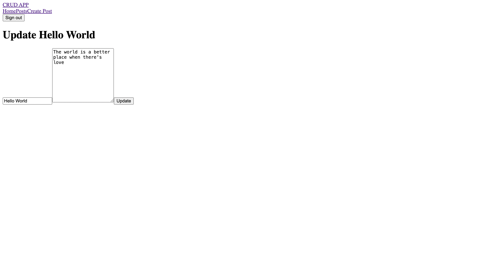

In this tutorial, you will learn how to implement authentication in a Next.js project using Directus Auth. You’ll register new users, login, handle refresh tokens, and perform create, read, update, and delete operations (CRUD), with the ability to only update or delete a user's own items.

## Before You Start

You will need:
- [Node.js](https://nodejs.org/en/download/) v18 and above installed on your computer.
- A Directus project - follow our [quickstart guide](https://docs.directus.io/blog/docs.directus.io/getting-started/quickstart) if you don't already have one.
- Some experience with Next.js and a newly-created project.

You will also need a a `posts` collection. Ensure `user_created` is enabled as an optional as it will be used to create permissions so a user can only edit or delete their own posts. Also create a `title` input field and a `content` QYSIWYG field.

## Creating a New User Role

Create a new role called `author`. Enable create and read permissions for the `posts` collection. For update and delete permissions, use custom rules and apply the following filter:

```
user_created -> id Equals $CURRENT_USER.id
```

This configuration ensures that users can read all posts but are restricted to updating and deleting only their own posts. Take note of this Role's ID in the sidebar as it will be needed in the next step.

## Allowing Public Registration

When a user first registers, they will be unauthenticated. In Directus, the permissions of unauthenticated users are controlled by the public role.

In your access control settings open the public role. Find `directus_users` under system collections, and then open custom permissions for the `create` operation.

1. In field permissions, enable only `first_name`, `last_name`, `email` and `password` options. If you want users to provide other data at the time of registration, enable the respective field.
2. In field validation, require `first_name`, `last_name`, `email`, and `password` to not be empty.
3. In field presets, set the `role` to the `id` of the author role.
This combination of settings in a custom permission will ensure users provide the required fields, and automatically set the role.

## Setting Up Directus In Your Next.js Project

In your Next.js project's `src` directory, create a `lib` directory. Inside it, create a `directus.js` file:

```js
import { createDirectus, rest, authentication } from '@directus/sdk';

const directus = createDirectus(process.env.BACKEND_URL)
  .with(authentication("cookie", {credentials: "include", autoRefresh: true}))
  .with(rest({credentials: "include"}));

export default directus;
```

In yout `src` directory, create a `constant` directory. Inside it, create a `index.js` file:

```js
export const COOKIE_NAME = "OurSiteJWT";
export const AUTH_USER = "auth_user";
```

## Handling User Session and Logout

Server actions are **asynchronous functions** that are executed on the server. They can be used in server and client components to handle form submissions and data mutations in Next.js applications.

To handle user session and logout, create an `action.js` file in the `lib` directory:

```js
"use server";
import { revalidatePath } from "next/cache";
import { directusLogin } from "./auth";
import {
  createItem,
  createUser,
  deleteItem,
  readItem,
  readItems,
  readMe,
  updateItem,
  withToken,
} from "@directus/sdk";
import directus from "@/lib/directus";
import { redirect } from "next/navigation";
import { AUTH_USER, COOKIE_NAME } from "@/constants";
import { cookies } from "next/headers";

export const handleLogout = async () => {
  cookies().delete(AUTH_USER);
  cookies().delete(COOKIE_NAME);
};

export const userSession = async () => {
  const cookieStore = cookies();
  let token = undefined;
  const cookie = cookieStore.get(COOKIE_NAME);
  if (cookie?.value) {
    token = JSON.parse(cookie?.value);
  }

  const user = {};
  if (token != undefined) {
    user.accessToken = token.data.access_token;
    user.refreshToken = token.data.refresh_token;
  }
  return user;
};
```

The `userSession` function retrieves user session information from cookies, including access and refresh tokens, and returns an object containing this information.

## Setting up a Next.js Layout

Create a `components` directory with `navbar` subdirectory. Inside  `navbar` create `Navbar.jsx` and add the following:

```javascript
import Link from "next/link"
import Links from "./links/Links"
import { auth } from "@/lib/auth";

const Navbar = async () => {

  const session = await auth();

  return (
    <div>
      <Link href="/">CRUD APP</Link>
      <div>
        <Links session={session}/>
      </div>
    </div>
  )
}
export default Navbar
```

In `navbar` create a `links` directory with `Links.jsx` and add the following:

```javascript
"use client";
import { useState } from "react";
import NavLink from "./navLink/navLink";
import { handleLogout } from "@/lib/action";

const links = [
  {
    title: "Home",
    path: "/",
  },
  {
    title: "Posts",
    path: "/blog",
  },
  {
    title: "Create Post",
    path: "/create-post",
  },
];

const Links = ({session}) => {
  const [open, setOpen] = useState(false);

  return (
    <div>
      <div>
        {links.map((link) => (
          <NavLink item={link} key={link.title} />
        ))}
        {session?.user ? (
          <>
            <form action={handleLogout}>
              <button>Sign out</button>
            </form>
          </>
        ) : (
          <NavLink item={{ title: "Sign in", path: "/login" }} />
        )}
      </div>
    </div>
  );
};
export default Links;
```

In `links` create a `navLink` directory with `navLink.jsx` and add the following:

```javascript
"use client";
import Link from "next/link";

const NavLink = ({ item }) => {

  return (
    <Link
      href={item.path}
    >
      {item.title}
    </Link>
  );
};
export default NavLink;
```

To render the `Navbar` component on all pages, update `Layout.js` as follows:

```javascript
import Navbar from "@/components/navbar/Navbar";

export const metadata = {
  title: {
    default:"Next.js 14 Homepage",
  },
  description: "Next.js Directus app",
};

export default function RootLayout({ children }) {
  return (
    <html lang="en">
      <body>
          <div>
            <Navbar />
            {children}
          </div>
      </body>
    </html>
  );
}
```

In the `app` directory, create `Loading.jsx` with the content:

```javascript
const Loading = () => {
  return (
    <div>Loading</div>
  )
}
export default Loading
```

## Protecting Routes

To handle route protection, Create the `post/layout.jsx` file and add the following:

```javascript
"use client"
import { userSession } from "@/lib/action";
import { useRouter } from "next/navigation";
import { useEffect, useState } from "react";

export default function PostLayout({ children }) {
  const [isSuccess, setIsSuccess] = useState(false);
  const router = useRouter();

  useEffect(() => {
    (async () => {
      const user = await userSession();

      if (!user.accessToken) {
        router.push("/login");
        return;
      }

      setIsSuccess(true);
    })();
  }, [router]);

  if (!isSuccess) {
    return <p>Loading...</p>;
  }
  return <div>{children}</div>;
}
```

This will ensure that only authenticated users can access the create post and update post pages.

## Implementing Registration

To send user credentials to the `Directus` backend on the user register form submission, navigate to the `action.js` file and add the following:

```javascript
...

export const register = async (previousState, formData) => {
  try {
    const { first_name, last_name, email, password } =
      Object.fromEntries(formData);
    const result = await directus.request(
      createUser({
        first_name,
        last_name,
        email,
        password,
        role: process.env.USER_ROLE,
      })
    );
    return { message: "Account Created!", status: 201 };
  } catch (e) {
    console.log(e);
    const code = e.errors[0].extensions.code;
    if (code === "RECORD_NOT_UNIQUE") {
      return { message: "This user already exist", status: 409 };
    }
    return {
      message: "An unexpected error occurred, please try again",
      status: 500,
    };
  }
};
```

In the `components` directory, create a `registerForm` subdirectory. Inside `registerForm` create `registerForm.jsx` and add the following:

```javascript
//src/app/components/registerForm/registerForm.jsx
"use client";
import { register } from "@/lib/action";
import { useFormState } from "react-dom";
import { useEffect, useState } from "react";
import { useRouter } from "next/navigation";
import Link from "next/link";

const RegisterForm = () => {
  const [state, formAction] = useFormState(register, undefined);

  const router = useRouter();
  const [error, setError] = useState('')

  useEffect(() => {
    state?.status === 201 && router.push("/login");
    state?.status === 409 && setError('A user with this email already exist');
  }, [state?.status, router]);
  

  return (
    <form action={formAction}>
      <input type="text" placeholder="First name" name="first_name" />
      <input type="text" placeholder="Last name" name="last_name" />
      <input type="email" placeholder="email" name="email" />
      <input type="password" placeholder="password" name="password" />
      <button>Register</button>
      {state?.error}
      <Link href="/login">
        Have an account? <b>Login</b>
      </Link>
      <p>{error}</p>
    </form>
  );
};
export default RegisterForm;
```

Create `(auth)` directory inside the `app` director. In the `(auth)`, create a `register` subdirectory. Inside `register` create `page.jsx` and add the following:

```javascript
//src/app/(auth)/register/page.jsx
import RegisterForm from "@/components/registerForm/registerForm";

const RegisterPage = () => {
  return (
    <div>
      <div>
        <RegisterForm/>
      </div>
    </div>
  );
};
export default RegisterPage;
```

To see the output of what you’ve built so far, run the following command in your terminal:

```bash
npm run dev
```

With the above implementation, users should be able to register.
Navigate to `http://localhost:3000/register` in your browser and you should see the following:


## Implementing Login

To send user credentials to the `Directus` backend on the user login form submission, navigate to the `lib` directory. Inside `lib` create `auth.js` and add the following:

```javascript
//src/lib/auth.js
import { COOKIE_NAME } from "@/constants";
import { cookies } from "next/headers";

export const directusLogin = async (credentials) => {
    const res = await fetch(`${process.env.BACKEND_URL}/auth/login`, {
      method: "POST",
      body: JSON.stringify(credentials),
      headers: { "Content-Type": "application/json" },
    });
    const user = await res.json();
    // If no error and we have user data, return it
    if (!res.ok && user) {
      throw new Error("Wrong credentials!");
    }
    const formatedData = JSON.stringify(user)
    cookies().set(COOKIE_NAME, formatedData)
    return user;
};
```

Navigate to the `action.js` file and add the following:

```javascript
...
export const login = async (prevState, formData) => {
  const { email, password } = Object.fromEntries(formData);

  try {
    const user = await directusLogin({ email, password });
    if (user) {
      redirect("/");
    }
  } catch (err) {
    console.log(err);
    if (err.message.includes("Wrong credentials!")) {
      return { error: "Invalid username or password" };
    }
    throw err;
  }
};
```

Create a `loginForm` subdirectory in the `components` directory. Inside `loginForm` create `loginForm.jsx` and add the following:

```javascript
//src/app/components/loginForm/loginForm.jsx
"use client";
import { login } from "@/lib/action";
import { useFormState } from "react-dom";
import Link from "next/link";

const LoginForm = () => {
  const [state, formAction] = useFormState(login, undefined);

  return (
    <form action={formAction}>
      <input type="email" placeholder="email" name="email" />
      <input type="password" placeholder="password" name="password" />
      <button>Login</button>
      {state?.error}
      <Link href="/register">
        {"Don't have an account?"} <b>Register</b>
      </Link>
    </form>
  );
};
export default LoginForm;
```

In the `(auth)` directory, create a `login` subdirectory. Inside `login` create `page.jsx` and add the following:

```javascript
//src/app/(auth)/login/page.jsx
import LoginForm from "@/components/loginForm/loginForm";

const LoginPage = () => {

  return (
    <div>
      <div>
        <LoginForm />
      </div>
    </div>
  );
};
export default LoginPage;
```

With the above implementation, registered users should be able to sign in.
Navigate to `http://localhost:3000/login` in your browser and you should see the following:


## Creating New Posts

### Creating Server Action

To create post from `Directus` backend, navigate to the `lib/action.js` file and add the following:

```javascript
export const addPost = async (prevState, formData) => {
  const { title, content, userId } = Object.fromEntries(formData);
  
  try {
      const result = await directus.request(
        createItem("posts", {
          title,
          content,
          user_created: userId,
          user_role: process.env.USER_ROLE
        })
      );
      if(result.id) {
        revalidatePath("/blog");
        redirect("/blog")
      }
  } catch (err) {
    console.log(err);
    return { error: "Something went wrong!" };
  }
};

export const getAuthUser = async (token) => {
  const userData = await directus.request(
    withToken(
      token.data.access_token,
      readMe({
        fields: ["*"],
      })
    )
  );
  return userData;
};
```

### Creating the Page

In the `post` directory, create a subdirectory `create-post`. Inside `create-post`  create `page.jsx` with the content:

```javascript
//src/app/post/create-post/page.jsx
import CreatePostForm from "@/components/createPostForm/createPostForm";
import { COOKIE_NAME } from "@/constants";
import { getAuthUser } from "@/lib/action";
import { cookies } from "next/headers";

const CreatePostPage = async () => {
  let user = {}
  const cook = cookies().get(COOKIE_NAME)
  if(cook) {
    const formatedData = JSON.parse(cook?.value)
    user = await getAuthUser(formatedData)
  }

  return (
    <div>
      <div>
        <div>
          <CreatePostForm userId = {user?.id} />
        </div>
      </div>
    </div>
  );
};

export default CreatePostPage;
```

In the `components` directory, create a subdirectory `createPostForm`. Inside `createPostForm`  create `createPostForm.jsx` with the content:

```javascript
//src/components/createPostForm/createPostForm.jsx
"use client"
import { addPost } from "@/lib/action";
import { useFormState } from "react-dom";

const CreatePostForm = ({userId}) => {
  const [state, formAction] = useFormState(addPost, undefined);
  
  return (
    <div>
      <form action={formAction} >
        <h1>Add New Post</h1>
        <input type="hidden" name="userId" value={userId} />
        <input type="text" name="title" placeholder="Title" />
        <textarea type="text" name="content" placeholder="content" rows={10} />
        <button>Add</button>
        {state?.error}
      </form>
    </div>
  );
};
export default CreatePostForm;
```

The `CreatePostForm` component provides a form for creating a new post. When the form is submitted, it calls the `addPost` function to add the post to the Directus backend. The form state is managed using the `useFormState` hook.

With the above implementation, registered users should be able to create new posts.
Navigate to `http://localhost:3000/create-post` in your browser and you should see the following:


## Creating a Listing

To render a list of all blog posts, you need to send a request to the Directus backend to fetch all post data from the posts collection created earlier in the Directus project.

Navigate to `lib/action.js` and add the following:

```javascript
//src/lib/action.js
export const getPosts = async () => {
  try {
    const result = await directus.request(
      readItems("posts", {
        fields: [
          "title",
          "id",
          "content",
          "date_created",
          "user_created.*",
        ],
      })
    );
    return result;
  } catch (error) {
    console.log(error);
  }
};
```

In the `app` directory, create a `blog` subdirectory. Inside `blog` create `page.jsx` and add the following to render the retrieved data:

```javascript
//src/app/blog/page.jsx
import PostCard from "@/components/postCard/postCard";
import { getPosts } from "@/lib/action";

const BlogPage = async () => {
  const posts = await getPosts()

  return (
    <div>
      {posts.map((post) => (
        <div key={post.id}>
          <PostCard post={post} />
        </div>
      ))}
    </div>
  );
};
export default BlogPage;
```

The blog page fetches posts data asynchronously using the `getPosts` function and renders a `PostCard` component for each post fetched.

In the `components` directory, create a `postCard` subdirectory. Inside `postCard` create `postCard.jsx` and add the following to render the posts data:

```javascript
//src/components/postCard/postCard.jsx
import Link from "next/link"
import PostUser from "../postUser/postUser"

const PostCard = async ({post}) => {

  return (
    <div >
      <div >
        <h1>{post.title}</h1>
       
        <div dangerouslySetInnerHTML={{ __html: post.content }}></div>
        <div >
          <PostUser user={post.user_created} />
        </div>
        <Link href={`/blog/${post.id}`}>READ MORE</Link>
      </div>
    </div>
  )
}
export default PostCard
```

Click on the `READ MORE`  link to get to the corresponding detail blog post page .

In the `components` directory, create a `postUser` subdirectory. Inside `postUser` create `postUser.jsx` and add the following to render the post creator data:

```javascript
//src/components/postUser/postUser.jsx
import directus from "@/lib/directus";

const PostUser = async ({ user }) => {

  return (
    <div>
      
      <div>
        <span>Author</span>
        <span
        >{`${user?.first_name} ${user?.last_name}`}</span>
      </div>
    </div>
  );
};
export default PostUser;
```

With the above implementation, users should be able to view all posts.
Navigate to `http://localhost:3000/blog` in your browser and you should see all posts:



## Viewing Single Posts

### Creating Server Action

To fetch a single post data from `Directus` backend, navigate to the `lib/action.js` file and add the following:

```JavaScript
//src/lib/action.js
export const getPost = async (slug) => {
  try {
    const post = await directus.request(
      readItem("posts", slug, {
        fields: [
          "title",
          "id",
          "content",
          "date_created",
          "user_created.*",
        ],
      })
    );
    return post;
  } catch (err) {
    console.log(err);
    throw new Error("Failed to fetch post!");
  }
};
```

The `getPost` function makes a request to Directus using the `directus.request()` method, specifying to read a single item from the "posts" collection based on the provided `slug`. Within the request, it specifies the fields to retrieve for the post.

### Creating the Page

Each blog post links to a single post detail page. In the `blog` directory, create a subdirectory `[slug]`. Inside `[slug]`  create `page.jsx` with the content:

```JavaScript
//src/app/blog/[slug]/page.jsx
import { redirect } from 'next/navigation'
import PostUser from "@/components/postUser/postUser";
import { Suspense } from "react";
import { deletePost, getAuthUser, getPost } from "@/lib/action";
import Link from "next/link";
import { cookies } from "next/headers";
import { COOKIE_NAME } from '@/constants';

export const generateMetadata = async ({ params }) => {
  const { slug } = params;
  const post =  await getPost(slug)

  return {
    title: post.title,
  };
};

const SinglePostPage = async ({ params }) => {
  const { slug } = params;
  const post = await getPost(slug)
  let user = {}
  const cook = cookies().get(COOKIE_NAME)
  if(cook) {
    const formatedData = JSON.parse(cook?.value)
    user = await getAuthUser(formatedData)
  }

  const handleDelete = async (data) => {
    "use server";
    const postId = data.get("postId");
    await deletePost(postId)
    redirect('/blog')
  };

  return (
    <div>
      <div>
        <h1>{post.title}</h1>
        <div>
          {post && (
            <Suspense fallback={<div>Loading...</div>}>
              <PostUser user={post.user_created} />
            </Suspense>
          )}
          <div>
            <span>Published</span>
            <span>
              {post.date_created.toString().slice(3, 16)}
            </span>
          </div>
          {user?.id === post?.user_created?.id &&  <div>
            <Link href={`/post/update-post/${post.id}`}>Edit</Link>
            <form action={handleDelete}>
            <input name="postId" style={{visibility: "hidden"}} value={post?.id}/>
            <input name="userId" style={{visibility: "hidden"}} value={user?.id}/>
            <button >Delete</button>
          </form>
          </div>}
        </div>
        <div dangerouslySetInnerHTML={{ __html: post.content }}></div>
      </div>
    </div>
  );
};

export default SinglePostPage;
```  

The  `SinglePostPage`  renders the  single post detail with options for editing and deleting the post if the logged in user is the post creator.
The post content is rendered using `dangerouslySetInnerHTML` to handle HTML content safely. It can only be used for trusted content.

Click on the `READ MORE`  link in a post to get to the corresponding detail blog post page as follows:



## Updating a Post

## Creating Server Action

To update post data from `Directus` backend, navigate to the `lib/action.js` file and add the following:

```javascript
export const updatePost = async (formData) => {
  const { id, title, content, userId } = formData;
  try {
    const result = await directus.request(
      updateItem('posts', id, {
        title: title,
        user_updated: userId,
        content,
      })
    );
    if(result.id) {
      revalidatePath("/blog");
      redirect("/blog")
    }
  } catch (err) {
    console.log(err);
    return { error: "Something went wrong!" };
  }
};
```

The `updatePost` function handles both the case of updating the post content and the case of updating the associated image. If a new image is uploaded, it first uploads the image and then updates the post with the new image ID. If an existing image is used, it directly updates the post with the existing image ID.

### Creating the Page

In the `post` directory, create a subdirectory `update-post`. Inside `update-post`  create a subdirectory `[slug]`. Inside `[slug]` create `pages.jsx` with the content:

```javascript
//src/app/post/update-post/[slug]/page.jsx
import { getAuthUser, getPost } from "@/lib/action";
import { cookies } from "next/headers";
import UpdatePostForm from "@/components/updatePostForm/updatePostForm";
import { COOKIE_NAME } from "@/constants";

const UpdatePage = async ({ params }) => {
  const { slug } = params;
  const post = getPost(slug)
  let user = {}
  const cook = cookies().get(COOKIE_NAME)
  if(cook) {
    const formatedData = JSON.parse(cook?.value)
    user = await getAuthUser(formatedData)
  }

  return (
    <div>
      <div>
        <div>
          <UpdatePostForm post={post} userId = {user?.id} />
        </div>
      </div>
    </div>
  );
};

export default UpdatePage;
```

In the `components` directory, create a subdirectory `updatePostForm`. Inside `updatePostForm`  create `updatePostForm.jsx` with the content:

```javascript
//src/components/updatePostForm/updatePostForm.jsx
"use client"
import { updatePost } from "@/lib/action";
import { useState } from "react";

const UpdatePostForm = ({userId, post}) => {
  const [formState, setFormState] = useState({
    id: post.id,
    title: post.title,
    content: post.content,
    userId
  });

  const handleSubmit = () => {
    updatePost(formState)
  }
  
  return (
    <div>
      <form onSubmit={handleSubmit}>
        <h1>Update {post.title}</h1>
        <input type="text" name="title" value={formState.title} onChange={(e)=> setFormState({...formState, title: e.target.value}) } placeholder="Title" />
        <textarea type="text" name="content" value={formState.content} onChange={(e)=> setFormState({...formState, content: e.target.value}) } placeholder="content" rows={10} />
        <button>Update</button>
      </form>
    </div>
  );
};
export default UpdatePostForm;
```

The `UpdatePostForm` component provides a form for updating an existing post. When the form is submitted, it calls the `updatePost` function to update the post in the Directus backend.

Click on the `Edit`  link in a detail post page to get to the corresponding update post page as follows:



## Deleting Posts

To delete post data from the `Directus` backend, navigate to the `lib/action.js` file and add the following:

```javascript
export const deletePost = async (postId) => {
  try {
    await directus.request(deleteItem('posts', postId));
    revalidatePath("/blog");
  } catch (err) {
    console.log(err);
    return { error: "Something went wrong!" };
  }
};
```

Click the `Delete` button on a detail post page to delete the post.

## Summary

With this tutorial, you’ve learnt how to implement Directus authentication in a Next.js 14 Project, dynamically create, read, update, delete posts, and successfully built a full-stack CRUD application with Directus for the backend and Next.js for the frontend.

There are so many ways this can be improved, and I can’t wait to see what you build next with Directus and Next.js.
