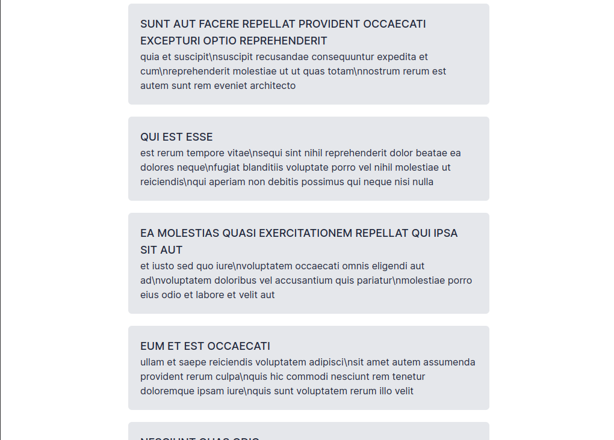

When working with a large set of data fetching and rendering them at once can cause performance issues for your application, especially for devices with poor internet connections. To prevent this, several techniques are used to fetch and render data in chunks. Two of the most common ones are pagination and infinite scrolling.

In this tutorial, you will learn how to implement pagination and infinite scrolling in Next.js with the Directus SDK, and understand benefits and drawbacks of both approaches.

## Before You Start

You will need:

- A Directus project - follow the [quickstart](https://docs.directus.io/getting-started/quickstart.html) guide to create a project if you don’t have one already.
- Knowledge of Next.js.

## Adding Data to Directus

You will need some data to work with to implement the pagination and infinite scrolling. In your Directus project, navigate to **Settings -> Data Model** and create a new collection called `posts` with a text input called `title` and a textarea field called `body`.

Navigate to the **Content Module** and add at least 10 items to the **Posts** collection. You can get sample data from the [JSONPlaceholder posts resource](https://jsonplaceholder.typicode.com/posts).

To make the collection publicly accessible, navigate to **Settings -> Access Control -> Public** and give Read access to the `posts` collection.

## Setting Up a Next.js Project

Open your terminal, and enter the following command to create a new Next.js project, install dependencies, and run a development server:

```shell
npx create-next-app@latest
✔ What is your project named? next-directus-app
✔ Would you like to use TypeScript? No
✔ Would you like to use ESLint? Yes
✔ Would you like to use Tailwind CSS? Yes
✔ Would you like to use `src/` directory? No
✔ Would you like to use App Router? (recommended) Yes
✔ Would you like to customize the default import alias (@/*)? No

cd next-directus-app
npm install @directus/sdk
npm run dev
```

In the root directory of the project, create a new directory called `lib`. Inside it create a `directus.js` file and include the following lines of code to initialize Directus and disable the default caching behavior of the Next.js [fetch()](https://nextjs.org/docs/app/api-reference/functions/fetch#fetchurl-options) function:

```js
import { createDirectus, rest } from "@directus/sdk";
const directus = createDirectus("<your-directus-project-url>").with(
  rest({
    onRequest: (options) => ({ ...options, cache: "no-store" }),
  })
);
export default directus;
```

Make sure to modify `<your-directus-project-url>` with your project's URL.

## Fetching Data in Chunks

To fetch data in chunks using an API, usually, two parameters are required. The first is a `limit` that determines the maximum number of items returned, and the second is a parameter that determines the starting point of the items to be fetched, it is usually associated with a type of pagination (e.g. cursor-based pagination, offset-based, pagination, etc.).

In Directus the second parameter can be either [offset](https://docs.directus.io/reference/query.html#offset) and [page](https://docs.directus.io/reference/query.html#page) which are associated with offset-based and page-based pagination respectively.

- Offset-based pagination: This deals with specifying a value (or offset) that indicates the number of items to skip or where the items being fetched should start from. It works hand-in-hand with the `limit` parameter to return a fixed number of items. For example, for a dataset of 200 items, if `offset=20` and `limit=10`, items 21-30 will be returned.
- Page-based pagination: This is an abstraction of the offset-based pagination where a page number is specified (e.g. 1, 2, 3) which will be used under the hood to calculate the offset.

For this tutorial, the `page` parameter will be used to implement both the pagination and infinite scrolling.

## Implementing Pagination

Modify the `app/page.js` file to the following:

```js
import directus from "@/lib/directus";
import { readItems } from "@directus/sdk";

const getPosts = async () => {
  return directus.request(readItems("posts"));
};

export default async function Home() {
  const posts = await getPosts();

  return (
    <div>
      <ul>
        {posts.map((post) => {
          return (
            <li key={post.id}>
              <h2>{post.title}</h2>
              <p>{post.body}</p>
            </li>
          );
        })}
      </ul>
    </div>
  );
}
```

This is a Server Component that will fetch all your posts from Directus using the `getPost()` function and render HTML in the server which will then be sent to the client.
If you navigate to `http://localhost:3000` in your browser you should see all your posts:



To add pagination, first, modify the `app/page.js` file to the following:

```js
import directus from "@/lib/directus";
import { readItems } from "@directus/sdk";

const getPosts = async (limit, page) => {
  return directus.request(
    readItems("posts", {
      limit,
      page,
    })
  );
};

export default async function Home({ searchParams }) {
  const LIMIT = 4;
  const currentPage = parseInt(searchParams.page) || 1;
  const posts = await getPosts(LIMIT, currentPage);
  return (
    <div>
      <ul>
        {posts.map((post) => {
          return (
            <li key={post.id}>
              <h2>{post.title}</h2>
              <p>{post.body}</p>
            </li>
          );
        })}
      </ul>
    </div>
  );
}
```

The `getPosts()` function will now return a maximum of 4 posts at a time. The set of posts returned is based on the page number passed to it which is gotten from the URL as a query parameter and is defaulted to 1. So currently the first 4 posts will be rendered and when the page number is increased the next set of posts will be rendered.

To be able to add and modify the page query parameter from the UI for navigating between pages, in the root directory, create a `components` directory, inside it, create a `Pagination.js` file, and add the following lines of code:

```js
import directus from "@/lib/directus";
import { aggregate } from "@directus/sdk";
import Link from "next/link";

const getTotalPostCount = async () => {
  const totalCount = await directus.request(
    aggregate("posts", {
      aggregate: { count: "*" },
    })
  );
  return totalCount[0].count;
};

async function Pagination({ limit, currentPage }) {
  const totalPostCount = await getTotalPostCount();
  const totalPages = Math.ceil(totalPostCount / limit);

  const hasMorePage = () => {
    const recievedPostsCount = limit * currentPage;
    return recievedPostsCount < totalPostCount;
  };

  return (
    <div>
      <Link href={currentPage <= 2 ? "/" : `?page=${currentPage - 1}`}>
        &laquo; Previous
      </Link>
      {Array.from(Array(totalPages), (_, i) => i + 1).map((page) => (
        <Link
          key={page}
          href={page === 1 ? "/" : `?page=${page}`}
          className={page === currentPage ? "active" : ""}
        >
          {page}
        </Link>
      ))}
      <Link
        href={
          hasMorePage() ? `?page=${currentPage + 1}` : `?page=${currentPage}`
        }
      >
        Next &raquo;
      </Link>
    </div>
  );
}

export default Pagination;
```

Here the Directus `aggregate()` function is used to calculate and return the total number of posts. The result is used to calculate the total number of pages and create a `hasMorePage()` function which will check if there are more pages.
In the return statement, we are rendering the pagination nav elements to be used to add and modify the page query parameter which includes a previous button, numeric links rendered using the total number of pages, and a next button that uses the `hasMorePage()` function to prevent further navigation.

To render to `Pagination` component, In the `app/page.js` file, add the following import:

```js
import Pagination from "@/components/Pagination";
```

Then, add the following line of code after the close `</ul>` tag:

```js
<Pagination limit={LIMIT} currentPage={currentPage} />
```

Here is what the `app/page.js` file, should now look like:

```js
import Pagination from "@/components/Pagination";
import directus from "@/lib/directus";
import { readItems } from "@directus/sdk";

const getPosts = async (limit, page) => {
  return directus.request(
    readItems("posts", {
      limit,
      page,
    })
  );
};

export default async function Home({ searchParams }) {
  const LIMIT = 4;
  const currentPage = parseInt(searchParams.page) || 1;
  const posts = await getPosts(LIMIT, currentPage);
  return (
    <div>
      <ul>
        {posts.map((post) => {
          return (
            <li key={post.id}>
              <h2>{post.title}</h2>
              <p>{post.body}</p>
            </li>
          );
        })}
      </ul>
      <Pagination limit={LIMIT} currentPage={currentPage} />
    </div>
  );
}
```

With this, you can now navigate between pages from the UI:


## Implementing Infinite Scrolling

Infinite scrolling requires browser events or the Intersection observer JavaScript API to be implemented so it needs to be done on the client side but one way we can improve this is to load the initial HTML from the server. For that, we will be using [Serve Actions](https://nextjs.org/docs/app/building-your-application/data-fetching/server-actions-and-mutations).

In the root directory, create a `components` directory, inside it, create a `PostList.js` file and add the following lines of code:

```js
"use client";

import { useState } from "react";

const PostList = ({ initialPosts, getPosts, limit, totalPostCount }) => {
  const [posts, setPosts] = useState(initialPosts);

  return (
    <>
      <ul className="max-w-[600px] mx-auto grid gap-5 pt-10">
        {posts?.map((post) => (
          <li key={post.id} className="p-5 rounded-md bg-gray-200 text-black">
            <h2 className="uppercase text-lg font-medium">{post.title}</h2>
            <p>{post.body}</p>
          </li>
        ))}
      </ul>
      <span>No more posts</span>
    </>
  );
};

export default PostList;
```

This component will receive the initial posts and render them.

Modify the `app/page.js` file to the following:

```js
import PostList from "@/components/PostList";
import directus from "@/lib/directus";
import { readItems } from "@directus/sdk";

const getPosts = async () => {
  "use server";
  return await directus.request(readItems("posts"));
};

export default async function Home() {
  const initialPosts = await getPosts();

  return (
    <>
      <div>
        <PostList initialPosts={initialPosts} />
      </div>
    </>
  );
}
```

Here a Server Action is created which is used to fetch all posts and pass the result as props to the `PostList` component. If you navigate to `http://localhost:3000` in your browser you should see all your posts:


To add infinite scrolling, first, modify the `app/page.js` file to the following:

```js
import PostList from "@/components/PostList";
import directus from "@/lib/directus";
import { aggregate, readItems } from "@directus/sdk";

const getPosts = async (page, limit) => {
  "use server";
  return await directus.request(
    readItems("posts", {
      limit,
      page,
    })
  );
};

const getTotalPostCount = async () => {
  const totalCount = await directus.request(
    aggregate("posts", {
      aggregate: { count: "*" },
    })
  );
  return totalCount[0].count;
};

export default async function Home() {
  const LIMIT = 6;
  const initialPosts = await getPosts(1, LIMIT);
  const totalPostCount = await getTotalPostCount();

  return (
    <>
      <div>
        <PostList
          getPosts={getPosts}
          limit={LIMIT}
          initialPosts={initialPosts}
          totalPostCount={totalPostCount}
        />
      </div>
    </>
  );
}
```

The `getPosts()` function will now return a maximum of 6 posts at a time. The set of posts returned is based on the page number passed to it. Increasing the page number will get the next set of posts.

Using the Directus `aggregate()` function, a `getTotalPostCount()` function was created to calculate and get the total number of posts. The result of the function along with the limit and `getPosts()` is then passed to the `PostList` component where they will be used.

Modify the `components/PostList.js` file to the following:

```js
"use client";

import { useState } from "react";

const PostList = ({ initialPosts, getPosts, limit, totalPostCount }) => {
  const [currentPage, setCurrentPage] = useState(1);
  const [posts, setPosts] = useState(initialPosts);

  const hasMorePosts = () => {
    const recievedCount = limit * currentPage;
    return recievedCount < totalPostCount;
  };

  return (
    <>
      <ul className="max-w-[600px] mx-auto grid gap-5 pt-10">
        {posts?.map((post) => (
          <li key={post.id} className="p-5 rounded-md bg-gray-200 text-black">
            <h2 className="uppercase text-lg font-medium">{post.title}</h2>
            <p>{post.body}</p>
          </li>
        ))}
      </ul>
      {hasMorePosts() ? (
        <span className="text-center block py-10">Loading...</span>
      ) : (
        <span className="text-center block p-10">No more posts</span>
      )}
    </>
  );
};

export default PostList;
```

Here the total number of posts passed as props is now used to create a `hasMorePosts()` function to check if there are more posts. The `hasMorePosts()` is then used to conditionally render a loading indicator.

To start fetching subsequent posts the Intersection Observer API will be used to observe the loading indicator, and when it enters the viewport more posts will be fetched.

Add the following import to the `components/PostList.js` file:

```js
import { useRef, useEffect } from "react";
```

Call the `useRef()` hook by adding the following line of code after the `posts` state:

```js
const observerElem = useRef(null);
```

To access the loading indicator element using the ref object, modify the `<span>` tag that display’s the loading indicator to the following:

```js
<span className="text-center block py-10" ref={observerElem}>
```

Finally, to start fetching new posts when the loading indicator enters the view post, add the following line code after the `observerElem` ref object:

```js
useEffect(() => {
  if (typeof window === "undefined" || !window.IntersectionObserver) return;
  const element = observerElem.current;
  const option = { threshold: 0 };

  const observer = new IntersectionObserver(handleObserver, option);
  if (element) observer.observe(element);
  return () => observer.unobserve(element);
}, [currentPage]);

const fetchMorePosts = async () => {
  const nextPage = currentPage + 1;
  const fetchedPosts = await getPosts(nextPage, limit);
  setPosts((prevPosts) => [...prevPosts, ...fetchedPosts]);
  setCurrentPage(nextPage);
};

const handleObserver = (entries) => {
  const [target] = entries;
  if (target.isIntersecting && hasMorePosts()) {
    fetchMorePosts();
  }
};
```

Here in the `useEffect` hook the Intersection Observer API is used to observe the `<span>` element of the loading indicator. At initial mount and when the `<span>` enters and exists the viewport, the `handleObserver()` callback function is called which will then call `fetchMorePosts()` to fetch new posts and update the state whenever there are more posts and the `<span>` element enters the viewport.

With this, the infinite scrolling should now be working:


## Which To Use

As with most topics, the answer is "it depends". Paginated lists tend to have better performance Search Engine Optimization (SEO) as all page content (typically smaller) is initially loaded on the page. Infinite scrolling is better at maintaining attention and exploration

You can read more on how to implement SEO-friendly pagination amd infinite scrolling in the [Google Search Central Blog](https://developers.google.com/search/blog/2014/02/infinite-scroll-search-friendly).

## Summary

With this tutorial, you’ve learned how to implement pagination and infinite scrolling with Directus in Next.js, and also about important factors that will help you make the choice between infinite scrolling and pagination for your app.
