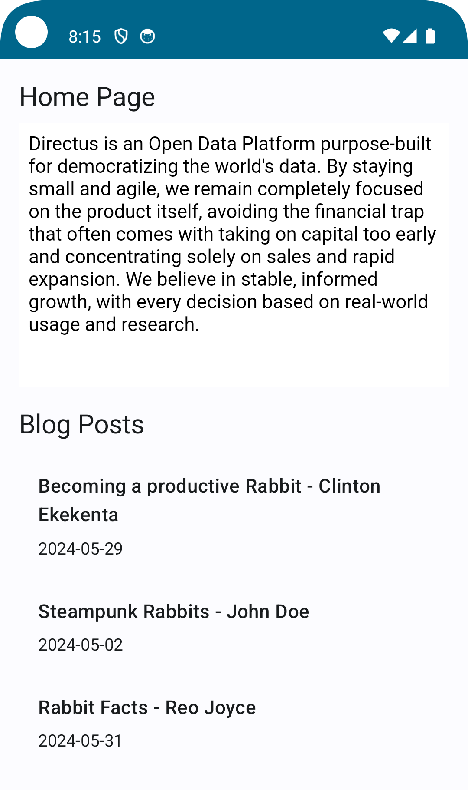

In this tutorial, you will learn how to set up an Android project with Kotlin and Directus. We'll cover initializing the project, creating a helper library for the Directus SDK, setting up global configurations, and creating dynamic pages, including a blog listing and a blog single view.

## Before You Start
You will need:
- A Directus project - follow our [quickstart guide](https://docs.directus.io/getting-started/quickstart) if you don't already have one.
- knowledge of Kotlin
- [Android Studio](https://developer.android.com/studio) installed on your computer


## Initialize project
Create a new Directus Cloud project - any tier and configuration will work for this tutorial. Open your Android Studio and create a new project by clicking `Start a new Android Studio project` from the welcome screen, or click on File -> New -> New Project if you created a project on Android Studio before. Select `Empty Activity`, name your project `DirectusApp` and, click the `Finish` button.

Open your `build.gradule` module file and add the following dependencies in the dependencies section:

```
dependencies {
    implementation("androidx.navigation:navigation-fragment-ktx:2.3.5")
    implementation("androidx.navigation:navigation-ui-ktx:2.3.5")
    implementation("com.squareup.retrofit2:retrofit:2.9.0")
    implementation("com.squareup.retrofit2:converter-gson:2.9.0")
    implementation("org.jetbrains:markdown:0.7.3")
)
```

Once the changes are made, a modal will appear suggesting you sync the project. Click on the Sync button to install the dependencies.

## Create a helper library for the SDK
Right-click on the `com.example.directusapp` directory and select New -> Package to create a network package. In your network package, create a new Kotlin file named `DirectusHelper` and define the Directus API service:

```
package com.example.directusapp.network

import retrofit2.Retrofit
import retrofit2.converter.gson.GsonConverterFactory

interface DirectusApiService {
    companion object {
        private const val BASE_URL = "https://directus.example.com"

        fun create(): DirectusApiService {
            val retrofit = Retrofit.Builder()
                .baseUrl(BASE_URL)
                .addConverterFactory(GsonConverterFactory.create())
                .build()
            return retrofit.create(DirectusApiService::class.java)
        }
    }
}
```

The above code defines a `DirectusAPIService` that includes a `create()` function to set up a Retrofit instance. This function creates a `Retrofit.Builder` object, sets the base URL using `baseUrl(BASE_URL)`, adds the GsonConverterFactory for handling JSON data conversion, builds the Retrofit instance with `build()`, and creates an implementation of the DirectusApiService interface using `create(DirectusApiService::class.java)`.

Similarly to the network package, crate a model and create a new Kotlin file named `Models` in the model package and define the app models:

```
package com.example.directusapp.model

data class Author(
    val id: Int,
    val name: String,
)

data class Blog(
    val id: Int,
    val title: String,
    val content: String,
    val dateCreated: String,
    val author: Author
)

data class Page(
    val slug: String,
    val title: String,
    val content: String,
)

data class Global(
    val id: Int,
    val title: String,
    val description: String,
)

data class BlogResponse(
    val data: Blog
)

data class BlogsResponse(
    val data: List<Blog>
)

data class PageResponse(
    val data: List<Page>
)

data class GlobalResponse(
    val data: Global
)
```

The above code defines data classes for different Directus collections and their respective response models.

## Using Global Metadata and Settings
In your Directus Data Studio, click on Settings -> Data Model and create a new collection named `global`. Select 'Treat as a single object' under the Singleton option because this will only have a single entry containing the app's global metadata. Create two text input fields - one with the key `title` and one with `description`.

Dirctus collections are not accessible to the public by default, click on Settings -> Access Control -> Public and give Read access to the Global collection.

Then click on the content module and select the global collection. A collection would normally display a list of items, but since this is a singleton, it will launch directly into the one-item form. Enter information in the title and description field and hit save.


Update the code in your `DirectusHelper.kt` file in your network package to define a Get endpoint to fetch the global metadata from Directus:

```
package com.example.directusapp.network

import com.example.directusapp.model.GlobalResponse
import retrofit2.Retrofit
import retrofit2.converter.gson.GsonConverterFactory
import retrofit2.http.GET

interface DirectusApiService {
    @GET("items/global")
    suspend fun getGlobal(): GlobalResponse

    companion object {
        private const val BASE_URL = "https://directus.example.com"

        fun create(): DirectusApiService {
            val retrofit = Retrofit.Builder()
                .baseUrl(BASE_URL)
                .addConverterFactory(GsonConverterFactory.create())
                .build()
            return retrofit.create(DirectusApiService::class.java)
        }
    }
}
```    

Right-click on your ui package, and create a new Kotlin file named `HomePageScreen`:

```
package com.example.directusapp.ui

import androidx.compose.foundation.layout.Column
import androidx.compose.foundation.layout.Spacer
import androidx.compose.foundation.layout.fillMaxSize
import androidx.compose.foundation.layout.height
import androidx.compose.foundation.layout.padding
import androidx.compose.material3.MaterialTheme
import androidx.compose.material3.Text
import androidx.compose.runtime.*
import androidx.compose.ui.Modifier
import androidx.compose.ui.unit.dp
import kotlinx.coroutines.launch
import com.example.directusapp.model.GlobalResponse
import com.example.directusapp.network.DirectusApiService

@Composable
fun BlogHomeScreen() {
    var globalResponse by remember { mutableStateOf<GlobalResponse?>(null) }
    var errorMessage by remember { mutableStateOf<String?>(null) }

    val scope = rememberCoroutineScope()

    LaunchedEffect(Unit) {
        scope.launch {
            try {
                val apiService = DirectusApiService.create()
                globalResponse = apiService.getGlobal()

            } catch (e: Exception) {
                errorMessage = e.message
            }
        }
    }

    if (errorMessage != null) {
        Text(text = "Error: $errorMessage", color = MaterialTheme.colorScheme.error)
    } else {
        Column(
            modifier = Modifier
                .fillMaxSize()
                .padding(16.dp)
        ) {
            globalResponse?.let { response ->
                Text(text = response.data.title, style = MaterialTheme.typography.titleLarge)
                Spacer(modifier = Modifier.height(8.dp))
                Text(text = response.data.description, style = MaterialTheme.typography.titleLarge)
                Spacer(modifier = Modifier.height(16.dp))
            }
        }
    }
}
```

Update your `MainActivity` class in the `MainActivity.kt` file to render the `BlogHomeScreen` screen.

```
package com.example.directusapp

import android.os.Bundle
import androidx.activity.ComponentActivity
import androidx.activity.compose.setContent
import androidx.compose.foundation.layout.fillMaxSize
import androidx.compose.material3.MaterialTheme
import androidx.compose.material3.Surface
import androidx.compose.material3.Text
import androidx.compose.runtime.Composable
import androidx.compose.ui.Modifier
import androidx.compose.ui.tooling.preview.Preview
import com.example.directusapp.ui.BlogHomeScreen
import com.example.directusapp.ui.theme.DirectusAppTheme

class directusapp : ComponentActivity() {
    override fun onCreate(savedInstanceState: Bundle?) {
        super.onCreate(savedInstanceState)
        setContent {
            DirectusAppTheme {
                // A surface container using the 'background' color from the theme
                Surface(
                    modifier = Modifier.fillMaxSize(),
                    color = MaterialTheme.colorScheme.background
                ) {
                    BlogHomeScreen()
                }
            }
        }
    }
}
```

Update your `AndroidManifest.xml` file in `app/src/main/` directory and grant your application access to the internet.

```
<?xml version="1.0" encoding="utf-8"?>
<manifest xmlns:android="http://schemas.android.com/apk/res/android"
    xmlns:tools="http://schemas.android.com/tools">

    <application
        android:allowBackup="true"
        android:dataExtractionRules="@xml/data_extraction_rules"
        android:fullBackupContent="@xml/backup_rules"
        android:icon="@mipmap/ic_launcher"
        android:label="@string/app_name"
        android:roundIcon="@mipmap/ic_launcher_round"
        android:supportsRtl="true"
        android:theme="@style/Theme.DirectusApp"
        tools:targetApi="31">
        <activity
            android:name=".MainActivity"
            android:exported="true"
            android:label="@string/app_name"
            android:theme="@style/Theme.DirectusApp">
            <intent-filter>
                <action android:name="android.intent.action.MAIN" />

                <category android:name="android.intent.category.LAUNCHER" />
            </intent-filter>
        </activity>
    </application>
    
    <!-- Added this line to request internet access -->
    <uses-permission android:name="android.permission.INTERNET" />
</manifest>
```

Now click on the Run icon at the top of your Android Studio Window to run the application.


## Creating Pages With Directus
Create a new collection called `pages` - make the Primary ID Field a "Manually Entered String" called `slug`, which will correlate with the URL for the page. For example, about will later correlate to the page localhost:3000/about.

Create a text input field called `title` and a `WYSIWYG` input field called `content`. In Access Control, give the Public role read access to the new collection. Create 3 items in the new collection - [here's some sample data](https://github.com/directus-labs/getting-started-demo-data).


Then update your `DirectusHelper` file to add another endpoint to fetch the page data from Directus:

```
package com.example.directusapp.network

import com.example.directusapp.model.GlobalResponse
import com.example.directusapp.model.PageResponse
import retrofit2.Retrofit
import retrofit2.converter.gson.GsonConverterFactory
import retrofit2.http.GET


interface DirectusApiService {
    @GET("items/global")
    suspend fun getGlobal(): GlobalResponse

    @GET("items/pages")
    suspend fun getPages(): PageResponse

    companion object {
        private const val BASE_URL = "https://directus.example.com"

        fun create(): DirectusApiService {
            val retrofit = Retrofit.Builder()
                .baseUrl(BASE_URL)
                .addConverterFactory(GsonConverterFactory.create())
                .build()
            return retrofit.create(DirectusApiService::class.java)
        }
    }
}
```   
    
Update your `BlogHomeScreen` to display the pages data:

```
package com.example.directusapp.ui

import androidx.compose.foundation.clickable
import androidx.compose.foundation.layout.Column
import androidx.compose.foundation.layout.Spacer
import androidx.compose.foundation.layout.fillMaxSize
import androidx.compose.foundation.layout.fillMaxWidth
import androidx.compose.foundation.layout.height
import androidx.compose.foundation.layout.padding
import androidx.compose.material3.MaterialTheme
import androidx.compose.material3.Text
import androidx.compose.runtime.*
import androidx.compose.ui.Modifier
import androidx.compose.ui.unit.dp
import androidx.navigation.NavController
import kotlinx.coroutines.launch
import androidx.compose.foundation.lazy.LazyColumn
import com.example.directusapp.ui.MarkdownView

@Composable
fun BlogHomeScreen(navController: NavController) {
    var globalResponse by remember { mutableStateOf<GlobalResponse?>(null) }
    var pagesResponse by remember { mutableStateOf<PageResponse?>(null) }

    var errorMessage by remember { mutableStateOf<String?>(null) }

    val scope = rememberCoroutineScope()

    LaunchedEffect(Unit) {
        scope.launch {
            try {
                val apiService = DirectusApiService.create()
                globalResponse = apiService.getGlobal()
                pagesResponse = apiService.getPages()

            } catch (e: Exception) {
                errorMessage = e.message
            }
        }
    }

    if (errorMessage != null) {
        Text(text = "Error: $errorMessage", color = MaterialTheme.colorScheme.error)
    } else {
        Column(
            modifier = Modifier
                .fillMaxSize()
                .padding(16.dp)
        ) {
            pagesResponse?.let { response ->
              Text(text = response.data[0].title, style = MaterialTheme.typography.titleLarge)
              Spacer(modifier = Modifier.height(8.dp))
              MarkdownView(markdownText = response.data[0].content.trimIndent())
              Spacer(modifier = Modifier.height(16.dp))
            }
        }
    }
}
```

Create another file named `MarkdownView` and create a `MarkdownView` composable function to render the `WYSIWYG` content from the collection of the pages:

```
package com.example.directusapp.ui

import android.webkit.WebView
import android.webkit.WebViewClient
import androidx.compose.runtime.Composable
import androidx.compose.ui.viewinterop.AndroidView
import org.intellij.markdown.flavours.gfm.GFMFlavourDescriptor
import org.intellij.markdown.html.HtmlGenerator
import org.intellij.markdown.parser.MarkdownParser

@Composable
fun MarkdownView(markdownText: String) {
    val htmlContent = markdownToHtml(markdownText)

    AndroidView(factory = { context ->
        WebView(context).apply {
            webViewClient = WebViewClient()
            loadDataWithBaseURL(null, htmlContent, "text/html", "UTF-8", null)
        }
    }, update = {
        it.loadDataWithBaseURL(null, htmlContent, "text/html", "UTF-8", null)
    })
}

fun markdownToHtml(markdownText: String): String {
    val flavour = GFMFlavourDescriptor()
    val parser = MarkdownParser(flavour)
    val parsedTree = parser.buildMarkdownTreeFromString(markdownText)
    val htmlGenerator = HtmlGenerator(markdownText, parsedTree, flavour)
    return htmlGenerator.generateHtml()
}
```

Refresh the app to see the changes.


## Creating Blog Posts With Directus
Back to your Directus Data studio, create a collection to store and manage your user's blog posts. First, create a collection named `author` with a single text input field named `name`. Add one or more authors to the collection.

Create another collection called `blogs` and add the following fields:

- slug: Primary key field, Manually entered string
- title: Text input field
- content: WYSIWYG input field
- image: Image relational field
- author: Many-to-one relational field with the related collection set to authors

Add 3 items in the posts collection - [here's some sample data](https://github.com/directus-labs/getting-started-demo-data).


Then update your `DirectusHelper` file to add another endpoint to fetch the blog data:
  
```
package com.example.directusapp.network

import com.example.directusapp.model.BlogsResponse
import com.example.directusapp.model.GlobalResponse
import com.example.directusapp.model.PageResponse
import retrofit2.Retrofit
import retrofit2.converter.gson.GsonConverterFactory
import retrofit2.http.GET


interface DirectusApiService {
    @GET("items/global")
    suspend fun getGlobal(): GlobalResponse

    @GET("items/pages")
    suspend fun getPages(): PageResponse

    @GET("items/blogs?fields=*,author.name")
    suspend fun getBlogs(): BlogsResponse

    companion object {
        private const val BASE_URL = "https://test.directus.app/"

        fun create(): DirectusApiService {
            val retrofit = Retrofit.Builder()
                .baseUrl(BASE_URL)
                .addConverterFactory(GsonConverterFactory.create())
                .build()
            return retrofit.create(DirectusApiService::class.java)
        }
    }
}
```   

Update your `BlogHomeScreen` to render the blogs:

```
package com.example.directusapp.ui

import androidx.compose.foundation.clickable
import androidx.compose.foundation.layout.Column
import androidx.compose.foundation.layout.Spacer
import androidx.compose.foundation.layout.fillMaxSize
import androidx.compose.foundation.layout.fillMaxWidth
import androidx.compose.foundation.layout.height
import androidx.compose.foundation.layout.padding
import androidx.compose.material3.MaterialTheme
import androidx.compose.material3.Text
import androidx.compose.runtime.*
import androidx.compose.ui.Modifier
import androidx.compose.ui.unit.dp
import androidx.navigation.NavController
import kotlinx.coroutines.launch
import androidx.compose.foundation.lazy.LazyColumn
import androidx.compose.ui.graphics.BlendMode.Companion.Screen
import com.example.directusapp.ui.MarkdownView
import com.example.directusapp.model.GlobalResponse
import com.example.directusapp.model.PageResponse
import com.example.directusapp.model.BlogsResponse
import com.example.directusapp.model.Blog
import com.example.directusapp.network.DirectusApiService

@Composable
fun BlogHomeScreen(navController: NavController) {
    var blogsResponse by remember { mutableStateOf<BlogsResponse?>(null) }
    var pagesResponse by remember { mutableStateOf<PageResponse?>(null) }
    var globalResponse by remember { mutableStateOf<GlobalResponse?>(null) }
    var errorMessage by remember { mutableStateOf<String?>(null) }

    val scope = rememberCoroutineScope()

    LaunchedEffect(Unit) {
        scope.launch {
            try {
                val apiService = DirectusApiService.create()
                blogsResponse = apiService.getBlogs()
                pagesResponse = apiService.getPages()
                globalResponse = apiService.getGlobal()
                println(pagesResponse)
                println(globalResponse)

            } catch (e: Exception) {
                errorMessage = e.message
            }
        }
    }

    if (errorMessage != null) {
        Text(text = "Error: $errorMessage", color = MaterialTheme.colorScheme.error)
    } else {
        Column(
            modifier = Modifier
                .fillMaxSize()
                .padding(16.dp)
        ) {
            // Display the page title and content
            pagesResponse?.let { response ->
                Text(text = response.data[0].title, style = MaterialTheme.typography.titleLarge)
                Spacer(modifier = Modifier.height(8.dp))
                MarkdownView(markdownText = response.data[0].content.trimIndent())
                Spacer(modifier = Modifier.height(16.dp))
            }
            Text(text = "Blog Posts", style = MaterialTheme.typography.titleLarge)
            Spacer(modifier = Modifier.height(10.dp))
            blogsResponse?.let { response ->
                LazyColumn {
                    items(response.data.size) { index ->
                        BlogItem(response.data[index], navController)
                    }
                }
            }
        }
    }
}

@Composable
fun BlogItem(blog: Blog, navController: NavController) {
    Column(
        modifier = Modifier
            .fillMaxWidth()
            .clickable {
                navController.navigate(Screen.BlogDetail.createRoute(blog.id))
                println(blog.id)
            }
            .padding(16.dp)
    ) {

        Text(text = "${blog.title} - ${blog.author}", style = MaterialTheme.typography.titleMedium)
        Spacer(modifier = Modifier.height(8.dp))
        Text(text = blog.dateCreated, style = MaterialTheme.typography.bodyMedium)
    }
}
```

Refresh your application to see the updates.



## Create Blog Post Listing
Each blog post links to a screen that does not yet exist. Right-click the ui package and create a new Kotlin file named `BlogDetailScreen`:

```
package com.example.directusapp.ui

import androidx.compose.foundation.layout.Column
import androidx.compose.foundation.layout.Spacer
import androidx.compose.foundation.layout.fillMaxSize
import androidx.compose.foundation.layout.height
import androidx.compose.foundation.layout.padding
import androidx.compose.material3.ExperimentalMaterial3Api
import androidx.compose.material3.Icon
import androidx.compose.material3.IconButton
import androidx.compose.material3.MaterialTheme
import androidx.compose.material3.Scaffold
import androidx.compose.material3.Text
import androidx.compose.material3.TopAppBar
import androidx.compose.runtime.Composable
import androidx.compose.runtime.LaunchedEffect
import androidx.compose.runtime.getValue
import androidx.compose.runtime.mutableStateOf
import androidx.compose.runtime.remember
import androidx.compose.runtime.setValue
import androidx.compose.ui.Modifier
import androidx.compose.ui.unit.dp
import androidx.navigation.NavController
import com.example.directusapp.network.DirectusApiService
import androidx.compose.material.icons.Icons
import androidx.compose.material.icons.filled.ArrowBack
import kotlinx.coroutines.launch
import com.example.directusapp.model.BlogResponse


@OptIn(ExperimentalMaterial3Api::class)
@Composable
fun BlogDetailScreen(blogId: Int, navController: NavController) {
    var blogResponse by remember { mutableStateOf<BlogResponse?>(null) }
    var errorMessage by remember { mutableStateOf<String?>(null) }

    LaunchedEffect(blogId) {
        launch {
            try {
                val apiService = DirectusApiService.create()
                blogResponse = apiService.getBlogById(blogId)
            } catch (e: Exception) {
                errorMessage = e.message
            }
        }
    }

    Scaffold(
        topBar = {
            TopAppBar(
                title = { Text("Blog Detail") },
                navigationIcon = {
                    IconButton(onClick = { navController.navigateUp() }) {
                        Icon(
                            imageVector = Icons.Filled.ArrowBack,
                            contentDescription = "Back"
                        )
                    }
                }
            )
        }
    ) {
        if (errorMessage != null) {
            Text(text = "Error: $errorMessage", style = MaterialTheme.typography.bodyLarge)
        } else {
            if (blogResponse != null) {
                // Render content using `blogResponse.data`
                val blog = blogResponse!!.data
                Column(
                    modifier = Modifier
                        .fillMaxSize()
                        .padding(it)
                        .padding(16.dp)
                ) {
                    Text(text = blog.title, style = MaterialTheme.typography.titleLarge)
                    Spacer(modifier = Modifier.height(8.dp))
                    Text(text = blog.dateCreated, style = MaterialTheme.typography.bodyMedium)
                    Spacer(modifier = Modifier.height(16.dp))
                    MarkdownView(markdownText = blog.content.trimIndent())
                }
            } else{
                Text(text="Loading")
            }
        }
    }
}
```


The above code defines a composable function called `BlogDetailScreen` that displays the details of a blog post retrieved from an API. It uses the Scaffold component with a `TopAppBar` that has a back button to navigate up the screen hierarchy. The screen fetches blog data from an API service using a coroutine and stores it in the `blogResponse` state variable. If there is an error, the `errorMessage` state variable is set. If the blog data is successfully fetched, it renders the blog title, date created, and content using the custom `MarkdownView` composable function. 

Then update your `DirectusHelper` file to add an endpoint to fetch blogs by their id:

```
package com.example.directusapp.network

import com.example.directusapp.model.BlogsResponse
import com.example.directusapp.model.BlogResponse
import com.example.directusapp.model.GlobalResponse
import com.example.directusapp.model.PageResponse
import retrofit2.Retrofit
import retrofit2.converter.gson.GsonConverterFactory
import retrofit2.http.GET
import retrofit2.http.Path

interface DirectusApiService {
    @GET("items/global")
    suspend fun getGlobal(): GlobalResponse

    @GET("items/pages")
    suspend fun getPages(): PageResponse

    @GET("items/blog?fields=*,author.name")
    suspend fun getBlogs(): BlogsResponse

    @GET("items/blog/{id}?fields=*,author.name")
    suspend fun getBlogById(@Path("id") id: Int): BlogResponse

    companion object {
        private const val BASE_URL = "https://test.directus.app/"

        fun create(): DirectusApiService {
            val retrofit = Retrofit.Builder()
                .baseUrl(BASE_URL)
                .addConverterFactory(GsonConverterFactory.create())
                .build()
            return retrofit.create(DirectusApiService::class.java)
        }
    }
}
```

## Add Navigation
To allow your users to navigate the `BlogDetailScreen` and back to the `BlogHomeScreen` you need to implement navigation in the app. In the ui package, create a new Kotlin file named `NavGraph`:

```
package com.example.directusapp.ui

import androidx.compose.runtime.Composable
import androidx.navigation.NavHostController
import androidx.navigation.compose.NavHost
import androidx.navigation.compose.composable

sealed class Screen(val route: String) {
    object BlogList : Screen("blogList")
    object BlogDetail : Screen("blogDetail/{blogId}") {
        fun createRoute(blogId: Int) = "blogDetail/$blogId"
    }
}

@Composable
fun NavGraph(navController: NavHostController) {
    NavHost(navController, startDestination = Screen.BlogList.route) {
        composable(Screen.BlogList.route) {
            BlogHomeScreen(navController)
        }
        composable(Screen.BlogDetail.route) { backStackEntry ->
            val blogIdString = backStackEntry.arguments?.getString("blogId")
            val blogId = blogIdString?.toIntOrNull()
            if (blogId != null) {
                BlogDetailScreen(blogId, navController)
            }
        }
    }
}
```

For the navigation, update your `MainActivity` file to render the `NavGraph`.

```
package com.example.directusapp

import android.os.Bundle
import androidx.activity.ComponentActivity
import androidx.activity.compose.setContent
import androidx.compose.foundation.layout.fillMaxSize
import androidx.compose.material3.MaterialTheme
import androidx.compose.material3.Surface
import androidx.compose.ui.Modifier
import androidx.navigation.compose.rememberNavController
import com.example.directusapp.ui.NavGraph
import com.example.directusapp.ui.theme.DirectusAppTheme

class MainActivity : ComponentActivity() {
    override fun onCreate(savedInstanceState: Bundle?) {
        super.onCreate(savedInstanceState)
        setContent {
            DirectusAppTheme {
                // A surface container using the 'background' color from the theme
                Surface(
                    modifier = Modifier.fillMaxSize(),
                    color = MaterialTheme.colorScheme.background
                ) {
                    val navController = rememberNavController()
                    NavGraph(navController = navController)
                }
            }
        }
    }
}
```

Now click on any of the blogs to navigate to the details page.


## Next Steps
Through this guide, you have set up a Nuxt project, created a Directus plugin, and set up an Android project with Kotlin to interact with Directus, covering project initialization, creating a helper library for the Directus SDK, global configurations, dynamic pages, and navigation setup.

If you want to see the code for this project, you can find it on [GitHub](https://github.com/icode247/directus_kotlin_app).