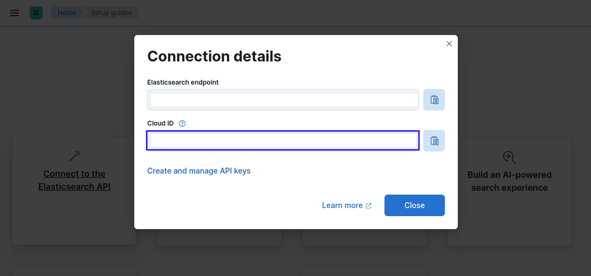
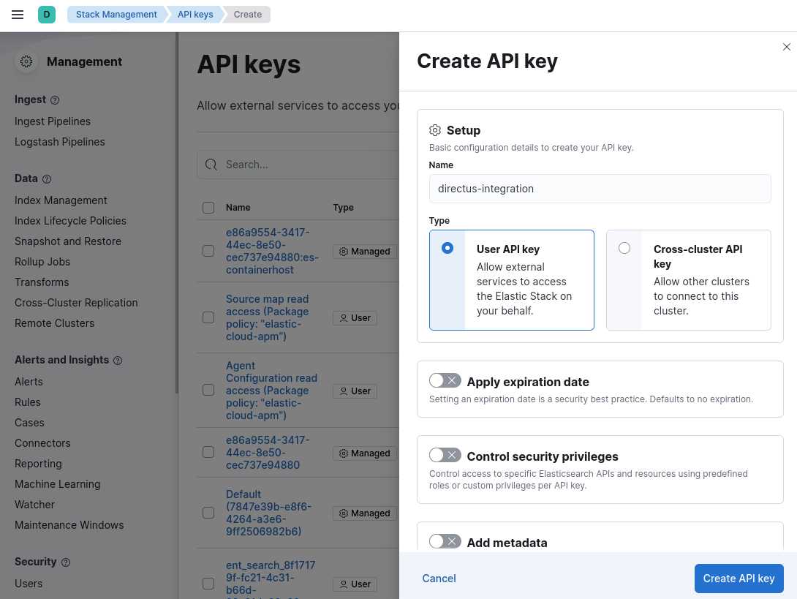
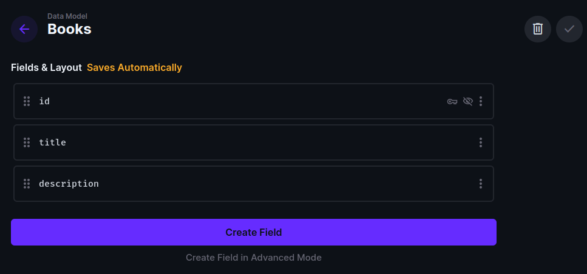

# Introduction

An important step required to harness enhanced search functionality with Elasticsearch is creating an index, which typically always needs to be in sync with the original data. While this feature is not available out-of-the-box in Directus, its flexibility through extensions allows this to be possible.

In this tutorial, you will learn how to use a [Custom API Hooks](https://docs.directus.io/extensions/hooks.html) extension to integrate Eleasticsearch indexing and Directus.

## Before You Start

You will need:

- Node >=18.19.0 installed on your system.
- A Directus Dev environment - follow the [Running Dev Environment](https://docs.directus.io/contributing/running-locally.html) guide to spin up a project if you don’t have one already.
- A running instance of Elasticsearch. For this tutorial, [Elastic Cloud](https://www.elastic.co/cloud/elasticsearch-service/signup?page=docs&placement=docs-body) will be used. [Create an account](https://cloud.elastic.co/registration?elektra=en-elasticsearch-page) if you don't have one already.

## Getting Elasticsearch Connection Details

To connect to Elasticsearch the Cloud ID and API key credentials will be used. You can in Kibana of your Elastic Cloud deployment, click on **Setup guides** at the right of the header. On the navigated page, click on **Connect to the Elasticsearch API** card and you will see your Cloud ID.



Now to get an API key, click on **Create and manage API keys,** then at the top-right of the navigated page click **Create API key.** Enter the name and click **Create API key** at the bottom-right of the sidebar.



Copy the displayed API key as well as the Cloud ID and paste them into the `api/.env` file in your Directus project.

```shell
ELASTIC_API_KEY=<your-api-key>
ELASTIC_CLOUD_ID=<your-cloud-id>
```

## Creating a Collection in Directus

The collection to be created is the one that needs to be in sync with an Elasticsearch index. In your Directus Admin App, navigate to **Settings -> Data Model** and create a new collection called `books` with a text input called `title` and a textarea field called `description`.



## Creating a Custom API Hooks Extension

As stated in the [docs](https://docs.directus.io/extensions/hooks.html) Custom API Hooks allow running custom logic when a specified event occurs within your project. These events include item creation, deletion, etc.

There are several types of hooks used to define the custom logic, such as [action](https://docs.directus.io/extensions/hooks.html#action), [filter](https://docs.directus.io/extensions/hooks.html#init), [init](https://docs.directus.io/extensions/hooks.html#schedule), etc. The specific hooks to use depend on the operation to be carried out. For this use case where an Elasticsearch index is to be updated when an item is created, updated, and deleted in a Directus collection to keep the index and collection in sync, the `action` hook will do the trick.

To create the hook extension boilerplate, in the terminal, enter the following command in the root directory of your Directus project with the following options:

```shell
npx create-directus-extension@latest
? Choose the extension type: hook
? Choose a name for the extension: directus-extension-elasticsearch
? Choose the language to use: javascript
? Auto install dependencies? (Y/n) y
```

After that, navigate into the created hook directory and install the Elasticsearch Javascript Client:

```shell
cd directus-extension-elasticsearch
npm install @elastic/elasticsearch
```

## Connecting to Elasticsearch

To connect to Elasticsearch, modify the `api/src/index.js` file to the following:

```javascript
import { createRequire } from "module";
const require = createRequire(import.meta.url);
const { Client } = require("@elastic/elasticsearch");

export default ({ action }, { env }) => {
  const client = new Client({
    cloud: {
      id: env.ELASTIC_CLOUD_ID,
    },
    auth: {
      apiKey: env.ELASTIC_API_KEY,
    },
  });
};
```

Because Elasticsearch is a CommonJs package, the `require()` function is constructed using the `createRequire()` node utility method and used to import it to avoid errors. The Elasticsearch JavaScript client has been instantiated in the exported register function using the Cloud ID and API key defined within the `.env` file and accessed using the `env` argument. Along with `env` the `action` hook is also been accessed.

## Saving Items to Index

Add the following lines of code after the `client` variable:

```javascript
action("books.items.create", async (meta) => {
  await client.index({
    index: "books",
    id: meta.key,
    document: meta.payload,
  });
});
```

This `action` hook will execute when an item is created in `books` collection. This is achieved by specifying `books.items.create` as the event name. The `action` hooks can listen to several other events, you can look them up in the [Available Events](https://docs.directus.io/extensions/hooks.html#available-events) table.

When executed a document will be created in an Elasticsearch `books` index containing the newly created item fields which was accessed from the `meta` object. The `meta` object includes the ID of the newly created item in the `key` property and the item fields in the `payload` property.

Although the `books` index was not explicitly created, that will be done automatically if doesn’t exist and a new document is been created which is the default behavior.

## Updating Items in Index

Add the following lines of code below the existing action:

```javascript
action("books.items.update", async (meta) => {
  await Promise.all(
    meta.keys.map(
      async (key) =>
        await client.update({
          index: "books",
          id: key,
          doc: meta.payload,
        })
    )
  );
});
```

For an update event, the `meta` object will includes an array of `keys` along with the updated fields even when only a single item is updated. So to modify the corresponding document or documents in `books` index, the array of keys is iterated over to send multiple update requests.

## Deleting Items in Index

For a delete event, the `meta` object includes an array of keys (ID) of the of the deleted items. Fields are not included. Add the following lines of code after the `books.items.update` action:

```javascript
action("books.items.delete", async (meta) => {
  await Promise.all(
    meta.keys.map(
      async (key) =>
        await client.delete({
          index: "books",
          id: key,
        })
    )
  );
});
```

## Adding your Custom API Hook to Directus

To get the hook working, navigate to the hook directory in the terminal and build it with the following command:

```shell
npm run build
```

In the `api` directory, create an `extensions` directory and copy and paste the hook directory (`directus-extension-elasticsearch`) into it. Then restart your project.

Now when you create, update, and delete items in the `books` collection, the changes will reflect in your Elasticsearch `books` index.

## Summary

With this tutorial, you’ve learned how to synchronize a Dierctus collection with an Elasticsearch index by developing a custom API Hooks extension. You can now go ahead to tweak this for your use case, add error handling, and integrate Elasticsearch with your app.
