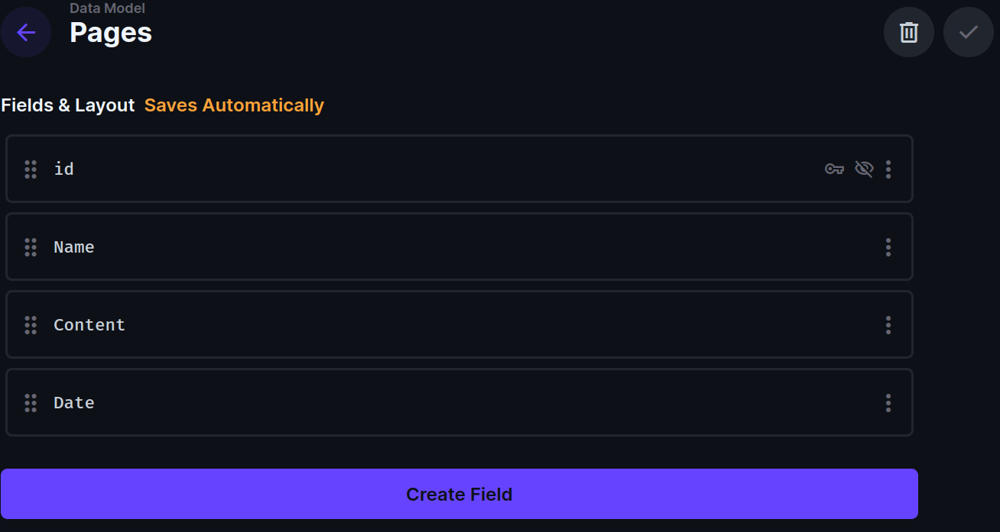

## Introduction
If you are considering transitioning your content management system from WordPress to Directus, this tutorial is for you. By the end, you will understand the process in migrating content, data, and other functionality from WordPress to Directus.

## Understanding the Differences

WordPress is often used as an integrated CMS, meaning it tightly couples content management with presentation. This approach simplifies many tasks but can limit flexibility and performance. 

Directus on the other hand, being a headless CMS, separates the content repository from the presentation layer, offering freedom to use any frontend technology while managing content through a REST or GraphQL API.

This separation implies a paradigm shift in how content is being managed and served.

## Directus Terminologies
Here are some key terminologies you will come across while following this article or while trying to migrate your specific app to Directus:
### Collections
Collections in Directus are similar to tables in a database. They are used to organize and store data of a similar type. For example, you might have a collection for blog posts, another for users, and another for products. Each collection contains fields that define the structure of the data stored within it.

### Fields
Fields are the individual data points within a collection, similar to columns in a database table. Fields define the type of data that can be stored in them, such as text, numbers, dates, or relationships to other collections. 

### Items
Items are the individual records within a collection, similar to rows in a database table. An item is a single unit of data that adheres to the structure defined by the fields in its collection. For instance, in a blog post collection, each blog post would be an item.

### Relationships
Relationships are connections between items in different collections. Directus allows you to create one-to-one, one-to-many, and many-to-many relationships, enabling complex data structures and interconnections. This may come in handy if you want to create a relational content structure, such as linking authors to their blog posts or products to their categories.

### Roles and Permissions
Directus provides a powerful role-based access control system. Roles are assigned to users to define what actions they can perform within the Directus App, and permissions are set at a granular level to control access to collections, fields, and items based on the user’s role. This ensures that users only have access to the content and functionalities relevant to them.

### Directus API (Application Programming Interface)
Directus exposes a RESTful API and a GraphQL API, allowing external applications and services to interact with the content stored in Directus programmatically. These APIs make it possible to retrieve, create, update, and delete content dynamically, enabling headless CMS functionalities for any frontend or application.

## Auditing WordPress Plugins
Before the migration, audit your WordPress plugins to understand their functionality and the need they fulfill. Unlike WordPress, Directus might not offer direct plugin equivalents, so it is important to understand the **why** behind each plugin being used. Also note that not all plugins need alternatives and the outcomes might be achievable within the Directus' core functionality.
This understanding will guide you in seeking or developing alternatives that align with Directus's architecture. 
Start by making a comprehensive list of all the plugins currently active on your WordPress site. For each plugin, note down what it does. 
You might have something like **Yoast SEO** for your blog which enhances SEO capabilities, including meta tags, sitemaps, and readability analysis.
Directus doesn't have a built-in SEO plugin equivalent as a headless system - it is down to your application to implement features based on data held in Directus. 

For example, you can manage SEO metadata by creating custom fields in your collections for titles, meta descriptions, and other SEO-related information. You might also develop or use existing extensions to generate sitemaps.

## Steps to Migrate Content From WordPress
This transition requires a systematic approach to ensure that all data is accurately transferred and that the new system is configured to meet your specific needs. In the following sections, you will export your posts and pages from WordPress. We will then use a Python script to import the data into Directus.

### Exporting WordPress Data
Start by exporting your WordPress data. Here it is assumed you already have a Wordpress site. WordPress offers a built-in export tool that generates an XML file of your content. However, for a more comprehensive export, especially for custom post types and metadata, we will be using a plugin that can export to formats more conducive to manipulation like JSON. 
On your Wordpress Admin, in the **Plugins** tab search for “**WP Import Export Lite”**. Install and activate it. 
After the installation select “**WP Imp Exp**” on the tab then select “**Post**” and select the format JSON in “**Advanced Options**” dropdown. Now you can download the [JSON file](https://github.com/khabdrick/wordpress-directus/blob/main/WP-data.json).
The JSON file we will use in this tutorial is a collection of blog posts from a WordPress site, each containing information such as the post ID, title, content, date, and permalink. 
You can use this same step to export the [Pages JSON data](https://github.com/khabdrick/wordpress-directus/tree/main). This file contains two pages with its title, content, and date it was created.


### Designing Your Directus Schema
Before importing data into Directus, design your schema in Directus by creating collections (equivalent to WordPress's post types. In the JSON exports Post Type "post" and "page" )), and fields (similar to WordPress's fields: Title, Content, Date, etc.). This step is critical and requires a deep understanding of your content structure to ensure the data is imported correctly into your Directus setup.

In our case, we have two export with post types "post" and "page" so in the Directus Data Studio, create a collection with the name “Posts” and "Pages".
Now we will create the fields that will hold the data items. If you are using my JSON exports create the following fields:



:::info Box title

*Note that the “Content” field has a Field type of ***WYSIWYG***, the rest are ***Input*** type. we are using ***WYSIWYG*** because the exported data is in raw HTML

:::

## Importing Data into Directus
After the JSON file is extracted and the schema is developed on Directus, you can go to your Collections page on Directus admin and you will see a button there to import and export. Just choose export and select the JSON file you downloaded. 


If you have images in the post or pages, you won’t be able to access them. With the Directus REST API we will be able to manipulate the JSON to extact the images and save to Directus Files so we can access the files in the post.
To use the API we need to get the API token at User Directory → Administrator → Admin User → Token. Copy the token and Keep it somewhere, we will use it later.
 
## Creating Import Scripts

In this section, we will work on the code to export the JSON data into our Directus fields. We will use Python to develop the script but if you are not familiar with Python don’t worry, I will explain everything and show you how to run the code.
The files gotten from WordPress have the following keys, but what we will be extracting will be "Title", "Content", and "Date". 
```json
{
    "ID": "2",
    "Title": "Sample Page",
    "Content": "...",
    "Excerpt": "...",
    "Date": "2024-04-08 15:33:50",
    "Post Type": "...",
    "Permalink": "..."
  },
```
### The URL replacer
As I mentioned before, some images are in the posts and we need to extract those images and save them to Directus. After a file is saved to Directus, the JSON file is updated with the Directus image URL. Then, after the changes are completed, the new JSON file is saved locally.
To start, first create a file with the name `extract-image.py`. The name is arbitrary.
*Note: The Python file should be in the same directory as the JSON file.*
We will start with the code below. Paste it in the file you just created.

```python
# Load JSON data from the file
with open(json_file_path, "r") as file:
    data = json.load(file)
# Iterate through each post in the JSON data
for post in data:
    content = post["Content"]
    # Check if there is an image in the content
    if '` tag by looking for the substring `'<img src="'`. If such a substring is found, it means the post contains an image. The code then extracts the URL of this image by locating the substring that starts immediately after `'<img src="'` and ends at the next double-quote (`"`). 
The extracted image URL is then passed to a function named `upload_to_directus` (this will be created next) to upload the image to Directus. The function returns `new_image_url` to this loop to replace the old URL in the post's content with this new URL.

### The image uploader
Now we will develop the function that will post the images to Directus and get the new URL. Paste the following code in above the code you have already.

```python
import json
import requests
import os
# Replace with the path to your JSON file
json_file_path = "WP-data.json" # Change this with the Pages JSON file to extract images for pages.

# Simulated function to upload an image to Directus and return the new image URL
def upload_to_directus(image_url):
    # This is where you'd upload the image to Directus using its API.
    # Below is a simulated Directus URL for demonstration purposes.
    print(image_url)
    image_content = requests.get(image_url).content
    temp_image_path = "temp_image.jpg"  # Temporary file path for the downloaded image
    with open(temp_image_path, "wb") as file:
        file.write(image_content)
    headers = {"Authorization": "Bearer your-api-token"}
    files = {
        "file": open(
            temp_image_path, "rb"
        )  # Open the temporary file to include in the request
    }
    directus_upload_url = "https://your.directus.app/files"
    print(f"Uploading image to Directus: {directus_upload_url}")
    response = requests.post(directus_upload_url, files=files, headers=headers)
    response_str = response.json()
    directus_image_id = response_str\["data"\]["id"]
    # Cleanup: remove the temporary image file
    os.remove(temp_image_path)
    # Construct the Directus image URL from the response
    directus_image_url = f"https://your.directus.app/assets/{directus_image_id}"
    print(f"Directus Image URL: {directus_image_url}")
    return directus_image_url
```

Replace `your-api-token` in the code above with the token you generated earlier. Also replace `*https://your.directus.app*` with your Directus app URL.
Assuming you have Python installed already you can run the code to create the new JSON file.
```bash
python extract-image.py
```
### The post uploader

Now we will build the script to store our posts in our Fields in Directus. Create a new file with the name *directus.py* and paste the following code:
```python
import json
import requests

def import_posts_to_directus(json_file_path, directus_url, api_key):
    """
    Reads posts from a JSON file and imports them into Directus, including handling featured images.
    """
    with open(json_file_path, "r") as file:
        posts = json.load(file)
    headers = {"Authorization": f"Bearer {api_key}", "Content-Type": "application/json"}
    for post in posts:
        # Extract the first image URL from the content and simulate its upload to Directus
        # Prepare the payload for Directus
        payload = {
            "Title": post["Title"],
            "Content": post["Content"],
            "Date": post["Date"],
        }
        # POST the data to the Directus API
        response = requests.post(
            f"{directus_url}/items/Posts", headers=headers, json=payload
        ) # path for pages is /Pages
        if response.status_code in [200, 201]:
            print(f"Post '{post['Title']}' imported successfully.")
        else:
            print(f"Failed to import post '{post['Title']}': {response.text}")

# Example usage
json_file_path = "modified_WP-data.json" # change to modified file to post Pages to Directus
directus_url = "https://your.directus.app"
api_key = "your-api-token"
# Uncomment the line below to run the function with your actual Directus URL and API key
import_posts_to_directus(json_file_path, directus_url, api_key)
``` 
:::info Box title

Note: Replace `https://your.directus.app` and `*your-api-token*` with the appropriate details.

:::
The code above:
1. Opens and reading a JSON file specified by `json_file_path`. It expects the file to contain an array of posts, with each post represented as a dictionary. These dictionaries must at least include keys for `"Title"`, `"Content"`, and `"Date"`.
2. Sets up HTTP headers for the request to the Directus API, including authorization via a Bearer token (specified by `api_key`) and setting `"Content-Type"` to `"application/json"` to indicate that the payload will be in JSON format.
3. For each post in the JSON file, it constructs a payload dictionary that contains the post's title, content, and date. 
4. Sends a `POST` request to the Directus API to create a new item in the `article` collection (or table) using the prepared payload. The Directus URL and the specific endpoint (`/items/article`) are constructed using the `directus_url` parameter. Authentication and content type are handled by the previously prepared headers.

Now run with the following command:
```bash
python directus.py
```
After the code is complete you sshould be able to see your items on Directus.


## Testing and Validation

Because you are moving from one platform to another, you might have some text formatting not appearing right. It’s unlikely but possible so look through the imported content in Directus to ensure all data has been accurately migrated and maintains its formatting. 

## Conclusion

Preparing a detailed migration plan, and carefully executing the data migration, organizations can leverage the flexibility and performance benefits offered by Directus. You don’t need to compromise on content quality or delivery.
Hopefully, this process has provided you with an opportunity to rethink and optimize how content is managed, delivered, and experienced across different channels.
To build on the knowledge you have gotten here  you can learn more about [relationships](https://docs.directus.io/app/data-model/relationships.html#overview) and how it can be use in Directus. This will come in handy for more complex migrations.
Here is the [code repo](https://github.com/khabdrick/wordpress-directus/tree/main) for this article.


