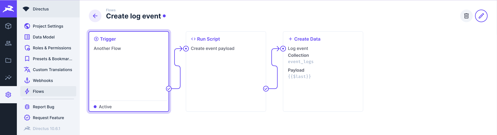
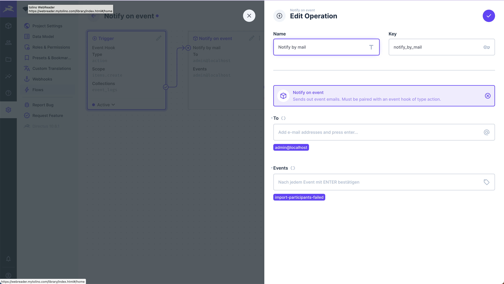

Directus offers a flexible and extensible foundation for creating a wide range of applications. However, to address more complex use cases such as "Backend as a Service" or "Internal Apps", it's important to develop a strategy for monitoring your application's health.

What benefits does monitoring give us:
- Insights into the flow of data
- Makes a production application debuggable
- Allows us to listen to events and send out notifications via different channels

## How is event monitoring different from activity logs and revision?
 In the context of Directus, activity logs allow us to identify changes on a per-collection item basis, providing a trail to retrace the execution of workflows and view the input/output of operations. On the other hand, event logs focus on tracking specific pieces of data. The difference in granularity between activity tracking and event logging makes them complement each other. For instance, in a monitoring pipeline, when a specific event triggers an alert, we can use revisions to trace back the execution flow to analyze the context.

## What events do we want to log?
There are two main categories of events that serve different purposes.

First, events that help us debug errors. These should contain information what, when and where something went wrong, accompanied by metadata to make the job of debugging easier. 

The second type of events provides transactional data about the application state. Consider a scenario where we periodically import participants from an event ticketing app. In such cases, we want to track whether the import process started, the number of participants successfully imported, any import failures, and the reasons behind those failures. Event logs are instrumental in answering these questions without having to look at flow revisions.

Furthermore, instead of sending email notifications directly from the location where an event occurs, we establish a separate workflow that listens for specific event types. This decoupling of alerting from our core business logic provides several advantages. It allows us to easily switch notification channels or transition to an external monitoring solution when the need arises, offering greater flexibility and adaptability in our alerting system.

## Before we start
You will need a Directus project running - either using Directus Cloud or by Self Hosting. Also, you need to configure email transport.

After that, start by creating the following collections and fields:

participants:
- id (Primary key: generated uuid)
- name: (Type: string, Interface: Input)
- email: (Type: string, Interface: Input, required)

log_events
- id (Primary key: generated uuid)
- event_name (Type: string, Interface: Input)
- context: (Type: string, Interface: Input)
- execution_id: (Type: uuid, Interface: Input)
- event_date (Type: timestamp, Interface: Datetime)
- meta: (Type: json, Interface: Code)

**event_name** is a resource identfier with a common meaning accross all events. It can be specific (triggered only at one location) or generic (triggered from multiple locations) with added meta data. For example, a generic event *ressource-not-found* could be enriched with the meta data *collection: string, id: any*, while an event *import-participants-failed* is a specific locator.

**context** identifies the location where the event takes place. While the **event_name** is reusable, the **context** should be distinct. We can build context hierachies, e.g. to locate events in subflows. The event *import-participants-failed* could be in the **context** (flow) *import-participants*. For this article we stick with a simple string input.

**execution_id** is a grouping identifier. For each execution within a **context**, all events share the same identifier. This gives us the possibility to look at the event from a broader perspective. 

**event_date** is a unix timestamp, which is set when the event is triggered, before it's inserted into the database.

**meta** is a JSON object, holding all additional information. 

## Create a monitoring & logging pipeline
With our collection setup, let's create a trigger Flow whose purpose is to set the event date and merge all metadata. This flow will be triggered by other flows each time we want to log an event.



The flow expects the following input payload:
```js
{
    event_name: string,
    context: string,
    execution_id: uuid,
    meta: Object | Array<Object>
}
```

Before we create the final event payload we set the current timestamp for our event and merge the meta keys together in case they are passed as array. 

```
:::info Be carefull

Passing an array in which a key is contained multiple times will override all keys with the last entry.

```

```js
module.exports = async function(data) {
    let meta = data.$trigger.meta;
    if (Array.isArray(meta)) {
    	meta = meta.reduce((agg, m) => ({...agg, ...m}), {});
    }
    
    return {
        "event_name": data.$trigger.event_name,
        "event_date": (new Date()).toISOString(),
        "context": data.$trigger.context,
        "execution_id": data.$trigger.execution_id,
        "meta": meta
    };
}
```
Let's create a dummy flow that imports participants via webhook. 


**1.** Count the number of participants that are passed in the request.

```js
module.exports = async function(data) {
	return {"nr_of_imported_participants": data.$trigger.body.length};
}
```

**2.** Initialize the logger, with the context *import-participants* and participant count from last step. This custom operation creates a unique **execution_id** for us.

<details>
<summary>Show app definition of initilize_logger</summary>

```ts
import { defineOperationApp } from '@directus/extensions-sdk';

export default defineOperationApp({
	id: 'initialize_logger',
	name: 'Init Logger',
	icon: 'box',
	description: 'Simple operation that sets the context and uuid for the session scope',
	overview: ({ loggingContext, metaData }) => [
		{
			label: 'Logging Context',
			text: loggingContext,
		},
		{
			label: 'Meta Data',
			text: metaData,
		},
	],
	options: [
		{
			field: 'loggingContext',
			name: 'Logging Context',
			type: 'string',
			meta: {
				width: 'full',
				interface: 'input',
			},
		},
		{
			field: 'metaData',
			name: 'Meta Data',
			type: 'json',
			meta: {
				interface: 'code',
				options: {
					language: 'json'
				},
			}
		},
	],
});
```
</details>

<details>
<summary>Show api definition of initilize_logger</summary>

```ts
import { defineOperationApi } from '@directus/extensions-sdk';
import { randomUUID as uuidv4 } from 'crypto';
import { mapValues, isPlainObject} from 'lodash';

type Options = {
	loggingContext: string;
	metaData: any
};

export default defineOperationApi<Options>({
	id: 'initialize_logger',
	handler: ({ loggingContext, metaData }, {logger}) => {
		// Iterate through a nested object
		// https://github.com/lodash/lodash/issues/1244
		const mapValuesDeep = (obj, fn) =>
			mapValues(obj, (val, key) =>
				isPlainObject(val) ? mapValuesDeep(val, fn) : fn(val, key, obj)
			)

		metaData = mapValuesDeep(metaData, function(val, key, obj) {
			if (key == 'password') {
				val = '*****'
			}

			return val;
		});

		return {uuid: uuidv4(), context: loggingContext, meta: metaData}
	},
});
```
</details>

**3.** Create the participants from the payloads body.

**4.** We either log a success or an error.

In this case we would log an error, if the required email is missing in one the payloads participants.


We can store events but still need a way to receive notifications. Additionally, we might only want to receive a subset of the events we create. Let's build a notification Flow that hooks onto created events and sends emails for the events we are interested in.


We configure the "Notify by mail" operation by entering all receiving email addresses into the "To" field. The names of all events for which we want to receive notifications should be entered into the "Events" field. In this case, enter *import-participants-failed*. Remember to press enter in both fields to add an item.



<details>
<summary>Show app definition of notify_on_event</summary>

```ts
import { defineOperationApp } from '@directus/extensions-sdk';

export default defineOperationApp({
	id: 'notify_on_event',
	name: 'Notify on event',
	icon: 'box',
	description: 'Sends out error emails. Must be paired with an event hook of type action.',
	overview: ({ to, events }) => [
		{
			label: 'To',
			text: Array.isArray(to) ? to.join(', ') : to,
		},
		{
			label: 'Events',
			text: Array.isArray(events) ? to.join(', ') : events,
		}
	],
	options: [
		{
			field: 'to',
			name: 'To',
			type: 'csv',
			meta: {
				width: 'full',
				interface: 'tags',
				options: {
					placeholder: '$t:operations.mail.to_placeholder',
					iconRight: 'alternate_email',
				},
			},
		},
		{
			field: 'events',
			name: 'Events',
			type: 'csv',
			meta: {
				width: 'full',
				interface: 'tags',
				options: {
					placeholder: 'Nach jedem Event mit ENTER bestätigen',
				},
			},
		},
	],
});

```
</details>

<details>
<summary>Show api definition of notify_on_event</summary>

```ts
import { defineOperationApi } from '@directus/extensions-sdk';

type Options = {
	to: string[];
	events: string[];
};

export default defineOperationApi<Options>({
	id: 'notify_on_event',
	handler: async ({ to, events }, { getSchema, database, services, accountability, logger, data }) => {
		const trigger: any = data.$trigger;

		const payload = trigger.payload;
		if (!events.includes(payload.event_name)) {
			return;
		}

		payload.meta = liquifyMeta(payload.meta);

		const schema = await getSchema({ database });
		const context = {database: database, schema: schema, accountability: accountability};

		const { MailService } = services;
        const mailService = new MailService({ schema: context.schema, knex: context.database });
        
		await mailService.send({
			to: to,
			subject: `Directus Event - ${payload.event_name}`,
			template: {
				name: 'event-notification',
				data: payload,
			},
		});
	},
});

function liquifyMeta(meta: Object) {
	const ret = [];
	for (const [key, value] of Object.entries(meta)) {
		ret.push({'key': key, 'value': JSON.stringify(value)});
	}
	return ret;
}

```
</details>

<details>
<summary>Email template used in notify_on_event</summary>

```html
<body>
  Eventname: {{ event_name }}<br>
  Eventdate: {{ event_date }}<br>
  Context: {{ context }}<br>
  <p>
    Meta:<br>
    
      {{ metadata.key }}: {{ metadata.value }}<br>
    
  </p>
  Execution ID: {{ execution_id }}
</body>
```
</details>

## Summary
While this setup is straightforward, it serves as a foundational step for monitoring your application. Typically, you would externalize your monitoring to avoid impacting your production database. However, if your workload is relatively small, this approach remains a viable solution, as you won't require any third-party services.

With this configuration in place, you have the option to create an insights panel to enhance your data analysis. Additionally, you can revamp the notification process by customizing the default email template or adding more templates based on the event's name.