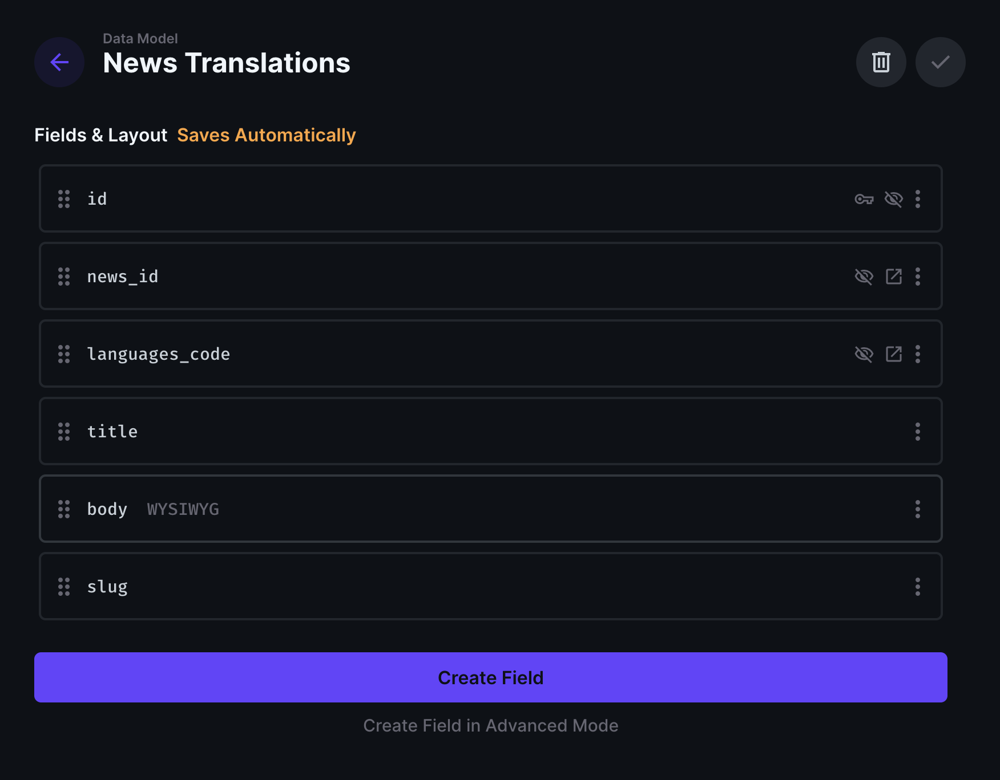

## Introduction
Svelte is a new JavaScript framework for building user interfaces for web applications. It offer a better way for handling UI updates when compared with React, Angular, or Vue.js. In this tutorial, you'll learn how to build a multilingual news application using Sveltekit with Directus i18n API.

## Before You Start
You will need:
- [Node.js v20.11.1](https://nodejs.org/) or later
- A code editor on your computer.
- Create and login to your [Directus Cloud account](https://directus.cloud/) and have install the Directus SDK `npm install @directus/sdk`.
- Some knowledge of React and Svelte.

The code for this tutorial is available on my [GitHub repository](https://github.com/icode247/directus-i18n-app); feel free to clone it to follow along.

## The Concept of i18n

i18n is the process of creating applications that support multiple languages. The phrase i18n represents the first and the last letters of the word **internationalization**. The number 18 denotes the number of letters between the first and the last letter. The main goal of i18n is to conveniently create applications that support multiple languages or locations without having to redesign the application to add those languages.


## Understanding Directus i18n API

Directus is an open-source headless Content Management System that provides a robust API for managing content. It offers an i18n API that enables the internationalization and localization of content within the system.

The Directus i18n API allows you to manage translations for various content types, such as articles, products, or any other data stored in the Directus system.

With the Directus i18n API, you can build multilingual applications or websites that serve localized content to users based on their preferred language or region. 

## Setting up a new project.

Let's start by setting up a new Svelte project using [degit](https://github.com/Rich-Harris/degit), by running the command below:

```
 npx degit sveltejs/template directus-i18n-app
```

The above command will scalfold a new Svelte project with the required dependencies. 

Next, change directory into the project folder and install the dependencies.

```
cd directus-i18n-app && npm install
```

Then install the **svelte-routing** package as a dev dependency:
```
npm i -D svelte-routing
```

## Designing the Data Model in Directus
In your Directus dashboard, navigate to Settings -> Data Model and create a new collections for `news` and`languages`. Use the schema below for the articles collection:

```
news
- id (Primary Key Field, Type: Auto-incremented Integer )
- author (Type: String, Type: Manually entered string )
- cover (Type: Image)
```


For the languages collection, use the schema below:

```
languages

- code (Primary Key Field, Type: Manually entered string )
- name (Type: String, Inferface: Input)
- direction (Type: String, Interface: Dropdown, Default Value: ltr)
```

The `diretion` field is to enable support for languages that read right to left.


To enable content translation in your **news** collection, update the collection to create a new field for `translations`. The translation field will create a one-to-many relationship with the `languages` collection. So select the `languages` collection as the **Language Collection Field**, `name` field for the **Language Indicator Field** and the `direction` field for the **Language Direction Field**.


Once you Save, a new collection named `news_translations` will be created for you. In the `news_translations` collection, we'll add the fields that needs to translated. Update the collection to add the schema below:

```
news_translations

- title (Type: String, Interface: Input )
- slug (Type: String, Interface: Input)
- body (Type: Text, Inferface: WYSIWYG)
```


Now, in the Language collection, create new entries for the language you'd want your contents to be translated to. You'll add entries for German, English (US) and French. 


Then create some entries in your News collection.


Now you can write your contents in different translations (German, French and English).

Lastly allow the Public role to read the `news`, `languages` and `news_translations` collections in the Access Control settings.


## Building the News App Frontend with SvelteKit
In your Svelte project, create a `directus.js` file to initialize Dirctus SDK in your project:

```
import { createDirectus, rest } from '@directus/sdk';

const directus = createDirectus('<YOUR DIRECTUS URL>').with(rest());

export default directus;
```

Then create an `news.js` file to fetch your content using the SDK:
```
import { readItems } from "@directus/sdk";
import directus from './directus';

export async function fetchNews() {
  try {
    const response = await directus.request(
      readItems("news",
       {
        deep: {
          translations: {
            _filter: {
              _and: [
                {
                  languages_code: { _eq: "en-US" },
                },
              ],
            },
          },
        },
        fields: ["*", { translations: ["*"] }],
      }
    )
    );
    
    return response;
  } catch (error) {
    console.error("Error fetching news:", error);
    return [];
  }
}
```

The above code snippet will use:
- ReadItems function to fetch all the contents in the news collection.
- Limit parameter to only return the a single result.
- Deep parameter to filter the related collection to only show the translations in **en-US (English US)**.


Next create an `NewsList.svelte` file in the **src** folder to render the news:

```
<script>
  export let news;
  import { Link } from "svelte-routing";
</script>

<h1>Trending Today!</h1>

<ul>
  {#each news as article}
    <li>
      <div>
        <h2>
          <Link to={`/article/${article.translations[0].slug}`}>{article.translations[0].title}</Link>
        </h2>
        <p>By {article.author}</p>
      </div>
    </li>
  {/each}
</ul>

<style>
  ul {
    list-style-type: none;
    padding: 0;
    margin: 0;
  }

  li {
    margin-bottom: 20px;
    border-bottom: 1px solid #ddd;
    padding-bottom: 20px;
    display: flex;
    align-items: center;
  }

  h1 {
    margin-bottom: 20px;
  }

  p {
    color: #888;
  }
</style>
```

The above code will:

- Loop through the news array returned in the `news.js` file to display the contents.
- Attach a link to each news list pointing to the news single page using **svelte-routing**.
- Add some simple styles to to the page.

Next, create an `SingleNews.svelte` file to render the individual news contents:

```
<script>
  import { onMount } from "svelte";
  import { readItems } from "@directus/sdk";
  import directus from './directus';
  import { navigate } from "svelte-routing";

  let article;
  let languages;
  export let slug;
  
  let languageCode = "en-US";

  async function fetchNews(slug, languageCode) {
    try {
      const pages = await directus.request(
        readItems("news", {
          deep: {
            translations: {
              _filter: {
                _and: [
                  {
                    languages_code: { _eq: languageCode },
                  },
                  {
                    slug: { _eq: slug },
                  },
                ],
              },
            },
          },
          fields: ["*", { translations: ["*"] }],
          limit: 1,
        })
      );

      article = pages[0];
    } catch (error) {
      console.error("Error fetching news:", error);
      navigate("/404");
    }
  }

  onMount(async () => {
    try {
      languages = await directus.request(readItems("languages"));
      fetchNews(slug, languageCode);
    } catch (error) {
      console.error("Error fetching languages:", error);
    }
  });
  
</script>
{#if article}
  <h1>{article.translations[0].title}</h1>
  {@html article.translations[0].body}
  <select bind:value={languageCode}>
    {#if languages}
      {#each languages as language}
        <option value={language.code}>{language.name}</option>
      {/each}
    {/if}
  </select>
{:else}
  <p>Article not found.</p>
{/if}
```

The above code will:

- Use the deep parameter to filter the related collection to fetch an news article that matches the translation in en-US (English US), which is the default set in the `languageCode` and matches the slug of the clicked article.
- Fetch all the available languages from the `languages` collection and render them, so users can choose the language they need the content to be translated into.
- Use the `@html` decorator to properly render the **WYSIWYG** `body` field content.

All the content fetching functionalities will happen once the component mounts. That is why we are calling the functions in the `onMount` method.

Now update the code in the add to the routing to navigation between the `NewsList` and `SingleNews` components.

```
<script>
    import { fetchNews } from './news.js';
    import { Router, Route } from 'svelte-routing';
    import NewsList from './NewsList.svelte';
    import SingleNews from './SingleNews.svelte';

    let news = [];

    async function fetchArticleData() {
      news = await fetchNews();
    }

    fetchArticleData();
</script>
  
<Router>
    <Route path="/" component={NewsList} news={news} />
    <Route path="/article/:slug" component={SingleNews} />
</Router>
```

## Adding Multilingual Navigation and Search
Now let's update your project to add the multilingual navigation and search functionalities. Update the code in the `SingleNews.svelte` file to add a handler to dynamically render the article translation based on the selected language.

```
<script>
...
function handleLanguageChange(event) {
    languageCode = event.target.value;
    fetchNews(slug, languageCode);
}
</script>
{#if article}
  <h1>{article.translations[0].title}</h1>
  {@html article.translations[0].body}
  <select bind:value={languageCode} on:change={handleLanguageChange}>
    {#if languages}
      {#each languages as language}
        <option value={language.code}>{language.name}</option>
      {/each}
    {/if}
  </select>
{:else}
  <p>News not found.</p>
{/if}
```


Now you translate the news in English, German, and French.

Next, replace the code in your `NewsList.svelte` file with the code snippets below to add search functionality:

```
<script>
  export let news;
  import directus from "./directus";
  import { readItems } from "@directus/sdk";
  import { Link } from "svelte-routing";

  let searchQuery = "";
  let searchResults = [];

  async function searchNews() {
    try {
      const result = await directus.request(
        readItems("news", {
          search: {
            _or: [
              { translations: { title: { _contains: searchQuery } } },
              { translations: { body: { _contains: searchQuery } } },
            ],
          },
          fields: ["*", { translations: ["*"] }],
        })
      );
      searchResults = result;
    } catch (error) {
      console.error("Error searching news:", error);
    }
  }

  $: if (searchQuery !== "") {
    searchNews();
  }
</script>

<h1>Trending Today!</h1>
<div>
  <input
    type="text"
    bind:value={searchQuery}
    placeholder="Search News..."
  />
  <button on:click={() => searchNews()}>Search</button>
</div>
<ul>
  {#each searchResults.length > 0 ? searchResults : news as article}
    <li>
      <div>
        <h2>
          <Link to={`/article/${article.translations[0].slug}`}>
            {article.translations[0].title}
          </Link>
        </h2>
        <p>By {article.author}</p>
      </div>
    </li>
  {/each}
</ul>

<style>
  ul {
    list-style-type: none;
    padding: 0;
    margin: 0;
  }
  li {
    margin-bottom: 20px;
    border-bottom: 1px solid #ddd;
    padding-bottom: 20px;
    display: flex;
    align-items: center;
  }
  h1 {
    margin-bottom: 20px;
  }
  p {
    color: #888;
  }
</style>
```

The above code will:

- Define variables `searchQuery` and `searchResults` to store the user's search input and the search results, respectively.
- Define an async function `searchNews` that sends a request to the Directus API to fetch news based on the `searchQuery`. It searches for news where the title or body contains the search query string.
- Use a reactive statement `$:` to call the `searchNews` function whenever the `searchQuery` changes.
- Render an input field and a button to allow the user to enter a search query and trigger the search.
- Loop through the `searchResults` array if it has results or the `news` array if `searchResults` is empty to display the article titles and authors.


## Summary
Throughout this tutorial, we've learned how to build a multilingual news application using Sveltekit with the Directus i18n API. We created collections using Directus's flexible CMS, and using the i18n feature provided in Directus, we translated the news article content into different languages.

Perhaps you can improve the application by adding some advanced styles to the news application, creating an authors collection, and creating a relation with the articles collection to associate each news article with an author. Additionally, you can render the blog cover images to fine-tune the news application. To learn more about Directus, visit the [documentation](https://docs.directus.io/).
