## Introduction

Authentication is an important aspect of web applications, as it provides the ability for users with the right permissions to access certain resources or perform specific actions.

In this article, you'll build an authentication system for a Nextjs application using Nextjs, NextAuth, and Directus as the backend and save the data of the application to a PostgreSQL database.

For a better understanding of the application you will be building, here is a demo of the application in play:

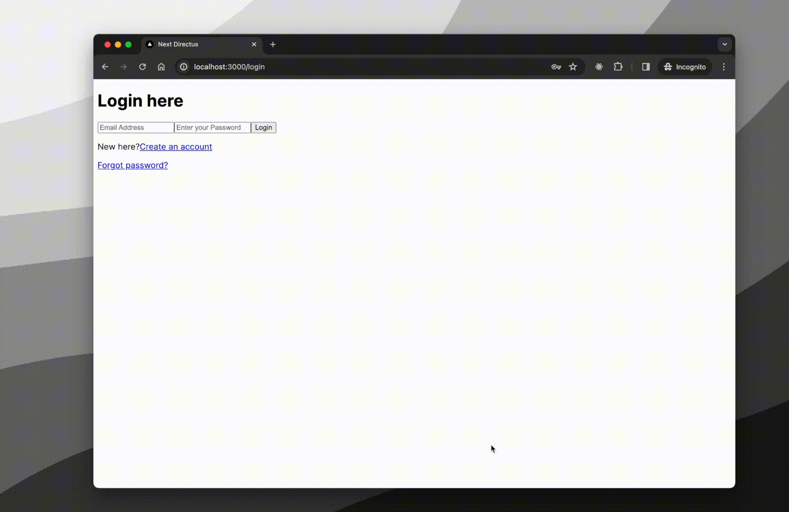

## Prerequisites

To begin with this tutorial, you'll need the following knowledge and tools:

- [`Nodejs`](https://nodejs.org/en/download/) installed on your computer to build the Nextjs application
- [`Docker`](https://www.docker.com/get-started/) installed on your computer to run Directus locally
- A [`PostgresQL`](https://www.postgresql.org/docs/current/tutorial-install.html) database for storing your users (preferably version 15 and higher)
- A basic knowledge of terminal/CLI commands

## Setting Up the Database

Before setting up Directus you need to configure the database that Directus will use for storing data.

```
:::info Directus supports different databases

>Note: This tutorial uses PostgresQL as a database, Directus also supports other databases like `mysql`, `oracledb` ,  `mssql`, `sqlite3`, `cockroachdb`. You can read more information about configuring Directus with a database here:

:::
```

Assuming you have PostgresQL installed locally and running, connect to the default PostgreSQL database using the command:

```bash
psql -U postgres
```

Enter the password you set during installation.

### Create a New User and Database

1. In the PostgreSQL interactive shell (`psql`), run:

    ```bash
    CREATE USER 'your_username' WITH PASSWORD 'your_password';

    ```

2. Next, Create a Database, using the command:

    ```bash
    CREATE DATABASE your_database OWNER your_username;
    ```

3. Exit PostgreSQL shell with:

    ```bash
    \q
    ```

Now that you have a working database, the next step is to set up Directus and connect it to the database.

## Setting up the Backend (Directus)

To set up Directus to run locally on your computer, follow the Directus [self-hosting guide](https://docs.directus.io/self-hosted/quickstart.html) with a few customizations.

1. First, create a root folder for the project called _next-directus_ and navigate into the folder with the command:

    ```bash
    mkdir next-directus && cd next-directus
    ```

    This folder will house the whole application including your locally hosted Directus instance and the frontend of the application (Nextjs).

2. Next, navigate into the _next-directus_ folder and create a subfolder _server_, here you'll store all the files related to running Directus locally.

    ```bash
    mkdir server && cd server
    ```

3. Inside of the _server_ folder, create a docker compose file named _docker-compose.yml_. with the following contents:
`docker-compose.yml`

    ```yml
    version: '3'
    services:
      Directus:
        image: Directus/directus:10.8.2
        ports:
          - 8055:8055
        volumes:
          - ./database:/directus/database
          - ./uploads:/directus/uploads
          - ./extensions:/directus/extensions
        environment:
          KEY: YOUR_RANDOMLY_GENERATED_KEY
          SECRET: YOUR_RANDOMLY_GENERATED_SECRET
          ADMIN_EMAIL: ADMIN_EMAIL
          ADMIN_PASSWORD: ADMIN_PASSWORD
          DB_CLIENT: YOUR_DB
          DB_HOST: host.docker.internal #Tells Docker to use localhost for connecting to the Database
          DB_PORT: YOUR_DB_PORT
          DB_DATABASE: YOUR_DB_TABLE
          DB_USER: YOUR_DB_USER
          DB_PASSWORD: YOUR_DB_USER_PASSWORD
          WEBSOCKETS_ENABLED: true
          # allow CORS
          CORS_ENABLED: true
          # Extensions config for Directus
          EXTENSIONS_AUTO_RELOAD: true
          EXTENSIONS_MUST_LOAD: true
          EXTENSIONS_PATH: ./extensions
          Tell Directus to allow this URL as our reset-password URL
          PASSWORD_RESET_URL_ALLOW_LIST: http://localhost:3000/reset-password
          # EMAIL configs for sending emails
          EMAIL_FROM: EMAIL@YOURDOMAIN.COM
          EMAIL_TRANSPORT: smtp
          EMAIL_SMTP_HOST: YOUR_SMTP_HOST_SERVER
          EMAIL_SMTP_PORT: 465
          EMAIL_SMTP_USER: EMAIL@YOURDOMAIN.COM
          EMAIL_SMTP_PASSWORD: YOUR_SMTP_USER_PASSWORD
          EMAIL_SMTP_SECURE: true
          EMAIL_SMTP_NAME: YOUR_SMTP_NAME

    ```

    This file will tell Docker the configurations to use when starting a new Directus container in Docker.

4. Run the command on the command line:

    ```bash
    docker compose up
    ```

    This command will create a new Directus container in docker with all the necessary files for running in your _server_ folder.

    You should now have Directus running on your machine on <http://localhost:8055> or <http://127.0.0.1:8055>

     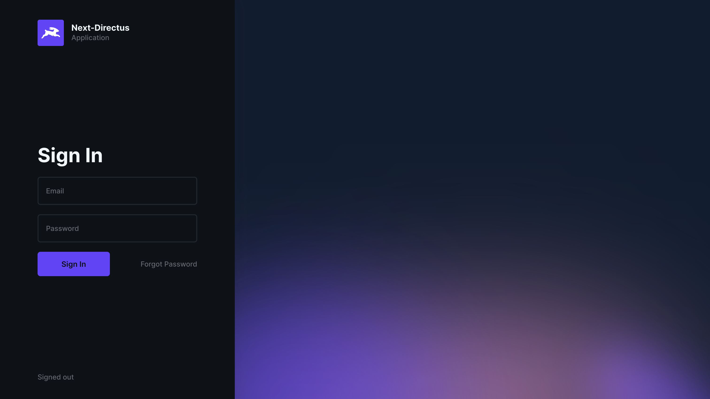

### Create a New Customer Role in Directus

Login with the admin credentials you set up in the _docker-compose.yml_ file and head over to Settings > Access Control (<http://localhost:8055/admin/settings/roles>), and click on the `+` icon on the top right to create a new role for users that can access your Directus app.

Name this role `Customer`; also uncheck the app access checkbox as you do not want users to access our Directus app here but to login from our frontend application and update the description to be `Users on our Nextjs Directus application.`

 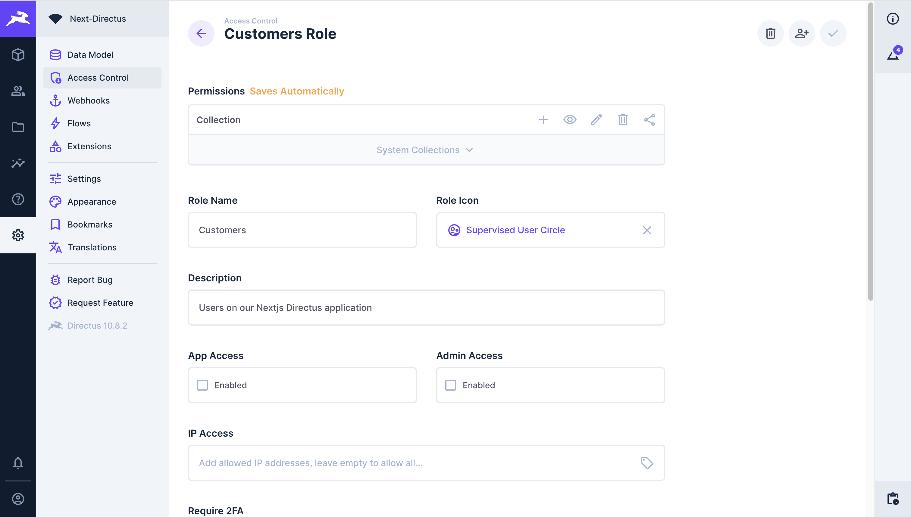

```

:::info Directus default user fields

>Note: The default Directus user comes with a list of default fields such as `first_name`, `last_name`,  `password`, `email`, and others. You can also extend the Directus user schema to contain other fields to suit your needs. To do this, head to <http://localhost:8055/admin/settings/data-model/directus_users/+> to add custom fields to the user model in your Directus app.
To reduce the complexity of a user for this application you only need the `first_name`, `last_name`, `email`, and `password` fields.

:::
```

 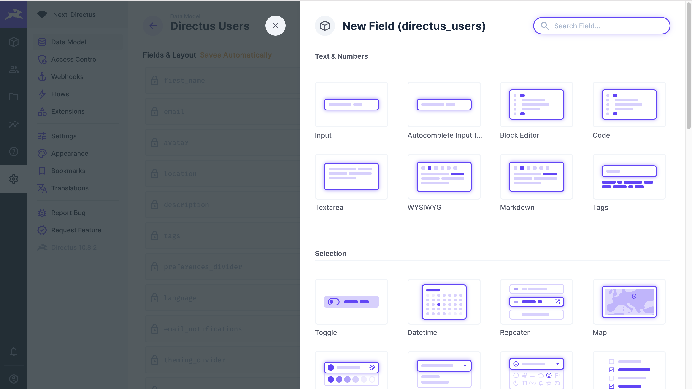

### Setting Permission for the Customer users

When you navigate to the User Directory (<http://localhost:8055/admin/users>), you should see two categories of users: Administrator and Customer.

To set specific permissions and restrictions to ensure your `customer` users do not access unauthorized information and new visitors on your frontend application can only sign up as a customer, navigate to Settings > Access Control, click on Customers, and the info icon on the top right, this will provide you with customer role `id` copy it and store it somewhere.

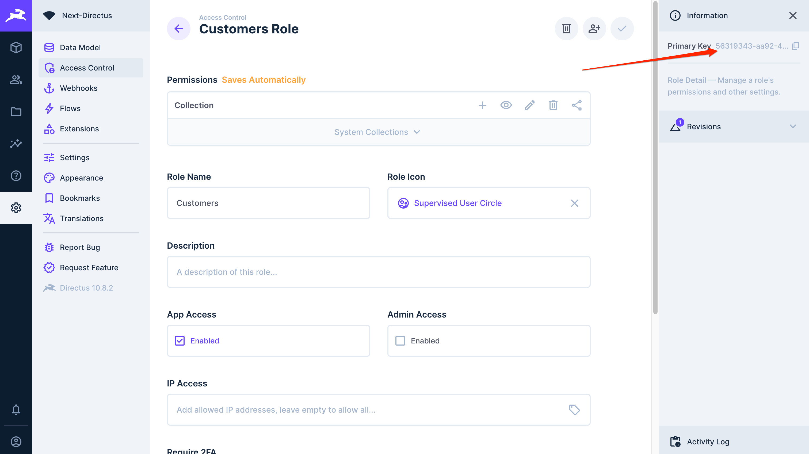

Next, navigate to  Settings > Access Control > Public (<http://localhost:8055/admin/settings/roles/public>); here, you'd want to set a permission rule that whenever a visitor visits your website and want to create a new account, they can only do so as a customer using this customer role `id`

Click on the system collections dropdown to show all Directus system collections, navigate to the `directus_users` list, on the plus icon tab (`+`), click on the red icon and click on `Use Custom`.

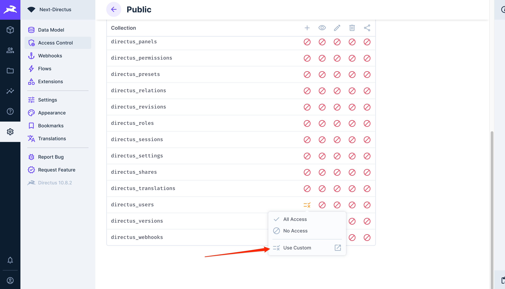

Navigate to the `Field Validation` tab and create a new rule:
The frontend application can only create a new user if the `role` field of the user is equal to the customer role `id` you copied in the previous step.

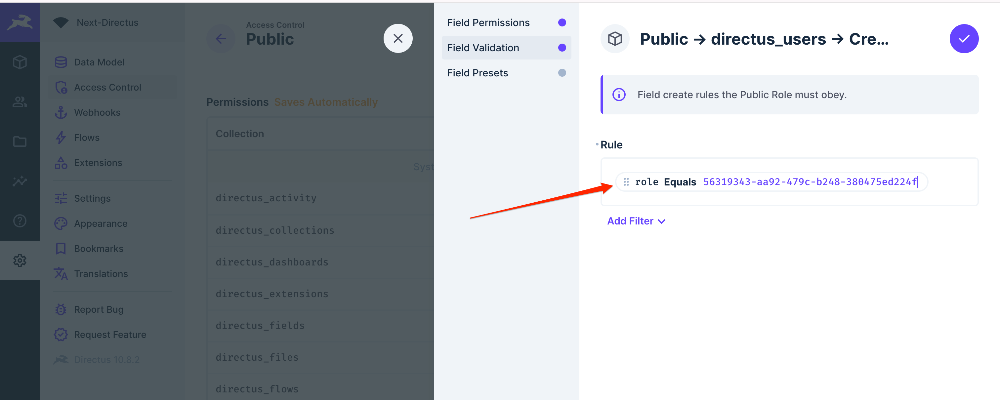

This will ensure that users created from your frontend application will permanently be assigned the role of a customer.

Now that you've successfully set up Directus as the backend of your application with custom permissions and access control for your users, it's time to build the frontend of the application and use Directus API services

## Building the Frontend Application (Nextjs)

With the backend already running, you can now start building the application's frontend. To do so, first navigate to the _next-directus_ folder if you are still in the _server_ folder with the command:

```bash
cd ../
```

### Installing Nextjs

Inside of the _next-directus_ folder, run the following command to install nextjs

```bash
npx create-next-app@latest client
```

During installation, when prompted, choose the following configurations:

```bash
✔ Would you like to use TypeScript?  Yes
✔ Would you like to use ESLint?  Yes
✔ Would you like to use Tailwind CSS? Yes
✔ Would you like to use `src/` directory?  No
✔ Would you like to use App Router? (recommended)  Yes
✔ Would you like to customize the default import alias (@/*)? Yes
✔ What import alias would you like configured? @/*

```

This will install Nextjs with Typescript and TailwindCSS configurations that are ready to use.

Navigate into the _client_ folder with the command:

```bash
cd client
```

Start the Nextjs server with the command below. This will open up the default Nextjs page template for a new project.

```bash
npm run dev
```

You should have a Nextjs application running in <http://localhost:3000/>

### Installing the required dependencies

For the frontend of the application, you need the following dependencies:

- [Next Auth](https://next-auth.js.org/) for creating the authentication system for Nextjs
- [Directus JavaScript SDK](https://docs.directus.io/guides/sdk/getting-started.html) for communicating with your Directus backend.

Install the dependencies using the command:

```bash
npm i next-auth @directus/sdk
```

### Configuring the Dependencies

Create a _.env.local_ with the following contents:

`.env.local`

```bash
NEXTAUTH_URL=http://localhost:3000
NEXTAUTH_SECRET=YOUR_NEXT_RANDOM_SECRET
USER_ROLE=THE_ROLE_OF_YOUR_CUSTOMER_FROM_DIRECTUS
BACKEND_URL=http://localhost:8055 #YOUR DIRECTUS BACKEND URL
NEXT_PUBLIC_URL=http://localhost:3000

```

This _.env.local_ contains all the credentials needed by NextAuth and the Directus SDK.

### Configuring the Directus SDK

Create a new folder called _lib_, and inside of that folder, create a new file called _directus.ts_ with the following contents:

`lib/directus.ts`

```ts
import { createDirectus, rest, authentication } from '@directus/sdk';

const directus = createDirectus(BACKEND_URL).with(authentication("cookie", {credentials: "include", autoRefresh: true})).with(rest());

export default directus;
```

Here, you are creating a new Directus API instance with enabled `authentication` and `rest` API features.

### Creating the AuthForm Component

With all the required dependencies installed, you can start building the components for the frontend application.
Open the _next-directus_ project in an editor of your choice and create a new folder named _AuthForm_ inside the _components_ folder (you'd need to create the _components_ folder also); inside of the _AuthForm_ folder, create an _index.tsx_ file

`components/AuthForm/index.tsx`

```tsx
import Link from "next/link";
import { FormEvent, useState } from "react";

interface Data {
  first_name?: string;
  last_name?: string;
  email: string;
  password: string;
}
interface AuthFormProps {
  title: string;
  buttonText: string;
  onSubmit: (data: Data) => void;
  linkText: string;
  linkDescription: string;
  linkHref: string;
  isFullForm?: boolean;
}

export default function AuthForm({
  title,
  buttonText,
  onSubmit,
  linkText,
  linkHref,
  linkDescription,
  isFullForm = true,
}: AuthFormProps) {
  const [formData, setFormData] = useState({
    first_name: "",
    last_name: "",
    email: "",
    password: "",
  });

  const handleFormSubmit = async (e: FormEvent<HTMLFormElement>) => {
    e.preventDefault();
    onSubmit(formData);
  };

  const handleInputChange = (e: React.ChangeEvent<HTMLInputElement>) => {
    setFormData({
      ...formData,
      [e.target.name]: e.target.value,
    });
  };

  return (
    <form onSubmit={handleFormSubmit} className=" md:w-[500px] w-full">
      <h1 className="capitalize text-lg font-medium my-4">{title}</h1>
      {isFullForm && (
        <>
          <input
            type="text"
            placeholder="First Name"
            name="first_name"
            value={formData.first_name}
            onChange={handleInputChange}
            required
            className="py-2 px-4 border border-indigo-500 rounded-md w-full my-5"
          />
          <input
            type="text"
            placeholder="Last Name"
            name="last_name"
            value={formData.last_name}
            onChange={handleInputChange}
            required
            className="py-2 px-4 border border-indigo-500 rounded-md w-full my-5"
          />
        </>
      )}
      <input
        type="email"
        placeholder="Email Address"
        name="email"
        value={formData.email}
        onChange={handleInputChange}
        required
        className="py-2 px-4 border border-indigo-500 rounded-md w-full my-5"
      />
      <input
        type="password"
        placeholder="Enter your Password"
        name="password"
        value={formData.password}
        required
        onChange={handleInputChange}
        className="py-2 px-4 border border-indigo-500 rounded-md w-full my-5"
      />
      <button className="bg-indigo-600 text-white py-3 px-6 w-full rounded-md">
        {buttonText}
      </button>
      <p className="mt-4">
        {linkDescription}
        <Link
          className="text-indigo-500 underline ml-2 "
          href={linkHref}
        >
          {linkText}
        </Link>
      </p>
    </form>
  );
}
```

This TailwindCSS styled form will serve as the `AuthForm` for both the registration and login pages.

### Implementing the Registration Functionality

To create the registration functionality for new users to register on the platform, you first need to create a Next API that the UI of the registration page will consume.

#### Creating the Registration API

Open the _app_ folder and create a new _api_ folder with an _auth_ subfolder and inside of this _auth_ folder, create a _register_ folder  with the file _route.ts_ with the content:

`api/auth/register/route.ts`

```tsx
import { NextResponse } from 'next/server';
import { createUser } from '@directus/sdk';
import directus from "@/lib/directus";


export async function POST(request: Request) {
  try {
    const { first_name, last_name, email, password } = await request.json();
    const result = await directus.request(
      createUser({
        first_name,
        last_name,
        email,
        password,
        role: process.env.USER_ROLE,
      })
    );
    return NextResponse.json({ message: "Account Created!" }, { status: 201 });
  } catch (e: any) {
    console.log(e);
    const code = e.errors[0].extensions.code
    if (code === 'RECORD_NOT_UNIQUE') {
      return NextResponse.json({ message: "This user already exist" }, { status: 409 });
    }

    return NextResponse.json({ message: "An unexpected error occurred, please try again" }, { status: 500 });
  }

}
```

The code above does the following:

1. Gets the `request` data that will be coming from the frontend `{ first_name, last_name, email, password }`
2. Uses the `directus` SDK to send a request to the backend server to create a new user with a `role` field that is set to a customer `role` ID
3. Respond to the frontend of the application if the request was successful or not

#### Creating the Registration UI

In the _app_ folder, create a new folder called _register_; inside of this folder, create two new files, _form.tsx_ and _page.tsx_.

The _form.tsx_ will contain the registration form and the _page.tsx_ will serve as the page rendered on the browser.
Add the following content to _form.tsx_:

`app/register/form.tsx`

```tsx
"use client";
import AuthForm from "@/components/AuthForm";
import { useRouter } from "next/navigation";
import { useState } from 'react';

interface Data {
  first_name?: string;
  last_name?: string;
  email?: string;
  password?: string;
}

export default function RegistrationForm() {
  const router = useRouter();
  const [error, setError] = useState('')
  const handleFormSubmit = async (data: Data) => {
    const response = await fetch(`/api/auth/register`, {
      method: 'POST',
      body: JSON.stringify({
        ...data
      }),
    });
    if (response.status === 201) {
      router.push('/login');
      router.refresh();
    }
    else {
      response.status === 409 ? setError('A user with this email already exist') : null
    }
  }

  return (
    <>
       {error && 
        <p className='text-red-500'>
          {error}
        </p>}
    <AuthForm title="Register here"
      onSubmit={handleFormSubmit}
      buttonText="Register"
      linkDescription="Already have an account?"
      linkText="Login"
      linkHref="/login"
      />
      </>
  );
}
```

The code above performs the following actions:

- Renders the `<AuthForm />` component with some customization as a registration form.
- Gets the input values from the form and sends a `fetch` request to `/api/auth/register` to register a new user.
- If the request is successful, it should redirect the user to the login page or throw an error if the request failed

Next, add the following content to the _page.tsx_ to render the registration form:

`app/register/app.tsx`

```tsx
import { getServerSession } from 'next-auth';
import { redirect } from 'next/navigation';
import RegistrationForm from "./form"

export default async function RegisterPage() {
  const session = await getServerSession()
  if (session) {
    redirect("/")
  }
  return (
    <div className="flex h-full flex-col justify-center min-h-screen items-center md:p-24 p-5">
      <RegistrationForm />
    </div>
  )
}
```

This should provide you with a UI like this:

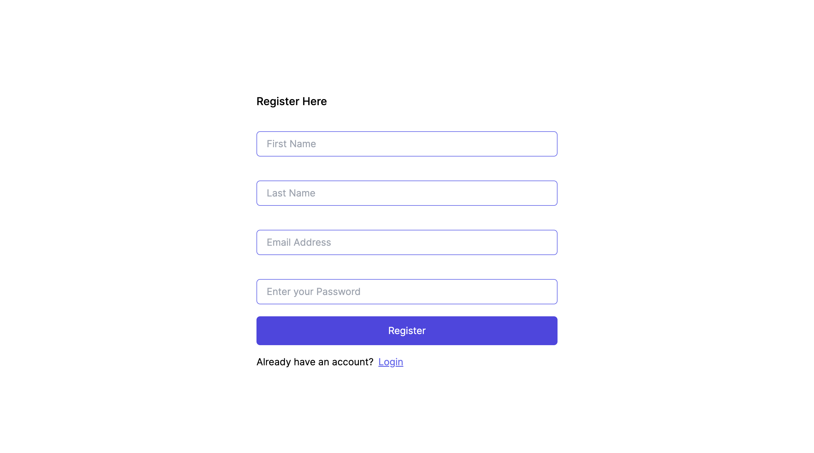

In code above:

- Renders the registration form created in the previous step
- Imports `getServerSession` from `next-auth` to check if a user currently has a session
- If a user already has a `session` ongoing, instead of rendering the registration form, it redirects them to the user dashboard( `/` )

Hurray! You've created a registration page that registers a new user from your Nextjs application to Directus.

Go to your Directus dashboard in <http://localhost:8055/admin/users>, and you should see a new user has been added to your list of users. Click on the `Customer` tab on the left, and it will show you all registered customers on your application.


The following action is to create the login functionality for the frontend application.

### Implementing the Login Functionality

With the registration page in place, let's implement the login functionality using the `next-auth` package.

#### Creating the Login API

Head to _api/auth_ and create a new folder called _[...nextauth]_; this folder will be used by the `next-auth` package for all login logic for the application.

Inside of the _[...nextauth]_, create a new file called _options.ts_ with the content:

`[...nextauth]/options.ts`

```ts
import type { NextAuthOptions } from 'next-auth';
import CredentialsProvider from 'next-auth/providers/credentials';
import { Session } from 'next-auth';
import directus from '@/lib/directus';
import { readMe, withToken } from '@directus/sdk';
import { JWT } from 'next-auth/jwt';

export const options: NextAuthOptions = {
  providers: [
    CredentialsProvider({
      // The name to display on the sign in form (e.g. "Sign in with...")
      name: 'Credentials',
      credentials: {
        email: {},
        password: {},
      },
      async authorize(credentials) {
        // Add logic here to look up the user from the credentials supplied
        const res = await fetch('http://localhost:8055/auth/login', {
          method: 'POST',
          body: JSON.stringify(credentials),
          headers: { 'Content-Type': 'application/json' },
        });
        const user = await res.json();
        // If no error and we have user data, return it
        if (!res.ok && user) {
          throw new Error('Email address or password is invalid');
        }
        if (res.ok && user) {
          return user;
        }
        // Return null if user data could not be retrieved
        return null;
      },
    }),
  ],
  secret: process.env.NEXTAUTH_SECRET,
  pages: {
    signIn: '/login',
  },
  callbacks: {
    async jwt({
      token,
      user,
      account,
    }: {
      token: JWT;
      user: any;
      account: any;
    }) {
      if (account && user) {
        const userData = await directus.request(
          withToken(
            user.data.access_token as string,
            readMe({
              fields: ['id', 'first_name', 'last_name'],
            })
          )
        );
        return {
          ...token,
          accessToken: user.data.access_token,
          refreshToken: user.data.refresh_token,
          user: userData,
        };
      }
      return token;
    },
    async session({ session, token }: { session: Session; token: any }) {
      session.user.accessToken = token.accessToken;
      session.user.refreshToken = token.refreshToken;
      session.user = token.user;
      return session;
    },
  },
};
```

Let's break down the `options` object for better understanding:

- `NextAuth` has authentication `providers` that can be used to sign in a user; this can be using `next-auth` built-in OAuth providers (e.g., Google, Github, etc.), using your own OAuth provider, using email or credentials. This tutorial uses credentials to authenticate users from the Directus backend.

```
:::info NextAuth supports multiple providers

>Note: you can have multiple providers to use to authenticate your users.

:::
```

- The `authorize` function performs an async request to the backend auth URL `http://localhost:8055/auth/login` to log in the user using the credentials provided by the request. If a user is found in the database, it returns the user data; otherwise, it throws an error.
- The `secret` field provides `next-auth` a secret for signing the `JWT` tokens that will be generated when a user is authenticated.
- By default, `next-auth` provides its own auth pages for handling authentication; the `pages` field can be used to customize `next-auth` to use custom pages provided.(In this application, the `signIn` page is the `login` page)
- `callbacks` in `next-auth` are functions after successful authentication. The code above has two callback functions:

  - When a user is authenticated by Directus, the Directus API returns an `access_token` and a `refresh_token`. Whenever `next-auth` generates its `JWT` token for an authenticated user, the `async jwt` function attaches the `access_token` and `refresh_token` to the `JWT` token generated. The function also fetches the `userData` from Directus using the `access_token` and attaches the data to the `JWT` token.

  - In NextAuth.js, a session represents the state of authentication for a user; this includes the user details such as `id`, `email` etc.
  The `async session` function attaches custom fields to the `session.user` object to contain an `id`, `first_name`, and `last_name` as well as the `accessToken` and `refreshToken` gotten from the Directus.

That's it; you've implemented the login logic to authenticate a user and also store its details in a `session`; you can now use this `session` data to check if a user is authenticated or not and whether they have the authorization to view a page or carry out a specific action.

To use this `options` object you created, open the _route.ts_ file and update its content:

`[...nextauth]/route.ts`

```ts
import NextAuth from 'next-auth';
import { options } from './options';

const handler = NextAuth(options);

export { handler as GET, handler as POST };
```

#### Creating the Login UI

With the login API ready, let's create the page that will call the login API to authenticate a user:
In the _app_ folder, create a new folder called _login_; inside of this folder, create two new files, _form.tsx_ and _page.tsx_.

The _form.tsx_ will contain the login form and the _page.tsx_ will serve as the page rendered on the browser.
Add the following content to _form.tsx_:

`app/login/form.tsx`

```tsx
'use client';
import Link from 'next/link';
import { signIn } from 'next-auth/react';
import { useRouter } from 'next/navigation';

import AuthForm from '@/components/AuthForm';
import { useState } from 'react';

interface Data {
  email?: string;
  password?: string;
}

export default function RegistrationForm() {
  const router = useRouter();
  const [error, setError] = useState('');
  const handleFormSubmit = async (data: Data) => {
    const response = await signIn('credentials', {
      email: data.email,
      password: data.password,
      redirect: false,
    });
    if (!response?.error) {
      router.push('/');
      router.refresh();
    } else {
      response.status === 401
        ? setError('Your email or password is incorrect')
        : null;
    }
  };

  return (
    <>
      {error && <p className="text-red-500">{error}</p>}
      <AuthForm
        title="Login here"
        onSubmit={handleFormSubmit}
        buttonText="Login"
        linkDescription="New here?"
        linkText="Create an account"
        linkHref="/register"
        isFullForm={false}
      />
      <div className="md:w-[500px] w-full mt-4">
        <Link
          className="text-indigo-500 underline "
          href="/request-reset-password"
        >
          Forgot password?
        </Link>
      </div>
    </>
  );
}
```

The above code:

- Renders the `<AuthForm />` component with some customization as a login form.
- Gets the input values from the form and uses the `signIn` method from `next-auth` to authenticate the user.
- If the request is successful, it should redirect the user to their dashboard or throw an error if the request failed

In your _page.tsx_, update its content to:

`app/login/page.tsx`

```tsx

import LoginForm from "./form"

export default async function RegisterPage() {
  return (
    <div className="flex h-full justify-center flex-col min-h-screen items-center md:p-24 p-5">
      <LoginForm />

    </div>
  )
}
```

This will create a page like this in the browser:

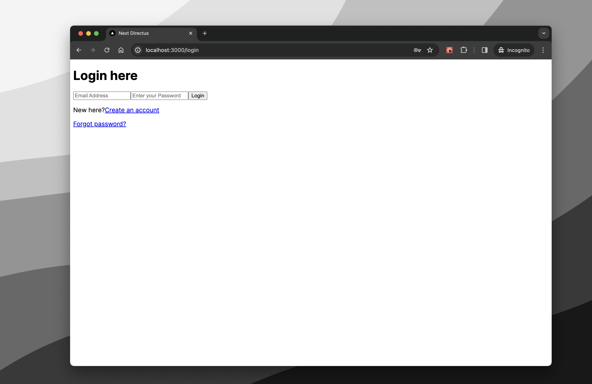

Kudos 🥳, you've just implemented a login functionality using `next-auth` in your Nextjs application with Directus.

Go ahead and test it. When a user logs in, it will go to the dashboard page (`/`)

### Protecting Private Routes with a Middleware

In a typical application, you'd only want authenticated users to be able to access private routes/pages such as `/dashboards` and user `profile` pages.

To do this in `next-auth`, create a new file in the _client_ folder called _middleware.ts_ with the content:

`middleware.ts`

```ts
export { default } from "next-auth/middleware"

export const config = { matcher: ["/"] }
```

This file will ensure any URL in the `matcher` array will be protected from unauthenticated users.

### Implementing a Forgot Password Request

An authentication system is only complete with a forgotten password reset functionality.
To implement a forgot password functionality in your Nextjs application, create a new folder in the _app_ folder called _request-reset-password_ with two files, _form.tsx_ and _page.tsx_.

Update the _form.tsx_ to the following:

`app/request-reset-password/form.tsx`

```tsx
'use client';

import Link from 'next/link';
import { FormEvent, useState } from 'react';
import { passwordRequest } from '@directus/sdk';
import directus from '@/lib/directus';

export default function RequestResetPasswordForm() {
  const [email, setEmail] = useState('');
  const [success, setSuccess] = useState('');
  const [error, setError] = useState('');
  const reset_url = `${process.env.NEXT_PUBLIC_URL}/reset-password`;

  const handleFormSubmit = async (e: FormEvent<HTMLFormElement>) => {
    e.preventDefault();

    try {
      const response = await directus.request(
        passwordRequest(email, reset_url)
      );
      setSuccess(
        'An email with a password reset link has been sent to your email!'
      );
    } catch (e: any) {
      console.log(e);
      if (e) {
        setError('An error occurred, please try again!');
      }
    }
  };

  return (
    <form onSubmit={handleFormSubmit} className=" md:w-[500px] w-full">
      <h1 className="capitalize text-lg font-medium my-4">
        Reset your password
      </h1>
      {success && (
        <p className="text-green-600 bg-green-50 p-2 rounded-md">{success}</p>
      )}
      {error && (
        <p className="text-red-600 bg-red-50 p-2 rounded-md">{error}</p>
      )}
      <p>
        Enter your registered email and a reset password link will be sent to
        you
      </p>
      <input
        type="email"
        placeholder="Email Address"
        name="email"
        required
        onChange={(e) => setEmail(e.target.value)}
        className="py-2 px-4 border border-indigo-500 rounded-md w-full my-5"
      />
      <button className="bg-indigo-600 text-white py-3 px-6 w-full rounded-md">
        Send Reset Link
      </button>
      <Link className="text-indigo-500 underline  mt-4 block" href="/login">
        Login page
      </Link>
    </form>
  );
}
```

The above code:

- Renders a form to collect the email input from the user.
- Fires a request using the Directus SDK to the Directus backend to reset the user password with an `email` and `reset_url` as request parameters.
- If the request is successful or failed, it should display a success or error message on the screen

In your _page.tsx_, update its content to:

`app/request-reset-password/page.tsx`

```tsx
import RequestResetPasswordForm from "./form"

export default async function RequestPasswordResetPage() {
  return (
    <div className="flex h-full justify-center flex-col min-h-screen items-center md:p-24 p-5">
      <RequestResetPasswordForm />
    </div>
  )
}
```

This will create a new page that looks like this:

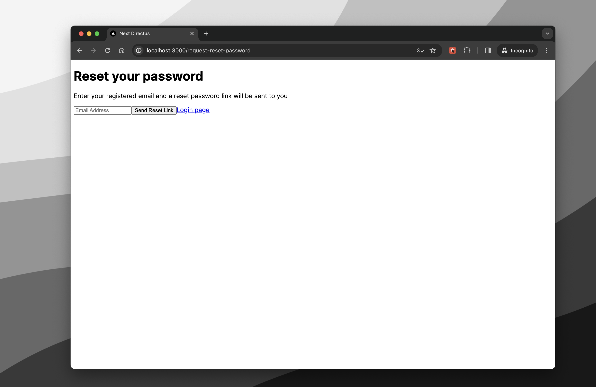

Filling out the reset password form and clicking on the reset button will trigger Directus to send a reset email with a link with a token to the user using the email configurations in your `docker-compose.yml` file.

### Customizing the Reset Password Email

To customize the email sent to the user's email, open the _server/extensions/_  folder generated by Directus in the _server_ folder and create a new  folder named _templates_
Directus email templates utilize [`liquid.js.`](https://liquidjs.com/). as such, you can customize them by creating custom `.liquid` files as replacements.

To customize the reset password email sent to the user, in the _templates_ folder, create a new _password-reset.liquid_ with the content:

`extensions/templates/password-reset.liquid`

```tsx

<h1>Reset your account password</h1>

<p>Hi there, you requested to change your password on our platform, here is a ink to reset your password below</p>
<p>
  <a href={{url}} target="_blank" rel="noopener noreferrer">Reset my password</a>
</p>

<p style="padding-top: 30px">Important: This link will expire in 24 hours.</p>

```

The `url` in the template is the `reset_url` passed in the reset password request from the frontend
Directus will attach a `token` to the `url` in the email that can be used to perform a new password request.

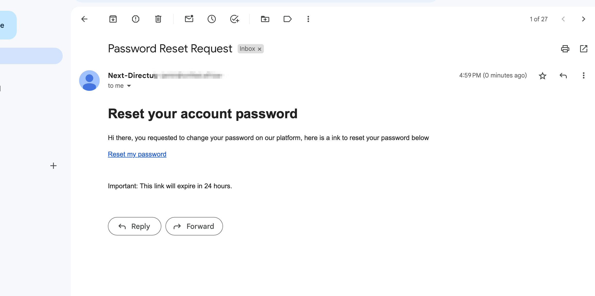

The email your users will receive should look like this screenshot above

### Resetting a User password

Now that the password reset request is successful, let's create a page where users can reset their password with the `url` they receive in their emails.

 Create a new folder in the _app_ folder called _reset-password_ with two files, _form.tsx_ and _page.tsx_.
 In the _form.tsx_ add the following:

`app/reset-password/form.tsx`

 ```tsx
 'use client';

import { FormEvent, useState } from 'react';
import { passwordReset } from '@directus/sdk';
import Directus from '@/lib/directus';
import { useRouter } from 'next/navigation'

export default function RequestResetForm({token}: {token: string}) {
  const [newPassword, setNewPassword] = useState('');
  const [success, setSuccess] = useState('');
  const [error, setError] = useState('');
  const reset_token = token;
  const router = useRouter();


  const handleFormSubmit = async (e: FormEvent<HTMLFormElement>) => {
    e.preventDefault();

    try {
      const response = await Directus.request(
        passwordReset(reset_token, newPassword)
      );
      setSuccess('Password successfully reset, redirecting you to login page...')
      setTimeout(() => router.push('/login'), 1000);
    } catch (e: any) {
      console.log(e)
        setError('The reset password token is invalid, please request for a new password reset link!')
    }
  };
  return (
    <form onSubmit={handleFormSubmit} className=" md:w-[500px] w-full">
      <h1 className="capitalize text-lg font-medium my-4">
        Provide a new password for your account
      </h1>
      {success &&
        <p className='text-green-600 bg-green-50 p-2 rounded-md'>
          {success}
        </p>}
      {error &&
        <p className='text-red-600 bg-red-50 p-2 rounded-md'>
          {error}
        </p>}
      <p>
       Enter your new password for your account
      </p>
      <input
        type="password"
        placeholder="Enter your new password"
        name="password"
        required
        onChange={(e) => setNewPassword(e.target.value)}
        autoComplete='new-password'
        className="py-2 px-4 border border-indigo-500 rounded-md w-full my-5"
      />
      <button className="bg-indigo-600 text-white py-3 px-6 w-full rounded-md">
        Create new password
      </button>
    </form>
  );
}
 ```

- The _reset-password/form.tsx_ accepts a token and sends a request to Directus using the Directus SDK with the `token` and `newPassword` as parameters for changing the user's password.

- If this request is successful, it redirects the user to the login page to log in with their new password.

Inside of the _page.tsx_, update the content to be:

`app/reset-password/page.tsx`

```tsx
import { redirect } from 'next/navigation';
import ResetPasswordForm from './form';


export default async function ResetPasswordPage({ searchParams }: { searchParams: { token: string } }) {
  const { token } = searchParams
  if (!token)
    redirect('/login')
  return (
    <div className="flex h-full justify-center flex-col min-h-screen items-center md:p-24 p-5">
      <ResetPasswordForm  token={token} />
    </div>
  );
}
```

The _page.tsx_ components checks if a token is present in the `reset-password` url; if it is present, it displays the `ResetPasswordPage`. Otherwise, it redirects the user to the login page.

## Summary

That's a wrap 🥳; in this article, you've successfully built an authentication system with password reset functionality using `Nextjs`, `NextAuth`, and `Directus`.
This is just a glimpse of what you can implement with Directus
Directus runs entirely as a backend service, meaning you can build complex backend services that will serve your frontend application with any database of your choice

Some possible steps you can consider to improve this application:

- Improving the functionality of the authentication system to accept OAuth providers like `Google`, `Twitter`, et. c
- Improving error handling to show the correct errors to your users properly
- Add a
- Create new `Item` models that your `Customers` can use to create their data from your frontend application

The complete code for this tutorial can be found [here](https://github.com/0xJamin/next-auth-directus)
