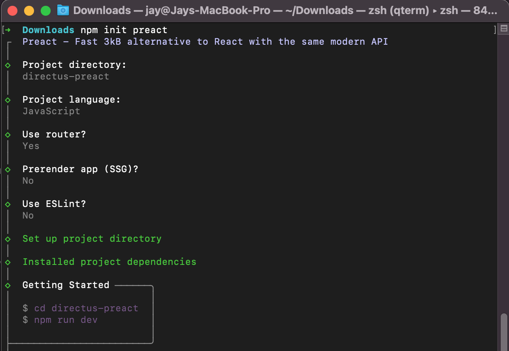
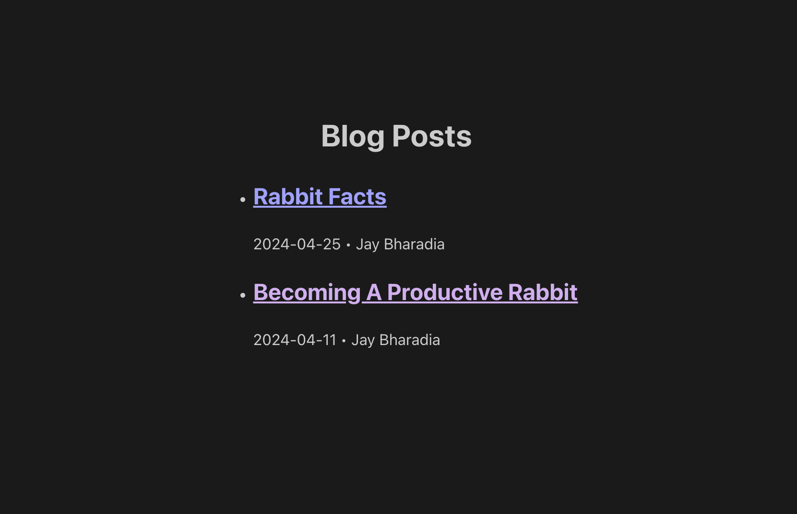

## Introduction

[Preact](https://preactjs.com/) is a lightweight alternative to React. In this tutorial, you will store, retrieve, and use global metadata, pages, and posts based on a Directus project.

Before You Start

You will need:

-   Install Node.js and a code editor on your computer.
-   A Directus project - [follow our quickstart guide](https://docs.directus.io/getting-started/quickstart) if you don't already have one.
-   Some knowledge of Preact framework.

## Creating a Preact Project

Open your terminal and run the following commands:

`npm init preact`



```
npm init preact
↳ Project directory: directus-project
↳ Project language: JavaScript
↳ Use router?: Yes
↳ Prerender app?: No
↳ Use ESLint?: No
cd directus-project
```

```
npm run dev
```

## Install the Directus SDK and start the Preact dev server:

```
npm install @directus/sdk`
npm run dev
```

## Setup Directus Utility

1. Create `utils/directus.js` file

```js
import { createDirectus, rest } from "@directus/sdk";

const directus = createDirectus("https://directus-supabase.onrender.com").with(
    rest()
);
export default directus;
```

Be sure to provide your actual Directus project URL.

## Using Global Metadata

In your Directus project, navigate to Settings -> Data Model and create a new collection called `global`. Under the Singleton option, select 'Treat as a single object', as this collection will have just a single entry containing global website metadata.

Create two text input fields - one with the key of `title` and one `description`.

Navigate to the `content` module and enter the `global` collection. Enter information in the title and description field and hit save.


By default, new collections are not accessible to the public. Navigate to Settings -> Access Control -> Public and give Read access to the Global collection.

In `pages/index.jsx` file, add the following code to fetch the data from Directus and display it.

```js
import directus from "../utils/directus";
import { readSingleton } from "@directus/sdk";
import { useState } from "preact/compat";

export function Home() {
    const [global, setGlobal] = useState({});
    const fetchData = async () => {
        const global = await directus.request(readSingleton("global"));

        setGlobal(global);
    };
    fetchData();

    return (
        <div>
            Home Page
            <h1>{global.title}</h1>
        </div>
    );
}
```

Open your browser to `http://localhost:3000`. You should see the data from your Directus Global collection displayed in the index page.

## Setup Routing

We will load Blog Post List, detail page, dynamic pages and a 404 page.

```js
import { render } from "preact";
import { LocationProvider, Router, Route } from "preact-iso";

import { NotFound } from "./pages/_404.jsx";
import { BlogList } from "./pages/blog/list.jsx";
import { Blog } from "./pages/blog/slug.jsx";
import { Page } from "./pages/slug.jsx";
import { Home } from "./pages/index.jsx";

import { Header } from "./components/Header.jsx";
import "./style.css";
export function App() {
    return (
        <LocationProvider>
            <Header />
            <main>
                <Router>
                    <Route path="/" component={Home} />

                    <Route path="/blog" component={BlogList} />
                    <Route path="/404" component={NotFound} />
                    <Route path="/blog/:slug" component={Blog} />
                    <Route path="/:slug" component={Page} />
                </Router>
            </main>
        </LocationProvider>
    );
}
render(<App />, document.getElementById("app"));
```

## Creating Pages With Directus

Create a new collection called pages - make the Primary ID Field a "Manually Entered String" called slug, which will correlate with the URL for the page. For example `about` will later correlate to the page `localhost:3000/about`.

Create a text input field called `title` and a WYSIWYG input field called `content`. In Access Control, give the Public role read access to the new collection. [here is some sample data](https://github.com/directus-community/getting-started-demo-data)

Inside of `pages` , create a new file called `slug.jsx`. This is a dynamic route, so a single file can be used for all of the top-level pages.

```js
import { useEffect, useState } from "preact/compat";
import { useRoute, useLocation } from "preact-iso";
import directus from "../utils/directus";
import { readItem } from "@directus/sdk";
export function Page() {
    const { params } = useRoute();
    const location = useLocation();
    const [page, setPage] = useState({});
    const [loading, setLoading] = useState(true);

    useEffect(() => {
        setLoading(true); // Set loading state to true when fetching data

        const fetchData = async () => {
            try {
                const page = await directus.request(
                    readItem("pages", params.slug)
                );
                setPage(page);
            } catch (error) {
                location.route("/404");
                console.error("Error fetching page:", error);
            } finally {
                setLoading(false);
            }
        };

        fetchData();
    }, [params.slug]);

    return (
        <div>
            {loading ? (
                <p>Loading...</p>
            ) : (
                <>
                    <h1>{page.title}</h1>
                    <div dangerouslySetInnerHTML={{ __html: page.content }} />
                </>
            )}
        </div>
    );
}
```


Note that we check if a returned value exists, and return a 404 if not. Please also note thatv-html should only be used for trusted content.

## Creating Blog Posts With Directus​

Create a new collection called authors with a single text input field called name. Create one or more authors.

Then, create a new collection called `posts` - make the Primary ID Field a "Manually Entered String" called `slug`, which will correlate with the URL for the page. For example hello-world will later correlate to the page `localhost:3000/blog/hello-world`.

Create the following fields in your posts data model:

-   a text input field called `title`
-   a WYSIWYG input field called `content`
-   an image relational field called `image`
-   a datetime selection field called `publish_date` - set the type to 'date'
-   a many-to-one relational field called `author` with the related collection set to `authors`
    In Access Control, give the Public role read access to the `authors`, `posts`, and `directus_files` collections.

Create 3 items in the posts collection - [here is some sample data](https://github.com/directus-community/getting-started-demo-data).

## Create Blog Post Listing​

Inside of the `pages` directory, create a new subdirectory called `blog` and a new file called `list.jsx` inside of it.

```js
import { useEffect, useState } from "preact/compat";
import { Link } from "preact-router";
import directus from "../../utils/directus";
import { readItems } from "@directus/sdk";
export function BlogList() {
    const [posts, setPosts] = useState([]);
    const [loading, setLoading] = useState(true);

    useEffect(() => {
        setLoading(true); // Set loading state to true when fetching data

        const fetchData = async () => {
            try {
                const posts = await directus.request(
                    readItems("posts", {
                        fields: [
                            "title",
                            "published_date",
                            "author.name",
                            "slug",
                        ],
                    })
                );
                setPosts(posts);
            } catch (error) {
                console.error("Error fetching posts:", error);
            } finally {
                setLoading(false);
            }
        };

        fetchData();
    }, []);

    return (
        <div>
            <h1>Blog Posts</h1>
            {loading ? (
                <p>Loading...</p>
            ) : (
                <ul>
                    {posts.map((post) => (
                        <li key={post.slug}>
                            <Link href={`/blog/${post.slug}`}>
                                <h2
                                    style={{
                                        textAlign: "left",
                                        textDecoration: "underline",
                                        cursor: "pointer",
                                    }}
                                >
                                    {post.title}
                                </h2>
                            </Link>
                            <div style={{ textAlign: "left" }}>
                                <span>{post.published_date}</span>
                                <span> &bull; {post.author.name}</span>
                            </div>
                        </li>
                    ))}
                </ul>
            )}
        </div>
    );
}
```

This query will retrieve the first 100 items (default), sorted by publish date (descending order, which is latest first). It will only return the specific fields we request - `slug`, `title`, `publish_date`, and the `name` from the related author item.
Visit `http://localhost:3000/blog` and you should now see a blog post listing, with latest items first.


Click on any of the blog post links, and it will take you to a blog post page complete with a header image.

## Create Blog Post Detail Page

Each blog post links to a page that does not yet exist. In the `pages/blog` directory, create a new file called `slug.jsx`:

```js
import { useEffect, useState } from "preact/compat";
import { useRoute, useLocation } from "preact-iso";
import directus from "../../utils/directus";
import { readItem } from "@directus/sdk";
export function Blog() {
    const { params } = useRoute();
    const location = useLocation();
    const [post, setPost] = useState({});
    const [loading, setLoading] = useState(true);

    useEffect(() => {
        setLoading(true);

        const fetchData = async () => {
            try {
                const post = await directus.request(
                    readItem("posts", params.slug)
                );
                setPost(post);
            } catch (error) {
                location.route("/404");
                console.error("Error fetching page:", error);
            } finally {
                setLoading(false);
            }
        };

        fetchData();
    }, [params.slug]);

    return (
        <div>
            {loading ? (
                <p>Loading...</p>
            ) : (
                <>
                    <h1>{post.title}</h1>
                    <div dangerouslySetInnerHTML={{ __html: post.content }} />
                </>
            )}
        </div>
    );
}
```


## Add Navigation

While not strictly Directus-related, there are now several pages that aren't linked to each other. In `index.jsx`, above the `<main />` component, add a navigation `<Header/>`. Don't forget to use your specific page slugs.

```js
import { useLocation } from "preact-iso";

export function Header() {
    const { url } = useLocation();

    return (
        <header>
            <nav>
                <a href="/" class={url == "/" && "active"}>
                    Home
                </a>
                <a href="/about" class={url == "/about" && "active"}>
                    About
                </a>
                <a href="/blog" class={url == "/blog" && "active"}>
                    Blogs
                </a>
            </nav>
        </header>
    );
}
```

Next Steps
Through this guide, you have set up an Preact project, created a Directus instance, and used it to query data. You have used a singleton collection for `global` metadata, dynamically created `pages`, as well as blog listing and blog pages.
