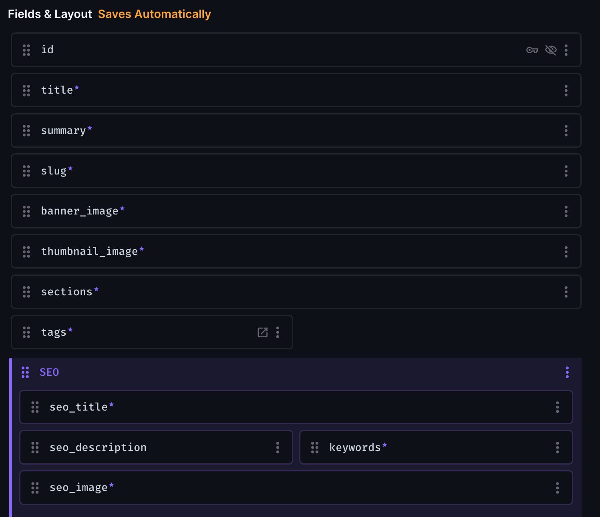
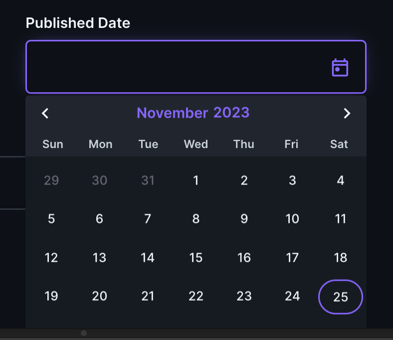
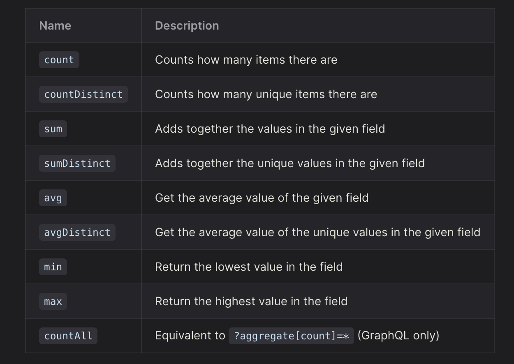

## Introduction

In the ever-evolving landscape of web development, the need for robust content management systems (CMS) has become more apparent than ever.

-   Directus stands out as a powerful choice, offering a myriad of features to handle data intricacies.
-   However, navigating the complexities of advanced filtering, especially with nesting and logical operators, can be a daunting task.

Join us as we embark on a hands-on exploration, providing practical examples, insightful strategies, and a roadmap to elevate your Directus proficiency.

Welcome to "Mastering Directus Advanced Filtering" – your comprehensive guide to navigating the depths of Directus with confidence and efficiency.

## Before You Start

> ℹ️ This guide uses the new [Directus SDK 11](https://docs.directus.io/guides/sdk/getting-started.html). Please refer docs if you are using an older version.

### Consider we have Blog Website

-   In our blog website, we have articles list with filters

### Article List


### Filters


> ## Real World Requirement

-   We need to show articles as per the **filters** are selected ( we have month , year filter ) and **search** and **sort**
-   Get data Month wise , Year wise , also `when month and year both are selected`
-   Get Data when search value is entered
-   when combination of above is happened ( month + year + search )
-   show Count of data as per the filters

---

### Directus Schema Setup

-   Set up your schema as shown in screenshot



-   Now create `published_date` with `date` format



### Accessing Items ( JS Part)

> Items are individual pieces of data in your database. They can be anything, from articles, to IoT status checks. Learn more about [Items](https://docs.directus.io/user-guide/overview/glossary.html#items).

### Initialize Directus instance

```js
import { createDirectus, rest, aggregate, readItems } from "@directus/sdk";

const client = createDirectus("https://directus.example.com").with(rest());
```

### Get Data by Month

```js
  restClient
        .request(
            readItems("articles", {
                filter: {
                    _or: [
                        {
                            "month(published_date)": {
                                // January
                                _eq: 1,
                            },
                        },
                        {
                            "month(published_date)": {
                                // Feb
                                _eq: 2,
                            },
                        },
                        {
                            "month(published_date)": {
                                // March
                                _eq: 3,
                            },
                        },
                    ],
                },
            })
        )

// Response
[{...}] // total length 1
```

### Get Data By Year

```js
  restClient
        .request(
            readItems("articles", {
                filter: {
                    _or: [
                            {
                                "year(published_date)": {
                                        _eq: 2023,
                                },
                            },
                            {
                                "year(published_date)": {
                                        _eq: 2022,
                                },
                            },
                    ],
                },
            })
        )
// Response
[{...},{...}] // Total count 2
```

### Get Data By Month & Year & search

```js
   restClient
        .request(
            readItems("articles", {
                filter: {
                    // Notice below _and -> logical operator
                    _and: [
                        {
                            // Month
                            _or: [
                                {
                                    "month(published_date)": {
                                        // January
                                        _eq: 1,
                                    },
                                },
                                {
                                    "month(published_date)": {
                                        // Feb
                                        _eq: 2,
                                    },
                                },
                                {
                                    "month(published_date)": {
                                        // March
                                        _eq: 3,
                                    },
                                },
                            ],
                        },
                        {
                            // Year
                            _or: [
                                {
                                    "year(published_date)": {
                                        _eq: 2023,
                                    },
                                },
                                {
                                    "year(published_date)": {
                                        _eq: 2022,
                                    },
                                },
                            ],
                        },
                        {
                            // Title search
                            title: {
                                _contains: "gpt",
                            },
                        },
                    ],
                },
            })
        )

//Response
[{...},{...}] // total count 2
```

## Aggregation & Grouping

### Get Filter Count By Year

```js
// Get articles count by year for showing in filters
const result = await client.request(
	aggregate('articles', {
		aggregate: { count: '*' },
        groupBy: ['year(published_date)']
	})
);

// Response
{
  "data": [
    {
      "published_date_year": 2022,
      "count": 35
    },
    {
      "published_date_year": 2023,
      "count": 44
    }
  ]
}
```


### Get Filter Count By Month

```js
// Get articles count by month for showing in filters
const result = await client.request(
	aggregate('articles', {
		aggregate: { count: '*' },
        groupBy: ['month(published_date)']
	})
);

// Response
{
  "data": [
    {
      "published_date_month": 1,
      "count": 4
    },
    {
      "published_date_month": 2,
      "count": 16
    },
    {
      "published_date_month": 3,
      "count": 15
    },
    {
      "published_date_month": 4,
      "count": 9
    },
    {
      "published_date_month": 5,
      "count": 8
    },
    {
      "published_date_month": 6,
      "count": 4
    },
    {
      "published_date_month": 7,
      "count": 2
    },
    {
      "published_date_month": 8,
      "count": 4
    },
    {
      "published_date_month": 9,
      "count": 2
    },
    {
      "published_date_month": 10,
      "count": 5
    },
    {
      "published_date_month": 11,
      "count": 6
    },
    {
      "published_date_month": 12,
      "count": 6
    }
  ]
}
```


-   Below image shows few more options
    

## Summary

-   By delving into this comprehensive guide, you have not only master advanced filtering in Directus but also learned valuable insights into SDK 11 integration and real-world application development.
-   This guide serves as a cornerstone for creating powerful queries, providing a solid foundation for addressing complex use cases with confidence.
