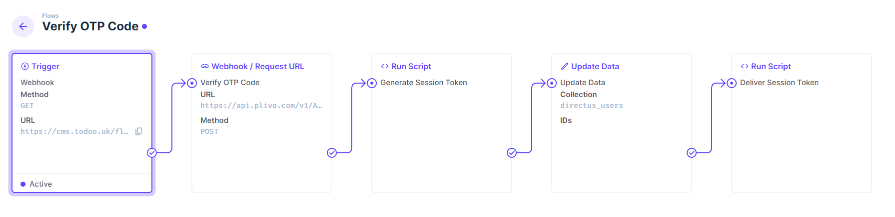

In this tutorial, we will be setting up Passwordless Authentication using Directus Automate and the [Plivo Verify API](https://www.plivo.com/verify/).

This will allow users to sign in to your Directus project by sending a one-time password (OTP) to their phone number, and then validating that it is correct before returning a token for further requests.

This solution can be used once a user already exists in your project and has a unique, correctly-formatted, phone number. Formatting numbers can be hard and the [Plivo Lookup API](https://www.plivo.com/lookup/) can be used to validate a phone number.

## Before You Start

You will need...

- A Directus project - follow our [quickstart guide](https://docs.directus.io/getting-started/quickstart) if you don't already have one.
- A [Plivo account](https://console.plivo.com/accounts/request-trial/).
- A phone number that you can use to test receiving SMS messages (such as your own mobile phone number).
- The `directus_users` table should have a `phone` field that is a `String`.
- The `directus_users` table should have a `otp_session_uuid` field that is a `String`.
- A Directus user account with a valid mobile phone number added to the `phone` field.

## Setting Up Plivo

In the [Plivo Verify Overview](https://console.plivo.com/verify/overview/), take note of your Auth ID and Auth Token. Create a new application and also take note of it's UUID.

Plivo uses BasicAuth to authenticate requests, but Directus Automate does not support this natively. Fortunately, you can use BasicAuth through headers by encoding the username and password as a Base64 string. 

The encoded value must be in the format `auth_id:auth_token`. You can use [this web tool to encode the string](https://www.base64encode.org/). Take note of the string.

## The Login Flow

- In Directus, create a new flow called "Passwordless Login". The description could be "Receives a country code & phone number to create a Plivo OTP session".
- Click the next button.
- Click webhook then uncheck the "Cache" checkbox
- Click the save button.

We're presented with our new flow with a "Webhook Trigger" node. This node will be the entry point for our flow. Make a note of the Trigger URL presented on this node as we will need this later.

- Click the little plus sign on the Webhook Trigger.
- Set the name to "Number Cleanup" and then click "Run Script".
- You will see a script editor. In the script editor, add the following code:

```javascript
module.exports = async function(data) {
  const countryCode = `+${data.$trigger.query.country_code}`;
  const phoneNumber = data.$trigger.query.phone_number;

  let fullPhoneNumber = phoneNumber.replace(/[^\d+]/g, ''); // remove all non-numeric characters except "+"
  
  if (phoneNumber.startsWith('00')) {
    fullPhoneNumber = phoneNumber.replace(/^00/g, '+')
  } else if (!phoneNumber.startsWith('+')) {
    fullPhoneNumber = `${countryCode}${phoneNumber.replace(/^[0-9]/g, '')}`;
  }
  
  return {
    phone_number: fullPhoneNumber
  };
}
```

This code crudely cleans up the phone number which is great for testing purposes. It also ensures a standard format for the phone number stored against the user account. We'll get back to that later.

- Click the save button and then save the flow.
- In a browser, navigate to the Trigger URL we noted earlier.
- Staying in the browser, edit the Trigger URL appending `?phone_number=07123456789&country_code=44` to the end. This will trigger the flow, clean up the phone number and return the following JSON: `{"phone_number":"+447123456789"}`
- If you see that, then the cleanup script is working as expected.

## Creating the Plivo OTP Session

- Back in the Directus flow editor, we need to add a new node to create the Plivo OTP session.
- Click the little plus sign on the "Number Cleanup" node.
- Set the name to "Create OTP Session" and then select "Webhook / Request URL".
- Set the method to POST
- In the URL field, enter `https://api.plivo.com/v1/Account/{PLIVO_AUTH_ID}/Verify/Session/`. Replace `{PLIVO_AUTH_ID}` with your Plivo Auth ID.
- In the headers section, add the following header replacing `{AUTH_HEADER}` with the encoded Authentication Header we created earlier:
  - Header: Authorization
  - Value: Basic {AUTH_HEADER}
- In the body section, add the following JSON replacing `{PLIVO_APP_UUID}` with your Plivo App UUID:

```json
{
  "app_uuid": "{PLIVO_APP_UUID}",
  "recipient": "{{$last.phone_number}}",
	"channel": "sms",
	"method": "POST"
}
```

A typical response from Plivo will look like this:

```json
{
	"api_id": "8ad839d3-34ab-4549-945d-33ed4f350ef5",
	"message": "Session initiated",
	"session_uuid": "b3d06b0c-d1cb-47cd-ab4b-64b579f72f93"
}
```

## Updating the User Account

- Back in the Directus flow editor, we need to add a new node to update the user account with the OTP session UUID.
- Click the little plus sign on the "Create OTP Session" node.
- Set the name to "Update User Account" and then click "Update Data".
- In the "Collection" field, click the word "Collection" and select "Edit Raw Value" and set the value to "directus_users".
- Set the Permissions to "Full Access"
- In the `Payload` section, add the following JSON:

```json
{
    "otp_session_uuid": "{{$last.session_uuid}}"
}
```

- In the `Query` section, add the following JSON:

```json
{
    "filter": {
        "phone": {
            "_eq": "{{number_cleanup.phone_number}}"
        }
    }
}
```

- Click `Done` and then click `Save`.

## Delivering the OTP Session to the Client

- We need to add a new node to deliver the OTP session UUID to the client.
- Click the little plus sign to the right of the "Update User Account" node.
- Set the name to "Deliver OTP Session" and then click "Run Script".
- In the script editor, add the following code:

```javascript
module.exports = async function(data) {
  return {
    otp_session_uuid: data.create_otp_session.data.session_uuid
  };
}
```

## Testing the Flow

- Back in the browser and navigate to the Trigger URL we noted earlier.
- Staying in the browser, edit the Trigger URL appending `?phone_number={YOUR_NUMBER}&country_code={YOUR_COUNTRY_CODE}`. Replace {YOUR_NUMBER} with your phone number and {YOUR_COUNTRY_CODE} with your country code.
- Hit enter and you should see a response from our Directus flow with the `otp_session_uuid`. This UUID is the OTP session ID that we will use to verify the OTP code.
- You should also receive an OTP code via SMS to the phone number you provided. Make a note of the OTP code.
- The `otp_session_uuid` has also been stored against the user account.
- Make a note of this `otp_session_uuid` as we will need it later.


## Verifying the OTP Code

The second flow will accept a Session UUID and a One Time Password. If correct, it will generate and save a new static token against the user and deliver it. The token can then be used to authenticate requests.

Create a new Flow from your project settings with a Webhook trigger and caching disabled. Your application will make a request to this URL when verifying a OTP.

To create a session, create a **Webhook / Request URL** operation with the following options:

- Set the method to POST
- In the URL field, enter `https://api.plivo.com/v1/Account/{PLIVO_AUTH_ID}/Verify/Session/{{$trigger.query.session_uuid}}/`. Replace `{PLIVO_AUTH_ID}` with your Plivo Auth ID.
- In the headers section, add the following header replacing `{AUTH_HEADER}` with the encoded Authentication Header we created earlier:
  - Header: Authorization
  - Value: Basic {AUTH_HEADER}
- In the body section, add the following JSON replacing `{PLIVO_APP_UUID}` with your Plivo App UUID:

```json
{
    "otp": "{{$trigger.query.otp}}"
}

## Generating a Directus session token

- We need to add a new node to generate a directus session token.
- Click the little plus sign on the "Verify OTP Code" node.
- Set the name to "Generate Session Token" and then click "Run Script".
- In the script editor, add the following code:

```javascript
module.exports = async function(data) {
    
    var message = data.$last.message;
    
    var rand = function() {
        return Math.random().toString(36).substr(2);
    };

    var token = function() {
        return rand() + rand();
    };
    
    if (message == "session validated successfully.") {
        return {
            message,
            token: token()
        };
    } else {
        return {
            message
        }
    }
}
```

## Updating the User Account

- We need to add a new node to update the user account with the session token.
- Click the little plus sign on the "Generate Session Token" node.
- Set the name to "Update User Account" and then click "Update Data".
- In the "Collection" field, click the word "Collection" and select "Edit Raw Value" and set the value to "directus_users".
- Set the Permissions to "Full Access"
- In the `Payload` section, add the following JSON:

```json
{
    "token": "{{$last.token}}"
}
```

- In the `Query` section, add the following JSON:

```json
{
    "filter": {
        "otp_session_uuid": {
            "_eq": "{{$trigger.query.session_uuid}}"
        }
    }
}
```

- Click `Done`

## Delivering the Directus Session Token to the Client

- We need to add a new node to deliver the Directus session token to the client.
- Click the little plus sign to the right of the "Update User Account" node.
- Set the name to "Deliver Session Token" and then click "Run Script".
- In the script editor, add the following code:

```javascript
module.exports = async function(data) {
	return data.generate_session_token;
}
```

## Testing the Flow

- Back in the browser and navigate to the Trigger URL for the `Verify OTP Code` flow we noted earlier.
- Staying in the browser, edit the Trigger URL appending `?otp={YOUR_OTP_CODE}&session_uuid={YOUR_OTP_SESSION}`. Replace {YOUR_OTP_CODE} with the OTP code you received via SMS and {YOUR_OTP_SESSION} with the `otp_session_uuid` you noted earlier.
- Hit enter and you should see a response from our Directus flow with the `token`. This token is the session token that we will use to authenticate with Directus.



## Summary

You have now successfully set up Passwordless Authentication in Directus Flows using the Plivo Verify API. This will allow users to sign in to your Directus project by sending a one-time password (OTP) to their phone number.

Beyond Passwordless Mobile authentication, email and magic link could also work the same way. The only difference is the way the user receives the code.