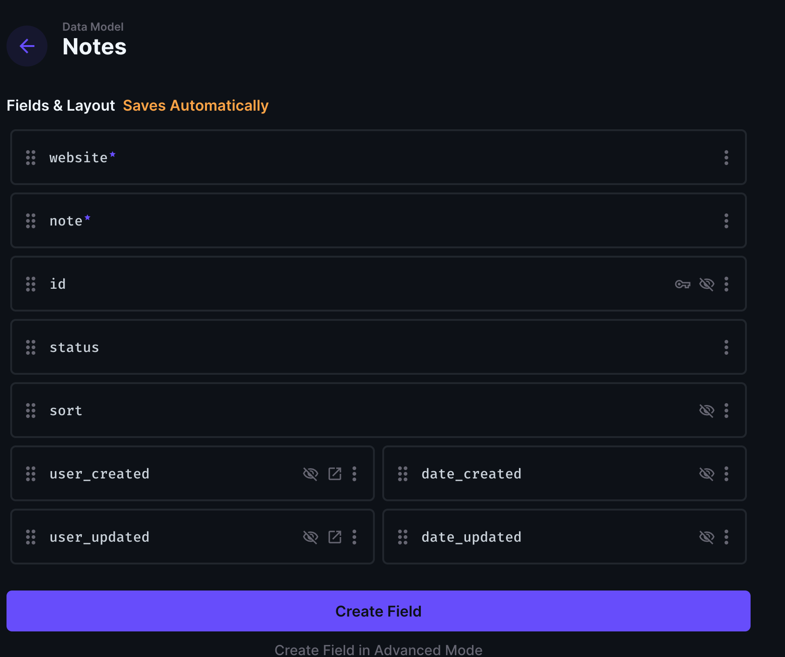
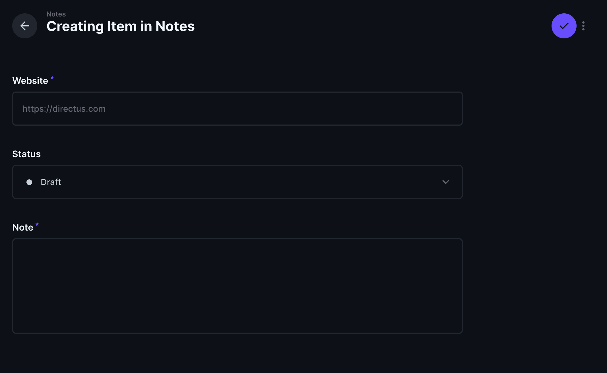
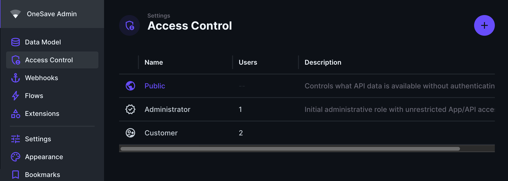
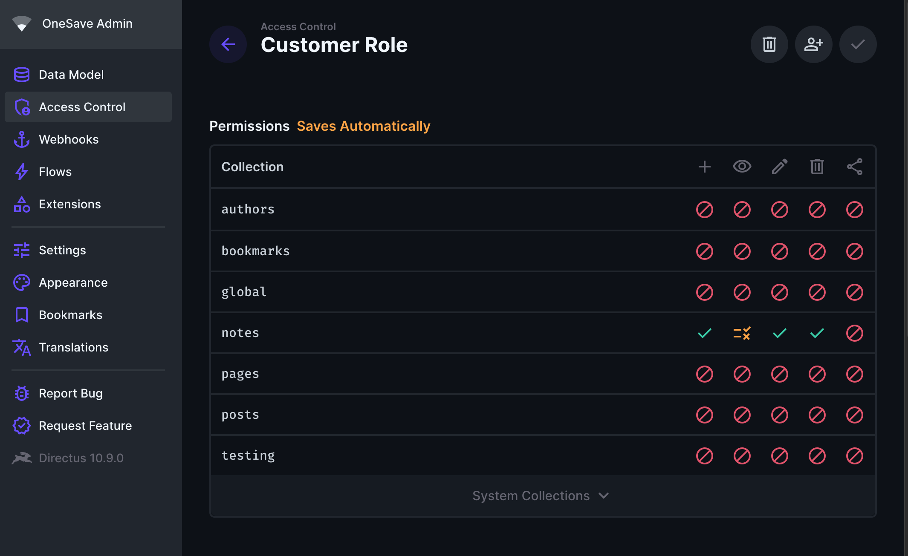
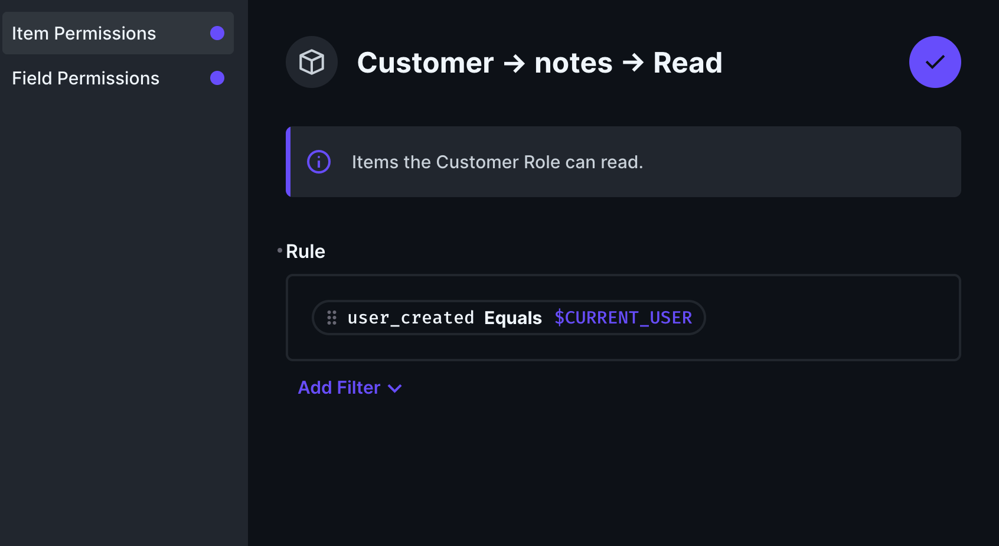
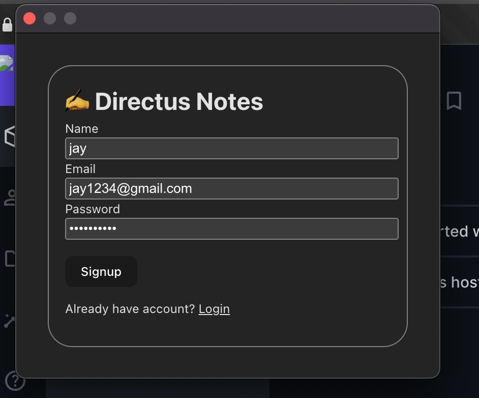
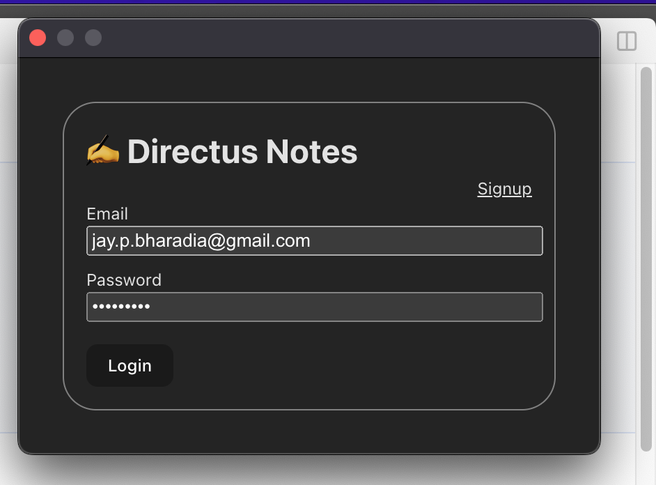
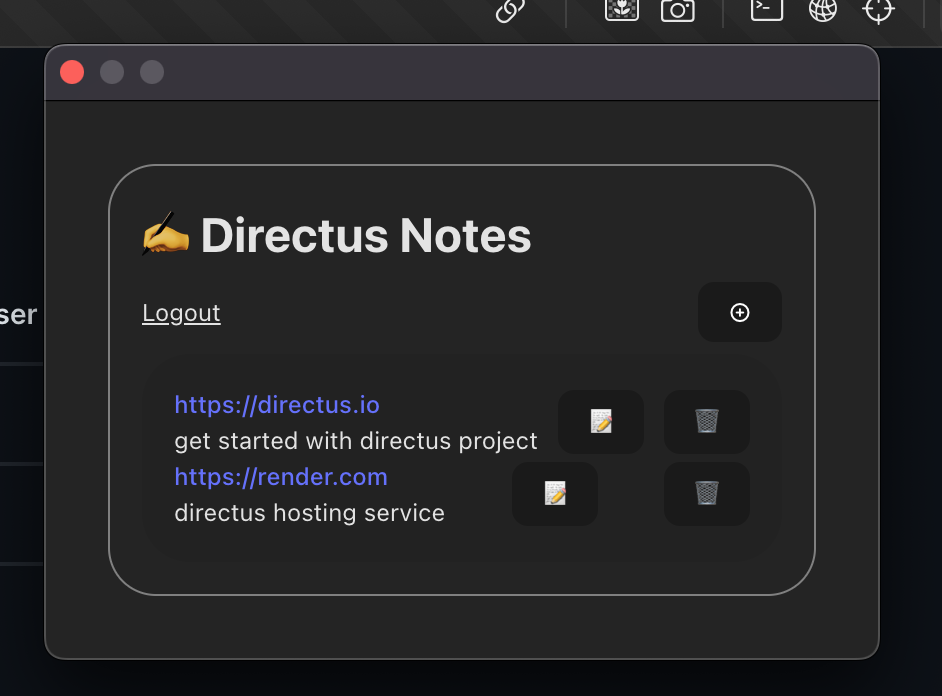
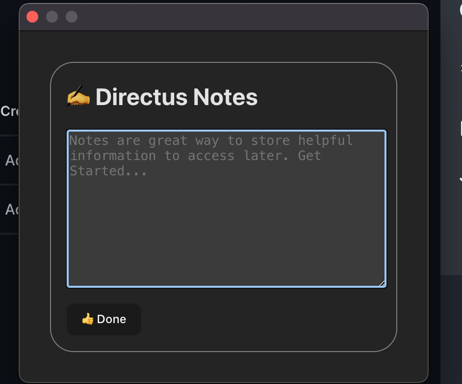
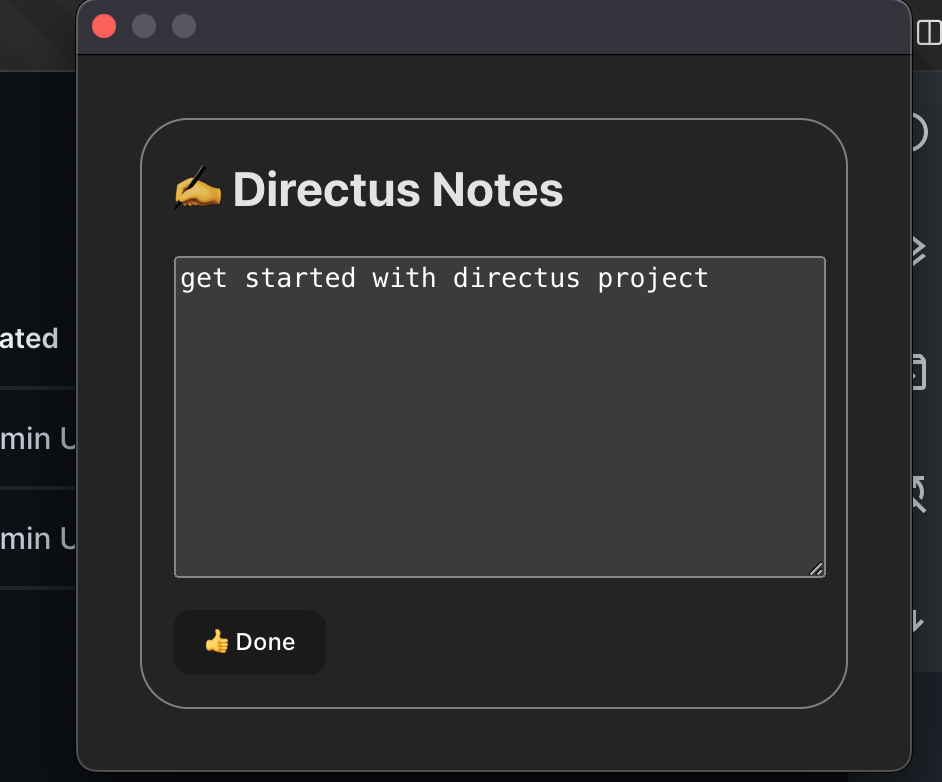

## Introduction

This article will guide you through building a Chrome extension using Vite and Directus. The extension will leverage Directus as the backend to store and manage data.

When a user clicks the extension while browsing a webpage, it will automatically capture the URL of the current webpage and prompt the user to add a `note`. Users will be able to `view`, `edit`, and `delete` their notes directly from the extension.

Before you start, you will need a Directus project. Follow the [Quickstart guide](https://docs.directus.io/getting-started/quickstart) to create one if needed.

This tutorial will not cover styling the extension, but light styling has been applied to the screenshots shown.

## Set Up Your Directus Project

### Create Notes Collection

Create a new collection called `notes` with all optional fields enabled. Create the following additional fields:

-   `website` - new field with type `string`
-   `note` - new field with type `string`





### Setup Roles

In order to create new note, edit note or delete note on behalf of user, we need to create separate role ( except admin ).
We will create `customer` role for different users.

-   Go to `settings` -> `Access Control` Menu
-   Click on `Add New` Role
-   Enter role name, select `App Access` only
-   Save



### Setup Permission

Create a `customer` role for new users. In the access control settings for the role, provide

-   Go to `Access Control` -> Select `Customer` Role.
-   Set a custom permission for all operations in the `notes` collection: `user_created equals $CURRENT_USER`.





---

## Initialize Extension

Open your terminal and run the following commands to create a new project, install dependencies, and run the project:

-   Open new terminal, execute below command to create new vite + vue project

```bash
npm create vite@latest directus-webnote-keeper -- --template vue
cd directus-webnote-keeper
npm install
npm install @directus/sdk js-cookie vue-router
npm run dev
```

## Setup Extension

Add a `manifest.json` file in root directory of the project:

```json
{
    "name": "Directus WebNote Keeper",
    "version": "1.0",
    "manifest_version": 3,
    "author": "Jay Bharadia",
    "description": "Directus WebNote Keeper for capturing urls and store in directus.",
    "icons": {
        "16": "icon.png",
        "32": "icon.png",
        "48": "icon.png",
        "128": "icon.png"
    },
    "action": {
        "default_title": "Directus WebNote Keeper",
        "default_popup": "index.html"
    },
    "permissions": ["activeTab", "storage"]
}
```

You must tell browser about the functionality and permissions required by this extension. You can read more about declaring permissions in the [Google Extensions Docs](https://developer.chrome.com/docs/extensions/develop/concepts/declare-permissions).

-   `activeTab`: We need to read the website from current active tab.
-   `storage`: Store the authentication token as a cookie.

### Create Directus SDK Plugin

Create new file `plugins/directus.js`

```js
import { createDirectus, rest, authentication } from "@directus/sdk";

import Cookies from "js-cookie";
const directus = createDirectus("your-project-url")
    .with(
        authentication("cookie", {
            autoRefresh: true,
            credentials: "include",
            storage: {
                get() {
                    if (Cookies.get("directus_auth"))
                        return JSON.parse(Cookies.get("directus_auth"));
                    else return null;
                },
                set(data) {
                    Cookies.set("directus_auth", JSON.stringify(data));
                },
            },
        })
    )
    .with(rest());

export default directus;
```

Replace `your-project-url` with your Directus Project's URL.

Open `main.js` and import the plugin:

```js
import directus from "./plugins/directus.js";

app.provide("directus", directus);
```

## Setup Routing

Create new file `plugins/router.js`

```js
// plugins/router.js

import { createWebHistory, createRouter } from "vue-router";
import HomeView from "../views/home.vue";

const routes = [
    { path: "/", name: "home", meta: { public: false }, component: HomeView },
];

const router = createRouter({
    history: createWebHistory(),
    routes,
});

export default router;
```

Include the router instance in `main.js`:

```js
import directus from "./plugins/directus.js";
import router from "./plugins/router.js"; // [!code ++]
app.provide("directus", directus);
app.use(router); // [!code ++]
```

## Load Extension

Before moving further, build the extension and make sure it runs in your browser. Add build command in `package.json`:

```json
"build-extension": "vite build && cp manifest.json dist/"
```

And then run the build command from your terminal:

```
npm run build-extension
```

Open Google Chrome, go to `chrome://extensions`, click on 'Load Unpacked button' button, and select your project's `dist` folder.

### Setup Signup

Create new file `src/views/signup.vue`

```html
<template>
    <div>
        <form @submit.prevent="signup">
            <label>Name</label>
            <input type="text" v-model="name" required />

            <label>Email</label>
            <input type="email" v-model="email" required />

            <label>Password</label>
            <input type="password" v-model="password" required />
            <button type="submit">Signup</button>
            <p>
                Already have account?
                <span @click="$router.push({ name: 'login' })">Login</span>
            </p>
        </form>
    </div>
</template>

<script>
    import { registerUser } from "@directus/sdk";
    export default {
        inject: ["directus"],
        data() {
            return {
                name: "",
                email: "",
                password: "",
            };
        },
        methods: {
            async signup() {
                await this.directus.request(
                    registerUser({
                        first_name: this.name,
                        email: this.email,
                        password: this.password,
                    })
                );
                this.$router.push({ name: "login" });
            },
        },
    };
</script>
```

Add the route in `routes`

```js
   {
        path: "/signup",
        name: "signup",
        meta: { public: true },
        component: SignupView,
    },
```



## Setup Login

Create new file `src/views/login.vue`

```html
<template>
    <div>
        <div>
            <span @click="$router.push({ name: 'signup' })"> Signup </span>
        </div>
        <form @submit.prevent="login">
            <label for="email">Email</label>
            <input type="email" id="email" required v-model="email" />

            <label for="password">Password</label>
            <input type="password" id="password" v-model="password" required />

            <button type="submit">Login</button>
        </form>
    </div>
</template>

<script>
    export default {
        inject: ["directus"],
        data() {
            return {
                email: "",
                password: "",
            };
        },
        methods: {
            async login() {
                try {
                    await this.directus.login(this.email, this.password);
                    this.$router.push({ name: "home" });
                } catch ({ errors }) {
                    console.log("🚀 ~ login ~ errors:", errors);
                    if (errors[0].extensions.code === "INVALID_CREDENTIALS")
                        alert("Invalid Email or password");
                    else
                        alert(
                            "Something went wrong. Try again after some time..."
                        );
                }
            },
        },
    };
</script>
```

### Add login route

```js
import LoginView from "../views/login.vue";
```

```js
  {
        path: "/login",
        name: "login",
        meta: { public: true },
        component: LoginView,
    },
```



## Setup Home Page

```html
<template>
    <div>
        <div>
            <p @click="logout">Logout</p>

            <button
                @click="$router.push({ name: 'upsert', params: { id: '+' } })"
            >
                ⊕
            </button>
        </div>
        <p v-if="loading">Loading...</p>
        <div v-else>
            <li v-for="note in notes" :key="`note-${note.id}`">
                <div>
                    <a :href="note.website"> {{ note.website }}</a>
                    <div>{{ note.note }}</div>
                </div>
                <button
                    @click="
                        $router.push({
                            name: 'upsert',
                            params: { id: note.id },
                        })
                    "
                >
                    📝
                </button>
                <button @click="remove(note.id)">🗑️</button>
            </li>
        </div>
    </div>
</template>

<script>
    import { readItems, deleteItem } from "@directus/sdk";
    import Cookies from "js-cookie";

    export default {
        inject: ["directus"],
        data() {
            return {
                notes: null,
                loading: false,
            };
        },
        created() {
            this.getNotes();
        },
        methods: {
            async remove(id) {
                await this.directus.request(deleteItem("notes", id));
                this.getNotes();
            },
            logout() {
                Cookies.remove("directus_auth");
                this.$router.push({ name: "login" });
            },
            async getNotes() {
                this.loading = true;
                this.notes = await this.directus.request(readItems("notes"));
                this.loading = false;
            },
        },
    };
</script>
```

### Load `home.vue` in `router.js`

```js
import HomeView from "../views/home.vue";
```

```js

    {
    path: "/",
    name: "home",
    meta: { public: false },
     component: HomeView
    },

```



## Create and Edit Notes

For creating and editing note, we will create only one file named `upsert.vue`.

For creating a new note, route will be `/note/+`
For editing note, route will be `/note/id` ( id contains unique number )

Based on route parameter, create or edit note logic is used.

```html
<!-- upsert.vue -->
<template>
    <div>
        <textarea
            rows="10"
            v-model="note"
            placeholder="Notes are great way to store helpful information to access later. Get Started..."
        ></textarea>
        <button @click="save">👍 Done</button>
    </div>
</template>

<script>
    import { createItem, readItem, updateItem } from "@directus/sdk";
    export default {
        inject: ["directus"],
        data() {
            return {
                note: "",
            };
        },
        computed: {
            id() {
                return this.$route.params.id;
            },
            isCreate() {
                return this.$route.params.id === "+";
            },
            isEdit() {
                return !this.isCreate;
            },
        },
        created() {
            if (this.isEdit) {
                this.get();
            }
        },
        methods: {
            async get() {
                // Edit Note
                const { note } = await this.directus.request(
                    readItem("notes", this.id)
                );
                this.note = note;
            },
            async save() {
                if (this.isEdit) {
                    await this.directus.request(
                        updateItem("notes", this.id, {
                            note: this.note,
                        })
                    );
                } else {
                    // Create Note
                    const [tab] = await chrome.tabs.query({
                        active: true,
                        lastFocusedWindow: true,
                    });

                    const { origin } = new URL(tab.url);
                    await this.directus.request(
                        createItem("notes", {
                            note: this.note,
                            website: origin,
                        })
                    );
                }

                this.$router.push({ name: "home" });
            },
        },
    };
</script>
```

### Load `upsert.vue` in `router.js`

```js
import Upsert from "../views/upsert.vue";
```

```js
    {
        path: "/note/:id",
        name: "upsert",
        meta: { public: false },
        component: Upsert,
    },
```




## Summary

In this tutorial, you've learnt how to build a Chrome Extension that authenticates with Directus and allows the user to manage data. There's still some more polish and functionality you can build, but a lot of it will be based on the same concepts we've worked through here.

```

```
