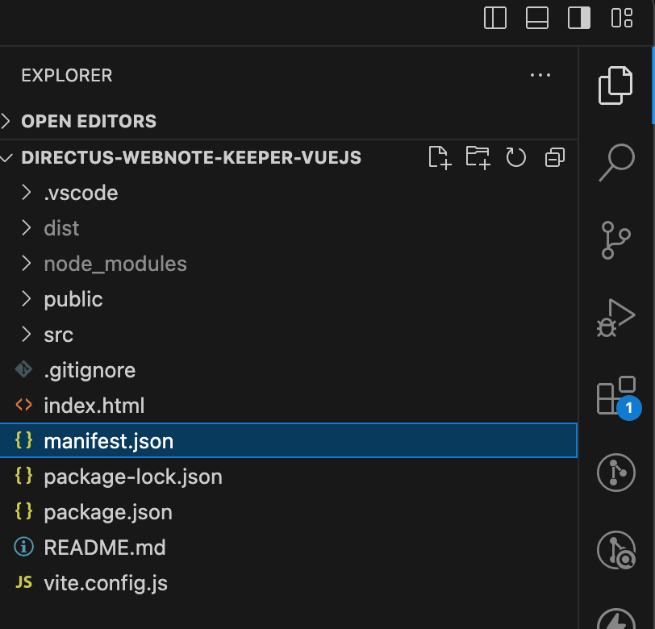
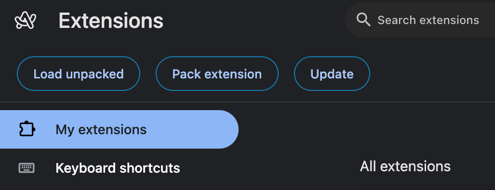
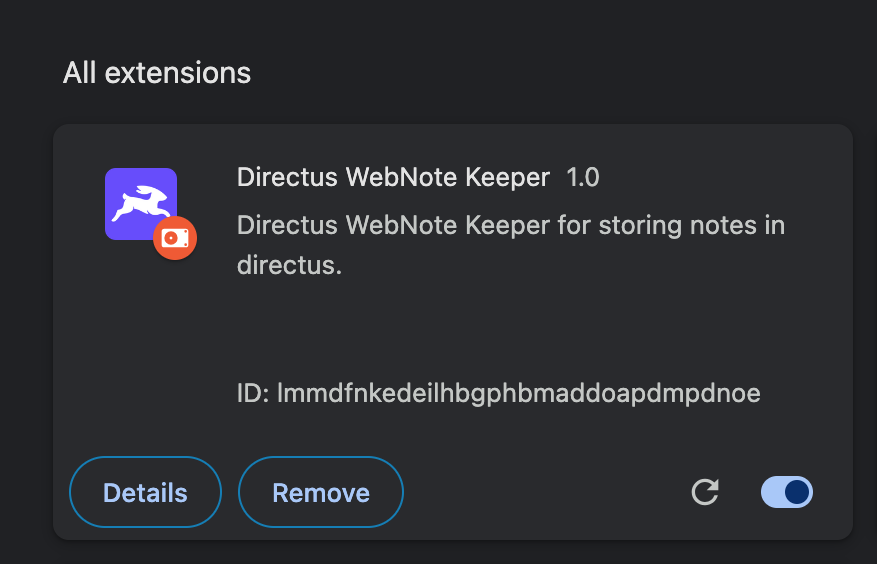

## Introduction

This article will guide you through how to make a chrome extension name WebNote Keeper using `vite` and `Directus`. The extension will leverage Directus as the backend CMS to store and manage these notes.

When a user clicks the extension while browsing a webpage, it will automatically capture the URL of the current webpage and prompt the user to add a `note`. Users will be able to `view`, `edit`, and `delete` their notes directly from the extension's interface. The extension will integrate with Directus API for CRUD operations on notes.

## Before You Start

-   A Directus project. Follow the [Quickstart guide](https://docs.directus.io/getting-started/quickstart) to create one.

## Setup Directus Schema

### Create Notes Collection

-   `website` - new field with type `string`
-   `note` - new field with type `string`


### Setup Roles

In order to create new note, edit note or delete note on behalf of user, we need to create separate role ( except admin ).
We will create `customer` role for different users.

-   Go to `settings` -> `Access Control` Menu
-   Click on `Add New` Role
-   Enter role name, select `App Access` only
-   Save


### Setup Permission

-   After creating this, we need to provide `notes` collection `read`, `edit`, `add` and `delete` permission
-   Go to `Access Control` -> Select `Customer` Role
-   Give access to `notes` collection


Apply Filter to `notes` collection to provide data for loggedin users individually.

-   Click on `eye` column -> Select `Use Custom`


### Directus setup is completed. Lets move to project.

---

## Setup Project

### Vite + Vue project

-   Open new terminal, execute below command to create new vite + vue project

```
npm create vite@latest directus-webnote-keeper -- --template vue

cd directus-webnote-keeper
```

-   Install Dependencies and run project

```
npm install

npm run dev
```

## Setup Extension

Add `manifest.json` in root directory of the project

```json
{
    "name": "Directus WebNote Keeper",
    "version": "1.0",
    "manifest_version": 3,
    "author": "Jay Bharadia",
    "description": "Directus WebNote Keeper for capturing urls and store in directus.",
    "icons": {
        "16": "icon.png",
        "32": "icon.png",
        "48": "icon.png",
        "128": "icon.png"
    },
    "action": {
        "default_title": "Directus WebNote Keeper",
        "default_popup": "index.html"
    },
    "permissions": ["activeTab", "storage"]
}
```

### About permissions

We need to tell browser about the functionality like storage required for extension to work properly. [Learn more](https://developer.chrome.com/docs/extensions/develop/concepts/declare-permissions)

**activeTab** : We need to read the website from current active tab

**storage** : for authentication token, we are using cookies for storage



## Setup Directus SDK, Cookies, Vue Router

```
npm install @directus/sdk js-cookie vue-router
```

**js-cookie** : `js-cookie` package will help us to deal with cookies like save cookie or get cookie and remove cookie. [Learn more](https://www.npmjs.com/package/js-cookie)

**vue-router** : `vue-router` will load routes like home page, login, signup , edit pages. [Learn more](https://router.vuejs.org/)

## Create Directus plugin

Create new file `plugins/directus.js`

```js
// plugins/directus.js

import { createDirectus, rest, authentication } from "@directus/sdk";

import Cookies from "js-cookie";
const directus = createDirectus("https://directus-supabase.onrender.com")
    .with(
        authentication("cookie", {
            autoRefresh: true,
            credentials: "include",
            storage: {
                get() {
                    if (Cookies.get("directus_auth"))
                        return JSON.parse(Cookies.get("directus_auth"));
                    else return null;
                },
                set(data) {
                    Cookies.set("directus_auth", JSON.stringify(data));
                },
            },
        })
    )
    .with(rest());

export default directus;
```

Replace `https://directus-supabase.onrender.com` with your directus url.

Import in `main.js`

```js
import directus from "./plugins/directus.js";

app.provide("directus", directus);
```

So chrome extensions can store data in `cookies` or `local storage`. But for security, we will use cookies.

We have used [custom storage](https://docs.directus.io/guides/sdk/authentication.html#configure-custom-storage) feature provided by directus to deal with cookies with different domain.

## Setup Routing

Create new file `plugins/router.js`

```js
// plugins/router.js

import { createWebHistory, createRouter } from "vue-router";
import HomeView from "../views/home.vue";

const routes = [
    { path: "/", name: "home", meta: { public: false }, component: HomeView },
];

const router = createRouter({
    history: createWebHistory(),
    routes,
});

export default router;
```

Basic router instance is ready for project. Include in `main.js`

Import in `main.js`

```js
// src/main.js
import router from "./plugins/router.js";
app.use(router);
```

## Setup CSS

Create new file `src/style.css`

```css
body {
    margin: 0;
    display: flex;
    place-items: center;
    min-width: 320px;
    min-height: 100vh;
}
```

Import `css` in `main.js`

```js
import "./style.css";
```

## Load extension in browser

Before moving further, lets build the extension and run demo.

-   Add build command in `package.json`

```json
"build-extension": "vite build && cp manifest.json dist/"
```

```
npm run build-extension
```

-   Open Google Chrome
-   Go to `chrome://extensions`
-   Click on `Load Unpacked button` present at top left
-   select project directory/dist folder





## Setup Routes

-   Home page
    contains list of notes added with url

-   login page
-   signup page
-   Create and edit note page

### Setup Signup

Create new file `src/views/signup.vue`

```html
<template>
    <div>
        <form @submit.prevent="signup">
            <label>Name</label>
            <input type="text" v-model="name" required />

            <label>Email</label>
            <input type="email" v-model="email" required />

            <label>Password</label>
            <input type="password" v-model="password" required />
            <button type="submit" style="margin-top: 16px">Signup</button>
            <p>
                Already have account?
                <span
                    @click="$router.push({ name: 'login' })"
                    style="text-decoration: underline; cursor: pointer"
                    >Login</span
                >
            </p>
        </form>
    </div>
</template>

<script>
    import { createUser } from "@directus/sdk";
    export default {
        inject: ["directus"],
        data() {
            return {
                name: "",
                email: "",
                password: "",
            };
        },
        methods: {
            async signup() {
                const result = await this.directus.request(
                    createUser({
                        first_name: this.name,
                        last_name: "",
                        email: this.email,
                        password: this.password,
                        role: "1c005600-202d-429c-81bb-452a70aec7e1", // Customer
                    })
                );
                this.$router.push({ name: "login" });
            },
        },
    };
</script>
```

Add css for button

```css
button {
    border-radius: 8px;
    border: 1px solid transparent;
    padding: 0.6em 1.2em;
    font-size: 1em;
    font-weight: 500;
    font-family: inherit;
    background-color: #1a1a1a;
    cursor: pointer;
    transition: border-color 0.25s;
}
button:hover {
    border-color: #646cff;
}
button:focus,
button:focus-visible {
    outline: 4px auto -webkit-focus-ring-color;
}
```

Role: Its the `customer` role we created. To check, check the url in `https://directus-supabase.onrender.com/admin/settings/roles/1c005600-202d-429c-81bb-452a70aec7e1`

### Load Signup route

-   Open `src/router.js`
-   Import `signup.vue`

```js
import SignupView from "../views/signup.vue";
```

Add the route in `routes`

```js
   {
        path: "/signup",
        name: "signup",
        meta: { public: true },
        component: SignupView,
    },
```


## Setup Login

Create new file `src/views/login.vue`

```html
<template>
    <div>
        <div style="text-align: right">
            <span
                @click="$router.push({ name: 'signup' })"
                style="text-decoration: underline; cursor: pointer"
            >
                Signup
            </span>
        </div>
        <form @submit.prevent="login">
            <label for="email" style="display: block">Email</label>
            <input type="email" id="email" required v-model="email" />

            <label for="password" style="margin-top: 8px">Password</label>
            <input type="password" id="password" v-model="password" required />

            <button type="submit" style="display: block; margin-top: 16px">
                Login
            </button>
        </form>
    </div>
</template>

<script>
    export default {
        inject: ["directus"],
        data() {
            return {
                email: "",
                password: "",
            };
        },
        methods: {
            async login() {
                try {
                    await this.directus.login(this.email, this.password);
                    this.$router.push({ name: "home" });
                } catch ({ errors }) {
                    console.log("🚀 ~ login ~ errors:", errors);
                    if (errors[0].extensions.code === "INVALID_CREDENTIALS")
                        alert("Invalid Email or password");
                    else
                        alert(
                            "Something went wrong. Try again after some time..."
                        );
                }
            },
        },
    };
</script>

<style>
    input,
    label {
        display: block;
        width: 100%;
    }
</style>
```

### Add login route

```js
import LoginView from "../views/login.vue";
```

```js
  {
        path: "/login",
        name: "login",
        meta: { public: true },
        component: LoginView,
    },
```


## Setup Home Page

```html
<template>
    <div>
        <div
            style="
                display: flex;
                justify-content: space-between;
                align-items: center;
            "
        >
            <p
                @click="logout"
                style="
                    text-decoration: underline;
                    cursor: pointer;
                    text-align: right;
                "
            >
                Logout
            </p>

            <button
                @click="$router.push({ name: 'upsert', params: { id: '+' } })"
            >
                ⊕
            </button>
        </div>
        <p v-if="loading">Loading...</p>
        <div
            v-else
            style="background: #222; padding: 16px; border-radius: 24px"
        >
            <li
                v-for="note in notes"
                :key="`note-${note.id}`"
                style="
                    display: flex;
                    justify-content: space-between;
                    align-items: center;
                "
            >
                <div>
                    <a :href="note.website"> {{ note.website }}</a>
                    <div>{{ note.note }}</div>
                </div>
                <button
                    @click="
                        $router.push({
                            name: 'upsert',
                            params: { id: note.id },
                        })
                    "
                >
                    📝
                </button>
                <button @click="remove(note.id)">🗑️</button>
            </li>
        </div>
    </div>
</template>

<script>
    import { readItems, deleteItem } from "@directus/sdk";
    import Cookies from "js-cookie";

    export default {
        inject: ["directus"],
        data() {
            return {
                notes: null,
                loading: false,
            };
        },
        created() {
            this.getNotes();
        },
        methods: {
            async remove(id) {
                await this.directus.request(deleteItem("notes", id));
                this.getNotes();
            },
            logout() {
                Cookies.remove("directus_auth");
                this.$router.push({ name: "login" });
            },
            async getNotes() {
                this.loading = true;
                this.notes = await this.directus.request(readItems("notes"));
                this.loading = false;
            },
        },
    };
</script>
```

### Load `home.vue` in `router.js`

```js
import HomeView from "../views/home.vue";
```

```js

    {
    path: "/",
    name: "home",
    meta: { public: false },
     component: HomeView
    },

```


## Setup Create Note And Edit Note

```html
<template>
    <div style="display: flex'; flex-direction: column">
        <textarea
            style="display: block; width: 100%; margin-top: 16px"
            rows="10"
            v-model="note"
            placeholder="Notes are great way to store helpful information to access later. Get Started..."
        ></textarea>
        <button style="display: block; margin-top: 16px" @click="save">
            👍 Done
        </button>
    </div>
</template>

<script>
    import { createItem, readItem, updateItem } from "@directus/sdk";
    export default {
        inject: ["directus"],
        data() {
            return {
                note: "",
            };
        },
        computed: {
            id() {
                return this.$route.params.id;
            },
            isCreate() {
                return this.$route.params.id === "+";
            },
            isEdit() {
                return !this.isCreate;
            },
        },
        created() {
            if (this.isEdit) {
                this.get();
            }
        },
        methods: {
            async get() {
                // Edit mode
                const { note } = await this.directus.request(
                    readItem("notes", this.id)
                );
                this.note = note;
            },
            async save() {
                if (this.isEdit) {
                    await this.directus.request(
                        updateItem("notes", this.id, {
                            note: this.note,
                        })
                    );
                } else {
                    const [tab] = await chrome.tabs.query({
                        active: true,
                        lastFocusedWindow: true,
                    });

                    const { origin } = new URL(tab.url);
                    await this.directus.request(
                        createItem("notes", {
                            note: this.note,
                            website: origin,
                        })
                    );
                }

                this.$router.push({ name: "home" });
            },
        },
    };
</script>
```

### Load `upsert.vue` in `router.js`

```js
import Upsert from "../views/upsert.vue";
```

```js
    {
        path: "/note/:id",
        name: "upsert",
        meta: { public: false },
        component: Upsert,
    },
```


## Summary

Directus WebNote Keeper is a proposed Chrome extension designed to help users save and manage notes related to the webpages they visit. It leverages Directus as the backend CMS for storing and managing these notes. When users click the extension while browsing, it automatically captures the current webpage's URL and prompts the user to add a note. Users can then view, edit, and delete their notes directly from the extension's interface. The extension will use the Directus API to perform CRUD (Create, Read, Update, Delete) operations on the notes. This project integrates the functionalities of a headless CMS with Chrome extension development to provide a practical tool for organizing web research and personal thoughts.
