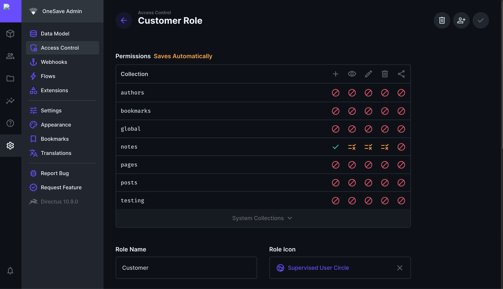

## Introduction

This article will guide you through how to make a chrome extension name WebNote Keeper using `vite` and `Directus`. The extension will leverage Directus as the backend CMS to store and manage these notes.

When a user clicks the extension while browsing a webpage, it will automatically capture the URL of the current webpage and prompt the user to add a `note`. Users will be able to `view`, `edit`, and `delete` their notes directly from the extension's interface. The extension will integrate with Directus API for CRUD operations on notes.

## Before You Start

-   A Directus project. Follow the [Quickstart guide](https://docs.directus.io/getting-started/quickstart) to create one.

## Setup Directus Schema

### Create Notes Collection

-   `website` - new field with type `string`
-   `note` - new field with type `string`


### Setup Roles

In order to create new note, edit note or delete note on behalf of user, we need to create separate role ( except admin ).
We will create `customer` role for different users.

-   Go to `settings` -> `Access Control` Menu
-   Click on `Add New` Role
-   Enter role name, select `App Access` only
-   Save


### Setup Permission

-   After creating this, we need to provide `notes` collection `read`, `edit`, `add` and `delete` permission
-   Go to `Access Control` -> Select `Customer` Role
-   Give access to `notes` collection



Apply Filter to `notes` collection to provide data for loggedin users individually.

-   Click on `eye` column -> Select `Use Custom`


### Directus setup is completed. Lets move to project.

---

## Setup Project

### Vite + Vue project

-   Open new terminal, execute below command to create new vite + vue project

```
npm create vite@latest directus-webnote-keeper -- --template vue

cd directus-webnote-keeper
```

-   Install Dependencies and run project

```
npm install

npm run dev
```

## Setup Extension

Add `manifest.json` in root directory of the project

```json
{
    "name": "Directus WebNote Keeper",
    "version": "1.0",
    "manifest_version": 3,
    "author": "Jay Bharadia",
    "description": "Directus WebNote Keeper for capturing urls and store in directus.",
    "icons": {
        "16": "icon.png",
        "32": "icon.png",
        "48": "icon.png",
        "128": "icon.png"
    },
    "action": {
        "default_title": "Directus WebNote Keeper",
        "default_popup": "index.html"
    },
    "permissions": ["activeTab", "storage"]
}
```

### About permissions

We need to tell browser about the functionality like storage required for extension to work properly. [Learn more](https://developer.chrome.com/docs/extensions/develop/concepts/declare-permissions)

**activeTab** : We need to read the website from current active tab

**storage** : for authentication token, we are using cookies for storage


## Setup Directus SDK, Cookies, Vue Router

```
npm install @directus/sdk js-cookie vue-router
```

**js-cookie** : `js-cookie` package will help us to deal with cookies like save cookie or get cookie and remove cookie. [Learn more](https://www.npmjs.com/package/js-cookie)

**vue-router** : `vue-router` will load routes like home page, login, signup , edit pages. [Learn more](https://router.vuejs.org/)

## Create Directus plugin

Create new file `plugins/directus.js`

```js
// plugins/directus.js

import { createDirectus, rest, authentication } from "@directus/sdk";

import Cookies from "js-cookie";
const directus = createDirectus("https://directus-supabase.onrender.com")
    .with(
        authentication("cookie", {
            autoRefresh: true,
            credentials: "include",
            storage: {
                get() {
                    if (Cookies.get("directus_auth"))
                        return JSON.parse(Cookies.get("directus_auth"));
                    else return null;
                },
                set(data) {
                    Cookies.set("directus_auth", JSON.stringify(data));
                },
            },
        })
    )
    .with(rest());

export default directus;
```

Import in `main.js`

```js
import directus from "./plugins/directus.js";

app.provide("directus", directus);
```

So chrome extensions can store data in `cookies` or `local storage`. But for security, we will use cookies.

We have used [custom storage](https://docs.directus.io/guides/sdk/authentication.html#configure-custom-storage) feature provided by directus to deal with cookies with different domain.

## Setup Routing

Create new file `plugins/router.js`

```js
// plugins/router.js

import { createWebHistory, createRouter } from "vue-router";
import HomeView from "../views/home.vue";

const routes = [
    { path: "/", name: "home", meta: { public: false }, component: HomeView },
];

const router = createRouter({
    history: createWebHistory(),
    routes,
});

export default router;
```

Basic router instance is ready for project. Include in `main.js`

Import in `main.js`

```js
// src/main.js
import router from "./plugins/router.js";
app.use(router);
```

## Setup CSS

Create new file `src/style.css`

```css
body {
    margin: 0;
    display: flex;
    place-items: center;
    min-width: 320px;
    min-height: 100vh;
}
```

Import `css` in `main.js`

```js
import "./style.css";
```

## Load extension in browser

Before moving further, lets build the extension and run demo.

-   Add build command in `package.json`

```json
"build-extension": "vite build && cp manifest.json dist/"
```

```
npm run build-extension
```

-   Open Google Chrome
-   Go to `chrome://extensions`
-   Click on `Load Unpacked button` present at top left
-   select project directory/dist folder


