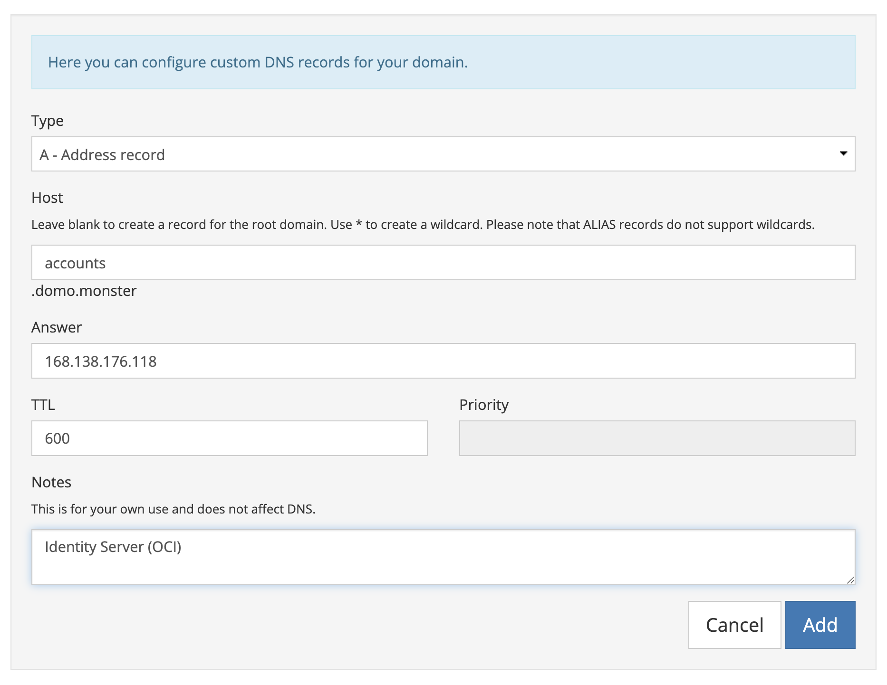
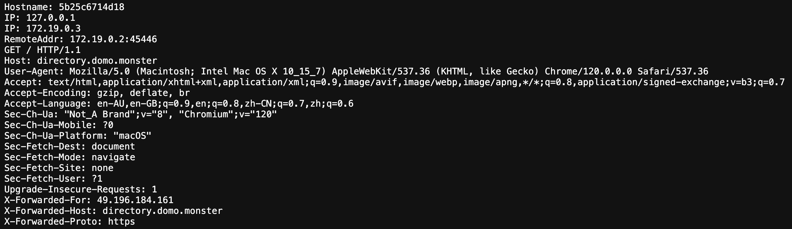
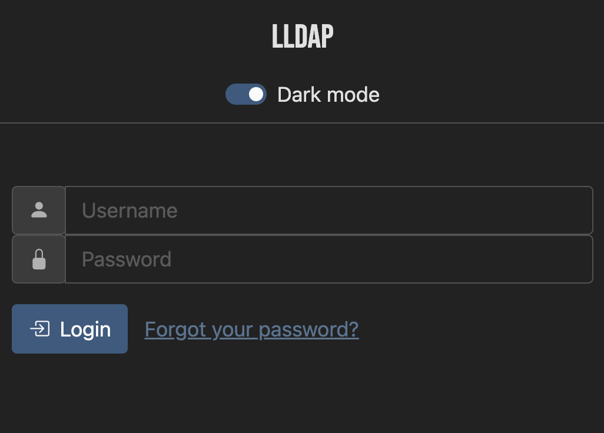

<!-- markdownlint-disable no-inline-html -->

## Introduction

Offering your users a Single Sign-On (SSO) experience provides a lot of benefits for them and you. Hosted solutions can be overkill for some organisations whilst public providers lack the fine-grained controls required to get the most from using SSO.

If only there was a Goldilocks solution that existed in the middle of these two popular options... but wait, there is!

Hosting your own has probably been considered if you are already comfortable self-hosting a Directus instance. Finding guides can be overwhelming as there are a lot of available self-hosted solutions and a lot of ways it can go wrong. This post will guide you on setting up a light-weight, modern, and reliable SSO solution using [Light LDAP](https://github.com/lldap/lldap), [Authelia](https://www.authelia.com/), and [Caddy](https://caddyserver.com/). We will use tools and workflows we are already familiar with from self-hosting Directus.

Once we have the SSO system set up, we will connect users to your Directus project using the <abbr title="OpenID Connect">OIDC</abbr> protocol. At the end, we will note some further actions we can take to implement good security practices. This will be important since we will be dealing with very sensitive data.

## Before You Start

You will need a self-hosted Directus installation ready for us to configure with the SSO config and role sync flow. Visit the [Self-hosting Quickstart](https://docs.directus.io/self-hosted/quickstart.html) docs if you need more information on how to do this.

This guide will help you configure a production grade SSO solution, so there are a few more things you will need:

* Domain name you can update DNS records for
* Reliable SMTP email service[^mailjet] for managing password resets and 2FA
* Basic knowledge of linux server admin. At minimum, you should know how to:
  * Connect via SSH
  * Edit server config files using [nano](https://www.nano-editor.org/) or [micro](https://micro-editor.github.io/)
  * Open and close ports via a firewall
  * Run basic commands to create and modify files and directories
  * Using basic `git` commands
* Server dedicated to identity management functions **(Strongly Recommended)**

[^mailjet]: This tutorial uses MailJet since it's one of the few transactional email providers with a decent free tier, but you should be able to use anything you already have working for Directus

### Using a Dedicated Server for Identity Management

We probably already have the other requirements if we are hosting our own Directus project in production. We also have a server instance to run Directus, so why do we need another server?

Dealing with identity management is complex from a security point of view. Although it is not the only way to reduce your risk profile, seperating your identity services to their own realm is a quick way to start the ongoing journey of hardening your identity management solution. Later on, we will consider how to harden your identity server and services further.

Your identity server doesn't need to run on dedicated hardware, although it can. Creating an independent home for your identity services can be as simple as using a dedicated VPS or even a Raspberry Pi if you're a home lab enthusiast. Depending on your load, this project will probably run on something with 1x CPU core, 1GB RAM and 10GB SSD storage with capability to spare.

Some of the key considerations are:

* Ensure the credentials you use to access your identity server are different from the ones used to access your app servers
* Restrict the number of people who have administration access to your identity server (both direct SSH access and login access to the LDAP admin panel) to the minimal number needed for ongoing operation
* Consider how to restrict access to the identity server from other services to the minimum required access and how to prevent access from potential bad actors

## What is SSO

Already know what SSO is and why you want to host your own? [Jump to the next section](#set-up-the-config-directory) 👇

Enabling SSO allows anyone to login to different services that your organisation uses with one set of credentials (eg. their username and password) instead of relying on the built in authentication methods of each service. This provides both users and organisations a number of benefits. Some include:

* **Security** — Many users have an unfortunate habit of reusing email/password combinations across services. Using SSO reduces your organisations number of potentially compromisable services holding valuable passwords to just one service. Reducing the surface of attack in this way, or number of attack vectors, is one of many ways to improve the overall cyber security of your online services. Many SSO solutions also allow you to configure additional security policies such as requiring <abbr title="Two Factor Authentication">2FA</abbr> for all accounts[^2fa].
* **Usability** — Users can often find themselves already logged into a new service if it is using the same SSO mechanism as another service they have accessed. If they aren't already logged in, it's a lot easier to login to another service with SSO without having to enter another (hopefully unique) set of credentials. Managing forgotten passwords and other common security actions is easier when it's in one location.
* **Access control** — Administrators can provision users with their roles in the user directory (LDAP) behind the SSO system. Services that rely on the SSO system for authentication can pull this data from the user directory to control what users have access to. Using SSO can also make it easy to disable a user from all services at once, for example, if an employee leaves. This ensures there are no stray accounts with access to potentially sensitive data.

[^2fa]: Directus provides native support for 2FA, however this may not be true for every service you use. Using an external service for identity management means that you can implement 2FA for all services, even those that don't support it natively. It also means your users will only need to setup 2FA once for all services you use.

SSO is often used by very large enterprises but it is also possible for small and midsize organizations to implement as well. Traditionally, there are two main ways organisations implement SSO:

* **Hosted Providers** — Hosted solutions such as [Okta](https://www.okta.com/) provide enterprise-grade Identity Access Management (IAM) which includes SSO as one of a number of other features.
* **Public Providers** — Companies like Google, Microsoft (GitHub), and Facebook provide login mechanisms for other organisations using the credentials users supply them.

Directus supports both of these options, however both types can have their own drawbacks depending on your needs. Publicly provided SSO options are generally a convenience option for users rather than a way to gain the benefits like the ones listed above. Adding a login with Google or Facebook option won't allow you to manage a users role across services for example but it does mean you won't be responsible for storing sensitive credentials. On the other hand, managed solutions can be costly or complex for developers who have simpler requirements.

The chosen stack outlined in this article is a good compromise of being complete enough to offer most of the features and benefits you might want from setting up SSO whilst also being opinionated and focused enough to not become too complex to understand and maintain.

Now that you know what SSO is and why you want to set it up, let's get started.

## Set up the Config Directory

Connect to your server over SSH and ensure Docker is installed and ready to go. We are using Docker Compose to orchestrate our services which means we need somewhere on the server to store our config and data files.

Choosing which OS to use, where to store config files on a server, and how to manage project configuration and secrets is out of the scope of this post. If you're looking for some reasonable default options to get started with however, then do the following:

* Choose a common Linux distro like [Ubuntu Server](https://ubuntu.com/server) which has a lot of community support and tutorials.
  * If you want to use something compatible with Red Hat Enterprise Linux, then [Rocky Linux](https://rockylinux.org/) is a good community supported alternative. If you don't know what this is or why you would want it, then stick with Ubuntu.
* Create a directory in `/srv/iam`[^directory] as the root config directory and add permissions to access it
  * `sudo mkdir /srv/iam`
  * `sudo chown -R ubuntu: /srv/iam` - change ubuntu to your login username
* Initialise the directory as a `git` repository. This allows you to benefit from built in revision control as well as allowing for advanced functions like using CI/CD pipelines to automatically deploy changes to your configurations.[^git]
* We will store secrets in files mounted as volumes in Docker containers.[^secrets]

[^directory]: The `/srv` directory is specified by the [Filesystem Hierarchy Standard](https://en.wikipedia.org/wiki/Filesystem_Hierarchy_Standard) as a directory for service specific data served by the host system. We created an `iam` directory as this server is providing Identity Access Management services. This is just one of many options and the opinions on where data like this should be stored is very diverse.
[^git]: You should push your git repo to a remote, however be careful to not push any sensitive information. This is important even if your repo is private on the remote server.
[^secrets]: This is not the only, or even best, way to manage secrets. It is better than storing them in .env files that might accidentally get published via `git` commands or may be at risk of other running processes accessing them. We are storing our secrets in `/run/secrets` on containers where possible to make migrating to using [Secrets in Docker Compose](https://docs.docker.com/compose/use-secrets/) easier. For now, we are mounting the files manually as most readers will be familiar with mounting local directories from mounting a SQLite file, extensions directory, and uploads directory in Directus projects.

If you have your own workflows for managing servers and services, then you are more than welcome to use them. Be mindful that you may need to adapt the instructions below to suit your workflows. In the rest of this article, we will refer to the root directory you just created (`/srv/iam`) as the `$CONFIG_DIR`.

<!-- TODO: -->

> You can download the repo containing the final file structure we will create... you could just download it and adjust if you know what you're doing... Otherwise we build it step by step.

## Set up Common Config and Domain

Create a `.env` file at `$CONFIG_DIR/.env`, add the following, and adjust the values for your setup:

```sh
# Admin
CONFIG_DIR="/srv/iam" # Change this if storing your config elsewhere
SUPERUSER_HANDLE="admin"

# Domain
ROOT_DOMAIN="example.tld"
LDAP_SUBDOMAIN="directory"
SSO_SUBDOMAIN="accounts"
LDAP_BASE_DN="dc=example,dc=tld"

# Branding
ORG_NAME="Acme Co."

# Email
# SMTP_HANDLE="hello" # Optional
SMTP_HOST=smtp.mailgun.org
SMTP_PORT=587
SMTP_DOMAIN="noreply.domain.tld"
SMTP_USERNAME=""
```

### `ROOT_DOMAIN`, `LDAP_SUBDOMAIN`, and `SSO_SUBDOMAIN`

We will provision the LDAP and SSO services as subdomains of your main domain. Using the example config above, we will access the LDAP admin panel at `directory.example.tld` and users will login at `accounts.example.tld`. Make sure you set your `ROOT_DOMAIN` to your domain name. Changing the subdomain variables is optional.

Other common subdomain options include:

* **directory** — ldap, people, users
* **accounts** — login, secure, signin, passport, auth

Use whichever makes the most sense for your case. Once this is done, update your DNS with A records for the two domains we will be using. The instructions for how to do this can be found on your DNS providers website. Often this will be the company you have registered your domain with if you are using their provided default DNS. Your records will look something like this once done:

| Record | Name               | Content            | TTL |
| :----: | :----------------: | :----------------: | :-: |
|    A   |         @          | { Main Server IP } | 600 |
|    A   | { LDAP_SUBDOMAIN } | { IAM Server IP }  | 600 |
|    A   | { SSO_SUBDOMAIN }  | { IAM Server IP }  | 600 |

Here is an example of a SSO_SUBDOMAIN record being added for a domain registered with Porkbun, but keep in mind your DNS admin portal will look different:



### `LDAP_BASE_DN`

This is usually your domain name, and is used as a namespace for your users across all of your services. The choice is arbitrary, but it will be needed to configure the LDAP integration with other services and will need to remain consistent. The sample value is for "example.tld", but you can extend it with as many "dc" as you want.

Choose your base domain name carefully as it is hard to change later. You don't have to own the domain name you use, but it probably should be a domain you own and will own for the lifetime of all your services.

### `SUPERUSER_HANDLE`

This will be the username of the super user used to create your first users. We will create a service user called 'authelia' using the superuser account. We will use the 'authelia' user to bind to the LDAP server in order to lookup users and their passwords. Once you have finished this tutorial, Authelia will be the only service binding directly to LDAP.

If auditing access logs is something that will be important to you, it may make sense to rename the superuser to `nobody` as it is considered unaccountable. It's hard to know for sure who used this account to make changes unless only one person knows the password and no other services are using it to bind to the LDAP server.

The `SUPERUSER_HANDLE` will also be combined with the `ROOT_DOMAIN` to create the from email address (e.g. admin@example.tld) used to send password reset emails from. <!-- markdownlint-disable-line -->

::: Technical information

A value of "admin" here will create the LDAP user "cn=admin,ou=people,dc=example,dc=tld" (using the base DN above). For the administration interface, 'admin' is the username.

:::

### `ORG_NAME`

This will be used in places like login buttons. Choose something short but easy to identify.

### `SMTP_`

Overrides use of #SUPERUSER_HANDLE in from email

TODO:

## Set up the Databases

This will be familiar if you are already using [Postgres with Directus](https://docs.directus.io/self-hosted/docker-guide.html#example-docker-compose), but don't worry if you haven't used Postgres before. Deploying Postgress as a container is as simple as deploying Directus as a container. We are going to extend the standard Postgres image a bit by adding a simple script that will create new users and databases for LLDAP and Authelia respectively. You can learn more about [using initialization scripts with the official Postgres container here](https://github.com/docker-library/docs/blob/master/postgres/README.md#initialization-scripts).

The Authelia docs also [highly recommend using Redis for production environments](https://www.authelia.com/configuration/session/redis/), so we will provision that now as well. In the config directory on your new identity server, create a file at `$CONFIG_DIR/data/postgres/init-user-db.sh` and add the following to it:

```sh
#!/bin/bash
set -e

psql -v ON_ERROR_STOP=1 --username "$POSTGRES_USER" --dbname "$POSTGRES_DB" <<-EOSQL
 CREATE USER lldap WITH PASSWORD 'lldap';
 CREATE DATABASE lldap;
 ALTER DATABASE lldap OWNER TO lldap;
 GRANT ALL PRIVILEGES ON DATABASE lldap TO lldap;
 CREATE USER authelia WITH PASSWORD 'authelia';
 CREATE DATABASE authelia;
 ALTER DATABASE authelia OWNER TO authelia;
 GRANT ALL PRIVILEGES ON DATABASE authelia TO authelia;
EOSQL
```

Now create your Docker Compose file at `$CONFIG_DIR/docker-compose.yml` and add the following:

```yaml
name: identity-server
services:
  db:
    container_name: db
    image: postgres:16
    restart: unless-stopped
    shm_size: 128mb
    volumes:
      - $CONFIG_DIR/data/postgres:/docker-entrypoint-initdb.d:ro
      - postgres:/var/lib/postgresql/data
    environment:
      POSTGRES_PASSWORD: "postgres"
    networks:
      - data

  cache:
    container_name: cache
    image: redis:7-alpine
    restart: unless-stopped
    healthcheck:
      test: [ "CMD", "redis-cli", "--raw", "incr", "ping" ]
    volumes:
      - redis:/data
    networks:
      - data

networks:
  data:
    name: data

volumes:
  postgres:
  redis:
```

You may notice that we are using the `postgres` image instead of the `postgis` image used in the Directus docs. Our identity management services won't need any mapping features, so we can use the image that the `postgis` image is based on instead.

You may also notice that we haven't set the `POSTGRES_USER`, and `POSTGRES_DB` environment variables like we did in the `docker-compose.yml` file for Directus. That is because we need to set up two sets of users and databases, which we did in the `/docker-entrypoint-initdb.d/init-user-db.sh` script instead. The script uses the username of the default user (postgres) to create these new users and databases.

Let's run `docker compose up` and watch the logs to confirm the users and databases were created. This can only been done one. If the container detects that a database volume exists already, it will not run the initialization scripts again. In the logs, you are looking for something like this:

```logs
db     | /usr/local/bin/docker-entrypoint.sh: sourcing /docker-entrypoint-initdb.d/init-user-db.sh
db     | CREATE ROLE
db     | CREATE DATABASE
db     | ALTER DATABASE
db     | GRANT
db     | CREATE ROLE
db     | CREATE DATABASE
db     | ALTER DATABASE
db     | GRANT
```

If you see two sets of `CREATE ROLE`, `CREATE DATABASE`, and `GRANT`, then we are ready to move to the next section and ensure we can access our services from the web. Press <kbd>Control</kbd> + <kbd>C</kbd> to stop the Docker containers.

## Set up the Secrets

Create a file at `$CONFIG_DIR/init-secrets.sh` and add the following to it:

```bash
# Load .env
DEFAULT_ENV='.env'

if [ -f $DEFAULT_ENV ]; then
  source $DEFAULT_ENV
else
  echo "Error: Please ensure you have created a .env file and are running this script from root of \$CONFIG_DIR set in your .env file"
  exit 1
fi

echo -e "\nConfig loaded from .env"

# Confirm $PWD = $CONFIG_DIR

if ! [ -d "$CONFIG_DIR" ]; then
  echo "Error: Please make sure \$CONFIG_DIR is defined correctly in the .env file and that it exists"
  exit 1
else
  echo -e "\$CONFIG_DIR set as '$CONFIG_DIR'\n"
fi

# Generate secrets

generate_secret() {
  DIR=$CONFIG_DIR/secrets/$1
  FILE=$DIR/$2

  if ! [ -d "$DIR" ]; then
    mkdir -p $DIR
  fi

  if [ -f $FILE ]; then
    echo "Skipping ./secrets/$1/$2. File already exists."
  else
    # Generate secret
    SECRET=$(docker run --rm authelia/authelia:latest authelia crypto rand --length 64 --charset alphanumeric)
    SECRET=${SECRET##*:}
    SECRET=$(echo $SECRET | tr -d "[:blank:]")

    # Write secret to file
    echo "Writing new secret to \$CONFIG_DIR/$1/$2"
    echo $SECRET >$FILE
    # Alternative independent of Docker but dependant of system tools
    # LC_ALL=C tr -dc 'A-Za-z0-9' </dev/urandom | head -c 64 > $FILE
  fi
}

generate_secret authelia SESSION.key
generate_secret authelia STORAGE_ENCRYPTION.key
generate_secret authelia JWT_SECRET.key
generate_secret authelia LDAP_PASSWORD.key
generate_secret authelia HMAC.key

generate_secret lldap JWT_SECRET.key
generate_secret lldap KEY_SEED.key
generate_secret lldap SUPERUSER_PASSWORD.key

generate_secret directus LDAP_PASSWORD.key

DIR=$CONFIG_DIR/secrets/authelia/certs
if ! [ -d "$DIR" ]; then
  mkdir -p $DIR
fi
```

Then run:

```bash
$ chmod +x init-secrets.sh
# No output

$ ./init-secrets.sh

Config loaded from .env
$CONFIG_DIR set as '/srv/iam'

Writing new secret to ./secrets/authelia/SESSION.key
Writing new secret to ./secrets/authelia/STORAGE_ENCRYPTION.key
Writing new secret to ./secrets/authelia/JWT_SECRET.key
Writing new secret to ./secrets/authelia/LDAP_PASSWORD.key
Writing new secret to ./secrets/authelia/HMAC.key
Writing new secret to ./secrets/lldap/JWT_SECRET.key
Writing new secret to ./secrets/lldap/KEY_SEED.key
Writing new secret to ./secrets/lldap/SUPERUSER_PASSWORD.key
Writing new secret to ./secrets/directus/LDAP_PASSWORD.key
```

Finally, manually add a file at `$CONFIG_DIR/secrets/email/SMTP_PASSWORD.key` and add the password provided by your transactional email provider.

## Set up the Proxy

[Caddy Server](https://caddyserver.com/) fits our theme of using tools that are simple, lightweight, and powerful for this tutorial. Add the Caddy service to our stack by updating our `docker-compose.yml` file with the following:

```yaml
services:

  cache:
    # ...

  db:
    # ...

  proxy:
    container_name: proxy
    image: lucaslorentz/caddy-docker-proxy:ci-alpine
    ports:
      - 80:80
      - 443:443
    environment:
      - CADDY_INGRESS_NETWORKS=net
    volumes:
      - /var/run/docker.sock:/var/run/docker.sock
      - $CONFIG_DIR/data/caddy:/data
    restart: unless-stopped
    networks:
      - net

  whoami:
    image: traefik/whoami
    networks:
      - net
    labels:
      # This is how we tell Caddy where to route traffic to and from a container
      caddy: ${LDAP_SUBDOMAIN?err}.${ROOT_DOMAIN?err}
      caddy.reverse_proxy: "{{upstreams 80}}"

networks:
  data:
    name: data
  net:
    name: net

volumes:
  # ...

```

Run `docker compose up` and then navigate to directory.example.tld (change to the details you've used in your config) in your browser. You should see something that looks like this:



If you see something like the above image, congratulations! 🥳 🎉 Our identity server is online, even if it isn't doing anything helpful yet. We will fix that very soon.

If the page is not loading, you'll need to debug and fix that before continuing. Check the logs showing in your terminal from docker compose for pointers in the right direction. Some common issues at this point are:

* Your DNS is not configured correctly or has not had enough time to propogate yet
* Your cloud provider has a firewall preventing public access that you need to update
* You have tried to get it running too many times, and Let's Encrypt won't give Caddy a certificate (wait an hour and try again)
* A butterfly flapped its' wings and caused havoc on servers across the world

Once we have tested the first subdomain, we can test the other by making the following change, restarting the docker containers, and loading accounts.example.tld in the browser this time.

```yaml
caddy: ${LDAP_SUBDOMAIN?err}.${ROOT_DOMAIN?err} // [!code --]
caddy: ${SSO_SUBDOMAIN?err}.${ROOT_DOMAIN?err} // [!code ++]
```

Finally we can remove the whoami container from the `docker-compose.yml` file as we only needed it for a quick sanity check.

```yaml
# ...

  proxy:
    # ...

  whoami: // [!code --]
    image: traefik/whoami // [!code --]
    networks: // [!code --]
      - net // [!code --]
    labels: // [!code --]
      # This is how we tell Caddy how to route traffic to a container // [!code --]
      caddy: ${LDAP_SUBDOMAIN?err}.${ROOT_DOMAIN?err} // [!code --]
      caddy.reverse_proxy: "{{upstreams 80}}" // [!code --]

networks:

# ...
```

## Set up the LDAP Service (Authentication)

The Lightweight Directory Access Protocol (LDAP) is a protocol for accessing and maintaining static data within directories. It is a mature, yet semi-complicated protocol because it supports a lot of use cases inside a typical corporate network. This included being able to maintain listings for systems, networks, services, and applications throughout the network. If you've worked in a large corporate office, there is a good chance LDAP (or its main alternative, Active Directory) is being used to connect you to your office printers for example.

A common use of LDAP is to provide a central place to store usernames and passwords. This allows many different applications and services to connect to the LDAP server to authenticate, or validate the identity of users. The [Light LDAP](https://github.com/lldap/lldap) (LLDAP) project is focused on providing a lightweight LDAP server that provides an opinionated, simplified LDAP interface focused on authentication only.

This means LLDAP is limited to a subset of LDAP's capabilities, and mainly provides a service to maintain a list of users along with their email address, password and basic information. It also manages which groups they are a part of which can be used for role management. If you are familiar with LDAP and looking for a complete LDAP solution, it is a good idea to check out the projects readme which covers some of LLDAP's anti-goals. Specifically read the [about section](https://github.com/lldap/lldap?tab=readme-ov-file#about) and [comparison with other services](https://github.com/lldap/lldap?tab=readme-ov-file#comparisons-with-other-services) for more information.

Let's setup LLDAP now and start managing our directory of users. We need to set up a basic config file for LLDAP first. You can view the [template file hosted on the LLDAP repository](https://github.com/lldap/lldap/blob/main/lldap_config.docker_template.toml) for full config options.

***

Create a file at `$CONFIG_DIR/data/lldap/lldap_config.toml` and add the following to it:

```toml
# Enable IPv6 and use the standard LDAP port internally
ldap_host = "::"
ldap_port = 389

# Define our connection to Postgres
DATABASE_URL = "postgres://lldap:lddap@db/lldap"

## Uncomment to reset the $SUPERUSER password for recovery
# force_reset_admin_password = true

# Authelia will handle this
enable_password_reset = false

## Uncomment to enable public access to LDAPS
# [ldaps_options]

# enabled = true
# port = 636
# cert_file = "/path/to/certfile.crt"
# key_file = "/path/to/keyfile.key"
```

Update the `$CONFIG_DIR/docker-compose.yml` file:

```yaml
services:
  cache:
    # ...

  db:
    # ...

  ldap:
    container_name: ldap
    image: lldap/lldap:stable
    hostname: ${LDAP_SUBDOMAIN:?err}.${ROOT_DOMAIN:?err}
    restart: unless-stopped
    # ports:
    #   # - 636:636
    # cap_add:
    #   - NET_BIND_SERVICE
    volumes:
      - ./secrets/lldap:/run/secrets:ro
      - ./data/lldap:/data
    depends_on:
      - db
    networks:
      - net
      - data
    environment:
      LLDAP_HTTP_URL: https://${LDAP_SUBDOMAIN?err}.${ROOT_DOMAIN?err}
      LLDAP_LDAP_BASE_DN: ${LDAP_BASE_DN:?err}
      LLDAP_LDAP_USER_DN: ${SUPERUSER_HANDLE:?err}
      LLDAP_LDAP_USER_EMAIL: ${SUPERUSER_HANDLE:?err}@${ROOT_DOMAIN:?err}
      LLDAP_LDAP_USER_PASS_FILE: /run/secrets/SUPERUSER_PASSWORD.key
      LLDAP_JWT_SECRET_FILE: /run/secrets/JWT_SECRET.key
      LLDAP_KEY_SEED_FILE: /run/secrets/KEY_SEED.key
    labels:
      caddy: ${LDAP_SUBDOMAIN?err}.${ROOT_DOMAIN?err}
      caddy.reverse_proxy: "{{upstreams 17170}}"

  proxy:
    # ...
```

Start the containers with `docker compose up` and navigate your browser to directory.example.tld (modify the URL according to your settings).

### Create Users, Service Account and Groups

YAY! Sweet, sweet admin panel pixels!



Use the value you set as your `$SUPERUSER_HANDLE` as the username. You will find the password for this account in `$CONFIG_DIR/secrets/lldap/SUPERUSER_PASSWORD.key`. Do not echo this password into your terminal as it will be saved in plaintext in your terminal logs. Use something like `nano` to view the password.

Let's create an account for ourselves now once we are logged in with the superuser account. Navigate to **Users** > **⊕ Create a user**. Choose a username for yourself and enter an email address and password. Choose a strong password and save it in a password manager. You can also enter your name which will appear on login screens. Once you have filled in your details, press **Submit** and you will be returned to the users page.

Now click on your username in the **User ID** column. Down the bottom of the user details screen, there is a drop down input field. Choose `lldap_admin` and press **⊕ Add to group**. You are now an admin for LLDAP. Logout of the superuser account and login with your own account.

Once you're logged in with your own personal account, navigate to **Groups** > **⊕ Create a group**. Type in `service_accounts` as the group name and tap **Submit**. Repeat this process to add the following three groups:

* `directus_admin`
* `directus_editors`
* `directus_users`

You now know how to create users, create groups, and how to add users to groups. Go ahead and create some users for the groups that will be our Directus roles. The users can be real or fictitious. Make sure you have at least one login user per Directus group and don't forget to add your own account to the `directus_admin` group. Later on, we will enable self-service so that users can reset their own passwords. If absolutely needed, you can manually change users passwords from their user page in LLDAP as a backup.

Before we set up Authelia, we need to generate service accounts for Authelia and Directus to use. Create a `authelia` and `directus` user using the method above. You can use an email address like `authelia@directory.domain.tld` or even just `authelia@authelia`. Use the password generated earlier in `$CONFIG_DIR/secrets/{authelia|directus}/LDAP_PASSWORD.key` for each respective service account.

Add both service accounts to the `service_accounts` and `lldap_admin` groups.

### Accessing LDAP over Public Networks vs Programmatic API Access

Many services can bind directly to LDAP services over a public network. Directus also [has this option](https://docs.directus.io/self-hosted/config-options.html#ldap-ldap) for example. Exposing LDAP over a network is considered bad practice from a security perspective though. The most secure way to access your user credentials is to use protocols like OAuth 2.0 and OIDC provided by services like Authelia.

If you need to manage users, groups, and custom attributes programatically, LLDAP is scriptable via its' [GraphQL API](https://github.com/lldap/lldap/blob/main/docs/scripting.md). There is also a [community maintained CLI](https://github.com/Zepmann/lldap-cli) which makes use of the built-in API. Using the config in this tutorial will ensure the API is only accessible over HTTPS via Caddy.

::: warn Expose LDAP over SSL only

If you must make LDAP available to a service external to your identity server, only expose LDAPS instead of LDAP. DO NOT expose port 389 as using an unsecured network protocol is at risk of Man in the Middle (MitM) attacks. This can potentially expose your users passwords!

:::

Some commented config has been provided to point you in the right direction if you need to enable LDAPS access (you probably don't). You should also configure your firewall to only allow connections to port 636 from trusted IP ranges.

## Set up the SSO Service (Authorisation)

We are using [Authelia](https://www.authelia.com/) for our SSO service. Like LLDAP, Autheliia is also very light (about 30MB of RAM) and very performant. Where authentication focuses on proving who a user is, authorisation is focused on managing what a user is allowed to access after they have verified their identity.

We do this in Authelia by defining authoization policies for each service we want to enable SSO for. We will explore this more when we go to connect our Directus project to Authelia. For now, we are going to make sure our newly created users can login with their credentials stored in LLDAP.

Although Authelia is technically focused on doing the authorisation of our different services, it does provide some user interfaces for authentication functions as well. Authelia will be responsible for managing 2FA tokens (OTP and WebAuthn) of our users and will provide the UI for password resets. Both of these are part of enabling our users to prove who they are.

***

This section of the article is one of the chunkiest in terms of config to add. Go ahead and add the following to the *docker-compose.yml* file now:

```yaml
services:
  cache:
    # ...

  db:
    # ...

  ldap:
    # ...

  proxy:
    # ...

  sso:
    container_name: sso
    image: authelia/authelia:latest
    restart: unless-stopped
    hostname: ${SSO_SUBDOMAIN:?err}.${ROOT_DOMAIN:?err}
    environment:
      # First factor
      AUTHELIA_AUTHENTICATION_BACKEND_LDAP_BASE_DN: ${LDAP_BASE_DN:?err}
      AUTHELIA_AUTHENTICATION_BACKEND_LDAP_USER: uid=authelia,ou=people,${LDAP_BASE_DN:?err}
      # Second factor
      AUTHELIA_TOTP_ISSUER: ${ORG_NAME:?err}
      AUTHELIA_WEBAUTHN_DISPLAY_NAME: ${ORG_NAME:?err}
      # Domains
      AUTHELIA_DEFAULT_REDIRECTION_URL: https://${ROOT_DOMAIN:?err}
      AUTHELIA_SERVER_HOST: ${SSO_SUBDOMAIN:?err}.${ROOT_DOMAIN?err}
      AUTHELIA_SESSION_DOMAIN: ${ROOT_DOMAIN?err}
      # Email
      AUTHELIA_NOTIFIER_SMTP_HOST: ${SMTP_HOST:?err}
      AUTHELIA_NOTIFIER_SMTP_PORT: ${SMTP_PORT:?err}
      AUTHELIA_NOTIFIER_SMTP_IDENTIFIER: ${SMTP_DOMAIN:?err}
      AUTHELIA_NOTIFIER_SMTP_SENDER: "${ORG_NAME:?err} <${SMTP_HANDLE:-$SUPERUSER_HANDLE}@noreply.${ROOT_DOMAIN:?err}>"
      AUTHELIA_NOTIFIER_SMTP_USERNAME: ${SMTP_USERNAME:?err}
      # Secrets
      AUTHELIA_NOTIFIER_SMTP_PASSWORD_FILE: /run/secrets/SMTP_PASSWORD.key
      AUTHELIA_AUTHENTICATION_BACKEND_LDAP_PASSWORD_FILE: /run/secrets/LDAP_PASSWORD.key
      AUTHELIA_JWT_SECRET_FILE: /run/secrets/JWT_SECRET.key
      AUTHELIA_SESSION_SECRET_FILE: /run/secrets/SESSION.key
      AUTHELIA_STORAGE_ENCRYPTION_KEY_FILE: /run/secrets/STORAGE_ENCRYPTION.key
      # AUTHELIA_IDENTITY_PROVIDERS_OIDC_HMAC_SECRET_FILE: /run/secrets/HMAC.key
      # AUTHELIA_IDENTITY_PROVIDERS_OIDC_ISSUER_PRIVATE_KEY_FILE: /secrets/certs/private.oidc.pem
    volumes:
      - ${CONFIG_DIR}/data/authelia:/config
      - ${CONFIG_DIR}/secrets/authelia:/run/secrets
      - ${CONFIG_DIR}/secrets/email/SMTP_PASSWORD:/run/secrets/SMTP_PASSWORD
    depends_on:
      - db
      - cache
      - ldap
    networks:
      - net
      - data
    labels:
      caddy: ${SSO_SUBDOMAIN:?err}.${ROOT_DOMAIN:?err}
      caddy.reverse_proxy: "{{upstreams 9091}}"
      caddy.reverse_proxy.trusted_proxies: 172.25.0.0/16 # Trust other Docker containers
```

Create a new file at `$CONFIG_DIR/data/authelia/configuration.yml` and add the following:

```yaml
# yamllint disable rule:comments-indentation
---

## ###############
## General Settings

theme: auto

server:
  asset_path: /config/assets/

log:
  level: info

storage:
  postgres:
    host: db
    database: authelia
    username: authelia
    password: authelia

session:
  redis:
    host: cache
    port: 6379

notifier:
  smtp:
    subject: "{title}"

certificates_directory: /run/secrets/certs/

## ###############
## First Factor
## https://www.authelia.com/configuration/first-factor/ldap/

password_policy:
  zxcvbn:
    enabled: true
    # 4 requires fairly complex passwords to pass
    # 3 is equivilent of typical requirments. Don't set lower than 3.
    min_score: 4

## Integration with Lite LDAP
## https://github.com/lldap/lldap/blob/main/example_configs/authelia_config.yml
## https://www.authelia.com/integration/ldap/introduction/#lldap (🚧 Under construction)

authentication_backend:
  password_reset:
    disable: false
  refresh_interval: 1m
  ldap:
    implementation: custom
    url: ldap://ldap:389
    timeout: 5s
    start_tls: false
    username_attribute: uid
    additional_users_dn: ou=people
    users_filter: "(&(|({username_attribute}={input})({mail_attribute}={input}))(objectClass=person))"
    additional_groups_dn: ou=groups
    groups_filter: "(member={dn})"
    group_name_attribute: cn
    mail_attribute: mail
    display_name_attribute: displayName

## ###############
## Second Factor
## https://www.authelia.com/configuration/second-factor/introduction/

ntp: # Used for TOTP tokens
  address: "pool.ntp.org:123" # Note this was changed from the default of Cloudflare

default_2fa_method: "totp"

duo_api:
  disable: true

## ###############
## Authorisation
## https://www.authelia.com/configuration/security/access-control/

access_control:
  default_policy: two_factor

identity_providers:
  oidc:
    clients:
      - id: directus
        description: My Directus Project
        secret: this_is_a_secret
        authorization_policy: two_factor # one_factor or two_factor
        pre_configured_consent_duration: 3M
        redirect_uris:
          - https://directus.example.tld/auth/oidc.callback
```

Run `docker compose up` again. This time, keen an eye on the logs to see if anything goes wrong. If Authelia does not start, work your way through the error messages. If everything is working, you'll see something like the following in the logs:

```sh
sso    | level=info msg="Initializing server for non-TLS connections on '172.27.0.4:9091' path '/'"
```

Once Authelia is running, navigate to your SSO URL (eg. accounts.example.tld). Currently, the configured flow is to require 2FA when logging in. This will ensure you have everything working. Once you have logged in, Authelia will ask to send you an email to you with a confirmation link. Clicking the link will take you to a page with setup instructions for your chosen 2FA token (TOTP or WebAuthn). You can register one TOTP token and one WebAuthn key.

Login with your email address and the password that you set in LLDAP. Follow the instructions to add your 2FA token. Once authenitcated, it will redirect you to your $ROOT_DOMAIN. Congratulations! You have a working authentication portal with 2FA and password reset support. To log out, go back to the SSO URL and click logout. You can also try the reset password flow by clicking the **Reset Password?** link on the sign in page.

## Connecting Directus and Authelia via OIDC

The hardest parts are over, phew! Once you can login properly properly, configuring Directus to use your new SSO system is as simple as adding a few lines to your configuration and providing the secrets to Authelia and Directus containers:

```yaml
services:
  directus:
    # ...
    env:
      AUTH_PROVIDERS: authelia # See comments below code block
      AUTH_AUTHELIA_CLIENT_ID_FILE: Client identifier for the external service. --
      AUTH_AUTHELIA_CLIENT_SECRET_FILE: Client secret for the external service. --
      AUTH_AUTHELIA_SCOPE: openid profile email
      AUTH_AUTHELIA_ISSUER_URL: OpenID .well-known discovery document URL of the external service. --
      AUTH_AUTHELIA_IDENTIFIER_KEY: User profile identifier key [1]. sub[2]
      AUTH_AUTHELIA_ALLOW_PUBLIC_REGISTRATION: true
      # AUTH_AUTHELIA_REQUIRE_VERIFIED_EMAIL: false
      AUTH_AUTHELIA_DEFAULT_ROLE_ID: A Directus role ID to assign created users. --
      # AUTH_AUTHELIA_ICON: account_circle
      AUTH_AUTHELIA_LABEL: ${ORG_NAME:?err}
      # AUTH_AUTHELIA_PARAMS: Custom query parameters applied to the authorization URL. --
```

### `AUTH_PROVIDERS`

The config above will limit users to those who have an account setup in the LLDAP database. This is best for situations where all of your users will be "internal" users.

### `AUTH_AUTHELIA_DEFAULT_ROLE_ID`

Choose the role with the least available permissions as the default role. We will create a flow to keep the roles in sync with the LDAP groups in a moment.

## Backups

## Hardening

We have exposed our LDAP service publicly. Even though we have enabled it to only use LDAPS, this is still not ideal. Set up firewalls configured to only allow via IP.

Could also wireshark it? Outside of scope though.

Protect LLDAP admin panel with Authelia

```yaml
  x-security:
    cap_drop: # https://www.redhat.com/en/blog/secure-your-containers-one-weird-trick
      - ALL
```

## Summary
