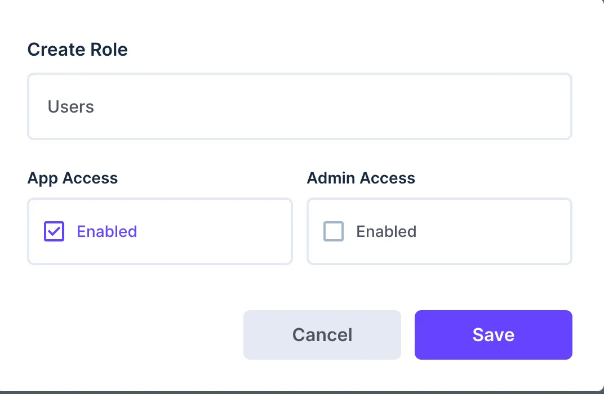
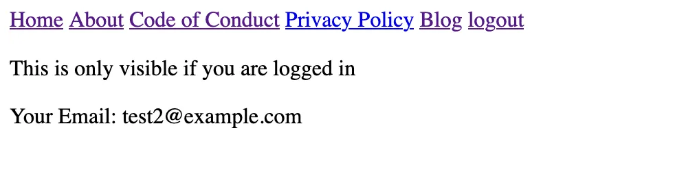

## Overview

In this guide, we will set up a complete authentication and authorization mechanism in SvelteKit using Directus as the Provider. The user session will be persisted via Server-Side Cookies and be used by the Directus SDK to make authenticated requests. As an example, we will create a new Role showing how authorization works.


## Primer Authentication

There are different ways how to store the user session. Here we will use the most secure form via Server-Side Cookies using the `Same-Site=Strict` attribute which will prevent CSRF Attacks. This means in order to be able to access the Directus Backend from the client directly, the Directus Backend will need to live on the same domain as the SvelteKit Frontend. For local development this will not matter. For more Information on this topic see https://andrewlock.net/understanding-samesite-cookies/


## Adapt Directus Wrapper

In [Getting Started with Directus and SvelteKit](https://docs.directus.io/blog/getting-started-directus-sveltekit.html), we create a wrapper which makes the Directus SDK available to our project. In this project, we will adapt the wrapper to utilize the token and define a global cookie options schema:


```js [/libs/directus.js]
import { createDirectus, rest  } from "@directus/sdk"; // [!code --]
import { createDirectus, rest, authentication  } from "@directus/sdk"; // [!code ++]
import { PUBLIC_APIURL } from '$env/static/public'; // [!code --]
import { PUBLIC_APIURL,PUBLIC_COOKIE_DOMAIN } from '$env/static/public'; // [!code ++]

function getDirectusInstance(fetch,token) {

  const options = fetch ? { globals: { fetch } } : {};

  const directus = createDirectus(PUBLIC_APIURL, options)
  .with(authentication('cookie', { credentials: 'include' })) // [!code ++]
  .with(rest());

  if(token) directus.setToken(token); // [!code ++]

  return directus;
}
export default getDirectusInstance;

export const constructCookieOpts = (age) => { // [!code ++]
	return { // [!code ++]
			'domain': PUBLIC_COOKIE_DOMAIN, // [!code ++]
			// send cookie for every page // [!code ++]
			'path': '/', // [!code ++]
			// server side only cookie so you can't use `document.cookie` // [!code ++]
			'httpOnly': true, // [!code ++]
			// only requests from same site can send cookies // [!code ++]
			// https://developer.mozilla.org/en-US/docs/Glossary/CSRF // [!code ++]
			'sameSite': "strict", // [!code ++]
			// only sent over HTTPS in production // [!code ++]
			'secure': process.env.NODE_ENV === 'production', // [!code ++]
			// set cookie to expire after a given time // [!code ++]
			'maxAge': age // [!code ++]
		} // [!code ++]
	} // [!code ++]
```

Additionally we need to define the Domain the Cookie is valid for in the  `.env` file:

```
PUBLIC_APIURL= "https://directus.example.com"
PUBLIC_COOKIE_DOMAIN= "example.com" // [!code ++]
```

## Create the Login Form

Let's start the user journey from adding a login/signup form:

```svelte [/signin/+page.svelte]
<script lang="ts">
	/** @type {import('./$types').PageData} */
	import { page } from '$app/stores';
  let email,password;
	const redirectedFrom = $page.url.searchParams.get('redirectedFrom')
</script>

<form
	action="?/login{redirectedFrom?`&redirectedFrom=${redirectedFrom}`:''}"
	method="POST">
	<div>
		<label for="email">Email</label>
		<input id="email" name="email" type="text" bind:value={email}	
		/>
	</div>

	<div>
		<label for="password">Password</label>
		<input id="password" name="password" type="password" required bind:value={password}	
		/>
	</div>

	<button type="submit">Log in</button>
	<button formaction="?/register{redirectedFrom?`&redirectedFrom=${redirectedFrom}`:''}">Register</button>
</form>
```

The html template is straight forward. We only have a small function to let us redirect the user to a page he was trying to access before needing to login/signup.

The JavaScript form action below will handle the actual request.
The Directus SDK is not saving HttpOnly Cookies, thus the Directus API is directly accessed from SvelteKit in order to be able to save the tokens in a secure cookie via SvelteKit's cookie handler.

```js [/signin/+page.server.js]
import { redirect,fail } from '@sveltejs/kit';
import { PUBLIC_APIURL } from '$env/static/public';
import { constructCookieOpts } from '$lib/directus';

const REFRESH_TOKEN_EXPIRATION = 30; // in days - adapt this with your Directus Settings

export const load = async ({ locals,url }) => {
	// redirect user if already logged in
	if (locals.token) redirect(302, '/profile')
	return {};
}

const loginUser = async (request,email,password) => {
	let req = await fetch(`${PUBLIC_APIURL}/auth/login`, {
		method: 'POST',
		headers: {
			'Content-Type': 'application/json',
			'user-agent':request.headers.get("user-agent"),
		},
		body: JSON.stringify({
			email,
			password
		})
	});
	if(req.status >= 300){
		throw new Error(await req.text());
	}
	req = await req.json();
	return req.data;
}


const login = async ({ cookies, request, url }) => {
	const data = await request.formData();
	const email = data.get('email');
	const password = data.get('password');
	const redirectedFrom = url.searchParams.get('redirectedFrom');
	
	try {
		let tokens = await loginUser(request,email,password);

		cookies.set('access_token',tokens.access_token, constructCookieOpts(Math.floor(tokens.expires/1000)));
		cookies.set('refresh_token', tokens.refresh_token, constructCookieOpts(60 * 60 * 24 * REFRESH_TOKEN_EXPIRATION));
	} catch (err) {
		return fail(400, {email,message:err.message});
	}

	redirect(302, redirectedFrom ? redirectedFrom : `/profile`)
}

const register = async ({ cookies, request, url }) => {
	const data = await request.formData();
	const email = data.get('email');
	const password = data.get('password');
	const redirectedFrom = url.searchParams.get('redirectedFrom')
	
  //First create the user
	let signupRequest = await fetch(`${PUBLIC_APIURL}/users`, {
		method: 'POST',
		headers: {
			'Content-Type': 'application/json',
			'user-agent':request.headers.get("user-agent")
		},
		body: JSON.stringify({
			email,
			password
		})
	});
	if(signupRequest.status >= 300){
		return fail(400, { email, message:await signupRequest.text() });
	}
	try {
		let tokens = await loginUser(request,email,password);

		cookies.set('access_token',tokens.access_token, constructCookieOpts(Math.floor(tokens.expires/1000)));
		cookies.set('refresh_token', tokens.refresh_token, constructCookieOpts(60 * 60 * 24 * REFRESH_TOKEN_EXPIRATION));
	} catch (err) {
		return fail(400, err.message);
	}
	
	redirect(302, redirectedFrom ? redirectedFrom : `/profile`)
}

export const actions = { login,register }
```

## Setup Directus Roles

Before you open `http://localhost:5173/signup` and create a new test user, let us define a new role called `user` which all new users will inherit upon creating an account.

Within the Directus Admin App go to Settings -> Access Control -> Create new Role and name it `Users`. App Access should be enabled.


Also note down the role id from the url while you are in the Access Role page of the new Role.

To make this role the default for new registered users and also to enable public non-authenticated users to register themself, go to Access Control -> public and customize the create permission of the directus_users collection. Make sure that only email and password field permissions are set and as a default field use the following setting:
```
{
    "role": "<YOUR ROLE ID>"
}
```

Here you will need to enter the Role ID from before. It could for example [look like this](default-role.webp).

Let's now try to register a new user for example `test@example.com` and password `test123`. You should see a 404 page as we do not yet have a profile page.  Even though the actual user is created in Directus and the cookie is set, the user is not logged in. This is because the cookie is only saved but not read for every request.


## Handle Authentication State

Next up, we need to handle the actual Cookie and keep the user remain logged in. For that, adapt the `hooks.server.js` file.

```js
import jwt from "jsonwebtoken";
import { PUBLIC_APIURL } from '$env/static/public';
import { redirect} from '@sveltejs/kit';
import { constructCookieOpts } from '$lib/directus';

const TOKEN_EXPIRATION_BUFFER = 300;

// exchange the refresh token for an access token
async function refreshAccessToken(cookies) {
    let res = await fetch(PUBLIC_APIURL + "/auth/refresh", {
      method: "POST",
      mode: "cors",
      headers: {
        Accept: "application/json, text/plain, */*",
        "Content-Type": "application/json",
      },
      body: JSON.stringify({ refresh_token: cookies.get('refresh_token') }),
    });
  
    if (res.status >= 300) {
      cookies.delete('refresh_token', { path:'/' });
      cookies.delete('access_token', { path:'/' });
      throw new Error("Refresh Token Status != 200");
    }
    let data = (await res.json()).data;
  
    cookies.set("refresh_token", data.refresh_token, constructCookieOpts(60 * 60 * 24 * 30));
    cookies.set("access_token", data.access_token, constructCookieOpts(Math.floor(data.expires/1000)));
  }

function isTokenExpired(jwtPayload){
    return jwtPayload?.exp < Math.floor(Date.now()/1000) + TOKEN_EXPIRATION_BUFFER;
}

function shouldProtectRoute(url) {
    return url.split("/").includes("(protected)")
}

export async function handle({event, resolve}) {
    const { cookies,url } = event
    
    if (cookies.get('access_token') || cookies.get('refresh_token')) {
        let jwtPayload = cookies.get('access_token') ? jwt.decode(cookies.get('access_token')) : false;
  
        //check if token is expired and renew it if necessary
        if (isTokenExpired(jwtPayload) || !cookies.get('access_token')) {
          try {
            await refreshAccessToken(cookies);
            jwtPayload = cookies.get('access_token') ? jwt.decode(cookies.get('access_token')) : false;
          } catch (err) {
            cookies.delete('refresh_token', { path:'/' });
            cookies.delete('access_token', { path:'/' });
          }
        }
        
        event.locals.user = jwtPayload?.id;
        event.locals.token = cookies.get('access_token');
    }

    if (event.route.id && shouldProtectRoute(event.route.id) && !event.locals.user) {
        redirect(302,`/signin?redirectedFrom=${encodeURIComponent(url.pathname)}`)
    }

    // this is needed so that the response headers from SvelteKit do include the correct header to allow the browser to parse json requests
    return await resolve(event, {
        filterSerializedResponseHeaders: (key, value) => {
            return key.toLowerCase() === 'content-type'
        }
    });
}
```

Every request will touch the logic in this file. It checks tokens and, if valid, sets the user id and the token to the locals object, which can be accessed throughout SvelteKit's load functions. If the Access Token is expired, a new one will be generated. Finally, we can define routes under the `(protected)` Directory. The "protected" keyword will not appear in the url, but is only visible in our file structure.

In order for the authentication to work, however, we also need to tell SvelteKit to actually pass those local variables through to every other load function.

Create a file `/+layout.server.js`:

```js [/+layout.server.js]
/** @type {import('./$types').LayoutServerLoad} */
export async function load({locals}) {
	return {
		user: locals.user,
		token: locals.token
	};
}
```

## Create Profile Page

The locals will now be used in every `+page.js` file to initialize the Directus SDK with the user's session token. To test this out, let's now create our `profile` page, which is only accessible if the user is logged in.

Create a file `/(protected)/profile/+page.js`

```js [/(protected)/profile/+page.js]
import getDirectusInstance from "$lib/directus";
import { readMe } from "@directus/sdk";
import { error } from "@sveltejs/kit";
export async function load({ parent, fetch }) {
  const { token } = await parent();
  const directus = getDirectusInstance(fetch, token);
  try {
    return {
      user: await directus.request(
        readMe({
          fields: ["*"],
        })
      ),
    };
  } catch (err) {
    error(404, "User not found");
  }
}

```

As you see, we are getting the token and initialize our Directus Instance as usual. This time however, we also give it the Access Token so that every request will now have the User's Session attached. In this case, we are reading the user's profile. If you try this without the token, the request will fail because of missing permissions.

To use data from Directus in the page we must export a `data` variable:

```svelte [/(protected)/profile/+page.svelte]
<script>
  export let data;
</script>
  
<p>This is only visible if you are logged in</p>

<p>Your Email: {data.user.email}</p>
```

You should now see a simple profile page if you are logged in under http://localhost:5173/profile




### Authenticated requests on the client and logging the user out

Until now we have used the Directus SDK solely in the load functions. In order to also use it on the client we can define a global context object, which we can use on every svelte component. For this the `+layout.svelte` file needs to be adapted:

```svelte [/+layout.svelte]
<script>
    export let data;
    import getDirectusInstance from '$lib/directus'; // [!code ++]
	  import { setContext } from 'svelte'; // [!code ++]

    // Make directus available to all components via Context API // [!code ++]
    const directus = getDirectusInstance(fetch,data.token) // [!code ++]
    setContext('directus', directus); // [!code ++]
</script>

<a href="/">Home</a>
<a href="/pages/about">About</a>
<a href="/pages/conduct">Code of Conduct</a>
<a href="/pages/privacy">Privacy Policy</a>
<a href="/blog">Blog</a>

{#if data.token} // [!code ++]
    <a href="/logout" data-sveltekit-preload-data="off">logout</a> // [!code ++]
{:else} // [!code ++]
    <a href="/signin">signin</a> // [!code ++]
{/if} // [!code ++]

<div>
    <slot></slot>
</div>
```

As you see, we also change the layout based on the login state and already add a logout endpoint for later usage.

A simple example to use the Directus SDK on the client is now to change the user's email in the profile page. Do the following changes to the profile component:

```svelte [/(protected)/profile/+page.svelte]
<script>
	import { getContext } from 'svelte'; // [!code ++]
  import { updateMe } from '@directus/sdk'; // [!code ++]
  export let data;

  const directus = getContext('directus'); // [!code ++]

  async function changeEmail() { // [!code ++]
    await directus.request(updateMe({email:data.user.email})) // [!code ++]
  } // [!code ++]
</script>
  
<p>This is only visible if you are logged in</p>

<p>Your Email: {data.user.email}</p>

<div> // [!code ++]
  <label for="email">Your E-Mail</label> // [!code ++]
  <input bind:value={data.user.email} required type="email" autocomplete="email" autocapitalize="off" /> // [!code ++]
  <button on:click={changeEmail}>Change Email</button> // [!code ++]
</div> // [!code ++]
```

Now go to http://localhost:5173/profile and change the email of your current logged-in user. Afterwards refresh the page to make sure that the value was persisted correctly.

Lastly, let's define a server endpoint to enable logout functionality:

```js [/(protected)/logout/+server.js]
import { redirect,fail } from '@sveltejs/kit';
import { PUBLIC_APIURL } from '$env/static/public';

export async function GET({locals,request,cookies}) {
  try {
    if(cookies.get('refresh_token'))
      await fetch(`${PUBLIC_APIURL}/auth/logout`, {
        method: 'POST',
        headers: {
          'Content-Type': 'application/json',
          'user-agent':request.headers.get("user-agent")
        },
        body: JSON.stringify({ refresh_token: cookies.get('refresh_token') })
      });
  } catch (err) {
    throw fail(400,err);
  }
  
  cookies.delete('refresh_token', { path: '/' });
  cookies.delete('access_token', { path: '/' });

  redirect(302,`/signin`);
}
```

This will simply delete the cookies and also calls the Directus API to invalidate the stored session in the Database. Then redirecting the user back to the login page. You can try this out by just opening http://localhost:5173/logout

# Conclusion

In this Guide, we have set up authentication and authorization in SvelteKit using Directus. It allows complex role based authorization schemas with granular control over what a logged-in user can access and do in your Directus backed App.