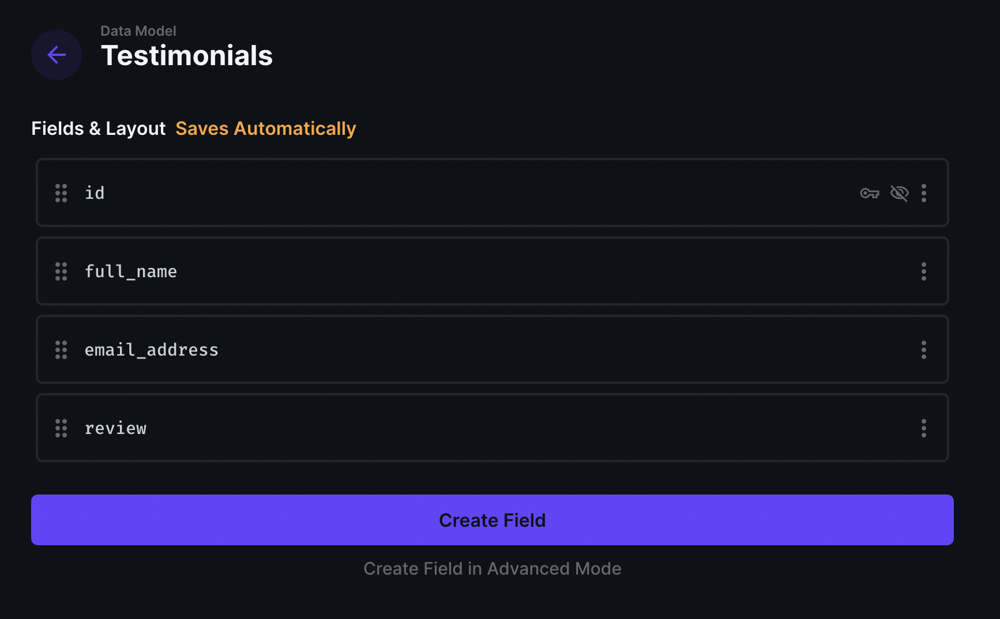
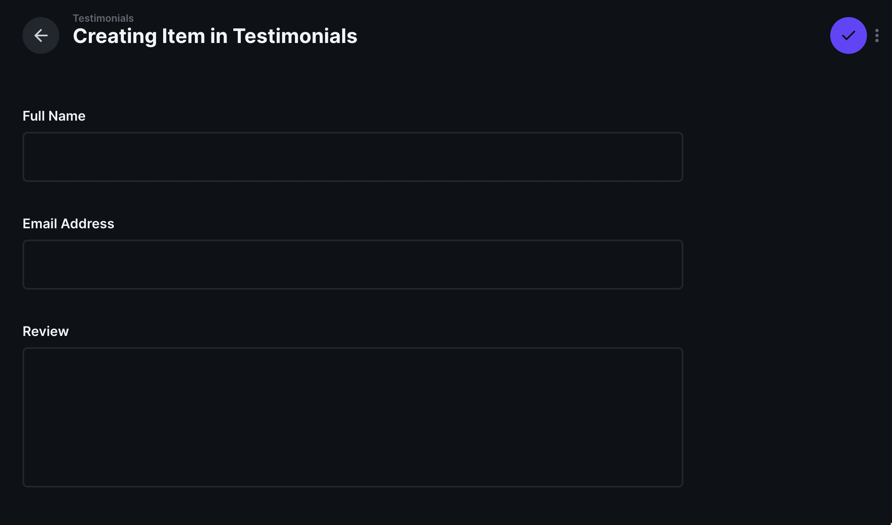
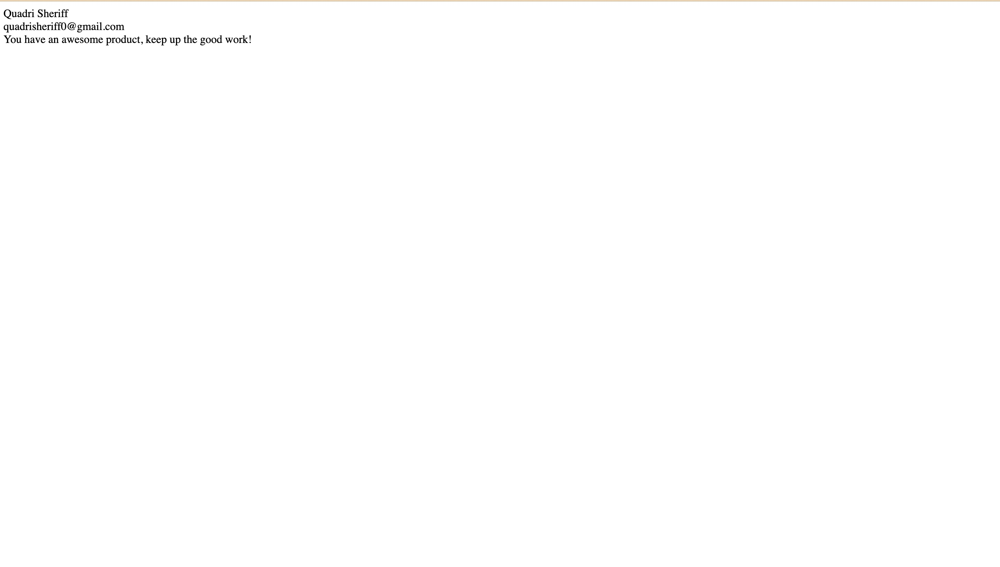
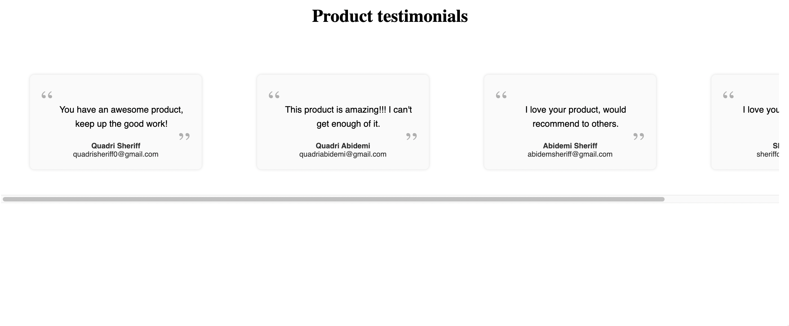
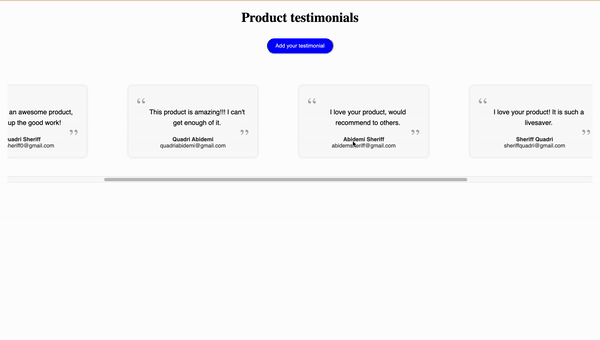

## Introduction

In this guide, we will setup a testimonial widget using SvelteKit and Directus as a CMS. By following this tutorial, you will learn how to:

- Create a Directus project and setup a Directus collection.
- Add data to a Directus collection from a Svelte app.
- Retrieve and display data from a Directus collection in your Svelte website.

## Before You Start

You will need:

- To install Node.js and a code editor on your computer.
- A Directus project - follow our [quickstart guide](https://docs.directus.io/getting-started/quickstart.html) if you don't already have one.
- Some knowledge of Svelte.

<!-- ## Your Sections Here -->
## Setup a Directus collection for data storage

To begin, we need to setup a Directus collection for storing our Testimonial data. Login to your Directus app and navigate to **Settings** > **Data Model**.

Click the + icon and create a new collection called `Testimonials`.

Add the following fields to the `Testimonials` collection and save:

- `full_name` (Type: String, Interface: Input): To capture the user's full name.
- `email_address` (Type: String, Interface: Input): To store the user's email address.
- `review` (Type: Text, Interface: TextArea): To store the user's testimonials.
  


### Enable Public Access to your Directus collection

The next step in this tutorial is to enable public access to the Testimonials collection. Head over to **Settings** > **Access Control** > **Public role**.

Toggle **Create** and **Read** permission from “No Access” to “All Access”.


This change allows you to add and retrieve testimonials directly from your frontend with no authentication.

### Add Initial data to your Directus collection

Navigate to **Content** > **Testimonials** in your Directus app and Click the + icon. Fill the collection fields and and save.



## Initialize a Svelte project

Initialize a new Svelte project by running the following command:

```bash
npm create svelte@latest testimonial-frontend # Choose Skeleton project
cd testimonial-frontend 
npm install
npm install @directus/sdk
```

Type `npm run dev` in your terminal to start the Vite development server and open [http://localhost:5173](http://localhost:5173) in your browser to access the Svelte website.

## Integrate the Directus SDK with Svelte

To make the Directus SDK available to your project, you need to setup a wrapper for the Directus SDK.

Add a `directus.js` file to the `./src/lib` directory and add the following to the file.

```js
import { createDirectus, rest } from '@directus/sdk';
import { PUBLIC_APIURL } from '$env/static/public';


function getDirectusInstance(fetch) {
   const options = fetch ? { globals: { fetch } } : {};
   const directus = createDirectus(PUBLIC_APIURL, options ).with(rest());
   return directus;
}


export default getDirectusInstance;
```

Also, add a `hooks.server.js` to your `./src` directory, and add the following to the file.

```js
export async function handle({ event, resolve }) {
   return await resolve(event, {
       filterSerializedResponseHeaders: (key, value) => {
           return key.toLowerCase() === 'content-type';
       },
   });
}
```

The `hooks.server.js` ensures that request headers required by the Directus backend are added to every request sent from your frontend to the Directus server.

Create a `.env` file in your project’s root directory and add the following to the file

```bash
PUBLIC_APIURL='directus_server_url'
```

Change `directus_server_url` to the URL of your Directus server.

### Fetch data with the Directus SDK

Add a `+page.js` file to your `./src/routes` directory, and add the following content to the file.

```js
/** @type {import('./$types').PageLoad} */
import getDirectusInstance from "$lib/directus";
import { error } from "@sveltejs/kit";
import { readItems } from "@directus/sdk";


export async function load({ fetch }) {
 const directus = getDirectusInstance(fetch);
 try {
   return {
     testimonials: await directus.request(readItems("Testimonials")),
   };
 } catch (err) {
  error(err);
 }
}
```

The `load` function fetch data from your Testimonials collection on every page load.

Update your `+page.svelte` file to the following.

```js
<script>
 /** @type {import('./$types').PageData} */
 export let data;
</script>


<div>
   <div>{data.testimonials[0].full_name}</div>
   <div>{data.testimonials[0].email_address}</div>
   <div>{data.testimonials[0].review}</div>
</div>
```

Your page should look like the following depending on the data that you added to your Testimonial collection in Directus.



## Create a Testimonial Carousel

Add a `TestimonialCard.svelte` and `TestimonialCarousel.svelte` file to your `./src/lib` folder.

Add the following to your `TestiomonialCard.svelte` file.

```js
<script>
  export let id;
  export let full_name;
  export let email_address;
  export let review;
</script>

<div {id} class="card-li">
  <blockquote class="card-article">{review}</blockquote>
  <div class="card-div1">
    <h5 class="card-h5">
      {full_name}<span class="card-span"> {email_address}</span>
    </h5>
  </div>
</div>

<style>
  .card-li {
    font-family: sans-serif;
    position: relative;
    overflow-x: auto;
    padding: 50px 50px;
	text-align: center;
    min-width: 310px;
    width: 100%;
    text-align: center;
    box-shadow: none !important;
  }

  .card-li * {
    -webkit-box-sizing: border-box;
    box-sizing: border-box;
  }
  .card-article {
    margin: 1;
    display: block;
    border-radius: 8px;
    position: relative;
    background-color: #fafafa;
    padding: 50px 30px 70px 50px;
    font-size: 1em;
    font-weight: 500;
    margin: 0 0 -50px;
    line-height: 1.6em;
    box-shadow: 0 0 5px rgba(0, 0, 0, 0.15);
  }
  .card-article:before,
  .card-article:after {
    font-family: "FontAwesome";
    content: "\201C";
    position: absolute;
    font-size: 50px;
    opacity: 0.3;
    font-style: normal;
  }
  .card-article:before {
    top: 35px;
    left: 20px;
  }
  .card-article:after {
    content: "\201D";
    right: 20px;
    bottom: 35px;
  }
  .card-div1 {
    position: relative;
    z-index: 20;
    margin-top: 10;
    padding-bottom: 9;
    padding-top: 10;
  }

  .card-h5 {
    opacity: 0.8;
    margin: 0;
    font-weight: 800;
    text-align: center;
  }
  .card-span {
    font-weight: 400;
    text-transform: none;
    display: block;
    text-align: center;
  }
</style>
```

This code displays individual testimonial data in a Card.

Add the following to your `TestimonialCarousel.svelte` file to implement the testimonial Carousel.

```js
<script context="module">
  import TestimonialCard from "$lib/TestimonialCard.svelte";

  export const getCarouselId = (index, carouselName = "carousel") =>
    `${carouselName}-item-${index}`;
</script>

<script>
  export let data;

</script>

<ul class="carousel-ul"
>
  {#each data.testimonials as testimonial, index}
    <svelte:component
      this={TestimonialCard}
      id={getCarouselId(index)}
      {...testimonial}
    />
  {/each}
</ul>

<style>
	.carousel-ul{
		display: flex;
		padding: 20;
		scroll-snap-type: x mandatory;
		gap: 2;
		overflow-x: auto;
	}

	.carousel-ul:before{
		width: 30vw;
	}
	.carousel-ul::after{
		width: 30vw;
	}
</style>
```

Update your `+page.svelte` code to the following.

```js
<script>
  /** @type {import('./$types').PageData} */
  export let data;
  import Carousel from "$lib/TestimonialCarousel.svelte";
</script>

<div>
  <h1 class="page-h1">Product testimonials</h1>
</div>

<section class="page-section">
  <Carousel {data} />
</section>

<!-- {/if} -->

<style>
  .page-h1 {
    text-align: center;
  }
  .page-section {
    display: grid;
    min-height: 100%;
	padding-left: 200px;
	margin: 10px;
    grid-template-rows: auto;
    place-items: center;
    overflow-x: scroll;
  }
</style>
```

Your svelte page should change to something similar to the following.



## Create a Add Testimonial form

The final step is to implement your Add Testimonial form. This form will allow users add data to your Testimonials collection directly from your svelte website.

Add a `TestimonialCreate.svelte` file your `./src/lib` folder and add the following code to the file.

```js
<script>
  import getDirectusInstance from "$lib/directus";
  import { error } from "@sveltejs/kit";
  import { createItem } from "@directus/sdk";
  export let full_name;
  export let email_address;
  export let review;
  export let addTestimonial;
  let loading = false;
  const directus = getDirectusInstance(fetch);
  async function createTestimonial() {
    console.log(full_name, email_address, review);
    var item = {
      full_name: full_name,
      email_address: email_address,
      review: review,
    };
    try {
      loading = true;
      await directus.request(createItem("Testimonials", item));
      loading = false;
      addTestimonial = false;
    } catch (err) {
      console.log(err);
      loading = false;
      addTestimonial = false;
      error(err);
    }
  }
</script>

<div class="create-div">
  <form class="create-form">
    <h1 class="create-h1">Add your Testimonial</h1>
    <label class="create-label" for="email">Full Name</label>
    <input
      class="create-input"
      name="full_name"
      required
      bind:value={full_name}
    />
    <label class="create-label" for="password">Email</label>
    <input
      class="create-input"
      name="email_address"
      type="email"
      required
      bind:value={email_address}
    />
    <label class="create-label" for="email">Enter your testimonial</label>
    <textarea
      rows="5"
      class="create-input"
      name="review"
      required
      bind:value={review}
    />
    <button on:click={createTestimonial} class="create-button">
      {#if loading}
        <svg
          aria-hidden="true"
          role="status"
          class="create-spinner"
          viewBox="0 0 100 101"
          fill="none"
          xmlns="http://www.w3.org/2000/svg"
        >
          <path
            d="M100 50.5908C100 78.2051 77.6142 100.591 50 100.591C22.3858 100.591 0 78.2051 0 50.5908C0 22.9766 22.3858 0.59082 50 0.59082C77.6142 0.59082 100 22.9766 100 50.5908ZM9.08144 50.5908C9.08144 73.1895 27.4013 91.5094 50 91.5094C72.5987 91.5094 90.9186 73.1895 90.9186 50.5908C90.9186 27.9921 72.5987 9.67226 50 9.67226C27.4013 9.67226 9.08144 27.9921 9.08144 50.5908Z"
            fill="#E5E7EB"
          />
          <path
            d="M93.9676 39.0409C96.393 38.4038 97.8624 35.9116 97.0079 33.5539C95.2932 28.8227 92.871 24.3692 89.8167 20.348C85.8452 15.1192 80.8826 10.7238 75.2124 7.41289C69.5422 4.10194 63.2754 1.94025 56.7698 1.05124C51.7666 0.367541 46.6976 0.446843 41.7345 1.27873C39.2613 1.69328 37.813 4.19778 38.4501 6.62326C39.0873 9.04874 41.5694 10.4717 44.0505 10.1071C47.8511 9.54855 51.7191 9.52689 55.5402 10.0491C60.8642 10.7766 65.9928 12.5457 70.6331 15.2552C75.2735 17.9648 79.3347 21.5619 82.5849 25.841C84.9175 28.9121 86.7997 32.2913 88.1811 35.8758C89.083 38.2158 91.5421 39.6781 93.9676 39.0409Z"
            fill="currentColor"
          />
        </svg>
      {:else}
        <div class="create-button-text">Add a review</div>
      {/if}
    </button>
  </form>
</div>

<style>
  .create-input {
    display: flex;
    align-items: center;
    padding: 2px 2px 2px 2px;
    width: 400px;
    min-height: 30px;
    font-size: small;
    margin-top: 2px;
    border-radius: 5px;
  }

  .create-input:focus {
    outline: none;
  }
  .create-label {
    font: bold;
    font-size: small;
    margin-top: 10px;
  }
  .create-h1 {
    padding-top: 3px;
    font: bolder;
    font-size: medium;
  }
  .create-form {
    display: flex;
    flex-direction: column;
    padding: 8px 8px 8px 8px;
    background-color: white;
    border-radius: 20px;
  }
  .create-div {
    display: flex;
    flex-direction: column;
    justify-content: center;
    justify-items: center;
    align-items: center;
  }
  .create-button {
    display: flex;
    justify-items: center;
    align-items: center;
    font-size: small;
    padding: 10px 20px 10px 20px;
    width: 80;
    background-color: blue;
    border-color: white;
    margin-top: 8px;
    font: bold;
    border-radius: 25px;
    color: white;
    
  }
  .create-button-text {
	text-align: center;
	justify-content: center;
	justify-self: center;
  }
  .create-spinner {
    height: 8px;
    width: 8px;
    display: inline;
	justify-self: center;
    animation-name: spin;
    animation-duration: 5000ms;
    animation-iteration-count: infinite;
  }
</style>
```

This code implements a form that accepts user inputs like `full_name`, `email_address`, and `review` and adds the input to your Testimonial collection in Directus.

Update your `./src/routes/+page.svelte` to the following to add the create testimonial form

```js
<script>
  /** @type {import('./$types').PageData} */
  export let data;
  let addTestimonial = false;
  import Carousel from "$lib/TestimonialCarousel.svelte";
  import TestimonialCreate from "../lib/TestimonialCreate.svelte";
  async function createTestimonial() {
    addTestimonial = true;
  }
  async function cancelTestimonial() {
    addTestimonial = false;
  }
</script>

<div class="page-div1">
	<h1 class="page-h1">Product testimonials</h1>
	<div class="page-div2">
	  {#if addTestimonial}
		<button
		  on:click={cancelTestimonial}
		  class="page-button1"
		  >Cancel</button
		>
	  {:else}
		<button
		  on:click={createTestimonial}
		  class="page-button2"
		  >Add your testimonial</button
		>
	  {/if}
	</div>
   </div>


{#if addTestimonial}
  <TestimonialCreate {addTestimonial} />
{:else}
  <section class="page-section">
    <Carousel {data} />
  </section>
{/if}

<style>
  .page-h1 {
    text-align: center;
  }
  .page-div1{
	margin-top: 2px;
  }
  .page-div2{
	display: flex;
	justify-content: center;
  }
  .page-section {
    display: grid;
    min-height: 100%;
    padding-left: 1000px;
    margin: 10px;
    grid-template-rows: auto;
    place-items: center;
    overflow-x: scroll;
  }
  .page-button1{
	display: flex;
		justify-items: center;
		align-items: center;
		font-size: small;
		padding: 10px 20px 10px 20px;
		width: 80;
		background-color: red;
		border-color: white;
		margin-top: 8px;
		font: bold;
		border-radius: 25px;
		color: white;
	}
	.page-button2{
		display: flex;
		justify-items: center;
		align-items: center;
		font-size: small;
		padding: 10px 20px 10px 20px;
		width: 80;
		background-color: blue;
		border-color: white;
		margin-top: 8px;
		font: bold;
		border-radius: 25px;
		color: white;
	}
</style>
```




## Summary

In this guide, you have set up a Testimonial widget in SvelteKit using Directus. It allows for adding new Testimonails data to Directus from Svelte and reading existing Testimonial data and displaying the in a carousel.

If you have any questions or need further assistance, please feel free to drop by our [Discord](https://directus.chat/) server.
