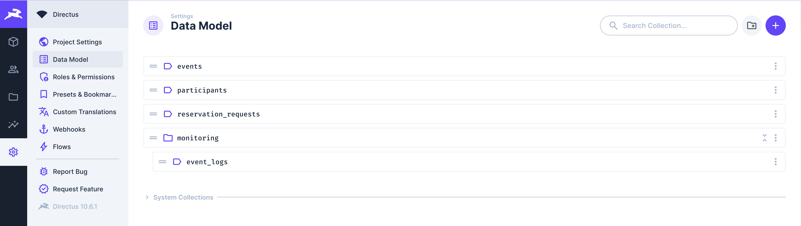
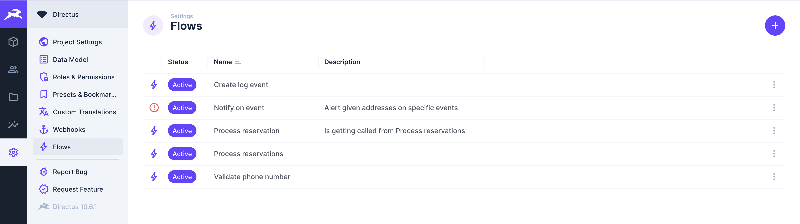
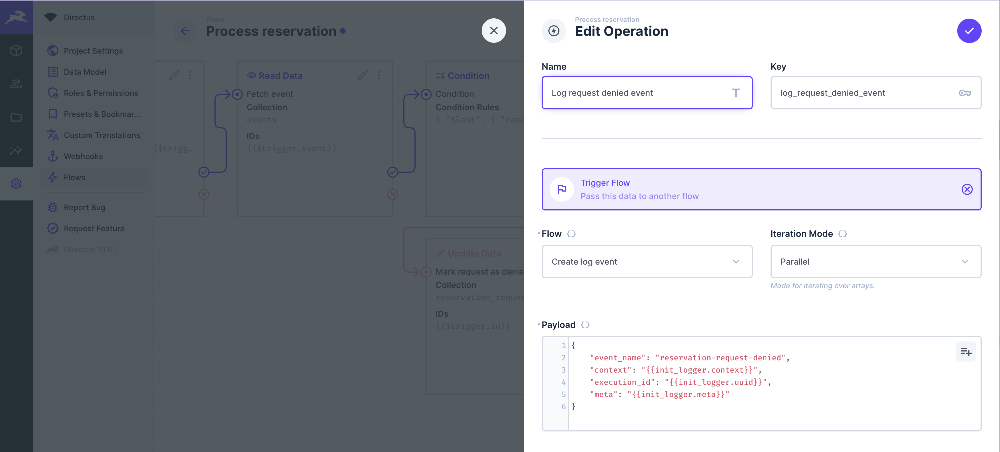
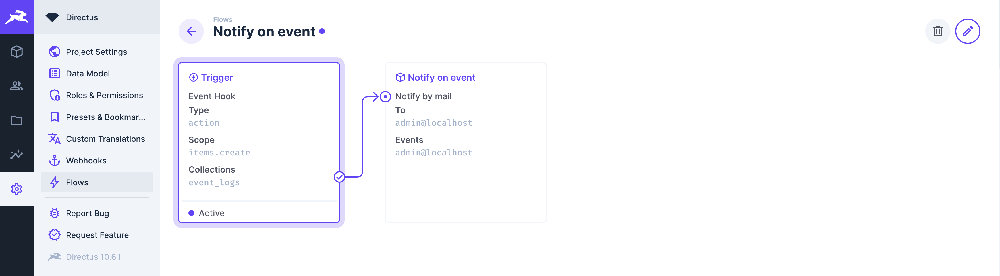

Thanks to its flexibility and extensibility, Directus provides a base to build various applications. But more is needed to tackle more complex use cases like BaaS or internal apps. Testing and monitoring are vital steps to tackle the reliability of those systems. In this article, we explore an approach to achieve that.

Our application features a rudimentary event reservation platform. Users would post reservation requests specifying their name, e-mail, phone number, and preferred event. The app administrator would then select a few requests at will and start processing each of them by triggering a manual flow from the Directus admin app. If the event is not booked out, a participant will be created, and the given phone number will be validated with the help of the Vonage API. Additionally, we use utility flows to track and get notified of special events, like invalid phone numbers and requests to reserve spots at booked-out events.

While running our tests, we mock out all external dependencies, such as Vonage and the SMTP server.

## Before we start
We are going to scaffold our project from a premade repository. You will need Git, NodeJS and Docker installed on your machine. On Windows, you will need WSL too! The node version is set to 20.6, but 18 should also work. Using a node version manager, like nvm, would be best. 

Note that running this setup on Windows WSL might cause some issues. You'll find a [troubleshooting guide](#troubleshooting) at the end of this article.

Optionally, you need a [Vonage Developer Account](https://developer.vonage.com/sign-up) in case you want to run the app in full function. The tests do not depend on Vonage, though. Also, you might want to explore the [Mockoon Desktop Client](https://mockoon.com/download/) after finishing this guide. All of these resources can be used for free. In the case of Vonage, you'll get some trial credit after signing up.

## Project setup
Let's start by checking out the [sample project](https://github.com/dband/directus_playground). 

```
git clone https://github.com/dband/directus_playground.git
```

In the root directory, you'll see four folders:

- **app** Contains our Directus extensions and a docker-compose stack to run the entire app.

- **exports** Versioned schema and flow definitions, which we'll import using the utils package.

- **tests** Integration and end-2-end tests, including the test docker compose stack and mock endpoints.

- **utils** Utility functions to manage our Directus app.

Apart from Directus, we are going to use the following included tools; both of those are integrated within the docker-compose configuration:
- [**Mailhog**](https://github.com/mailhog/MailHog) is a local SMTP mock server. It lets us save and retrieve sent messages without spamming our mailbox or third-party provider.

- [**Mockoon**](https://mockoon.com/download/) is an HTTP mock server configurable via the desktop app. The configuration can be exported as JSON and loaded upon the start of the test container. 

Build the projects:
1. Both app and tests need the utils package, so execute `npm run build` in the root directory. 
2. In **tests/setup** execute `node ./setup.js`. This script will start the testing stack, migrate the schema and flow definitions, and copy all extensions into the container. This command needs to be **run every time** after rebuilding an extension. 
3. After the script runs through, open your browser on http://localhost:8056, log in (the credentials are in tests/setup/admin_credentials.env), and check if the schema and flows are present.





## Setup integrations and end-to-end tests
After setting up the project, let us take a look how the testing app works. The docker compose configuration below binds to the ports 5433, 1026, 8026, and 8056. Make sure that does ports are not blocked, or change them accordingly.

Also we are initializing our mock endpoints. The Mockoon container binds to the volume on `./mockoon/Vonage.json:/data1:readonly`. Thats the path to the JSON configuration that was exported from Mockoon client.

<details>
<summary>Show docker-compose.yaml (found in ./tests/setup)</summary>

```yaml
version: '3'
name: taxinsights-test
services:
  database:
    image: postgis/postgis:15-master
    # Required when running on platform other than amd64, like Apple M1/M2:
    platform: linux/amd64
    ports:
    - 5433:5432
    environment:
      POSTGRES_USER: 'directus'
      POSTGRES_PASSWORD: 'directus'
      POSTGRES_DB: 'directus'

  mailhog:
    image: mailhog/mailhog
    logging:
      driver: 'none'
    ports:
      - 1026:1025 # smtp server
      - 8026:8025 # http server

  mockoon:
    image: mockoon/cli:latest
    command: ["--data", "data1"]
    ports:
    - "8050:8050"
    volumes: 
    - ./mockoon/Vonage.json:/data1:readonly
  
  directus:
    image: directus/directus:10.6.1
    ports:
      - 8056:8055
    depends_on:
      - database
      - mockoon
      - mailhog
    environment:
      KEY: '1732633e-2d70-4373-955a-f130a7c0eb4f'
      SECRET: 'eb4a8eb0-2aa3-45fb-a3d1-c6dc02d8448d'

      DB_CLIENT: 'pg'
      DB_HOST: 'database'
      DB_PORT: '5432'
      DB_DATABASE: 'directus'
      DB_USER: 'directus'
      DB_PASSWORD: 'directus'

      EMAIL_TRANSPORT: smtp
      EMAIL_SMTP_HOST: mailhog
      EMAIL_SMTP_PORT: 1025

      EXTENSIONS_AUTO_RELOAD: 'false'

      VONAGE_BASE_URL: http://mockoon:8050
      # These should be set to whatever you expect in your mock endpoint, leave them as is for this demo
      VONAGE_API_KEY: 'xxxx'
      VONAGE_API_SECRET: 'yyyyy'
    
    env_file:
    - admin_credentials.env
```
</details>

## Create a monitoring & logging pipeline
When shit hits the fan, it's nice to have some information where things went wrong. Therefore, we create a flow called "Create log event". This flow will be triggered from other flows each time we want to raise a concern.


The flow expects the following input payload:
```js
{
    event_name: string,
    context: string,
    execution_id: uuid,
    meta: Object | Array<Object>
}
```
Before we create the final event payload we set the current timestamp for our event.

```js
module.exports = async function(data) {
  return {
    "event_name": data.$trigger.event_name,
    "event_date": (new Date()).toISOString(),
    "context": data.$trigger.context,
    "execution_id": data.$trigger.execution_id,
    "meta": data.$trigger.meta
  };
}
```

We trigger the event creation flow like this



We can store events but still need a way to get notified. Also, we might want to receive only a subset of the events we create. Let's build a notification flow that hooks onto create events and sends e-mails for all events we are interested in.



We configure the "Notify by mail" operation by typing all receiving e-mail addresses into the field "To" field. The names of all events we want to receive notifications for need to be entered into the field "Events". Remember to press enter for both fields to add an item.


Below you can expand the complete code for all operations.

<details>
<summary>Show app definition of notify_on_event</summary>

```ts
import { defineOperationApp } from '@directus/extensions-sdk';

export default defineOperationApp({
	id: 'notify_on_event',
	name: 'Notify on event',
	icon: 'box',
	description: 'Sends out error emails. Must be paired with an event hook of type action.',
	overview: ({ to, events }) => [
		{
			label: 'To',
			text: Array.isArray(to) ? to.join(', ') : to,
		},
		{
			label: 'Events',
			text: Array.isArray(events) ? to.join(', ') : events,
		}
	],
	options: [
		{
			field: 'to',
			name: 'To',
			type: 'csv',
			meta: {
				width: 'full',
				interface: 'tags',
				options: {
					placeholder: '$t:operations.mail.to_placeholder',
					iconRight: 'alternate_email',
				},
			},
		},
		{
			field: 'events',
			name: 'Events',
			type: 'csv',
			meta: {
				width: 'full',
				interface: 'tags',
				options: {
					placeholder: 'Nach jedem Event mit ENTER bestätigen',
				},
			},
		},
	],
});

```
</details>

<details>
<summary>Show api definition of notify_on_event</summary>

```ts
import { defineOperationApi } from '@directus/extensions-sdk';

type Options = {
	to: string[];
	events: string[];
};

export default defineOperationApi<Options>({
	id: 'notify_on_event',
	handler: async ({ to, events }, { getSchema, database, services, accountability, logger, data }) => {
		const trigger: any = data.$trigger;

		const payload = trigger.payload;
		if (!events.includes(payload.event_name)) {
			return;
		}

		payload.meta = liquifyMeta(payload.meta);

		const schema = await getSchema({ database });
		const context = {database: database, schema: schema, accountability: accountability};

		const { MailService } = services;
        const mailService = new MailService({ schema: context.schema, knex: context.database });
        
		await mailService.send({
			to: to,
			subject: `Directus Event - ${payload.event_name}`,
			template: {
				name: 'event-notification',
				data: payload,
			},
		});
	},
});

function liquifyMeta(meta: Object) {
	const ret = [];
	for (const [key, value] of Object.entries(meta)) {
		ret.push({'key': key, 'value': JSON.stringify(value)});
	}
	return ret;
}

```
</details>

<details>
<summary>Email template used in notify_on_event</summary>

```html
<body>
  Eventname: {{ event_name }}<br>
  Eventdate: {{ event_date }}<br>
  Context: {{ context }}<br>
  <p>
    Meta:<br>
    
      {{ metadata.key }}: {{ metadata.value }}<br>
    
  </p>
  Execution ID: {{ execution_id }}
</body>
```
</details>

<details>
<summary>Show app definition of initilize_logger</summary>

```ts
import { defineOperationApp } from '@directus/extensions-sdk';

export default defineOperationApp({
	id: 'initialize_logger',
	name: 'Init Logger',
	icon: 'box',
	description: 'Simple operation that sets the context and uuid for the session scope',
	overview: ({ loggingContext, metaData }) => [
		{
			label: 'Logging Context',
			text: loggingContext,
		},
		{
			label: 'Meta Data',
			text: metaData,
		},
	],
	options: [
		{
			field: 'loggingContext',
			name: 'Logging Context',
			type: 'string',
			meta: {
				width: 'full',
				interface: 'input',
			},
		},
		{
			field: 'metaData',
			name: 'Meta Data',
			type: 'json',
			meta: {
				interface: 'code',
				options: {
					language: 'json'
				},
			}
		},
	],
});
```
</details>

<details>
<summary>Show api definition of initilize_logger</summary>

```ts
import { defineOperationApi } from '@directus/extensions-sdk';
import { randomUUID as uuidv4 } from 'crypto';
import { mapValues, isPlainObject} from 'lodash';

type Options = {
	loggingContext: string;
	metaData: any
};

export default defineOperationApi<Options>({
	id: 'initialize_logger',
	handler: ({ loggingContext, metaData }, {logger}) => {
		// Iterate through a nested object
		// https://github.com/lodash/lodash/issues/1244
		const mapValuesDeep = (obj, fn) =>
			mapValues(obj, (val, key) =>
				isPlainObject(val) ? mapValuesDeep(val, fn) : fn(val, key, obj)
			)

		metaData = mapValuesDeep(metaData, function(val, key, obj) {
			if (key == 'password') {
				val = '*****'
			}

			return val;
		});

		return {uuid: uuidv4(), context: loggingContext, meta: metaData}
	},
});
```
</details>

## Using activity tracking to test Flows
Finally, we are ready for testing! Apart from the logging pipeline, our app contains three flows. 
- **Process reservations**, which is a manual trigger on items of the collection reservation_requests
- **Process reservation**, is called from **process reservations** for each selected reservation and checks if the event is booked out. If there are still slots left, a participant is created.
- **Validate phone number**, is an action hook on create/update participants and calls the Vonage API to validate the given phone number.

That gives us the following test cases:
- an incoming reservation converts to a participant
- an incoming reservation is invalid because the event is booked out
- a participant is created/updated with a valid phone number
- a participant is created/updated with an invalid phone number

For the brevity of this article, we will explore the first two test cases. All test cases are implemented in the file `tests/src/flows.spec.ts`. 

If you set up the project, you should have a working Directus test environment ready. This environment should contain an admin user with a token, which we will use for authentication. At the top of the file, we import all dependencies, initialize our HTTP and Mailhog clients, and set up a connection to prefill the database without causing side effects.

```js
import { test, expect } from '@playwright/test';
import { faker } from '@faker-js/faker';
import knex from 'knex'
import dotenv from 'dotenv'
import { getClient } from 'utils'

dotenv.config({ path: 'env/.env-dev' });

const DIRECTUS_URL = process.env.TEST_CLIENT_URL;
const AUTH_TOKEN = process.env.TEST_CLIENT_AUTH_TOKEN;
const MAILHOG_HTTP = process.env.MAILHOG_HTTP_URL;

const adminClient = getClient(DIRECTUS_URL, AUTH_TOKEN);
const mailhog = getClient(MAILHOG_HTTP);

const db = knex({
  client: 'postgres',
  connection: {
    host : 'localhost',
    port : 5433,
    user : 'directus',
    password : 'directus',
    database : 'directus'
  }
});
```

Next, we need some utility functions. The database should reset between tests. Also, we need to wait for Directus to process the flows. For simplicity, we do that each time by sleeping a few seconds after calling the Directus API. Also, we need a way to trigger the manual flow **process reservations**, by opening the sidebar and clicking the button. At last, we want to validate if our flow operations are called in the expected order.

```js
async function reset() {
  await db.raw('TRUNCATE TABLE event_logs')
  
  await db.raw('TRUNCATE TABLE directus_activity RESTART IDENTITY CASCADE')
  await db.raw('TRUNCATE TABLE directus_notifications RESTART IDENTITY CASCADE')
  await db.raw('TRUNCATE TABLE directus_revisions RESTART IDENTITY CASCADE')

  await db.raw('TRUNCATE TABLE participants RESTART IDENTITY CASCADE')
  await db.raw('TRUNCATE TABLE reservation_requests RESTART IDENTITY CASCADE')

  await mailhog.delete('/api/v1/messages');
}

function sleep(ms) {
  return new Promise((resolve) => {
    setTimeout(resolve, ms);
  });
}

function linkToFlow(id) {
  return `${DIRECTUS_URL}/revisions?filter[item]=${id}`;
}

async function openFlowsSidebar(page) {
  await page.getByRole('button').filter({ hasText: 'Flows' }).click(); 
}

function triggerManualFlow(flowName, page) {
  return page.getByRole('button').filter({ hasText: flowName }).click();
}

function assertOperations(expectedOps, actualOps) {
  expect(actualOps.length).toBe(expectedOps.length);

  for (let i = 0; i < expectedOps.length; i++) {
      const expected = expectedOps[i];
      const {options, ...actual} = actualOps[i];

      expect(actual).toMatchObject(expected);
  }
}
```

We start by seeding a list of randomly generated events and log in to Directus with our admin account before each test. We need to know the event IDs in our tests later, so let's initialize them outside of beforeAll.

```js
const eventOne = faker.string.uuid();
const eventZeroCapacity = faker.string.uuid();

test.describe('given a list of events', () => {
    test.beforeAll(async () => {
        await reset();

        await db('events').insert([
            {
                id: eventOne,
                name: faker.commerce.productName(),
                description: faker.lorem.paragraph(),
                event_date: faker.date.soon(),
                capacity: 1
            },
            {
                id: eventZeroCapacity,
                name: faker.commerce.productName(),
                description: faker.lorem.paragraph(),
                event_date: faker.date.soon(),
                capacity: 0
            }
        ]);
    });

    test.beforeEach(async ({ page }) => { 
        await reset(); 

        await page.goto('http://localhost:8056/admin/users')
        await page.waitForURL("http://localhost:8056/admin/login?redirect=/users");
      
        await page.getByPlaceholder('Email').fill('admin@directus.com');
        await page.getByPlaceholder('Password').fill('admin');
        await page.getByRole('button', { name: 'Sign In' }).click(); 
      
        await expect(await page.locator('h1').locator('div').textContent()).toBe('User Directory');      
    });
});
```

The test for a valid reservation, aka an event that is not booked out, should
1. generate and insert a reservation into the database
2. open the URL `/admin/content/reservation_requests`
3. open the flows sidebar
4. select one or more reservation items
5. execute the flow **process reservations** by hitting the button
6. wait for a few seconds until the flow runs through
7. fetch the revision data of the flow with the help of our flows definition file in `exports/flows/flows.json`.
8. Checking the operation ID, key and status and, optionally the payload

```js
test.describe('given a list of events', () => {
  ...

  test.describe('process reservations', () => {
    test('a reservation is valid', async ({ page }) => {
      await db('reservation_requests').insert(
        {
          id: faker.string.uuid(),
          name: faker.person.fullName(),
          email: faker.internet.email(),
          phone: faker.phone.number(),
          event: eventOne
        }
      );

    await page.goto(`${DIRECTUS_URL}/admin/content/reservation_requests`);
    
    await openFlowsSidebar(page);

    await page.locator('.checkbox').nth(1).click();

    await triggerManualFlow('Process reservations', page);

    await sleep(2000);

    const revisionsData = await adminClient(linkToFlow('321374e8-3822-4a53-84cc-b2ecd32887ce'));
    const revisions = revisionsData.data.data;

    expect(revisions.length).toBe(1);
        
    const operations = revisions[0].data.steps;
    const expectedOps = [
      {
        operation: '93bda332-6a58-466d-896a-c4f31173ef81',
        key: 'init_logger',
        status: 'resolve'
      },
      {
        operation: 'b6083af0-a24c-4837-bd1f-0fccced66d7b',
        key: 'fetch_event',
        status: 'resolve'
      },
      {
        operation: '66903a5b-6ceb-453e-b4ef-626d7598985d',
        key: 'condition_83wu5',
        status: 'resolve'
      },
      {
        operation: 'd9a2ba2d-aaf4-4c61-aa70-32e7dfd5d627',
        key: 'create_payload',
        status: 'resolve'
      },            
      {
        operation: '05346fb6-2141-45dd-adbf-b3d697b4f0a0',
        key: 'create_participant',
        status: 'resolve'
      },
      {
        operation: '97699175-9e66-4e1b-93bf-181bb70ba572',
        key: 'mark_request_as_success',
        status: 'resolve'
      }
    ];
    assertOperations(expectedOps, operations);    
  });
});
```

Testing the flow in case the event booked out needs a slight change as the condition after "fetch_event" will reject. 

```js
  const expectedOps = [
    {
      operation: '93bda332-6a58-466d-896a-c4f31173ef81',
      key: 'init_logger',
      status: 'resolve'
    },
    {
      operation: 'b6083af0-a24c-4837-bd1f-0fccced66d7b',
      key: 'fetch_event',
      status: 'resolve'
    },
    {
      operation: '66903a5b-6ceb-453e-b4ef-626d7598985d',
      key: 'condition_83wu5',
      status: 'reject'
    },
    {
      operation: '3f0bb8c2-2af4-4f46-b8ef-42505112d87a', 
      key: 'mark_request_as_denied',                     
      status: 'resolve'
    },
    {
      operation: '95c0dca3-0c04-4bb5-a789-342da36e52e6',
      key: 'log_request_denied_event',
      status: 'resolve'
    }
  ];
```

Also we query our "log_events" collection and make sure that directus did send an email.

```js
const eventLogData = await adminClient('/items/event_logs');
expect(eventLogData.data.data.length).toBe(1);

const messages = await mailhog('/api/v2/search?kind=containing&query=reservation-request-denied');
expect(messages.data.count).toBe(1);
```

## Summary
In this article, we created a simple event-logging pipeline with optional alerting, which allows us to debug and monitor applications in production. Also, we covered how to test the result of flow operations by measuring the order and status. We could have gone further and tested the input and output of every operation, but it's enough for this use case. Additionally, we saw how to test manual flows with Playwright. In the same way, we can test custom endpoints and modules.

There are many ways to optimize this setup. For example, if you find the testing setup too tedious, you could automate it even further by enabling hot reloading or running an automation tool like Nodemon, copying over the latest changes. Just be aware in case you use custom migrations. Your current schema should always be up to date before running those. 

You could also create an insights panel to track the amount of (specific) events over a time period.

## Troubleshooting

In WSL, the script might fail on line 108 of the setup.js script 

```js
await exec('docker compose cp ../../app/build/. directus:/directus/extensions');
```

Somehow it's not possible to copy the folder to the container if it is in a sub directory. Change the command to

```js
await exec('docker compose cp app/build/. directus:/directus/extensions');
``` 

and execute the script from the root dir of the project dir.
