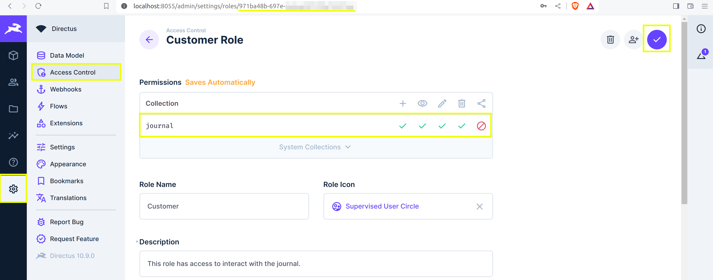
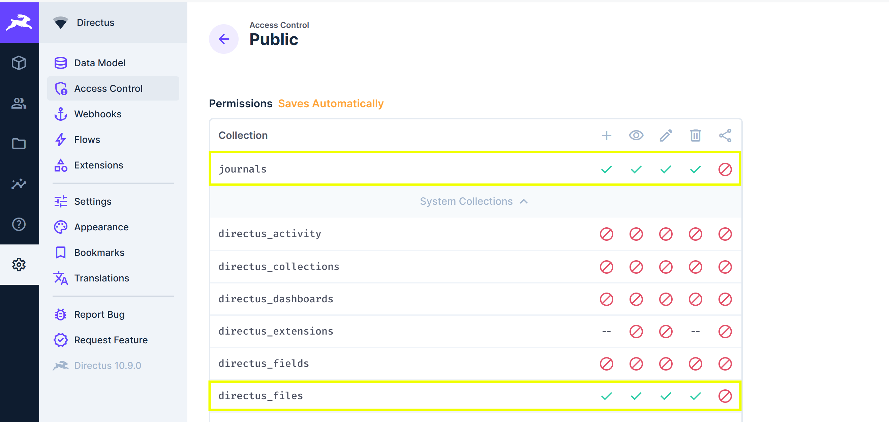
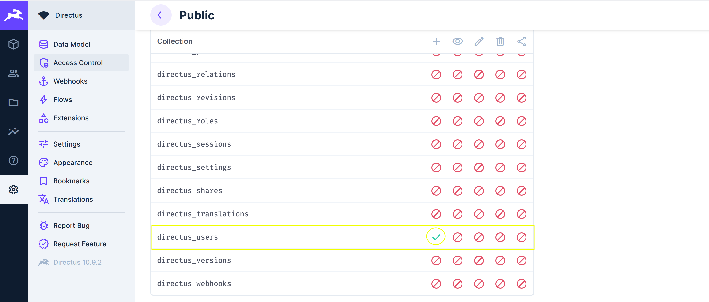

## Introduction

In this tutorial, we’ll build a personal travel journal application using Vue.js and Directus. We’ll go through the process of implementing user authentication with Directus and demonstrate how to interact with a Directus collection using Vue.js.

## Before You Start

You'll need:

- [Node.js](https://nodejs.org/en/) and a code editor installed on your machine.
- A Directus project created either using [Directus Cloud](https://directus.cloud/) or [run locally on your machine.](https://docs.directus.io/getting-started/quickstart.html).
- Some knowledge of the Vue.js Composition API.

## Creating A Vue.js Project

Open your terminal and run the following command:

```bash
npm create vue@3
```

During project creation, when prompted with questions, choose the following options:

```bash
✔ Project name: … ./directus-travel-journal
✔ Package name: … -directus-travel-journal
✔ Add TypeScript? … No / Yes
✔ Add JSX Support? … No / Yes
✔ Add Vue Router for Single Page Application development? … No / Yes
✔ Add Pinia for state management? … No / Yes
✔ Add Vitest for Unit Testing? … No / Yes
✔ Add an End-to-End Testing Solution? › No
✔ Add ESLint for code quality? … No / Yes
```

Once completed, run the following command to install dependencies and start the development server:

```bash
cd directus-travel-journal
npm install
npm run dev
```

Once the command is run, visit `http://localhost:5173` and you should see a starter project. Open the new directory in your code editor before continuing.

## Installing the Directus SDK

With your Vue.js project set up, proceed to install the Directus SDK with the following command:

```bash
npm install @directus/sdk
```

## Creating a Journal and Users Collection

In your Directus project, navigate to Settings -> Data Model and create a new collection called `journal`. Use `journal` as the table name and leave every other configuration as their default.

Create the following fields with the following types:

- `title`: Input - string (*required*).
- `description`: Textarea - text (*required*).
- `photo`: Image - uuid (*required*).
- `city`: Input - string (*required*).
- `country`: Input - string (*required*).

Add a description of the `journal` collection and proceed to create the collection.


Head over to Settings→Access Control, and create a customer role with only App Access. Give it create, read, update, and delete access to the `journal` collection, add a description, and then proceed to create the customer role while taking note of the customer role id:



After creating the customer role, you will be directed to the Access Control page. Click on the Public role and enable create, read, update, and delete access to the `journal` collections and also for `directus_files` and `directus_users` under system collections:





## Preparing the Vue.js Project

In your Vue.js project, navigate to the `src` folder. Delete the `base.css` file and edit the `main.css` file to contain the following: 

```css
@import url('https://fonts.googleapis.com/css2?family=Poppins:wght@300&display=swap');

*, body{
  font-family: 'Poppins', sans-serif;
}
```

Doing this will set the overall font for the Vue.js application to [Poppins](https://fonts.google.com/specimen/Poppins).

Head over to the `components` folder and delete everything in it including the `icons` folder and the following components `HelloWorld.vue`, `TheWelcome.vue`, and `WelcomeItem.vue`.

Once that is done, go into the `router/index.js` file and edit it to match the following:

```javascript
import { createRouter, createWebHistory } from "vue-router";
import LoginView from "../views/LoginView.vue";

const router = createRouter({
  history: createWebHistory(import.meta.env.BASE_URL),
  routes: [
    {
      path: "/",
      name: "login",
      component: LoginView,
    },
    {
      path: "/signup",
      name: "signup",
      component: () => import("../views/SignupView.vue"),
    },
    {
      path: "/addjournal",
      name: "addjournal",
      component: () => import("../views/Addjournal.vue"),
    },
    {
      path: "/readjournal",
      name: "readjournal",
      component: () => import("../views/Readjournal.vue"),
    },
  ],
});

export default router;
```

This will set up the basic routing for the Vue.js application, allowing users to navigate between different views. Below is a quick summary of the views:

- `/`: This is the root path of the application and is associated with a view called `LoginView`. When users visit the base URL of your application, they are directed to this view, which is typically used for user authentication.
- `/signup`: This path leads to the `SignupView` and is designed for new users to register or create an account. When users navigate to `/signup`, they are presented with a signup form to enter their details and create a new account.
- `/addjournal`: This is the part for the `Addjournal` view. This route is used for adding new journal entries.
- `/readjournal`: This route is linked to the `Readjournal` view. It is intended for users to view and read their existing journal entries. When users navigate to `/readjournal`, they can browse through all the journal entries they have created.

In the `views` folder, delete the existing views - `AboutView.vue` and `HomeView.vue` and create the following views - `LoginView.vue`, `SignupView.vue`, `Addjournal.vue` and `Readjournal.vue`.

Finally, edit your `App.vue` to contain the following code:

```html
<script setup>
import { RouterView } from 'vue-router'

</script>

<template>
  <RouterView />
</template>
```

## Configuring Login and SignUp

First, head over to the `LoginView.vue` view and add the following script:

```javascript
<script setup>
import { ref } from "vue";
import { useRouter } from "vue-router";
import { createDirectus, authentication, rest, login } from "@directus/sdk";

const email = ref("");
const password = ref("");

const router = useRouter();

const directus = createDirectus("YOUR_DIRECTUS_PROJECT_URL")
  .with(authentication("json"))
  .with(rest());

const handleLogin = async () => {
  try {
    const response = await directus.request(login(email.value, password.value));
    console.log("Authentication successful", response);
    router.push({ name: "addjournal" });
    if (response.access_token) {
      localStorage.setItem("userToken", response.access_token);
    }
  } catch (error) {
    console.error("Authentication failed:", error);
  }
};
</script>
```

This will establish the functionality for user authentication with Directus using the Directus SDK. If the login is successful, the received authentication token is stored in the browser's local storage, and the user is redirected to the route - `addjournal`, where they can start adding entries to their travel journal.


Next, add the following template:

```html
<template>
  <div class="login-container">
    <form @submit.prevent="handleLogin">
      <h2>Welcome, to your Travel Journal!</h2>
      <div class="form-group">
        <label for="email">Email:</label>
        <input type="email" id="email" v-model="email" required />
      </div>

      <div class="form-group">
        <label for="password">Password:</label>
        <input type="password" id="password" v-model="password" required />
      </div>

      <button type="submit">Login</button>
      <p class="signup-link">
        Do not have an account? <RouterLink to="/signup">SignUp</RouterLink>
      </p>
    </form>
  </div>
</template>
```

and styles:

```html
<style scoped>
  .login-container {
  display: flex;
  justify-content: center;
  align-items: center;
  min-height: 100vh;
  background-color: #f5f5f5;
  font-family: Arial, sans-serif;
}

.form-group {
  margin-bottom: 15px;
}

form {
  padding: 20px;
  border: 1px solid #ddd;
  border-radius: 4px;
  background: white;
  box-shadow: 0 4px 8px rgba(0, 0, 0, 0.1);
  max-width: 300px;
  width: 100%;
}

label {
  display: block;
  margin-bottom: 5px;
}

input[type="email"],
input[type="password"] {
  width: 100%;
  padding: 8px;
  border: 1px solid #ddd;
  border-radius: 4px;
  box-sizing: border-box;
}

button {
  width: 100%;
  padding: 10px;
  border: none;
  border-radius: 4px;
  background-color: #4caf50;
  color: white;
  font-size: 16px;
  cursor: pointer;
  transition: background-color 0.3s;
}

button:hover {
  background-color: #45a049;
}

.signup-link {
  margin-top: 15px;
  text-align: center;
}

.signup-link a {
  color: #4caf50;
  text-decoration: none;
}

.signup-link a:hover {
  text-decoration: underline;
}
</style>
```

To configure the signup functionality, add the following script to your `SignupView.vue`:

```javascript
<script setup>
import { ref } from "vue";
import { useRouter } from "vue-router";
import { createDirectus, createUser, rest } from "@directus/sdk";

const router = useRouter();

const firstName = ref("");
const lastName = ref("");
const email = ref("");
const password = ref("");

const directus = createDirectus("http://localhost:8055").with(rest());

const handleSignup = async () => {
  try {
    const response = await directus.request(
      createUser({
        first_name: firstName.value,
        last_name: lastName.value,
        email: email.value,
        password: password.value,
        role: "..72a55849",
      }),
    );
    console.log("Signup successful:", response);
    router.push({ name: "addjournal" });
  } catch (error) {
    console.error("Signup failed:", error);
  }
};
</script>
```

This will set up the user registration functionality in directus. And, after a successful signup, the user is directed to the `Addjournal.vue` view just like the `Login` functionality. Be sure to replace the role with your customer role ID string.

Add the following template:

```html
<template>
  <div class="signup-container">
    <form @submit.prevent="handleSignup">
      <div class="form-group">
        <label for="firstName">First Name:</label>
        <input type="text" id="firstName" v-model="firstName" required />
      </div>

      <div class="form-group">
        <label for="lastName">Last Name:</label>
        <input type="text" id="lastName" v-model="lastName" required />
      </div>

      <div class="form-group">
        <label for="email">Email Address:</label>
        <input type="email" id="email" v-model="email" required />
      </div>

      <div class="form-group">
        <label for="password">Password:</label>
        <input type="password" id="password" v-model="password" required />
      </div>

      <button type="submit">Signup</button>
      <p class="login-link">
        Already have an account? <RouterLink to="/">Login</RouterLink>
      </p>
    </form>
  </div>
</template>
```

And then, the styles:

```css
<style scoped>
.signup-container {
  display: flex;
  justify-content: center;
  align-items: center;
  min-height: 100vh;
  background-color: #f5f5f5;
  font-family: Arial, sans-serif;
}

.form-group {
  margin-bottom: 15px;
}

form {
  padding: 20px;
  border: 1px solid #ddd;
  border-radius: 4px;
  background: white;
  box-shadow: 0 4px 8px rgba(0, 0, 0, 0.1);
  max-width: 300px;
  width: 100%;
}

label {
  display: block;
  margin-bottom: 5px;
}

input[type="text"],
input[type="email"],
input[type="password"] {
  width: 100%;
  padding: 8px;
  border: 1px solid #ddd;
  border-radius: 4px;
  box-sizing: border-box;
}

button {
  width: 100%;
  padding: 10px;
  border: none;
  border-radius: 4px;
  background-color: #4caf50;
  color: white;
  font-size: 16px;
  cursor: pointer;
  transition: background-color 0.3s;
}

button:hover {
  background-color: #45a049;
}

.login-link {
  margin-top: 15px;
  text-align: center;
}

.login-link a {
  color: #4caf50;
  text-decoration: none;
}

.login-link a:hover {
  text-decoration: underline;
}
</style>
```

As a final step, add the following code in the `Addjournal.vue` view so you can test the login and signup functionality you have implemented in the Vue.js application with Directus:

```html
<template>
    <div>
        This  is the Addjournal view
    </div>
</template>
```

Head over to your Vue application over the browser, you should see the following:


At this point, navigate to the signup page by clicking on **signup,** and then create a user:


Once the user is created successfully, you should be directed to the `Addjournal.vue` view:


To confirm the user has been created, head to your Directus project and navigate to User Directory → All Users, you should see the newly created user:


With this, you have successfully integrated Directus Auth into your Vue.js project. Also, you can log in with the newly created user credentials in your Vue.js application.

## Creating and Viewing Journals

Now that you have successfully integrated a login and signup feature with Directus, it’s time to interact with the `journals` collections from your Vue.js application, so users can add journal entries, edit, delete, and also view them.

In a script block, import the necessary Vue and Directus SDK methods, Initialize `useRouter` and `useRoute` for navigation and parameter access, and then define reactive variables for form inputs and state management:

```javascript
import { ref, watch } from "vue";
import {
  createDirectus,
  uploadFiles,
  rest,
  createItems,
  updateItem,
  readItems,
} from "@directus/sdk";
import { useRouter, useRoute } from "vue-router";

const router = useRouter();
const route = useRoute();
const journalId = ref(route.query.journalId);
const title = ref("");
const description = ref("");
const photo = ref(null);
const country = ref("");
const city = ref("");
const photoPreview = ref(null);
const isLoading = ref(false);
```

Next, define a utility function `getImageUrl` to construct URLs for images so they can be previewed, and initialize the Directus client using `createDirectus` from the SDK:

```javascript
const getImageUrl = (imageId) => {
  return `http://localhost:8055/assets/${imageId}`;
};

const client = createDirectus("http://localhost:8055").with(rest());
```

Then, use the `watch` function to fetch existing journal data when a `journalId` is provided using the `readItems` method from the Directus SDK to fetch data based on the provided `journalId`.

If the ID exists, the journal's details are loaded into the form's reactive variables:

```javascript
watch(
  journalId,
  async (newJournalId) => {
    if (newJournalId) {
      try {
        isLoading.value = true;
        const journalData = await client.request(
          readItems("journals", {
            filter: { id: { _eq: newJournalId } },
            fields: ["title", "description", "country", "city", "photo"],
          }),
        );

        title.value = journalData[0].title;
        description.value = journalData[0].description;
        country.value = journalData[0].country;
        city.value = journalData[0].city;
        photoPreview.value = getImageUrl(journalData[0].photo);
      } catch (error) {
        console.error("Error fetching journal:", error);
      } finally {
        isLoading.value = false;
      }
    }
  },
  { immediate: true },
);
```

Implement image handling functions `handleFile` for previewing selected images and `uploadImageToDirectus` for uploading images using the `uploadFiles` method from the Directus SDK. 

These functions will manage file input from the user, convert files to a format suitable for preview, and upload images to Directus:

```javascript
const handleFile = (file) => {
  photo.value = file;
  const reader = new FileReader();
  reader.onload = (e) => {
    photoPreview.value = e.target.result;
  };
  reader.readAsDataURL(file);
};

const uploadImageToDirectus = async () => {
  try {
    if (!photo.value) {
      return null;
    }

    const formData = new FormData();
    formData.append("file", photo.value);
    const response = await client.request(uploadFiles(formData));

    if (response && response.id) {
      return response.id;
    } else {
      console.error("Unexpected response format:", response);
      throw new Error("Invalid response format or missing expected data");
    }
  } catch (error) {
    console.error("Image upload failed:", error);
    throw error;
  }
};
```

Finally, define a function - `handleSubmit` to manage journal entry submission. This function will determine whether to create a new entry using the `createItems` method or update an existing one using the `updateItem` method from the Directus SDK. 

It'll handle form submission, and image uploads, and navigate to the `readjournal` view on success.

```javascript
const handleSubmit = async () => {
  isLoading.value = true;
  try {
    let imageUUID;
    if (photo.value) {
      imageUUID = await uploadImageToDirectus();
    } else {
      const imageIdMatch = photoPreview.value.match(/\/assets\/(.+)$/);
      imageUUID = imageIdMatch ? imageIdMatch[1] : null;
    }

    const journalData = {
      title: title.value,
      description: description.value,
      country: country.value,
      city: city.value,
      photo: imageUUID,
    };

    let response;
    if (journalId.value) {
      response = await client.request(updateItem('journals', journalId.value, journalData));
    } else {
      response = await client.request(createItems('journals', journalData));
    }
    router.push({ name: 'readjournal' });
  } catch (error) {
    console.error('Journal submission failed:', error);
    if (error.response) {
      console.error('Error response data:', error.response.data);
    }
  } finally {
    isLoading.value = false;
  }
};
```

Now add the following template:

```html
<template>
  <div class="add-journal-container">
    <form @submit.prevent="handleSubmit">
      <div class="form-group">
        <label for="title">Title:</label>
        <input type="text" id="title" v-model="title" required />
      </div>

      <div class="form-group">
        <label for="description">Description:</label>
        <textarea id="description" v-model="description" required></textarea>
      </div>

      <div class="form-group">
        <label for="city">City:</label>
        <input type="text" id="city" v-model="city" required />
      </div>

      <div class="form-group">
        <label for="country">Country:</label>
        <input type="text" id="country" v-model="country" required />
      </div>

      <div class="form-group">
        <label for="photo">Photo:</label>
        <input
          type="file"
          id="photo"
          @change="handleFile($event.target.files[0])"
        />
      </div>

      <div class="photo-preview" v-if="photoPreview">
        
      </div>

      <button type="submit" v-if="!isLoading">Submit</button>
      <div v-if="isLoading">Submitting...</div>
    </form>
  </div>
</template>
```

And then the following styles:

```css
<style scoped>
.add-journal-container {
  display: flex;
  justify-content: center;
  align-items: center;
  min-height: 100vh;
  background-color: #f5f5f5;
  font-family: Arial, sans-serif;
}

.form-group {
  margin-bottom: 15px;
}

form {
  padding: 20px;
  border: 1px solid #ddd;
  border-radius: 4px;
  background: white;
  box-shadow: 0 4px 8px rgba(0, 0, 0, 0.1);
  max-width: 300px;
  width: 100%;
}

label {
  display: block;
  margin-bottom: 5px;
}

input[type="text"],
textarea,
input[type="file"] {
  width: 100%;
  padding: 8px;
  border: 1px solid #ddd;
  border-radius: 4px;
  box-sizing: border-box;
}

button {
  width: 100%;
  padding: 10px;
  border: none;
  border-radius: 4px;
  background-color: #4caf50;
  color: white;
  font-size: 16px;
  cursor: pointer;
  transition: background-color 0.3s;
}

button:hover {
  background-color: #45a049;
}

.photo-preview img {
  max-width: 150px;
  max-height: 150px;
  object-fit: cover;
}
</style>
```

For viewing journals, add the following piece of code in your `Readjournal.vue` view:

In a script block, initialize `useRouter` and `useRoute` for navigation and parameter access, And define a reactive variable `journals` to store the list of journal entries fetched from Directus:

```javascript
import { ref, onMounted } from 'vue';
import { createDirectus, rest, readItems, deleteItem } from '@directus/sdk';
import { useRouter, useRoute } from 'vue-router';

const router = useRouter();
const route = useRoute();
const journals = ref([]);

const client = createDirectus('http://localhost:8055').with(rest());
```

Use the `onMounted` lifecycle hook to fetch journal entries from the Directus backend as soon as the component is mounted to the DOM using the `readItems` method:

```javascript
onMounted(async () => {
  try {
    const response = await client.request(readItems("journals"));
    console.log("Full response:", response);
    journals.value = response;
    console.log("journals value from readjournal:", journals.value);
  } catch (error) {
    console.error("Error fetching journals:", error);
  }
});
```

Following that, define a function - `editJournal` to navigate the user to the `addjournal` view for editing a journal entry. 

This function will take a journal object as an argument and use `router.push` to navigate, passing the journal's ID as a query parameter. 

```javascript
const editJournal = (journal) => {
  router.push({ name: 'addjournal', query: { journalId: journal.id }});
  console.log("Editing journal:", journal.id);
};
```

Then, implement a function - `deleteJournal` to allow users to delete a journal entry. 

This function will use the `deleteItem` method from the Directus SDK to send a request to delete the specified journal entry from the backend.

Upon successful deletion, the local list of journals is updated to remove the deleted entry, ensuring the UI reflects the current state of the Directus backend.

```javascript
const deleteJournal = async (journalId) => {
  try {
    await client.request(deleteItem('journals', journalId));
    journals.value = journals.value.filter((journal) => journal.id !== journalId);
    console.log("Journal deleted:", journalId);
  } catch (error) {
    console.error('Error deleting journal:', error);
  }
};
```

Finally, create a utility function `getImageUrl` to construct the URL for journal entry images stored in Directus using an `imageId` and then, return the full URL path to the image. 

This will help convert stored image IDs into usable image URLs for displaying images in your Vue.js frontend:

```javascript
const getImageUrl = (imageId) => {
  return `http://localhost:8055/assets/${imageId}`;
};
```

Now, add the following template:

```html
<template>
  <div class="read-journal-container">
    <div class="journal-list">
      <div
        v-for="journal in journals"
        :key="journal.id"
        class="journal-entry card"
      >
        <div class="content"><h3>{{ journal.title }}</h3></div>
        <div class="content">{{ journal.description }}</div>
        <div class="content">
          <p><b>City</b>: {{ journal.city }}</p>
          <p><b>Country</b>: {{ journal.country }}</p>
        </div>
        <div class="content">
          
        </div>
        <div class="journal-actions">
          <button @click="editJournal(journal)" class="edit-button">
            Edit
          </button>
          <button @click="deleteJournal(journal.id)" class="delete-button">
            Delete
          </button>
        </div>
      </div>
    </div>
  </div>
</template>
```

And then the following styles:

```css
<style scoped>
.read-journal-container {
  display: flex;
  flex-direction: column;
}

.journal-list {
  display: grid;
  grid-template-columns: repeat(4, 1fr);
  gap: 20px;
  padding: 20px;
}

@media (max-width: 1200px) {
  .journal-list {
    grid-template-columns: repeat(3, 1fr);
  }
}

@media (max-width: 800px) {
  .journal-list {
    grid-template-columns: repeat(2, 1fr);
  }
}

@media (max-width: 500px) {
  .journal-list {
    grid-template-columns: 1fr;
  }
}

.card {
  border: 1px solid #ddd;
  border-radius: 4px;
  padding: 15px;
  box-shadow: 0 2px 4px rgba(0, 0, 0, 0.1);
}

.journal-photo {
  width: 100px;
  height: 100px;
  display: block;
  margin-bottom: 10px;
}

.journal-actions {
  display: flex;
  justify-content: space-around;
  margin-top: 10px;
}

.edit-button,
.delete-button {
  border: none;
  padding: 10px 15px;
  border-radius: 4px;
  cursor: pointer;
  color: white;
  font-weight: bold;
}

.edit-button {
  background-color: #4caf50;
}

.delete-button {
  background-color: #f44336;
}

.edit-button:hover {
  background-color: #45a049;
}

.delete-button:hover {
  background-color: #d32f2f;
}

.content {
  margin-bottom: 10px;
  border: 2px solid black;
  padding: 10px;
}

.journal-entry {
  width: 100%;
  margin-bottom: 30px;
}
</style>
```

Head over to your Vue.js application over the browser and go ahead to create a journal:


Once the journal is created successfully, you will be directed to the `Readjournal` view:


Head to the `Journals` collection in your directus project to view your journal entry:

To view the image attached to a journal entry, select the `+` icon at the top right of the `Journals` collection page, select photos and then thumbnails:


Once clicked, you should be able to see the photo related to a journal entry:


You can also do this for other columns like descriptions like so:


Head to files to see images that were uploaded from your Vue.js application:


At this point, you can either choose to delete a journal or edit a journal entry. To edit a journal entry, click on the `edit` button. This will take you to the `Addjournal` view where you can view the current journal entry:


After making edits and resubmitting, you’ll be taken to the `Readjournal` where you can view the journal with the new edits implemented.


At this point, you can choose to delete a journal if you want to and it will be removed from your Vue.js application as well as your Directus project.

## Next Steps

Looking ahead, here are some exciting directions you might consider venturing into after completing this tutorial.

### Add a Session Identifier to Track Journals Created by the Same User

Currently, the application does not differentiate between journals created by different users. To enhance user experience and security, you can implement a filtering approach. Here's how:

1. **Filter Journals by User**: When fetching journals, modify the API call to filter journals based on the logged-in user's ID, ensuring users only see their journals.

### Allow Users to View Their Existing Journals Before Creating New Ones

Currently, after a user creates a journal, they have to go through the signup or login process to create another one. To streamline this:

1. **Persistent Login Session**: Implement a persistent login session with Directus. Once a user logs in, maintain their session until they explicitly log out. This can be achieved using session storage, cookies, or local storage to store the authentication token.
2. **Direct Access to Journal View**: After login or journal creation, redirect users to the `Readjournal` view instead of the `Addjournal` view where they are required to create a journal before viewing the ones they already created. This can be done by adjusting the navigation flow in your Vue Router setup.
3. **Add** `Create New Journal` **Button in ReadJournal View**: In the `Readjournal` view, include a prominent button or link to navigate to the `AddJournal` view. This provides users with a clear and immediate path to create a new journal entry without unnecessary navigation.

The code snippets used in this tutorial can be found in the [GitHub repository](https://github.com/mercybassey/travel-journal-with-directus). Thank you for reading and happy coding!