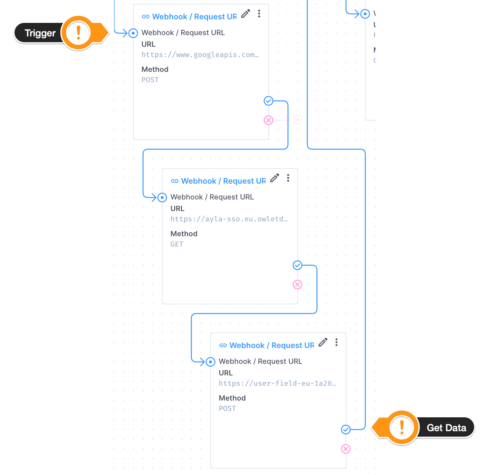
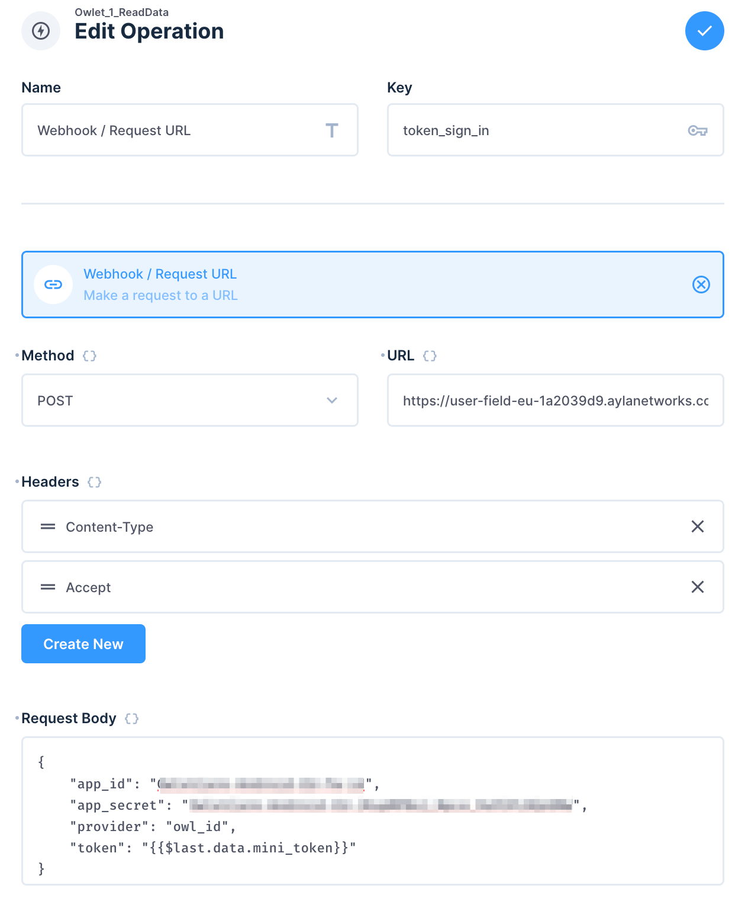
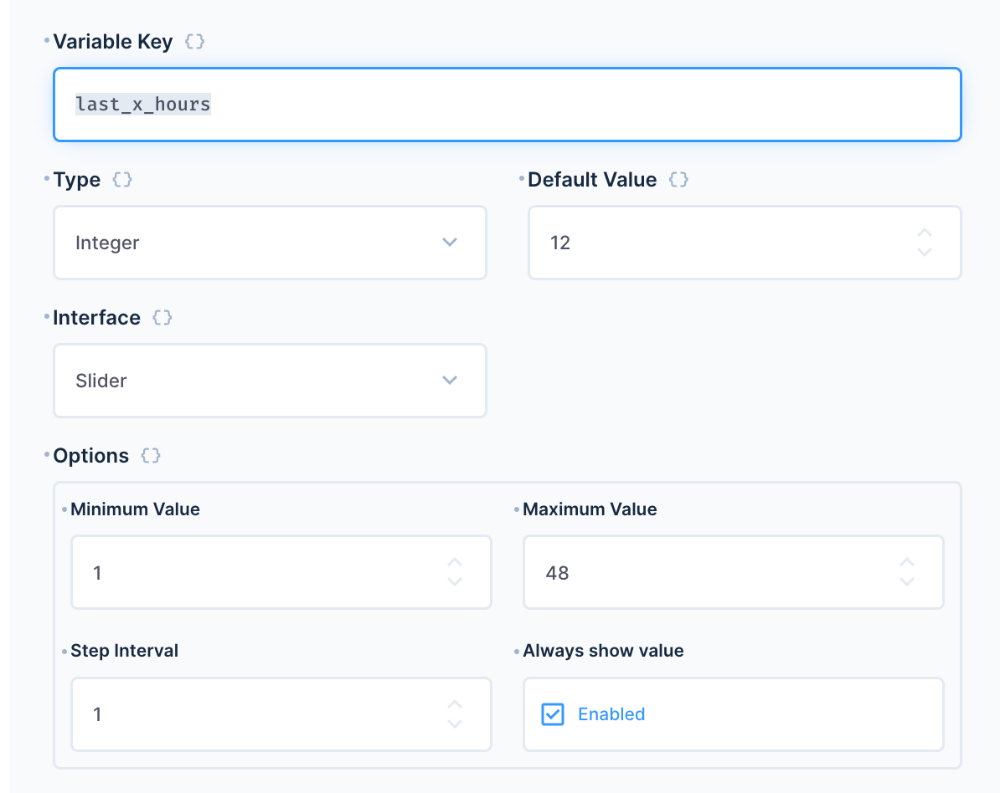
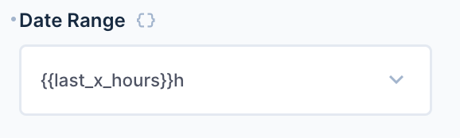
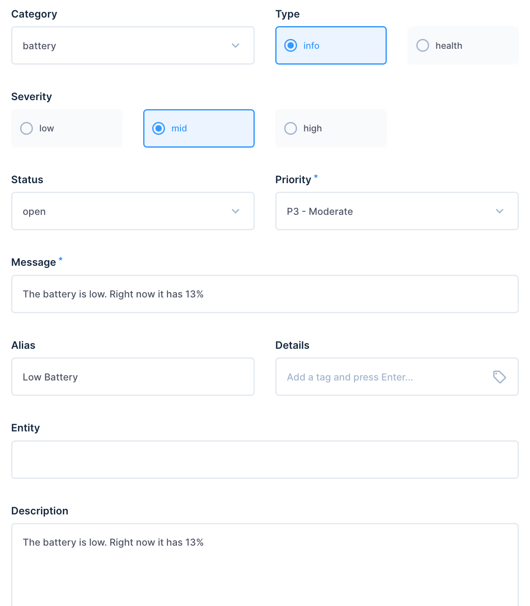
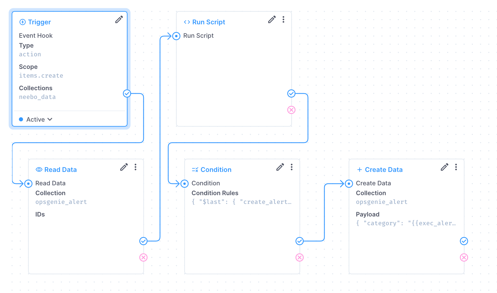
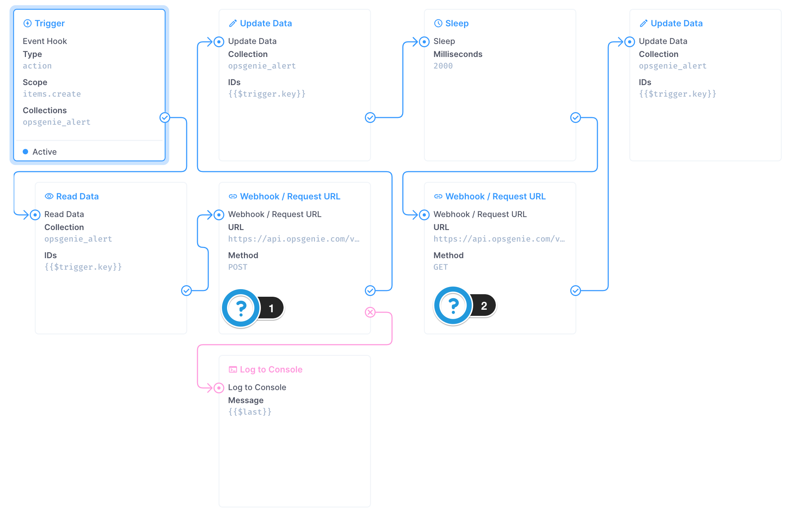
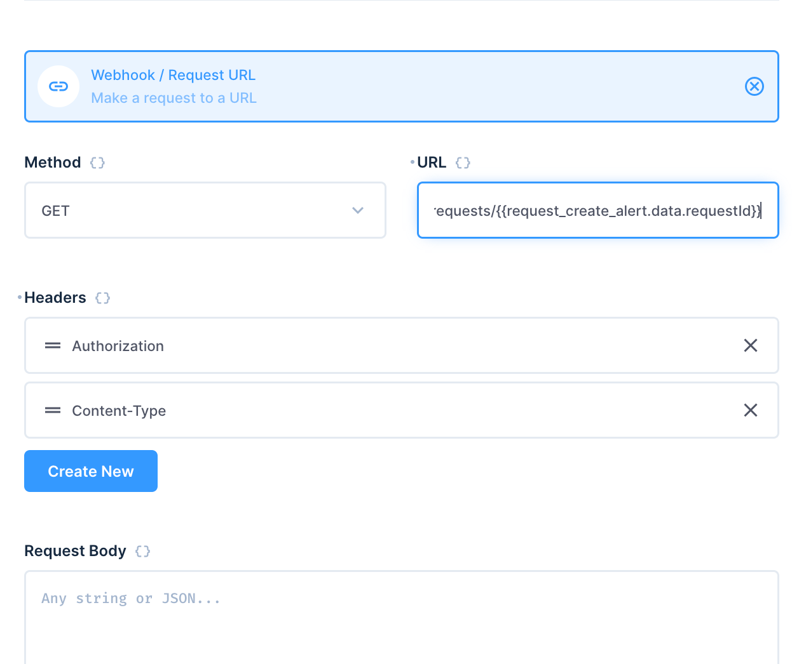
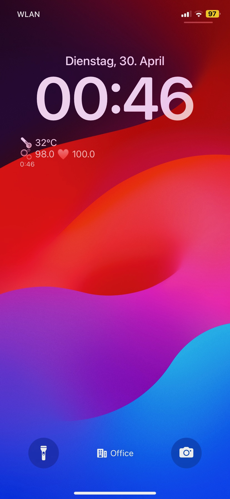

In this article, we will explore Directus as a backend for a smart wearable device, and how to extend the functionality of the the apps shipped with the device.

We will cover data model configuration, how to grab data from the wearable using Directus Flows, and how to integrate Directus into 3rd party tools for reporting, such as OpsGenie and screen widgets on an iPhone.

## Before You Start
- A Directus project - follow our [quickstart guide](https://docs.directus.io/getting-started/quickstart) if you don't already have one.
- A wearable with an API to consume the data. For this project, we will use the [Owlet](https://owletcare.com/).

## Implementation
## Creating Collections
#### The data storage collection
As we want to track sensor data over time, we will frequently pull the data with some details from the external API. Create a collection called `sensor_data` with a auto-generated UUID as an ID. Allow Directus to create `sort`, `status`, and `date_created` fields as well.
For each element of the data provided by the sensor, we want to save these values. Depending on the used sensor, you may come up with a different set of fields. In our case we've created the following important additional fields:

| Field name | Interface | Comment |
| ---- | ---- | ---- |
| raw_payload | Code | We use this to store the JSON payload that we gather from the external API for debugging purposes. |
| temperature | Input, Decimal | Plain value from the sensor data. |
| oxygen | Input, Decimal | Plain value from the sensor data. |
| heart_rate | Input, Decimal | Plain value from the sensor data. |
| battery_level | Input, Integer | Plain value from the sensor data. |
| battery_status | Dropdown | To evaluate the sensor data. |
| heart_status | Dropdown | To evaluate the sensor data. |
| oxygen_state | Dropdown | To evaluate the sensor data. |
| thermal_state | Dropdown | To evaluate the sensor data. |
This collection is for integration into the OpsGenie alerting system. As Direcuts provides the fields for sort, creation, and update date as well aw who perfomred the action, we enanled these fields during creation. Next to the id we need the following fields for alerts we want to create later on. Next to the default fields, the most important custom fields are the following ones:


| Field name | Interface | Comment |
| ---- | ---- | ---- |
| external_id | Input/String | Store the Alert ID |
| priority | Dropdown | P1 - Critical to P5 - Informational |
| category | Dropdown | Simple method to deicde if health related or just an info |
| message | String | The message that should be displayed in OpsGenie |
| data | Many to Many | foreign key to the data item |

There are also a couple of other fields that we can use and populate such as severity, type, description, tags, links, or alias. To find our more about each field, check out the OpsGenie docs

## Authenticating with the Sensor

The Owlet lacks a publicly-documented API, so some reverse-engineering was required. This Flow will roughly follow this workflow:

1. Trigger every minute.
2. Authenticate and get all the needed tokens.
3. Get a list of connected devices.
4. Get the data of our target device.
5. Transform the data to our needs.
6. Save the data.
##### The Trigger
The easiest way to get regular data fetched automatically with a Flow is a scheduled trigger.
During the setup, we've set the trigger to the following settings:

Status: Active
Activity & Log tracking: Track Log & Activity 
Interval: * * * * * (which means, it runs every minute)

We highly recommend turning off the logging or at least reducing it to prevent the flow from writing too much data into the history. 
##### Authenticate and request a Token
For this specific API, the authentication is a bit more complex compared to basic auth or a simple "request a token" as we might know it from the easy-to-use-api from Directus.
The general process to get a token which can be used to access actual device data contains three steps:

1. First, we use the regular login credentials (the one I can log in within the mobile App) and pass them to an auth service provided by Google. If successfully logged in, we receive a first token.
2. With this token we can now secondly authenticate against the actual vendor server. But again we just get a second token.
3. Within the third request we pass the 2nd token to the vendor API once again. For this request, we will receive a last token that can be used to fetch actual data from the API.



The screenshot shows the last request. As a key, we've set `token_sign_in` which can be used in the next operation. Within the payload/request body, we've specified the token to use with the dynamic code `"{{$last.data.mini_token}}"`. The object `$last` refers to the previous operation, an easy way to access the results from the last request. 


 
## Reading Data From the Sensor

Compared to the auth process, fetching actual data from the API is done with fewer requests – just two are needed. As the vendor supports multiple devices, we have to get a list of devices first. In theory, we can also do this in preparation and hard-code the device ID within the next operation. But again, as there is no official documentation of the API this might change or the ID might not that unique and may change within any future updates. 

So let's identify the device name, or `dsn` as it is called by the external API. 

Create a Request operation with the final token we got from the authentication operations.


| Method | URL |
| --- | --- |
| GET | https://ads-field-eu-1a2039d9.aylanetworks.com/apiv1/devices.json |

As header parameter, we set the following:

| Header | Value |
| --- | --- |
| Authorization | `auth_token {{$last.data.access_token}}` |

If everything works so far, the JSON we receive looks something like this, but for security reasons, some data was removed or masked as it also contains coordinates, MAC addresses, IP addresses, and so on:

```json
{
  "status": 200,
  "statusText": "OK",
  "headers": {
    ...
  },
  "data": [
    {
      "device": {
        "dsn": "AC00***697",
        "lan_ip": "192.168.*.*",
        "lan_enabled": false,
        "has_properties": true,
        "connection_status": "Online",
        "lat": "********",
        "lng": "********",
        "device_type": "Wifi"
      }
    }
  ]
}
```

The device object has exactly one tracker and provides us with the `dsn` as well as the flag for `has_properties`.

Create one more Request operation to actually, finally, fetch sensor data.

| Method | URL |
| --- | --- |
| GET | `https://ads-field-eu-1a2039d9.aylanetworks.com/apiv1/dsns/{{$last.data[0].device.dsn}}/properties.json` |
As a header parameter, we set the following:

| Header | Value |
| ---- | ---- |
| Authorization | `auth_token {{token_sign_in.data.access_token}}` |
As you can see, the named operation becomes handy now.

This request returns every property the device currently has. In total, we received over 1600 lines of JSON this time. The good thing, we only have a single property object here. All properties have a name attribute. 

Create a Run Script operation to find the properties we need:

```Javascript
module.exports = async function(data) {
  let rtnData
	data.read_dns.data.forEach(p => {
    if (p.property.name === "REAL_TIME_VITALS") {
      //console.log(JSON.parse(p.property.value))
      rtnData = JSON.parse(p.property.value)
    }
  });
  return rtnData;
}
```

Within `rtnData` we now store all the relevant values such as battery details, heart rate and oxygen level. As the JSON data is stored as a raw string with the value attribute, the run operation already parses the string and returns the following JSON object back to the Flow

```Json
{
  "ox": 0,
  "hr": 0,
  "mv": 0,
  "sc": 2,
  "st": 0,
  "bso": 0,
  "bat": 100,
  "btt": 0,
  "chg": 2,
  "aps": 0,
  "alrt": 0,
  "ota": 0,
  "srf": 1,
  "rsi": 18,
  "sb": 0,
  "ss": 0,
  "mvb": 0,
  "mst": 0,
  "oxta": 255,
  "onm": 0,
  "bsb": 4,
  "mrs": 0,
  "hw": "obl"
}
```

Some of the keys are self-speaking while others are not clear. Due to the lack of documentation, I can only compare the values with the data from the original app to identify what is what. Also, the mentioned GitHub projects have some details from other users that were helping to understand the keys here.

In our case, we are using `ox` as the oxgenlevel, `hr` as heartrate, `bat` as battery level, and `st` as the skin temperature.

## Saving the Sensor Data

The last step within the Flow is to save the gathered data within the collection we've set up already. The payload of the create operation looks like this:

```Json
{
    "raw_payload": "{{$last}}",
    "oxygen": "{{$last.ox}}",
    "heart_rate": "{{$last.hr}}",
    "temperature": "{{$last.st}}",
    "battery_level": "{{$last.bat}}"
}
```
## Reporting
### Insights
As the Insights module is built in Directus, you can create any report with the data just as you need it. In our case, we've created the following dashboard:


The dashboard is split into three sections, on the left, the last 30 minutes of data are displayed. On the right, you can select the amount of hours you'd like to review. This is done by a slide that is used as a global variable for the 3 charts underneath. 
In between, some stats are displayed, in detail, in the very last dataset for the oxygen level, heart rate, temperature and battery stats. 

All the charts are using the "Time Series" chart. The left side uses the default values for the data range of 30 minutes. For each measurement, the min and max values are set to render the most common values including some border values. The dynamic charts on the right are set up similarly. 

To achieve the dynamic time window, we have to create the "Global Variable" with the name 'last_x_hours' first:


Within the dynamic "Time Series" charts we can reuse the global variable by adding its name to the date range:

You can use the <span v-pre>`{{…}}`</span> syntax, followed by a lower `h` to identify the value that should work as hours. If you use the same variable for all three slides, they will change altogether once you've selected a new amount of hours within the global variable slider.

## 3rd Party Alerting Integration

You can integrate this system with external services to get a robust alerting system and a handy quick view of the current status directly on my mobile phone.

### Creating an Alert Item

For the alerting system, we're using OpsGenie, usually used for system, infrastructure or app health status. But why not for the actual health use case?

To build this, a new Flow listens to every created event within the `sensor_data` collection. Every new record in this collection is evaluated and under certain conditions, a new item is created within an additional collection called `opsgenie_alert`. The collection looks something like this to store all relevant data that OpsGenie can use:



The related Flow looks like this:



Within the Run Script operation the data is evaluated and based on the met conditions, the returning JSON is passed over to the next operation.

For checking the battery level the code looks like this:

```javascript
module.exports = async function(data) {
    var rtn = {
    	"create_alert": false
    }
    if (data.$trigger.payload.battery_level < 20) {
    	rtn.create_alert = true
        rtn.alert_data = {
        	"category": "battery",
            "type": "info",
            "severity": "mid",
            "priority": "P3",
            "alias": "Low Battery",
            "message": "The battery is low. Right now it has "+data.$trigger.payload.battery_level+"%",
            "description": "The battery is low. Right now it has "+data.$trigger.payload.battery_level+"%"
        }
    }
    // ... 
	return rtn;
}
```

The next Condition Operation within the Flow checks the value of `create_alert` and either stops here if `false` or passes the data to the final Create operation if set to `true`. This can be done easily by the following condition rule:

```json
{
    "$last": {
        "create_alert": {
            "_eq": true
        }
    }
}
```

You can build in several other logic like checking if there is an open alert already and stuff like this. To keep it simple we're skipping this at the moment. (And trust OpsGenie to not raise two alerts for the same incoming data)

Within the create operation, the following payload is used to create the OpenGenie Alert item:

```json
{
    "category": "{{exec_alert_logic.alert_data.category}}",
    "type": "{{exec_alert_logic.alert_data.type}}",
    "severity": "{{exec_alert_logic.alert_data.severity}}",
    "priority": "{{exec_alert_logic.alert_data.priority}}",
    "alias": "{{exec_alert_logic.alert_data.alias}}",
    "message": "{{exec_alert_logic.alert_data.message}}",
    "description": "{{exec_alert_logic.alert_data.description}}"
}
```
#### Escalating to OpsGenie    

Once the alert is created within Directus, of course, it has to be created within OpsGenie as well. For this – again a new Flow is needed. This time we have to use the Timeout operation as OpsGenie queues all incoming requests and does not provide the result immediately.



Once triggered, we read out all the data first and pass the needed data to the OpsGenie API with a user key and the JSON data from the alert collection. As the API does not return the actual result but only an ID of the incoming task, we now wait 2 seconds before requesting the current status of our queued task with the 2nd web request. The request URL gets the returning ID from the 1st web request: 



This request will return the current status and therefore all the data (including an ID) of this alert. With the update operation, we saved the alert ID to be able to refer to the OpsGenie alert if needed.

In the moment an actual alert is created within OpsGenie, any connected system is yelling for attention, just as configured in the tool.

If Directus tries to create a new alert with the same data (in case the battery or oxygen level is still on the same level) no new alert is created by the design of OpsGenie. But it's hard to miss any alert as it sends SMS, critical push notifications, or even calling a phone number if needed and no reaction is noticed. 
#### As a Widget for iOS
As a last method of reporting and integration Directus, we can create a simple iOS widget, that sits right on my lock and home screen. As this is not about iOS development we chose the easy way and used Scriptable for this. This free app can be used to run JavaScript and display the data as a widget. The only downside of these Scriptable widgets is, that iOS decides WHEN to update the content of the widget. So you can not force the widget to reload actively. This is a limitation to prevent battery drainage and high load due to the demanding JavaScript. Usually, the script runs every 1 to 15 minutes. To know how "outdated" the displayed data is, we've added the create-timestamp as part of the widgets. 
For the Directus integration this time I have created a new role that can have view access to the data collection only. A user in this role has set a static token that I can use within the widget. Using the query parameter `limit` and `sort` I can define to get only the very last entry sorted by the create date column.

```javascript
const url = "https://my-directus.app/items/neebo_data?limit=1&sort=sort,-date_created"
const token = "xy-my-static-token"
async function getData(url) {
  let request = new Request(url);
  let authHeader = "Bearer " + token
  request.headers = { "Authorization": authHeader }

  let data = await request.loadJSON();
  return data;
}
function processData(data) {
  console.log(data)
  let processedData = {
    "placement": data.data[0].placement,
    "battery": {
      "level": data.data[0].battery_level,
      "state": data.data[0].battery_state
    },
    "termal": {
      "state": "",
      "value": data.data[0].temperature
    },
    "oxygen": {
      "state": "",
      "value": data.data[0].oxygen
    },
    "heart_rate": {
      "state": "",
      "value": data.data[0].heart_rate
    },
    "reldate": new RelativeDateTimeFormatter().string(new Date(data.data[0].date_created), new Date()),
    "datecreated":
      new Date(data.data[0].date_created).getHours() + ":" +
      String(new Date(data.data[0].date_created).getMinutes()).padStart(2, "0")
  }

  return processedData;
}
function createWidget(data) {
  var widget = new ListWidget();
  console.log(data.placement);
  switch (data.placement) {
    case 4:  // Charging
      var text = widget.addText("⚡️ " + data.battery.level + "% …");
      break;
    case "2":
      break;
    default:
      var text = widget.addText("🌡️ " + data.termal.value + "°C");
      var text = widget.addText("🫧 " + data.oxygen.value + " ♥️ " + data.heart_rate.value);
      break;
  }
  var text = widget.addText(data.datecreated);
  text.font = Font.regularRoundedSystemFont(12);
  return widget;
}
let data = await getData(url);
let processedData = processData(data);
let widget = await createWidget(processedData);
Script.setWidget(widget);
Script.complete()
```

In the end, the widget would look like this. In case the waerable is charging, the current battery level is displayed.


## Wrap up
And Voila, you've successfully built your monitoring system by using Direcuts. In this post, we covered how to set up the needed Collections to store data from an external API using Flows, worked with the data to further integrate the collected data into third-party tools and built our reporting Dashboard directly within Direcuts using Insights as well as display the latest data on our mobile phone.